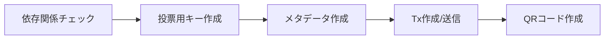

# **カタリスト有権者登録**

!!! summary "概要"
    * このマニュアルは、プールのpayment.addrを有権者登録する方法です。  
      payment.addrの資金をVotingパワーに使用でき、Catalyst投票が可能になります。
    
    * 依存関係は`BP`にインストールしてください。
    * 有権者登録作業はSJG TOOLで行います。

## **1. 事前準備インストール**

**<font color=red>以下の依存関係はBPサーバーにインストールしてください</font>**  

必要なバイナリ

| bech32  | cardano-signer | catalyst-toolbox |
| :---------- | :---------- | :---------- |
| v1.1.3 | v1.13.0 | v0.5.0 |

### **1-1. Bech32インストール**

ダウンロード
=== "ブロックプロデューサーノード"
    ```bash
    cd $HOME/git
    wget  https://github.com/IntersectMBO/bech32/archive/refs/tags/$(curl -s https://api.github.com/repos/IntersectMBO/bech32/releases/latest | jq -r .tag_name).tar.gz
    tar -xf $(curl -s https://api.github.com/repos/IntersectMBO/bech32/releases/latest | jq -r .tag_name).tar.gz
    mv bech32-$(curl -s https://api.github.com/repos/IntersectMBO/bech32/releases/latest | jq -r .tag_name | tr -d v) bech32
    rm $(curl -s https://api.github.com/repos/IntersectMBO/bech32/releases/latest | jq -r .tag_name).tar.gz
    ```

ビルド
=== "ブロックプロデューサーノード"
    ```bash
    cd bech32
    cabal update
    cabal build bech32
    ```

binディレクトリへコピー
=== "ブロックプロデューサーノード"
    ```bash
    sudo cp $(find $HOME/git/bech32/dist-newstyle/build -type f -name "bech32") /usr/local/bin/bech32
    ```

バージョン確認
=== "ブロックプロデューサーノード"
    ```bash
    bech32 -v
    ```
> 戻り値 1.1.3


### **1-2. cardano-signerインストール**
=== "ブロックプロデューサーノード"
    ```bash
    cd $HOME/git
    wget https://github.com/gitmachtl/cardano-signer/releases/download/$(curl -s https://api.github.com/repos/gitmachtl/cardano-signer/releases/latest | jq -r .tag_name)/cardano-signer-$(curl -s https://api.github.com/repos/gitmachtl/cardano-signer/releases/latest | jq -r .tag_name | tr -d v)_linux-x64.tar.gz
    tar -xf cardano-signer-$(curl -s https://api.github.com/repos/gitmachtl/cardano-signer/releases/latest | jq -r .tag_name | tr -d v)_linux-x64.tar.gz
    ```

binディレクトリへコピー
=== "ブロックプロデューサーノード"
    ```
    sudo cp $HOME/git/cardano-signer /usr/local/bin/cardano-signer
    ```

バージョン確認
=== "ブロックプロデューサーノード"
    ```
    cardano-signer help | grep -m 1 "cardano-signer"
    ```
> cardano-signer 1.32.0

**エアギャップへコピー**

**BPの`$HOME/git/`直下にある`cardano-signer`をダウンロードし、エアギャップの`$HOME/git/`直下にコピーする**

!!! important "ファイル転送"
    BPにある`cardano-signer`をエアギャップオフラインマシンの$HOME/git/ディレクトリにコピーします。
    ``` mermaid
    graph LR
        A[BP] -->|cardano-signer| B[エアギャップ];
    ``` 

**binディレクトリへコピー**
=== "エアギャップ"
    ```
    sudo cp $HOME/git/cardano-signer /usr/local/bin/cardano-signer
    ```

パーミッション設定
=== "エアギャップ"
    ```
    sudo chmod 755 /usr/local/bin/cardano-signer
    ```

バージョン確認
=== "エアギャップ"
    ```
    cardano-signer help | grep -m 1 "cardano-signer"
    ```
    > cardano-signer 1.32.0


### **1-3. catalyst-toolboxインストール**
=== "ブロックプロデューサーノード"
    ```
    cd $HOME/git
    git clone https://github.com/input-output-hk/catalyst-core.git
    cd catalyst-core
    git checkout 1bdacb3
    ```

Rustパッケージアップデート
=== "ブロックプロデューサーノード"
    ```
    rustup update
    ```

インストール
=== "ブロックプロデューサーノード"
    ```
    cd src/catalyst-toolbox
    cargo install --path . --force
    ```

バージョン確認
=== "ブロックプロデューサーノード"
    ```
    catalyst-toolbox --version
    ```
    > catalyst-toolbox 0.5.0


## **2. 有権者登録作業**

### **2-1. SJGTOOL起動**


有権者登録の流れ



!!! danger "作成ファイルについて"
    `XXX_voting.skey` / `XXX_voting.vkey` / `XXX_voting.json` (XXXはティッカー名)
    
    * 上記の3ファイルはダウンロードして、USBなどへバックアップしてください。
    * `XXX_voting.json`には、復元フレーズが含まれています。  
    Fund11から開始予定のWeb版Catalyst投票センターを使用する際に必要になりますので、厳重に保管して下さい。

!!! hint "中断した場合"
    処理が途中で中断した場合でも、SJGTOOLを起動し`[5]Catalyst有権者登録`を選択すれば途中から再開できます。

### **2-2. QRコード作成後**

QRコードが発行できたら`$HOME/CatalystVoting`ディレクトリ内ファイルの整理をお願いします。

| ファイル名  | サーバー内処理 | バックアップ
| :---------- | :---------- | :---------- |
| XXX_voting.skey | 削除 | 必須 |
| XXX_voting.vkey | 削除 | 必須 |
| XXX_voting.json | 削除 | 必須 |
| vote-registration.cbor | 削除 | 任意 |
| XXX_vote_qrcode.png | 保管 | 必須 |
| txhash.log | 保管 | 任意 |

---