# **Grafanaアラート設定**

!!! note "概要"
    サーバー異常状態発生時に任意のアプリへ通知を送信する設定です。  
    サーバー監視には必須設定となります。

## **1. 事前確認**

* grafana version 12.4.1以上
* Grafana [SJG最新ダッシュボード](../setup/monitoring-setup.md/#3-grafana)適用済み

### **1-1. Grafanaバージョン確認**

```bash
grafana-cli --version
```

### **1-2. システムパッケージの更新**
```bash
sudo apt update && sudo apt upgrade -y
```

## **2. 通知先アプリの設定**

!!! note "通知先アプリの設定"
    アラートの通知先はLINE/Discord/Telegram/Slackを複数指定することが可能です。  
    ブロック生成ステータス通知の[2. 通知アプリの設定](../setup/blocknotify-setup.md/#2)で設定した手順と同様に、通知先名などを変えてトークンを発行してください。  

## **3. 通知テンプレート設定**

* 左ペインの「`Alerting`」→「`Contact points`」を選択し、「`Notification Templates`」タブの「`Add notification template group`」を選択
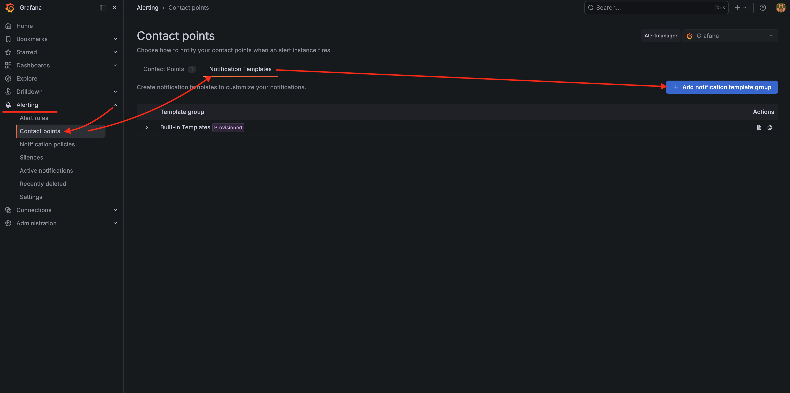

* 任意のテンプレート名「`SJG`」を入力
* 以下の内容を「`Template group`」に入力
* 「`Save`」を選択
```
{{ define "myalert" }}{{ range .Annotations.SortedPairs }}{{ if ne .Name "datasource_uid" }}{{ if ne .Name "grafana_state_reason" }}{{ if ne .Name "ref_id" }}{{ if ne .Name "description" }}{{ .Name }}: {{ .Value }}{{ end }}{{ end }}{{ end }}{{ end }}{{ end }}{{ end }}

{{ define "mymessage" }}
{{ if gt (len .Alerts.Firing) 0 }}【❌ 障害発生 ❌】{{ len .Alerts.Firing }}件

{{ range .Alerts.Firing }}{{ template "myalert" . }}{{ end }}
{{ end }}
{{ if gt (len .Alerts.Resolved) 0 }}【✅ 以下の障害は復旧しました ✅】{{ len .Alerts.Resolved }}件

{{ range .Alerts.Resolved }}{{ template "myalert" . }}{{ end }}
{{ end }}
{{ end }}
```
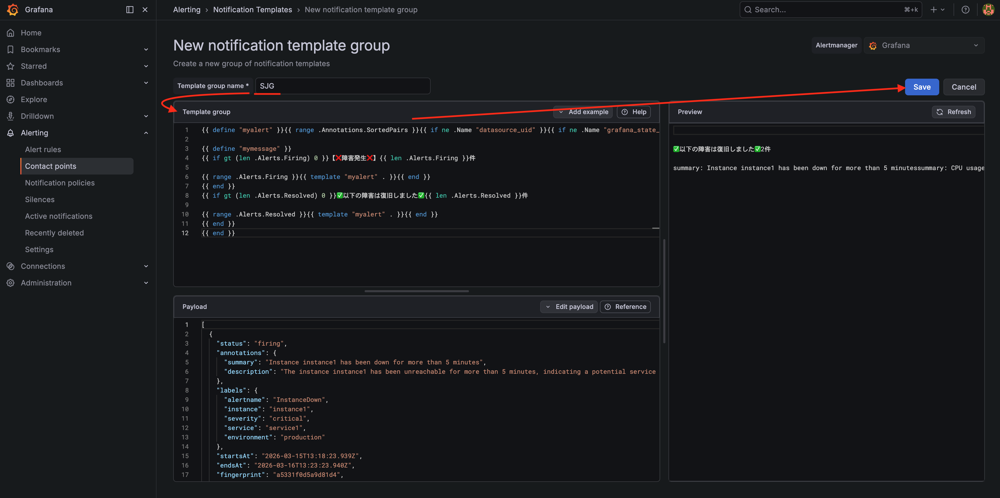

## **4. 通知先設定**
* 「`Contact Points`」タブを選択
* 「`Create contact point`」を選択
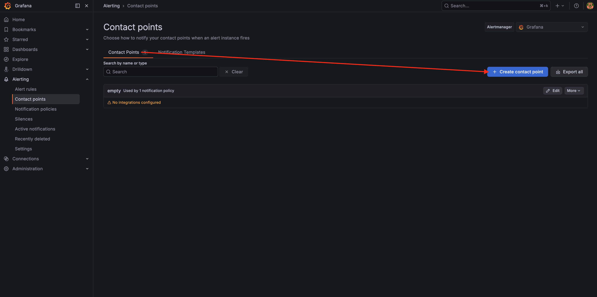

* 「`Create contact point`」→「`Name *`」に任意の通知名「`Self-Alert`」を入力
* 「`Integration`」→「通知先(Discord,Telegram,Slack等)」を選択し、情報を入力
> ここではDiscordを選択しています。
* [2. 通知アプリの設定](../setup/blocknotify-setup.md/#2)で取得した通知アプリごとのトークンIDやWebhookURLを入力
> LINEはAPIの仕様変更に伴い選択肢から除外されています。
* 「`Optional * settings`」→「`Message Content`」→「`Edit Message Content`」→「`Select notification template`」→「`Choose notification template`」欄から、「`mymessage`」を選択し、「`Save`」
* 「`Save contact point`」を選択
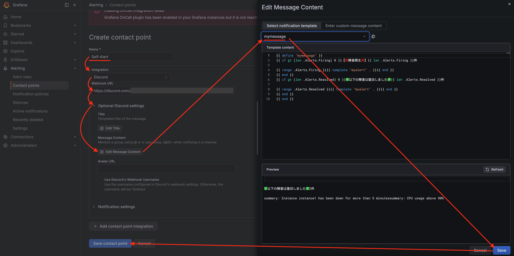

!!! tip "通知先ごとのタグ入力欄表記について"
    * `Discord`→`Message Content`
    * `Slack`→`Text Body`
    * `Telegram`→`Message`

!!! tip "複数通知先の設定について"
    「`Add contact point integration`」を選択し、その他の通知先設定をすれば、複数の通知先を設定することが可能


* 左ペインの「`Alerting`」→「`Notification policies`」を選択
* 「`Default policy`」→「`More`」→「`Edit`」を選択
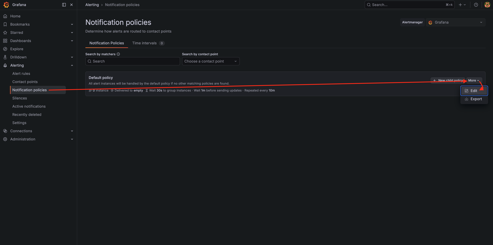

* 「`Default contact point`」→「`Self-Alert`」を選択
* 「`Group by`」に「`grafana_folder`」と「`alertname`」を指定
* 「`Timing options`」→「`Group interval`」→「`1m`」を設定
* 「`Repeat interval`」→「`10m`」に設定
* 「`Update default policy`」を選択
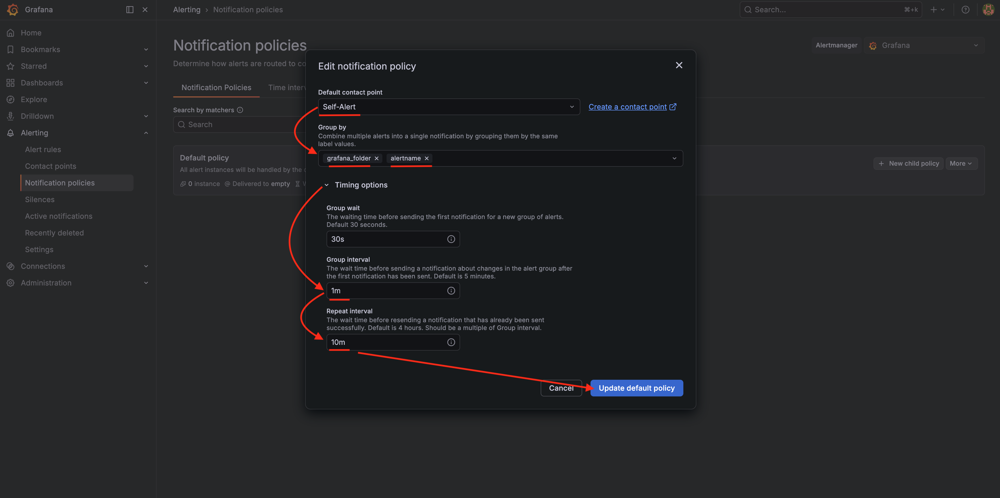

## **5. アラートルールの作成**

通知の基準となるアラートルールを作成します。  

* 左ペインの「`Alerting`」→「`Alert rules`」→「`New alert rule`」の順に選択します。
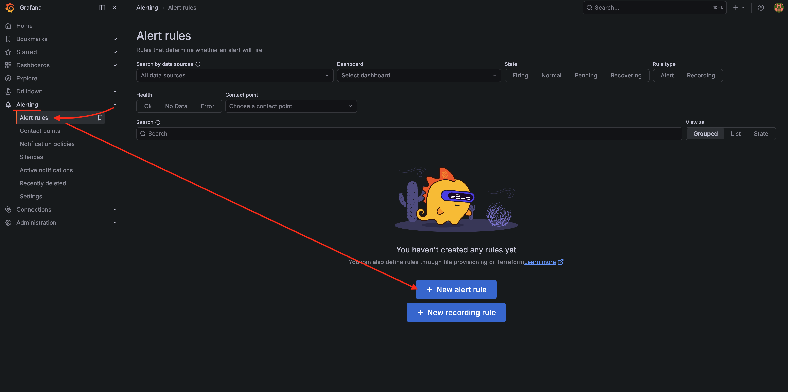

### **5-1. ノードスロット監視**

!!! tip "ヒント"
    ※ 「`2. Define query and alert condition`」の  

    - 「`Advanced options`」をオン  
    - 「`Run queries`」の隣に配置されている「`Code`」タブに切り替え  

* 「`1. Enter alert rule name`」→以下のような任意のルール名
```bash
Relay1-スロット監視
```
* 「`2. Define query and alert condition`」→「`Metrics Browser`」を選択
* 「`1. Select a metric`」→以下を入力し、選択
```bash
cardano_node_metrics_slotInEpoch_int
```
* 「`2. Select labels to search in`」→「`alias`」を入力し、選択
* 「`3. Select (multiple) values for your labels`」→「`relaynode1`」を選択
* 「`Use query`」を選択
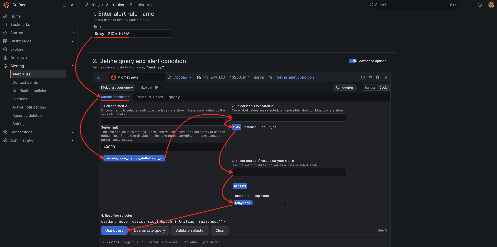

* 「`Expressions`」→「`Threshold`」→「`C`」のゴミ箱マークを選択
* 「`Add expression`」→「`Classic condition (legacy)`」を選択
* 「`Conditions`」→「`last() / A / HAS NO VALUE`」選択
* 「`Set "B" as alert condition`」をクリックし、「`Alert condition`」の表示に変更
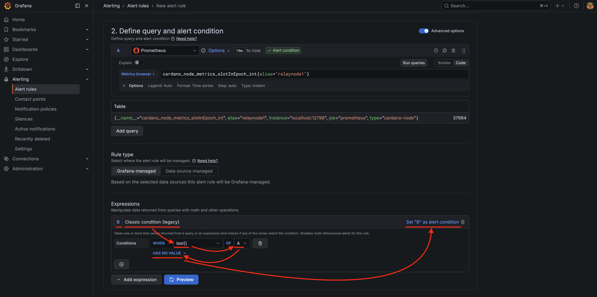

* 「`3. Add folder and labels`」→「`New folder`」を選択し、「`SJG`」を入力して「`Create`」
* 「`4. Set evaluation behavior`」→「`New evaluation group`」を選択し、「`Evaluation group name`」に「`ノード監視`」、「`Evaluation interval`」に「`10s`」を選択して「`Create`」
* 「`Pending period`」→「`20s`」を選択
* 「`Configure no data and error handling`」を展開し、「`Alert state if no data or all values are null`」→「`Alerting`」を選択
* 「`Alert state if execution error or timeout`」→「`Alerting`」を選択
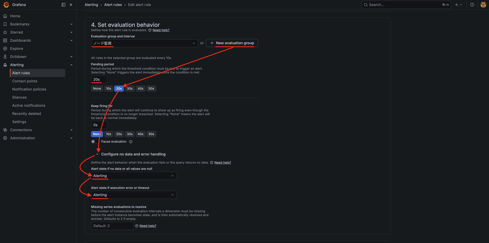

* 「`5. Configure notifications`」→「`Contact point`」→「`Self-Alert`」を選択
* 「`6. Configure notification message`」→「`Add custom annotation`」を選択
* 「`Custom annotation name and content`」→「`...name`」→以下を入力
```bash
検知内容
```
* 「`Custom annotation name and content`」→「`...content`」→以下を入力
```bash
Relay1のスロットを取得出来ませんでした。ノード起動状態を確認してください。
```
* 「`Save`」を選択
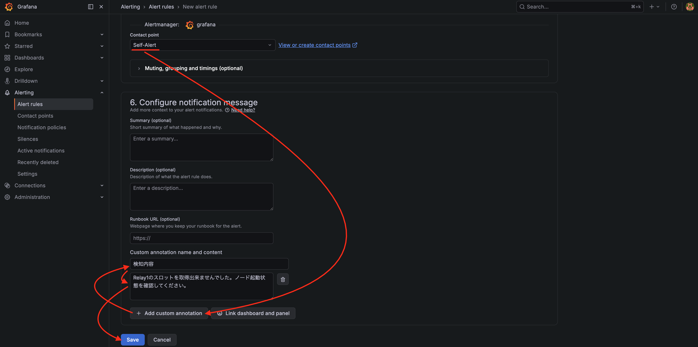

!!! tip "ヒント"
    残り全てのノードのノードスロット監視を設定してください。  

上記で作成したルールをコピーします。
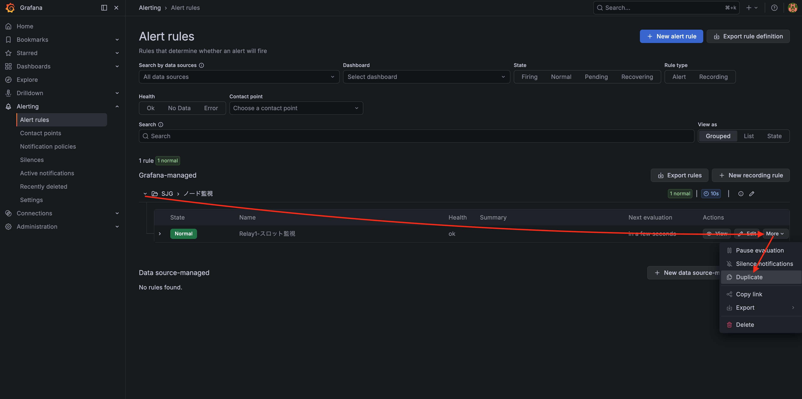

* 「`1. Enter alert rule name`」を書き換えます。
* 「`2. Define query and alert condition`」→「`Metrics Browser`」を書き換えます。
例）  
```bash
cardano_node_metrics_slotInEpoch_int{alias="relaynode2"}
```
```bash
cardano_node_metrics_slotInEpoch_int{alias="block-producing-node"}
```

* 「`Custom annotation name and content`」→「`...content`」の検知内容を書き換えます。
* 「`Save`」を選択


### **5-2. BP→リレー接続監視**
上記で作成したルールをコピーします。


* 「`1. Enter alert rule name`」→以下のような任意のルール名に書き換えます。
```bash
BPリレー接続監視
```
* 「`2. Define query and alert condition`」→「`Metrics Browser`」を選択
* 「`1. Select a metric`」→以下を入力し、選択
```bash
cardano_node_metrics_peers_connectedPeers_int
```
* 「`2. Select labels to search in`」→「`alias`」を入力し、選択
* 「`3. Select (multiple) values for your labels`」→「`block-producing-node`」を選択
* 「`Use query`」を選択
* 「`Conditions`」→「`last()` / `A` / `IS BELOW`」→「`1`」を入力
* 「`Configure no data and error handling`」を展開し、「`Alert state if no data or all values are null`」→「`Alerting`」を選択
* 「`Alert state if execution error or timeout`」→「`Alerting`」を選択
* 「`Custom annotation name and content`」→「`...content`」→「`BPからリレーへの接続が確認できません。接続状況を確認してください。`」を入力
* 「`Save`」を選択

### **5-3. チェーン密度監視**
上記で作成したルールをコピーします。


* 「`1. Enter alert rule name`」→以下のような任意のルール名に書き換えます。
```bash
チェーン密度監視
```
* 「`2. Define query and alert condition`」→「`Metrics Browser`」→以下に置き換えます。
```bash
cardano_node_metrics_density_real{alias="relaynode1"} * 100
```
* 「`Conditions`」→「`last()` / `A` / `IS BELOW`」→「`4.5`」を入力
* 「`Configure no data and error handling`」を展開し、「`Alert state if no data or all values are null`」→「`Normal`」を選択
* 「`Alert state if execution error or timeout`」→「`Normal`」を選択
* 「`Custom annotation name and content`」→「`...content`」→以下を入力
```bash
チェーン密度が4.5％を下回っています。これはカルダノチェーン全体の問題です。
```
* 「`Save`」を選択


### **5-4. ノードタイム監視**
上記で作成したルールをコピーします。


* 「`1. Enter alert rule name`」→以下のような任意のルール名に書き換えます。
```bash
Relay1-ノードタイム監視
```
* 「`2. Define query and alert condition`」→「`Metrics Browser`」→以下に置き換えます。
```bash
node_timex_maxerror_seconds{alias="relaynode1"} * 1000
```
* 「`Conditions`」→「`last()` / `A` / `IS ABOVE`」→「`100`」を入力
* 「`Configure no data and error handling`」を展開し、「`Alert state if no data or all values are null`」→「`Normal`」を選択
* 「`Alert state if execution error or timeout`」→「`Normal`」を選択
* 「`Custom annotation name and content`」→「`...content`」→以下を入力
```bash
Relay1のノードタイムが100msを超えています。Chronyを再起動してください。
```
* 「`Save`」を選択

!!! tip "ヒント"
    残り全てのノードのノードタイム監視を設定してください。  

上記で作成したルールをコピーします。


* 「`1. Enter alert rule name`」を書き換えます。
* 「`2. Define query and alert condition`」→「`Metrics Browser`」を書き換えます。
例）  
```bash
node_timex_maxerror_seconds{alias="block-producing-node"} * 1000
```
```bash
node_timex_maxerror_seconds{alias="relaynode2"} * 1000
```

* 「`Custom annotation name and content`」→「`...content`」の検知内容を書き換えます。
* 「`Save`」を選択


### **5-5. KES残り日数監視**
上記で作成したルールをコピーします。


* 「`1. Enter alert rule name`」→以下のような任意のルール名に書き換えます。
```bash
BP-KES残り日数監視
```
* 「`2. Define query and alert condition`」→「`Metrics Browser`」→以下に置き換えます。
```bash
(cardano_node_metrics_remainingKESPeriods_int * 1.5)
```
* 「`Conditions`」→「`last()` / `A` / `IS BELOW`」→「`10`」を入力
* 「`Configure no data and error handling`」を展開し、「`Alert state if no data or all values are null`」→「`Normal`」を選択
* 「`Alert state if execution error or timeout`」→「`Normal`」を選択
* 「`Custom annotation name and content`」→「`...content`」→以下を入力
```bash
KESキーの期限が迫っています。ブロック生成予定のないタイミングでKESキーを更新してください。
```
* 「`Save`」を選択


### **5-6. ディスク使用率監視**
上記で作成したルールをコピーします。


* 「`1. Enter alert rule name`」→以下のような任意のルール名に書き換えます。
```bash
Relay1-ディスク使用率監視
```
* 「`2. Define query and alert condition`」→「`Metrics Browser`」→以下に置き換えます。
```bash
1 - (node_filesystem_avail_bytes{alias="relaynode1",mountpoint="/"} / node_filesystem_size_bytes{alias="relaynode1",mountpoint="/"})
```
* 「`Conditions`」→「`last()` / `A` / `IS ABOVE`」→「`0.9`」を入力

* 「`Configure no data and error handling`」を展開し、「`Alert state if no data or all values are null`」→「`Normal`」を選択
* 「`Alert state if execution error or timeout`」→「`Normal`」を選択
* 「`Custom annotation name and content`」→「`...content`」→以下を入力
```bash
Relay1のディスク使用率が90%を超えています。100%に達する前に契約サーバーのアップグレードなどを行う必要があります。
```
* 「`Save`」を選択

!!! tip "ヒント"
    残り全てのノードのディスク使用率監視を設定してください。  

上記で作成したルールをコピーします。


* 「`1. Enter alert rule name`」を書き換えます。
* 「`2. Define query and alert condition`」→「`Metrics Browser`」を書き換えます。
例）  
```bash
1 - (node_filesystem_avail_bytes{alias="block-producing-node",mountpoint="/"} / node_filesystem_size_bytes{alias="block-producing-node",mountpoint="/"})
```
```bash
1 - (node_filesystem_avail_bytes{alias="relaynode2",mountpoint="/"} / node_filesystem_size_bytes{alias="relaynode2",mountpoint="/"})
```

* 「`Custom annotation name and content`」→「`...content`」の検知内容を書き換えます。
* 「`Save`」を選択


## **6. 通知内容URLカスタマイズ**

!!! note "注意"
    * 事前に[Grafanaセキュリティ強化](../operation/grafana-security.md)を実施してください。
    * 以下はGrafanaインストールサーバーで実施してください。


`xxxx.bbb.com`を[Grafanaセキュリティ強化](../operation/grafana-security.md/#1)で取得したドメイン(サブドメイン)に置き換えて実行  
`https://`は不要
```
domain=xxxx.bbb.com
```

以下コマンドをすべてコピーして実行します。
```bash
sudo sed -i /etc/grafana/grafana.ini \
    -e 's!;domain = localhost!domain = '${domain}'!' \
    -e 's!;root_url = %(protocol)s://%(domain)s:%(http_port)s/!root_url = https://%(domain)s/!'
```

Grafanaを再起動します。
```bash
sudo systemctl daemon-reload
```
```bash
sudo systemctl restart grafana-server.service
```

確認
```bash
sudo systemctl status grafana-server.service
```
> Active: active (running)であること

---