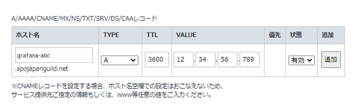
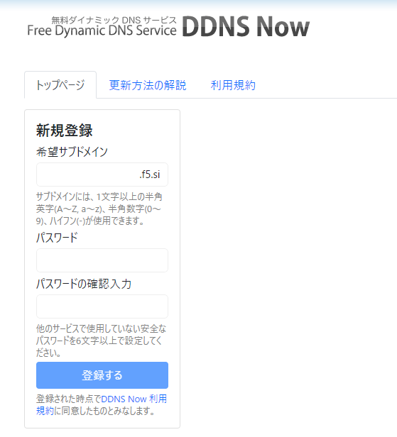
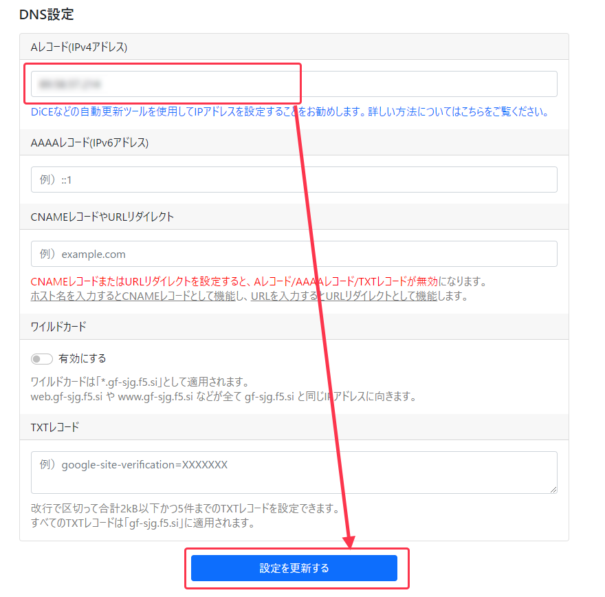
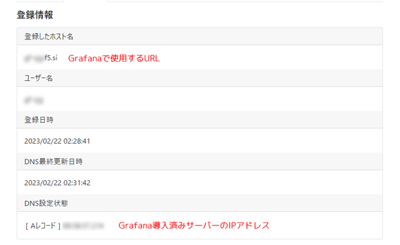
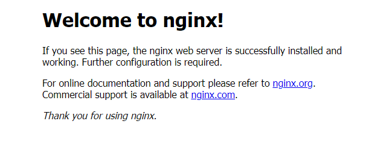
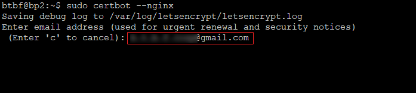
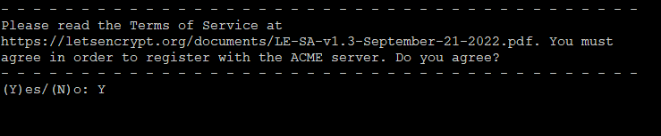
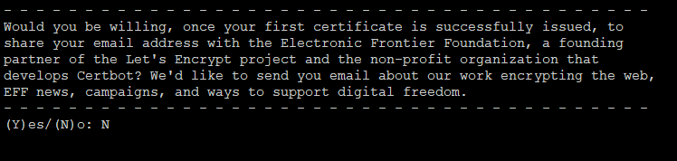
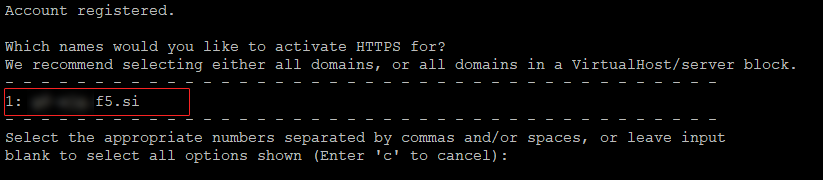
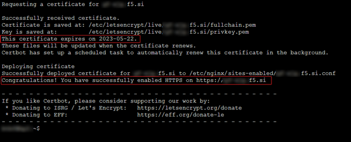

# **Grafanaセキュリティ強化**

!!! note "概要"
    このマニュアルではGrafanaのリモートアクセスセキュリティを強化するためHTTPS化とリバースプロキシの導入設定を行います。


## **事前確認**

以下の手順は、[監視ツール設定](../setup/monitoring-setup.md)で設定したGrafana導入サーバーで実施してください。

～作業の流れ～

1. 独自ドメイン(サブドメイン)を取得  
　 ※無料ドメイン取得手順も掲載
2. WEBサーバーnginxのインストール・リバースプロキシ設定
3. certbotをインストール
4. 無料SSL証明書(Let’s Encrypt)を取得
5. nginx設定変更
6. SSL証明書自動更新を設定

!!! warning "作業前の注意事項"
    以下の文章をよく読みながら進めてください。コマンドの実行忘れ・コマンドコピーミスなどに十分注意してください。

## **1. ドメイン(サブドメイン)の取得**

!!! hint "確認"
    ホームページなどの運用ですでに独自ドメインを取得済みの場合はそちらを使用出来ます。独自ドメインをお持ちでない方は無料ダイナミックDNSでドメインを取得できます。

=== "独自ドメインをお持ちの方"


    独自ドメインをお持ちの方は、登録レジストラのDNS設定でGrafana用サブドメインを設定してください。

    参考）  
    ホスト名：任意のサブドメイン名  
    TYPE：A  
    VALUE(値):Grafana導入サーバーIPアドレス  
    
    

=== "独自ドメインを持っていない方"

    [DDNS Now](https://ddns.kuku.lu/){target="_blank" rel="noopener"}で無料のドメインを取得します。
    DDNS Nowは完全無料・定期通知不要・サービス保障稼働率100%など、使いやすいDDNSサービスです。ただしサブドメインなどは設定できません。1アカウント1ドメイン
    
    **ドメイン(アカウント)の取得**  
    ここで取得したサブドメインがGrafanaのURLになります。
    
    例）grafana-abc.f5.si  
    

    **詳細設定からDNSのAレコードを設定**  
    「Aレコード(IPv4アドレス)」欄にGrafanaを導入しているサーバーのIPアドレスを入力して「設定を変更する」をクリックしてください
    

    **登録情報確認**  
    


## **2. nginxのインストール**

**インストール**

=== "Grafana導入サーバー"
    ```bash
    sudo apt update && sudo apt install nginx -y
    ```

**ステータス確認**
```bash
sudo systemctl --no-pager status nginx
```
> 緑色で「active (running)」になっていることを確認

**HTTP/HTTPS用ポートを開放**
```bash
sudo ufw allow 80/tcp
```
```bash
sudo ufw allow 443/tcp
```

**開放中のGrafana用3000ポートを削除**  

numbered で表示された3000ポートの番号を指定して削除してください。
```bash
sudo ufw status numbered
```
```bash
sudo ufw delete 番号
```

**ufwをリロード**
```bash
sudo ufw reload
```

!!! success "確認"
    ローカルブラウザから `http://Grafana導入サーバーのIPアドレス` にアクセスしてNginx Welcomeページが表示されれば問題ありません。  
    


`xxxx.bbb.com`を[1. ドメイン(サブドメイン)の取得](../operation/grafana-security.md/#1)で取得したドメイン(サブドメイン)に置き換えて実行します。

```bash
domain=xxxx.bbb.com
```

**仮想ホストファイルの作成**
```bash
cat > "$HOME/$domain.conf" << EOF
server {
    listen 80;
    server_name $domain;

    location / {
        proxy_set_header Host \$http_host;
        proxy_pass http://127.0.0.1:3000;
    }
}
EOF
```

**ファイル移動**
```bash
sudo mv $HOME/$domain.conf /etc/nginx/sites-available/
```

**シンボリックリンク作成**
```bash
sudo ln -s /etc/nginx/sites-available/$domain.conf /etc/nginx/sites-enabled/$domain.conf
```

**構文チェック**
```bash
sudo nginx -t
```
> nginx: the configuration file /etc/nginx/nginx.conf syntax is ok  
> nginx: configuration file /etc/nginx/nginx.conf test is successful  
> 上記のような表示であれば問題ありません。

**nginxの再読み込み**
```bash
sudo systemctl reload nginx
```

!!! success "確認"
    ローカルブラウザから`http://ドメイン名`でアクセスし、Grafanaログイン画面が表示されればリバースプロキシ設定に成功しました！

**デフォルトのホストファイルリンクを削除**
```bash
sudo unlink /etc/nginx/sites-enabled/default
```

**構文チェック**
```bash
sudo nginx -t
```
> nginx: the configuration file /etc/nginx/nginx.conf syntax is ok  
> nginx: configuration file /etc/nginx/nginx.conf test is successful  
> 上記のような表示であれば問題ありません。

**nginxの再読み込み**
```bash
sudo systemctl reload nginx
```

## **3. certbotをインストール**

snapが利用可能か確認

```bash
snap version
```
> `snap`と`snapd`のバージョン情報が表示されれば`snap`が利用可能です。

```bash
sudo snap install --classic certbot
```
> certbot from Certbot Project installed のように表示されればインストール完了です。


**certbot のシンボリックリンクを作成**
```bash
sudo ln -sf /snap/bin/certbot /usr/bin/certbot
```

## **4. 無料SSL証明書(Let’s Encrypt)を取得**
```bash
sudo certbot --nginx
```

**設定**

1. 任意のメールアドレスの登録  
ここで登録したメールアドレスにSSL証明書更新前・期限切れ情報の通知が届きます。  


2. Let's Encryptサービス利用規約への同意確認  
`y`を入力して、Enter


3. キャンペーンメール登録確認(不要ならN)  
`n`を入力して、Enter


4. SSL証明書登録ドメインの確認  
`1:`にご自身のドメインが表示されていることを確認し、`1`を入力して、Enter  


5. SSL証明書取得確認  
`This certificate expires on`は取得したSSL証明書の有効期限です。  
  
`Congratulations!`が表示されていれば署名書取得成功です。

!!! success "確認"
    ローカルブラウザから`https://ドメイン名`でアクセスし、Grafanaログイン画面が表示されればHTTPS化に成功しています。  


## **5. nginx設定変更**

**1. websocketの有効化**  

```bash
echo $domain
```
> 戻り値が設定したドメインであること。  
> そうでなければ、変数domainに[1. ドメイン(サブドメイン)の取得](../operation/grafana-security.md/#1)で取得したドメイン(サブドメイン)を代入してください。

**仮想ホストファイルの編集**

```bash
sudo sed -i '/location \//,/}/c\
    location / {\
        proxy_set_header Host $http_host;\
        proxy_pass http://127.0.0.1:3000;\
    }\
\
    location /api/live {\
        proxy_http_version 1.1;\
        proxy_set_header Upgrade $http_upgrade;\
        proxy_set_header Connection $connection_upgrade;\
        proxy_set_header Host $http_host;\
        proxy_pass http://127.0.0.1:3000;\
    }' /etc/nginx/sites-enabled/$domain.conf
```

**2. nginx 構成ファイルの強化**

事前バックアップ
```bash
sudo cp /etc/nginx/nginx.conf /etc/nginx/nginx.conf.bak.$(date +%Y%m%d-%H%M%S)
```

`ssl_protocols` を `TLSv1.2 TLSv1.3` に変更
```bash
sudo sed -i -E 's/^[[:space:]]*ssl_protocols.*/    ssl_protocols TLSv1.2 TLSv1.3;/' /etc/nginx/nginx.conf
```

以下の設定を追記
```bash
grep -q 'limit_conn_zone \$binary_remote_addr zone=addr:5m;' /etc/nginx/nginx.conf || \
sudo sed -i '/include \/etc\/nginx\/sites-enabled\/\*;/a\
\
        ## Start: Size Limits \& Buffer Overflows ##\
        client_body_buffer_size  3K;\
        client_header_buffer_size 3k;\
        client_max_body_size 80k;\
        large_client_header_buffers 2 10k;\
        ## END: Size Limits \& Buffer Overflows ##\
\
        ### Directive describes the zone, in which the session states are stored i.e. store in slimits. ###\
        ### 1m can handle 32000 sessions with 32 bytes/session, set to 5m x 32000 session ###\
        limit_conn_zone $binary_remote_addr zone=addr:5m;\
\
        ### Control maximum number of simultaneous connections for one session i.e. ###\
        ### restricts the amount of connections from a single ip address ###\
        limit_conn addr 10;\
\
        map $http_upgrade $connection_upgrade {\
            default upgrade;\
            '\'''\''      close;\
        }' /etc/nginx/nginx.conf
```

**nginxエラーチェック**
```bash
sudo nginx -t
```
!!! note "戻り値"
    === "正常な場合"
        ``` { .yaml .no-copy }
        nginx: the configuration file /etc/nginx/nginx.conf syntax is ok
        nginx: configuration file /etc/nginx/nginx.conf test is successful
        ```
    === "エラーがある場合(例) "
        ``` { .yaml .no-copy }
        nginx: [emerg] unexpected "}" in /etc/nginx/sites-enabled/******.conf:8
        nginx: configuration file /etc/nginx/nginx.conf test failed
        ```
        エラー箇所を修正してください。


**nginxの再読み込み**
```bash
sudo systemctl reload nginx
```

**状態確認**
```bash
sudo systemctl --no-pager status nginx
```
> Active: active (running)であること

## **6. SSL証明書自動更新**

1.SSL証明書自動更新タイマー確認  
このプログラムでSSL証明書が自動更新されます。
```bash
systemctl status snap.certbot.renew.timer
```
> 緑色で「active (waiting)」になっていることを確認

## 2. nginx自動リロード設定

SSL証明書更新後に nginx を再読み込みする deploy hook を作成します。

```bash
sudo tee /etc/letsencrypt/renewal-hooks/deploy/nginx-reload.sh > /dev/null << 'EOF'
#!/bin/bash
systemctl reload nginx
EOF
```

実行権限を付与

```bash
sudo chmod 755 /etc/letsencrypt/renewal-hooks/deploy/nginx-reload.sh
```

動作確認

```bash
sudo certbot renew --dry-run
```
> Congratulations, all simulated renewals succeeded のように表示されれば成功です。

SSL証明書自動更新タイマー確認  
```bash
systemctl status snap.certbot.renew.timer
```
> 緑色で「active (waiting)」になっていることを確認

---