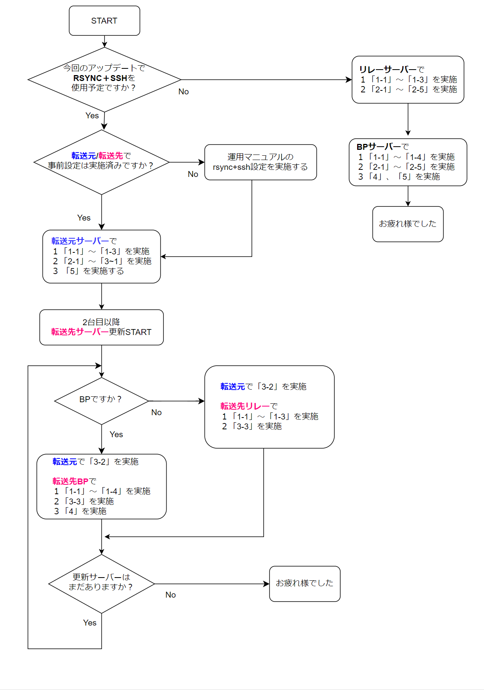

# **ノードアップデート**

このガイドは ノードバージョン`10.6.4`に対応しています。  

最終更新日：2026年4月19日  

!!! info "バージョン対応表"
    * <font color=red>各依存関係もバージョンアップしてますのでよくお読みになって進めてください</font>

    | OS | Node | CLI | GHC | Cabal | CNCLI |
    | :---------- | :---------- | :---------- | :---------- | :---------- | :---------- |
    | ubuntu 24.04 | 10.6.4 | 10.15.0.0 | 9.6.7 | 3.12.1.0 | 6.7.0 |

    **■アップデートパターンDB再構築有無**

    | バージョン | DB再構築有無 | 設定ファイル更新有無 | トポロジーファイル更新有無 |
    | :---------- | :---------- | :---------- | :---------- |
    | 10.5.4以前 → 10.6.4 | あり | 更新あり | なし |

<!--
    | OS | Node | CLI | GHC | Cabal | CNCLI |
    | :---------- | :---------- | :---------- | :---------- | :---------- | :---------- |
    | ubuntu 24.04.* | 10.7.0 | 10.15.1.0 | 9.6.7 | 3.12.1.0 | 6.7.0 |

    **■アップデートパターンDB再構築有無**

    | バージョン | DB再構築有無 | 設定ファイル更新有無 | トポロジーファイル更新有無 | Grafanaダッシュボード更新有無 |
    | :---------- | :---------- | :---------- | :---------- | :---------- |
    | 10.5.4 → 10.7.0 | あり | 更新あり | 更新あり | 更新あり |
-->

!!! warning "留意点"
    - 作業実施前にブロック生成スケジュールを確認してください。  
    - 今回のアップデートではDB更新があるため、ブロック生成が2時間以上無いことを確認してください。   
    - 複数行のコードをコードボックスのコピーボタンを使用してコマンドラインに貼り付ける場合は、最後の行が自動実行されないため確認の上Enterを押してコードを実行してください。


??? danger "主な変更点と新機能および検証結果"

    !!! tip "cardano-node"

        **10.6.4 <font color=red>Plutusインタープリタに対する多数の修正と改善リリース</font>**
        
        - ソースビルドの場合 blst v0.3.14使用必須
        - PraosModeを有効

        **10.5.3 <font color=red>バグ修正緊急リリース</font>**
        
        - cardano-crypto-classライブラリ参照先修正
        - ソースビルドの場合 blst v0.3.14使用必須
        - PraosModeのみ有効

        **10.5.2 <font color=red>バグ修正緊急リリース</font>**  

        <font color=red> 10.3.x, 10.4.x or 10.5.xをご利用中の場合は速やかに10.5.2へアップグレードしてください</font>

        1）ハッシュサイズに関する問題  
        2）ネットワークスタック内の ピア選択の不具合  
        を修正しています。

        特定の条件下では、ネットワークの Periodic Churn（定期的な入れ替え） の仕組みが正しく機能せず、十分な数の「Warm ピア」を降格できない状態になるバグが発見されました。
        その結果、長期的に見て アクティブピアのサンプリング（選定）が十分多様化しないことが懸念されます。

        SPOはこのリリースへのアップグレードが推奨されます。  
        
        - PraosMode推奨

        **10.5.1**  

        - Windowsのソケットに関する不具合の修正
        - DNSルックアップエラーのキャッシュ時間の短縮
        - PeerSharing設定動作の改良
        - `--non-producer-node` の代わりに `--start-as-non-producer-node` を使うようにコマンドラインオプションが変更（旧オプションは非推奨に）

        **10.5.0**

        - Ouroboros Genesis の最適化
        - GHC 8.10 のサポート削除

        **10.4.1**

        * UTxO-HD統合  
        <font color=red>現時点ではプール運営のノードではディスクバックエンドは非推奨のため、当マニュアルではインメモリバックエンドセットアップで構築されています</font>  
        UTxO-HDの概要については[こちら](https://docs.google.com/presentation/d/16gJt5k9p3H9ycwHNO6O0HGb0cYvRpbwhUsvH4kFEthM/edit?usp=sharing){target="_blank" rel="noopener"}をご参照ください
        * config.json内 `LedgerDB`新しいキーを設定
    
    !!! tip "cardano-cli v10.15.0.0"

        - `TxBodyContent` 型を更新（互換性あり）
        - `transaction build-estimate` で推定手数料を表示
        - 不正な `timestamp` のエラーメッセージを改善
        - `create-testnet-data` で `Byron` / `Shelley` の `k` を統一

    !!! 検証結果
        ■検証環境
        Ubuntu24.04 / PreProd-Testnet / cardano-node 10.6.4 / cardano-cli 10.15.0.0 / SJG-TOOL 4.1.2  

        | 検証項目 | 結果 |
        | :---------- | :---------- |
        | ソースコードビルド | ✅ |
        | ブロック生成 | ✅ |
        | リソース監視 | ✅ |
        | 報酬出金 | ✅ |
        | ウォレット送金 | ✅ |
        | KES更新 | ✅ |
        | ガバナンス投票 | ✅ |


<!--### **更新フローチャート**
更新フローチャートは、画像をクリックすると別ウィンドウで開きます。
<a href="../../../images/8.7.2-update.png" target=_blank></a>-->

## **0. 事前準備**
1. [Ubuntu22.04から24.04へ移行](../../operation/ubuntu24-migration/)を実施してから以降進めてください。

## **1. 依存環境アップデート**

**現在のノードバージョンを変数に代入**
```bash
current_node=$(cardano-node version | grep cardano-node)
echo $current_node
```

### **1-1. システムのアップデートと依存関係のインストール**

```bash
sudo apt update && sudo apt upgrade -y
```
```bash
sudo apt install bc curl htop nano needrestart protobuf-compiler rsync ufw zstd automake build-essential pkg-config libffi-dev libgmp-dev libssl-dev libncurses-dev libsystemd-dev zlib1g-dev make g++ tmux git jq wget libtool autoconf liblmdb-dev liburing-dev libsnappy-dev -y
```

### **1-2. 依存関係バージョン確認**

**cabalバージョン確認**
```bash
cabal --version
```
> `cabal-install version 3.12.1.0`

**GHCバージョン確認**
```bash
ghc --version
```
> `The Glorious Glasgow Haskell Compilation System, version 9.6.7`

**libsodiumコミット確認**
```bash
cd $HOME/git/libsodium
git branch --contains | grep -m1 HEAD | cut -c 21-28
```
> `dbb48cce`

**secp256k1バージョン確認**
```bash
cd $HOME/git/secp256k1
git branch --contains | grep -m1 HEAD | cut -c 21-27
```
> `acf5c55`

**Blstバージョン確認**  
インストール済みバージョン
```bash
cat /usr/local/lib/pkgconfig/libblst.pc | grep Version
```
> `Version 0.3.14`


??? danger "各アプリのバージョン(戻り値)が異なる場合"

    ??? danger "cabal 3.8.1.0以下の場合"
        **cabal 3.8.1.0以下の場合のみ実行**
        **cabalバージョンアップ**
        ```bash
        ghcup upgrade
        ghcup install cabal 3.12.1.0
        ghcup set cabal 3.12.1.0
        ```

        cabalバージョン確認
        ```bash
        cabal --version
        ```

        ``` { .yaml .no-copy }
        cabal-install version 3.12.1.0   
        compiled using version 3.12.1.0 of the Cabal library
        ```

    ??? danger "GHC 9.6.7以外の場合 (9.6.7より新しい場合を含む)"
        ```bash
        ghcup upgrade
        ghcup install ghc 9.6.7
        ghcup set ghc 9.6.7
        ```

        ghcバージョン確認
        ```bash
        ghc --version
        ```

        ``` { .yaml .no-copy }
        The Glorious Glasgow Haskell Compilation System, version 9.6.7
        ```

    ??? danger "libsodiumコミット値が違う場合"
        ```bash
        cd ~/git/libsodium
        git fetch --all --prune
        git checkout dbb48cc
        ./autogen.sh
        ./configure
        make
        make check
        sudo make install
        ```
        > `make`コマンド実行後半に出現する `warning` は無視して大丈夫です。

    ??? danger "secp256k1コミット値が違うまたは戻り値が無い場合"
        ```bash
        cd $HOME/git/secp256k1/
        git fetch --all --prune --recurse-submodules --tags
        git checkout acf5c55
        ./autogen.sh
        ./configure --prefix=/usr --enable-module-schnorrsig --enable-experimental
        make
        make check
        ```

        ??? note "戻り値確認"
            ``` { .yaml .no-copy }
            Testsuite summary for libsecp256k1 0.3.2
            ============================================================================
            # TOTAL: 3
            # PASS:  3
            # SKIP:  0
            # XFAIL: 0
            # FAIL:  0
            # XPASS: 0
            # ERROR: 0
            ============================================================================
            ```
            > PASS:3であることを確認する

        **インストールコマンドを必ず実行する**
        ```bash
        sudo make install
        ```

    ??? danger "Blst 0.3.13以下または「No such file or directory」の場合"
        === "0.3.13以下の場合"
            ```bash
            cd $HOME/git/blst
            git fetch --all --prune --recurse-submodules --tags
            git checkout tags/v0.3.14
            ./build.sh
            ```

        === "「No such file or directory」の場合"
            ```bash
            cd $HOME/git
            git clone https://github.com/supranational/blst
            cd blst
            git checkout v0.3.14
            ./build.sh
            ```

        設定ファイル作成

        ```bash title="このボックスはすべてコピーして実行してください"
        cat > libblst.pc << EOF
        prefix=/usr/local
        exec_prefix=\${prefix}
        libdir=\${exec_prefix}/lib
        includedir=\${prefix}/include

        Name: libblst
        Description: Multilingual BLS12-381 signature library
        URL: https://github.com/supranational/blst
        Version: 0.3.14
        Cflags: -I\${includedir}
        Libs: -L\${libdir} -lblst
        EOF
        ```

        設定ファイルコピー
        > このボックスは1行ずつコピーして実行してください

        ```bash
        sudo cp libblst.pc /usr/local/lib/pkgconfig/
        ```
        ```bash
        sudo cp bindings/blst_aux.h bindings/blst.h bindings/blst.hpp  /usr/local/include/
        ```
        ```bash
        sudo cp libblst.a /usr/local/lib
        ```
        ```bash
        sudo chmod u=rw,go=r /usr/local/{lib/{libblst.a,pkgconfig/libblst.pc},include/{blst.{h,hpp},blst_aux.h}}
        ```

        バージョン確認
        ```bash
        cat /usr/local/lib/pkgconfig/libblst.pc | grep Version
        ```
        > Version 0.3.14


### **1-3. CNCLIバージョン確認(BPのみ)**

CNCLIバージョン確認
```bash
cncli --version
```
> cncli 6.7.0

??? danger "cncli v6.6.0以下だった場合(クリックして開く)"
    
    **CNCLIのアップデート**

    ```bash
    cd $HOME
    cncli_release="$(curl -s https://api.github.com/repos/cardano-community/cncli/releases/latest | jq -r '.tag_name' | sed -e "s/^.\{1\}//")"
    ```
    ```bash
    curl -sLJ https://github.com/cardano-community/cncli/releases/download/v${cncli_release}/cncli-${cncli_release}-ubuntu22-x86_64-unknown-linux-musl.tar.gz -o $HOME/cncli-${cncli_release}-x86_64-unknown-linux-musl.tar.gz
    ```
    ```bash
    tar xzvf $HOME/cncli-${cncli_release}-x86_64-unknown-linux-musl.tar.gz -C $HOME/.cargo/bin/
    ```
    ```bash
    rm $HOME/cncli-${cncli_release}-x86_64-unknown-linux-musl.tar.gz
    ```

    バージョン確認
    ```bash
    cncli --version
    ```
    > cncli v6.7.0


## **2. ノードアップデート**

!!! tip "バイナリファイルインストール方法の違いについて"
    
    * **_ビルド済みバイナリ_**・・・IntersectMBOリポジトリソースコードからビルドされたバイナリファイルをダウンロードします。ビルド不要のためビルド時間を短縮できます。 
    
    * **_ソースコードからビルド_**・・・ご自身のサーバーでソースコードからビルドしてバイナリファイルを作成します。検証目的やソースコードからビルドしたい場合に利用できます。ビルドに30分前後かかります。Raspberry Piを使用してプールを構築する場合は、ARM用コンパイラでコンパイルする必要があります。


=== "ビルド済みバイナリを使用する場合"

    ### **2-1. バイナリダウンロード**

    旧バイナリの削除
    ```bash
    rm -rf $HOME/git/cardano-node-old/
    ```

    バイナリファイルのダウンロード
    ```bash
    mkdir $HOME/git/cardano-node2
    cd $HOME/git/cardano-node2
    wget -q https://github.com/IntersectMBO/cardano-node/releases/download/10.6.4/cardano-node-10.6.4-linux-amd64.tar.gz
    ```

    解凍
    ```bash
    tar zxvf cardano-node-10.6.4-linux-amd64.tar.gz ./bin/cardano-node ./bin/cardano-cli ./bin/snapshot-converter
    ```

    **バージョンの確認**

    ```bash
    $(find $HOME/git/cardano-node2 -type f -name "cardano-cli") version  
    $(find $HOME/git/cardano-node2 -type f -name "cardano-node") version  
    ```
    以下の戻り値を確認します。  
    ``` { .yaml .no-copy }
    cardano-cli 10.15.0.0 - linux-x86_64 - ghc-9.6  
    git rev 5a4dcd1b410ba78f9faab7acd48f606496909935

    cardano-node 10.6.4 - linux-x86_64 - ghc-9.6  
    git rev 5a4dcd1b410ba78f9faab7acd48f606496909935
    ```


    **ノードの停止** 
    ```bash
    sudo systemctl stop cardano-node
    ```

    ### **2-2. バイナリインストール**

    **バイナリーファイルをシステムフォルダーへコピー**

    ```bash
    sudo cp $(find $HOME/git/cardano-node2 -type f -name "cardano-cli") /usr/local/bin/cardano-cli
    ```
    ```bash
    sudo cp $(find $HOME/git/cardano-node2 -type f -name "cardano-node") /usr/local/bin/cardano-node
    ```

    **システムに反映されたノードバージョンの確認**

    ```bash
    cardano-cli version
    cardano-node version
    ```

    以下の戻り値を確認します。
    ``` { .yaml .no-copy }
    cardano-cli 10.15.0.0 - linux-x86_64 - ghc-9.6  
    git rev 5a4dcd1b410ba78f9faab7acd48f606496909935

    cardano-node 10.6.4 - linux-x86_64 - ghc-9.6  
    git rev 5a4dcd1b410ba78f9faab7acd48f606496909935
    ```


=== "ソースコードからビルドする場合はこちら"
    **ソースコードダウンロード**

    **現在のノードバージョンを変数に代入**
    ```bash
    current_node=$(cardano-node version | grep cardano-node)
    echo $current_node
    ```

    TMUXセッションを展開
    ```bash
    tmux new -s build
    ```
    > アップデート作業中にSSHが中断した場合は、`tmux a -t build`で再開できます。

    以前ビルドしたディレクトリの削除
    ```bash
    rm -rf $HOME/git/cardano-node-old/
    ```

    ソースコードのダウンロード
    ```bash
    cd $HOME/git
    git clone https://github.com/IntersectMBO/cardano-node.git cardano-node2
    cd cardano-node2/
    ```

    **2-2.ソースコードからビルド**

    ```bash
    cabal clean
    cabal update
    ```

    ```bash
    git fetch --all --recurse-submodules --tags
    git checkout tags/10.6.4
    cabal configure --with-compiler=ghc-9.6.7
    ```

    ```bash
    cabal build all cardano-cli
    ```
    !!! hint "ヒント"
        * ビルド完了までに数十分ほどかかります。
        * SSH接続が途中で切断された場合、再度接続して`tmux a -t build`で再開してください。  
        * ビルド中にデタッチ(Ctrl+B D)してバックグラウンド処理へ切り替えられます。

    

    **バージョン確認**

    ```bash
    $(./scripts/bin-path.sh cardano-cli) version  
    $(./scripts/bin-path.sh cardano-node) version  
    ```

    以下の戻り値を確認します。
    ``` { .yaml .no-copy }
    cardano-cli 10.15.0.0 - linux-x86_64 - ghc-9.6  
    git rev 5a4dcd1b410ba78f9faab7acd48f606496909935

    cardano-node 10.6.4 - linux-x86_64 - ghc-9.6  
    git rev 5a4dcd1b410ba78f9faab7acd48f606496909935
    ```

    **ビルド用TMUXセッションを終了します。** 
    ```bash
    exit
    ```

    **ノードの停止** 
    ```bash
    sudo systemctl stop cardano-node
    ```

    **バイナリーファイルをシステムフォルダーへコピー**

    ```bash
    cd $HOME/git/cardano-node2
    sudo cp $(./scripts/bin-path.sh cardano-cli) /usr/local/bin/cardano-cli
    ```
    ```bash
    cd $HOME/git/cardano-node2
    sudo cp $(./scripts/bin-path.sh cardano-node) /usr/local/bin/cardano-node
    ```

    **システムに反映されたノードバージョンの確認**

    ```bash
    cardano-cli version
    cardano-node version
    ```

    以下の戻り値を確認します。
    ``` { .yaml .no-copy }
    cardano-cli 10.15.0.0 - linux-x86_64 - ghc-9.6  
    git rev 5a4dcd1b410ba78f9faab7acd48f606496909935

    cardano-node 10.6.4 - linux-x86_64 - ghc-9.6  
    git rev 5a4dcd1b410ba78f9faab7acd48f606496909935
    ```

    ??? warning "10.3.1以下からアップデートする場合はこちらも実施(クリックして開く)"
        **snapshot-converterのダウンロード**
        ```bash
        cd $HOME/git/cardano-node2
        wget -q https://github.com/IntersectMBO/cardano-node/releases/download/10.6.4/cardano-node-10.6.4-linux-amd64.tar.gz
        ```
        解凍
        ```bash
        tar zxvf cardano-node-10.6.4-linux-amd64.tar.gz ./bin/snapshot-converter
        ```

### **2-3. 設定ファイル更新**

既存ファイルのバックアップ
```bash
mkdir -p $NODE_HOME/backup
cp $NODE_HOME/${NODE_CONFIG}-config.json $NODE_HOME/backup/${NODE_CONFIG}-config.json
```

<!--
cp $NODE_HOME/${NODE_CONFIG}-topology.json $NODE_HOME/backup/${NODE_CONFIG}-topology.json
-->

設定ファイルダウンロード

BPとリレー共通：
```bash
cd $NODE_HOME
wget -q https://spojapanguild.net/node_config/10.6.4/${NODE_CONFIG}-config.json -O ${NODE_CONFIG}-config.json
wget -q https://spojapanguild.net/node_config/10.6.4/${NODE_CONFIG}-checkpoints.json -O ${NODE_CONFIG}-checkpoints.json
```

<!--
リレー・BPともに[リレー/BP接続設定](../setup/relay-bp-setup.md/#2-2)を実施してから以降進めてください。
> ファイアウォール設定はすでに設定しているのでスキップしてください。  
> ノード再起動はサーバー再起動するので不要です。

[Grafanaダッシュボード用のJSONファイル](../setup/monitoring-setup.md/#3-grafana)をダウンロードしてください。
-->

<!--
!!! danger ""
    <font color=red>BPとリレーで実行するコマンドが異なるので、対象サーバーごとにタブを切り替えてください</font>
    
    === "リレーで実行"
        設定ファイルダウンロード
        ```bash
        cd $NODE_HOME
        wget -q https://spojapanguild.net/node_config/10.5.4/${NODE_CONFIG}-config.json -O ${NODE_CONFIG}-config.json
        wget -q https://spojapanguild.net/node_config/10.5.4/${NODE_CONFIG}-checkpoints.json -O ${NODE_CONFIG}-checkpoints.json
        ```

    === "BPで実行"
        設定ファイルダウンロード
        ```bash
        cd $NODE_HOME
        wget -q https://spojapanguild.net/node_config/10.5.4/${NODE_CONFIG}-config-bp.json -O ${NODE_CONFIG}-config.json
        wget -q https://spojapanguild.net/node_config/10.5.4/${NODE_CONFIG}-checkpoints.json -O ${NODE_CONFIG}-checkpoints.json
        ```
-->

??? warning "10.1.4~10.3.1からアップデートする場合はこちらも実施(クリックして開く)"

    !!! hint "BPのみ"
        起動スクリプト更新 
        ```bash
        PORT=`grep "PORT=" $NODE_HOME/startBlockProducingNode.sh`
        b_PORT=${PORT#"PORT="}
        echo "BPポートは ${b_PORT} です"
        ```
        > BPのポート番号が表示されることを確認します。

        ```bash title="このボックスはすべてコピーして実行してください"
        cat > $NODE_HOME/startBlockProducingNode.sh << EOF 
        #!/bin/bash
        DIRECTORY=$NODE_HOME
        PORT=${b_PORT}
        HOSTADDR=0.0.0.0
        TOPOLOGY=\${DIRECTORY}/${NODE_CONFIG}-topology.json
        DB_PATH=\${DIRECTORY}/db
        SOCKET_PATH=\${DIRECTORY}/db/socket
        CONFIG=\${DIRECTORY}/${NODE_CONFIG}-config.json
        KES=\${DIRECTORY}/kes.skey
        VRF=\${DIRECTORY}/vrf.skey
        CERT=\${DIRECTORY}/node.cert
        /usr/local/bin/cardano-node +RTS -N --disable-delayed-os-memory-return -I0.1 -Iw300 -A32m -n4m -F1.5 -H2500M -RTS run --topology \${TOPOLOGY} --database-path \${DB_PATH} --socket-path \${SOCKET_PATH} --host-addr \${HOSTADDR} --port \${PORT} --config \${CONFIG} --shelley-kes-key \${KES} --shelley-vrf-key \${VRF} --shelley-operational-certificate \${CERT}
        EOF
        ```

    !!! hint "全ノード"
        **DB更新**  

        **Mithrilインストール**
        ```bash
        cd $HOME/git
        mithril_release="$(curl -s https://api.github.com/repos/input-output-hk/mithril/releases/latest | jq -r '.tag_name')"
        wget https://github.com/input-output-hk/mithril/releases/download/${mithril_release}/mithril-${mithril_release}-linux-x64.tar.gz -O mithril.tar.gz
        ```

        設定
        ```bash
        tar zxvf mithril.tar.gz mithril-client
        sudo cp mithril-client /usr/local/bin/mithril-client
        ```

        パーミッション設定
        ```bash
        sudo chmod +x /usr/local/bin/mithril-client
        ```

        DLファイル削除
        ```bash
        rm mithril.tar.gz mithril-client
        ```

        バージョン確認
        ```bash
        mithril-client -V
        ```
        > Mithril Githubの[リリースノート](https://github.com/input-output-hk/mithril/releases/latest){target="_blank" rel="noopener"}内にある`mithril-client-cli`のバージョンをご確認ください。
                                        

        スナップショット復元

        作業用TMUX起動
        ```bash
        tmux new -s mithril
        ```

        変数セット
        ```bash
        export AGGREGATOR_ENDPOINT=https://aggregator.release-mainnet.api.mithril.network/aggregator
        export GENESIS_VERIFICATION_KEY=$(wget -q -O - https://raw.githubusercontent.com/input-output-hk/mithril/main/mithril-infra/configuration/release-mainnet/genesis.vkey)
        export ANCILLARY_VERIFICATION_KEY=$(wget -q -O - https://raw.githubusercontent.com/input-output-hk/mithril/main/mithril-infra/configuration/release-mainnet/ancillary.vkey)
        export SNAPSHOT_DIGEST=latest
        ```

        ??? 旧DBをバックアップしたい方はこちら
            !!! danger "空き容量に関しての注意事項"
                DBをバックアップする場合、サーバーディスクの空き容量をご確認ください。
                安定稼働のためには250GB以上の空き容量が必要です。
                ```bash
                df -h /usr | awk '{print $4}'
                ```
                <strong><font color=red>Availが250GB以上あることを確認してください。</font></strong>

            リネーム
            ```bash
            mv $NODE_HOME/db/ $NODE_HOME/backup/db9/
            ```

            ??? danger "ノードバージョンアップ後の作業"
                稼働に問題がないことが確認でき次第削除することをお勧めします。
                ```bash
                rm -rf $NODE_HOME/backup/db9/
                ```

        既存DBの削除
        ```bash
        rm -rf $NODE_HOME/db
        ```

        最新スナップショットDL
        ```bash
        mithril-client cardano-db download \
          --download-dir $NODE_HOME \
          --include-ancillary \
          $SNAPSHOT_DIGEST
        ```
        > スナップショットダウンロード～解凍まで自動的に行われます。1/7～7/7が終了するまで待ちましょう。  

        DBスナップショットDL/解凍完了メッセージ  
        > 7/7 - Verifying the cardano db signature…    
        > Cardano database snapshot '*****' archives have been successfully unpacked. Immutable files have been successfully verified with Mithril.

        tmux作業ウィンドウを終了します。
        ```bash
        exit
        ```

<!--
### **2-4.DB変換**

!!! danger "LMDB変換について"
    10.5.1の元帳データではLMDB構造を使用しているため、10.3.1以下のバージョンからアップグレードする場合リプレイ(再構築)が発生します。この再構築を避けるために以下の設定を実施して元帳データを変換してください。

ledgerディレクトリをバックアップ
```
cp -r $NODE_HOME/db/ledger $NODE_HOME/db/ledgerbackup
```
スナップショットスロットNo取得
```
cd $NODE_HOME/db/ledgerbackup
snapshot_slotno=$(ls -1 | grep -v '\.checksum$' | sort -r | head -n 1)
```
DB変換
```
$HOME/git/cardano-node2/bin/snapshot-converter Legacy ${snapshot_slotno} Mem ${snapshot_slotno}_mem cardano --config $NODE_HOME/${NODE_CONFIG}-config.json
```
DB置換
```
rm -rf $NODE_HOME/db/ledger/*
cp -r ${snapshot_slotno}_mem $NODE_HOME/db/ledger/${snapshot_slotno}
``` 
-->

### **2-4. DB更新**

=== "全ノード"

    **Mithrilインストール**
    ```bash
    cd $HOME/git
    mithril_release="$(curl -s https://api.github.com/repos/input-output-hk/mithril/releases/latest | jq -r '.tag_name')"
    wget https://github.com/input-output-hk/mithril/releases/download/${mithril_release}/mithril-${mithril_release}-linux-x64.tar.gz -O mithril.tar.gz
    ```

    設定
    ```bash
    tar zxvf mithril.tar.gz mithril-client
    sudo cp mithril-client /usr/local/bin/mithril-client
    ```

    パーミッション設定
    ```bash
    sudo chmod +x /usr/local/bin/mithril-client
    ```

    DLファイル削除
    ```bash
    rm mithril.tar.gz mithril-client
    ```

    バージョン確認
    ```bash
    mithril-client -V
    ```
    > Mithril Githubの[リリースノート](https://github.com/input-output-hk/mithril/releases/latest){target="_blank" rel="noopener"}内にある`mithril-client-cli`のバージョンをご確認ください。
                                    

    スナップショット復元

    作業用TMUX起動
    ```bash
    tmux new -s mithril
    ```

    変数セット
    ```bash
    export AGGREGATOR_ENDPOINT=https://aggregator.release-mainnet.api.mithril.network/aggregator
    export GENESIS_VERIFICATION_KEY=$(wget -q -O - https://raw.githubusercontent.com/input-output-hk/mithril/main/mithril-infra/configuration/release-mainnet/genesis.vkey)
    export ANCILLARY_VERIFICATION_KEY=$(wget -q -O - https://raw.githubusercontent.com/input-output-hk/mithril/main/mithril-infra/configuration/release-mainnet/ancillary.vkey)
    export SNAPSHOT_DIGEST=latest
    ```

    既存DBの削除
    ```bash
    rm -rf $NODE_HOME/db
    ```

    最新スナップショットDL
    ```bash
    mithril-client cardano-db download \
      --download-dir $NODE_HOME \
      --include-ancillary \
      $SNAPSHOT_DIGEST
    ```
    > スナップショットダウンロード～解凍まで自動的に行われます。1/5～7/7が終了するまで待ちましょう。  

    DBスナップショットDL/解凍完了メッセージ  
    > 7/7 - Verifying the cardano db signature…    
    > Cardano database snapshot '*****' archives have been successfully unpacked. Immutable files have been successfully verified with Mithril.

    tmux作業ウィンドウを終了します。
    ```bash
    exit
    ```

### **2-5. サーバー再起動**

**作業フォルダリネーム**

以前のバージョンで使用していたバイナリフォルダをリネームし、バックアップとして保持します。  
最新バージョンを構築したフォルダをcardano-nodeとして使用します。

```bash
cd $HOME/git
mv cardano-node/ cardano-node-old/
mv cardano-node2/ cardano-node/
```

サーバーの再起動
```bash
sudo reboot
```

SSH接続後、ノード同期状況の確認
```bash
sudo journalctl --unit=cardano-node --follow
```

<!--
DB再構築が完了するまで待機（Replayed block: ~ Progress: 100% を過ぎ、ログが流れるまで）
-->

!!! tip "ノードログメッセージ確認"

    以下のメッセージがログに含まれている場合に同期状況を判断できます。

    | メッセージ | ステータス |
    | :---------- | :---------- |
    | `Chain extended, new tip: xxxxxxxx at slot xxxxxx`| チェーン同期成功 |
    | `GenesisReadFileError`| ジェネシスファイルエラー |
    | `InvalidYaml` | 設定ファイルエラー |
    | `Invalid option` | 起動オプションエラー |
    | `Invalid argument` | 起動コマンドエラー |
    | `Address in use` | ノード起動ポートが競合しています |


## **3. 依存関係作業**

### **3-1. リレー/BP共通**

**gLiveView更新**
```bash
sed -i $NODE_HOME/scripts/env \
    -e '1,73s!UPDATE_CHECK="N"!UPDATE_CHECK="Y"!' \
    -e '1,73s!#PROM_HOST=127.0.0.1!PROM_HOST=127.0.0.1!' \
    -e '1,73s!#PROM_PORT=12798!PROM_PORT=12798!'
```

**gliveの起動**
```bash
glive
```

更新メッセージが表示されたら`yes`を入力して`enter`  
> env script update(s) detected, do you want to download the latest version? (yes/no): yes

gLiveView.sh更新完了のメッセージが表示されたら再度`enter`  
> gLiveView.sh update successfully applied!  
> press any key to proceed ..


**更新フラグの切り替え**
```bash
sed -i $NODE_HOME/scripts/env \
    -e '1,73s!UPDATE_CHECK="Y"!UPDATE_CHECK="N"!'
```

**gliveバージョン確認**
```bash
glive
```
> Koios gLiveView v1.32.0

<!--
### **3-2.BPのみ**

**ライブラリ更新**
```
cd $NODE_HOME/scripts
wget https://raw.githubusercontent.com/cardano-community/guild-operators/master/scripts/cnode-helper-scripts/cntools.library -O cntools.library
```

**cncli.sh更新**
```
cd $NODE_HOME/scripts
wget https://raw.githubusercontent.com/cardano-community/guild-operators/master/scripts/cnode-helper-scripts/cncli.sh -O ./cncli.sh
```

```
pool_hex=`cat $NODE_HOME/pool.id`
pool_bech32=`cat $NODE_HOME/pool.id-bech32`
printf "\nプールID(hex)は \e[32m${pool_hex}\e[m です\n\n"
printf "\nプールID(bech32)は \e[32m${pool_bech32}\e[m です\n\n"
```

```
sed -i $NODE_HOME/scripts/cncli.sh \
-e '1,30s!#POOL_ID=""!POOL_ID="'${pool_hex}'"!' \
-e '1,30s!#POOL_ID_BECH32=""!POOL_ID_BECH32="'${pool_bech32}'"!' \
-e '1,30s!#POOL_VRF_SKEY=""!POOL_VRF_SKEY="${CNODE_HOME}/vrf.skey"!' \
-e '1,30s!#POOL_VRF_VKEY=""!POOL_VRF_VKEY="${CNODE_HOME}/vrf.vkey"!'
```

**ブロックログサービスを再起動する**
```
sudo systemctl restart cnode-cncli-sync.service
```
-->
### **3-2. BPサービス確認** 

??? danger "ブロック生成ステータス通知またはSPO Block Notifyを未導入(更新)していない方"

    === "未導入の方で今後も導入予定が無い方"
        [5. サービスファイル作成・登録](../setup/blocklog-setup.md#5)を再実行してください。（エイリアス設定は不要です）
    
    === "新規導入または更新する方"
        [SPOBlockNotify移行手順](../operation/blocknotify-reinstall.md)から新規導入または更新を実施してください。

BPノードが完全に同期した後、サービス起動状態を確認します。

* cnclilog  
* leaderlog  
* validate  
* logmonitor  
* blocknotify(SPO Block Notifyを導入している場合)


??? failure "cnclilogで`Missing eta_v for block xxxxxx` エラーが出る場合の対処法"
    cncliを再同期してください。

    ```bash
    sudo systemctl stop cnode-cncli-sync.service
    ```
    ```bash
    rm $NODE_HOME/guild-db/cncli/*
    ```
    ```bash
    sudo systemctl restart cnode-cncli-sync.service
    ```
    ```bash
    cnclilog
    ```
    100% sync'dになるまでお待ち下さい。


## **4. エアギャップアップデート**
!!! hint "SFTP機能ソフト導入"
    R-loginの転送機能が遅いので、大容量ファイルをダウン・アップロードする場合は、SFTP接続可能なソフトを使用すると効率的です。（FileZilaなど）  
    ファイル転送には[SFTPソフト設定](../operation/sftp-setup.md)を行ってください。

=== "ビルド済みバイナリをダウンロードした場合"
    === "リレーサーバー"
        ```bash
        sudo cp $(find $HOME/git/cardano-node -type f -name "cardano-cli") ~/cardano-cli
        ```

        ```mermaid
        graph LR
            A[リレーサーバー] -->|cardano-cli| B[ローカルのホストマシン];
        ``` 

        USBを用いて`cardano-cli`をエアギャップに移動します。
        ```mermaid
        graph LR
            A[ローカルのホストマシン] -->|cardano-cli| B[エアギャップ];
        ``` 

        === "エアギャップ"
            **ディレクトリ作成**
            ```bash
            mkdir -p $HOME/git/cardano-node2
            ```
            > $HOME/git/cardano-node2/ に`cardano-cli`を格納します。  


        **`cardano-cli` バイナリの配置**
        ```bash
        sudo cp $(find $HOME/git/cardano-node2 -type f -name "cardano-cli") /usr/local/bin/cardano-cli
        ```
        ```bash
        sudo chmod +x /usr/local/bin/cardano-cli
        ```

        **バージョンの確認**
        ```bash
        cardano-cli version
        ```

        **戻り値確認**
        ``` { .yaml .no-copy }
        cardano-cli 10.15.0.0 - linux-x86_64 - ghc-9.6  
        git rev 5a4dcd1b410ba78f9faab7acd48f606496909935
        ```

=== "ソースコードからビルドした場合"
    === "リレーサーバー" 
        ```bash
        cd $HOME/git/cardano-node
        sudo cp $(./scripts/bin-path.sh cardano-cli) ~/cardano-cli
        ```

        **必要ライブラリ取得**
        ```bash
        cp /usr/local/lib/libsodium.so.23.3.0 $HOME/libsodium.so.23.3.0
        cp /lib/libsecp256k1.so.2.0.2 $HOME/libsecp256k1.so.2.0.2
        ```

        **確認**
        ```bash
        ll $HOME/cardano-cli $HOME/libsodium.so.23.3.0 $HOME/libsecp256k1.so.2.0.2
        ```

        **戻り値確認**
        ``` { .yaml .no-copy }
        cardano-cli
        libsecp256k1.so.2.0.2
        libsodium.so.23.3.0
        ```

        !!! important "ファイル転送"
            USBを用いて`cardano-cli`、`libsodium.so.23.3.0`、`libsecp256k1.so.2.0.2`をエアギャップの$HOME/git/cardano-node2に移動します。
            ```mermaid
            graph LR
                A[リレーサーバー] -->|cardano-cli / libsodium.so.23.3.0 / libsecp256k1.so.2.0.2| B[エアギャップ];
            ``` 

        エアギャップマシンで以下を実行します。
        === "エアギャップ"
            **ディレクトリ作成**
            ```bash
            mkdir -p $HOME/git/cardano-node2
            ```

            **cardano-cliの配置**
            ```bash
            sudo cp $HOME/git/cardano-node2/cardano-cli /usr/local/bin/cardano-cli
            ```
            **権限付与**
            ```bash
            sudo chmod +x /usr/local/bin/cardano-cli
            ```
            **依存ライブラリ配置用ディレクトリ作成**
            ```bash
            sudo mkdir -p /usr/local/lib
            ```
            **`lib`ディレクトリに`libsodium.so.23.3.0`、`libsecp256k1.so.2.0.2`を配置**
            ```bash
            sudo cp $HOME/git/cardano-node2/libsodium.so.23.3.0 /usr/local/lib/
            ```
            ```bash
            sudo cp $HOME/git/cardano-node2/libsecp256k1.so.2.0.2 /usr/local/lib/
            ```

            **権限設定**
            ```bash
            sudo chown root:root /usr/local/lib/libsodium.so.23.3.0
            ```
            ```bash
            sudo chown root:root /usr/local/lib/libsecp256k1.so.2.0.2
            ```
            ```bash
            sudo chmod +x /usr/local/lib/libsodium.so.23.3.0
            ```
            ```bash
            sudo chmod +x /usr/local/lib/libsecp256k1.so.2.0.2
            ```

            **シンボリックリンク作成**
            ```bash
            cd /usr/local/lib
            ```

            **libsodium**
            ```bash
            sudo ln -sf libsodium.so.23.3.0 libsodium.so.23
            ```
            ```bash
            sudo ln -sf libsodium.so.23 libsodium.so
            ```

            **libsecp256k1**
            ```bash
            sudo ln -sf libsecp256k1.so.2.0.2 libsecp256k1.so.2
            ```
            ```bash
            sudo ln -sf libsecp256k1.so.2 libsecp256k1.so
            ```

            **リンカーの更新**
            ```bash
            echo '/usr/local/lib' | sudo tee /etc/ld.so.conf.d/local.conf
            sudo ldconfig
            ```

            **依存関係確認**
            ```bash
            ldd /usr/local/bin/cardano-cli
            ```

            **戻り値確認**
            ``` { .yaml .no-copy }
            libsodium.so.23 => /usr/local/lib/libsodium.so.23
            libsecp256k1.so.2 => /usr/local/lib/libsecp256k1.so.2
            ```

            **cardano-cliの動作確認**
            ```bash
            cardano-cli version
            ```

            **戻り値確認**
            ``` { .yaml .no-copy }
            cardano-cli 10.15.0.0 - linux-x86_64 - ghc-9.6  
            git rev 5a4dcd1b410ba78f9faab7acd48f606496909935
            ```

<!--
## **99 前バージョンへロールバックする場合**
最新バージョンに問題がある場合は、以前のバージョンへ戻す場合のみ実行してください。

!!! danger "確認"
バイナリを更新する前にノードを停止します。

```bash
sudo systemctl stop cardano-node
```

古いリポジトリを復元します。

```bash
cd $HOME/git
mv cardano-node/ cardano-node-rolled-back/
mv cardano-node-old/ cardano-node/
```

バイナリーファイルを `/usr/local/bin`にコピーします。

```bash
sudo cp $(find $HOME/git/cardano-node/dist-newstyle/build -type f -name "cardano-cli") /usr/local/bin/cardano-cli
sudo cp $(find $HOME/git/cardano-node/dist-newstyle/build -type f -name "cardano-node") /usr/local/bin/cardano-node
```

バイナリーが希望するバージョンであることを確認します。

```bash
/usr/local/bin/cardano-cli version
/usr/local/bin/cardano-node version
```

```bash
sudo systemctl start cardano-node
```

!!! success "確認"
    再起動して同期が開始しているか確認して下さい。

--> 

---