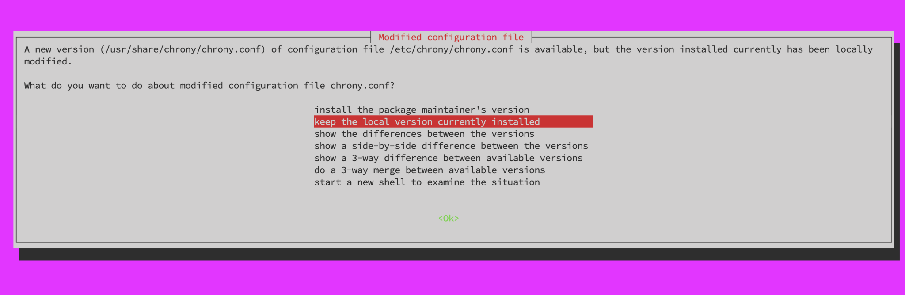
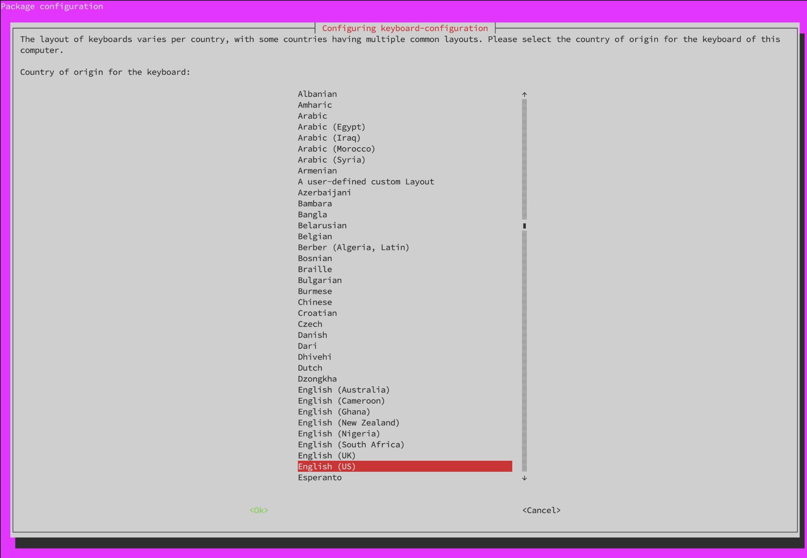
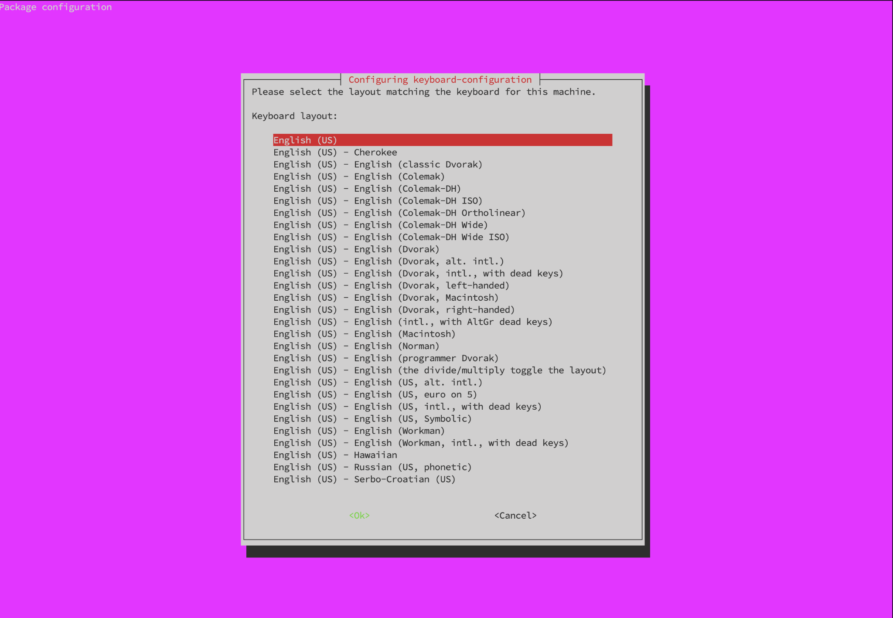
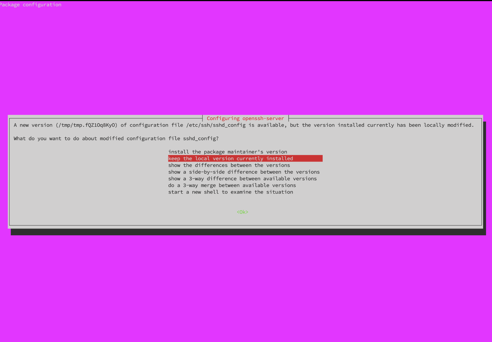
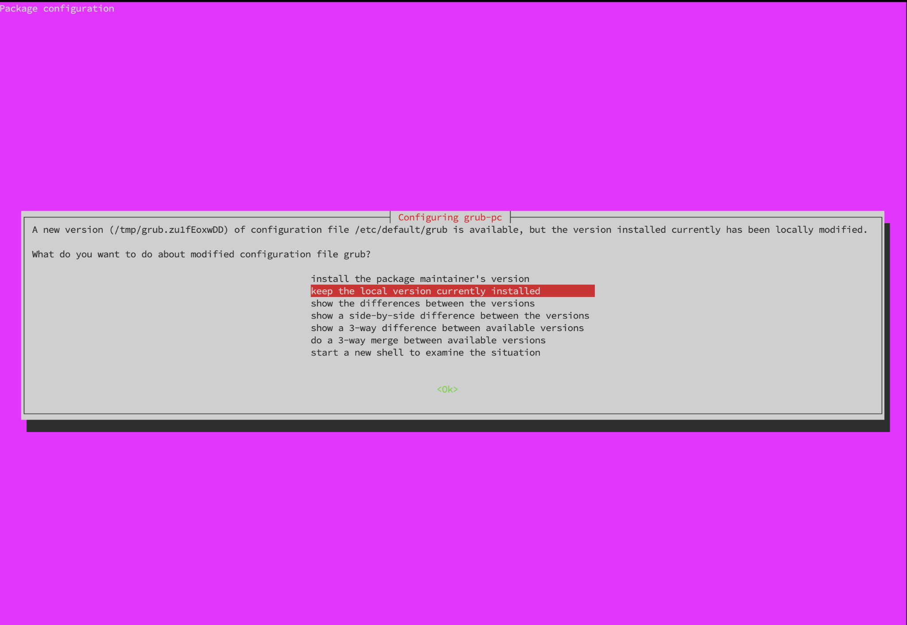
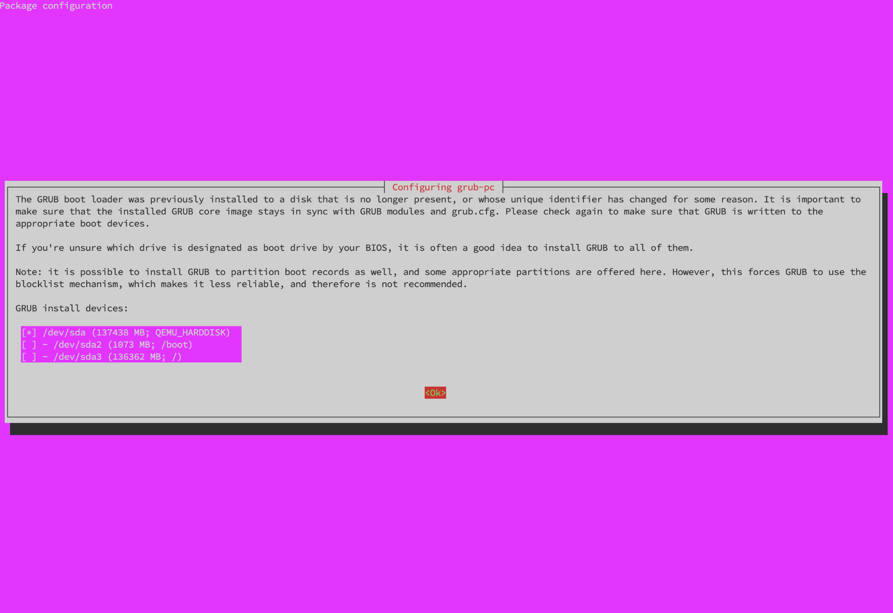

# **Ubuntu22.04から24.04へ移行**

!!! abstract "アップグレード前の確認事項"

    * 22.04 LTSのセキュリティサポートは `2027年6月頃` まで有効です。
    * 作業前に一通り熟読し、作業フローを理解して下さい。
    * OSアップグレードのため、作業は慎重に実施してください。


## **1. 事前準備**

### **1-1. スナップショットの作成**

!!! warning "スナップショットの作成"
    アップグレード前に<font color=red>**必ず**</font>、VPSのサーバー管理画面から現時点のスナップショット(バックアップ)を作成してください。  
    万一アップグレードに失敗した場合、素早く復旧できます。

### **1-2. SSH鍵の種類を確認する**

SSH接続用のローカルパソコンに保存されている、SSH秘密鍵ファイルの種類を確認してください。

* id_rsa
* ssh_ed25519

のどちらか

### **1-3. SSHターミナルバージョン最新化**

WindowsでR-loginをご利用の場合は、[最新のRLogin](https://github.com/kmiya-culti/RLogin/releases/){target="_blank" rel="noopener"}を使用して下さい。

### **1-4. 作業対象サーバログイン**

!!! Tip "接続方法"
    [1-4. 作業対象サーバログイン](../operation/ubuntu24-migration.md/#1-4)〜[1-8. Ubuntuバージョン確認](../operation/ubuntu24-migration.md/#1-8-ubuntu)は通常のSSH接続で作業してください。

??? note "id_rsaの場合"
    古いssh-rsa（SHA-1）方式は非推奨／接続不可になることがあるため、Ed25519 が推奨されるので作成します。

    **ペア鍵の作成**
    ```bash
    ssh-keygen -t ed25519 -N '' -C ssh_connect -f ~/.ssh/ssh_ed25519
    ```

    ssh_ed25519（秘密鍵）とssh_ed25519.pub（公開鍵）というファイルが作成されているか確認します。
    ```bash
    cd ~/.ssh
    ls
    ```
    
    公開鍵を認証ファイルに書き込みます。
    ```bash
    cat ssh_ed25519.pub >> authorized_keys
    ```

    !!! note "SSH鍵ファイルのダウンロード"

        1. R-loginの場合はファイル転送ウィンドウを展開  
        2. 左側ウィンドウ(ローカル側)は任意の階層にフォルダを作成  
        3. 右側ウィンドウ(サーバ側)は「.ssh」フォルダを選択  
        4. 右側ウィンドウから、`ssh_ed25519`と`ssh_ed25519.pub`の上で右クリックして  「ファイルのダウンロード」を選択  
        5. 一度サーバからログアウト  
        6. R-Loginのサーバ接続編集画面を開き、「SSH認証鍵」をクリックし4でダウンロードした`ssh_ed25519`ファイルを選択  
        7. サーバへ接続

        <font color=red>※4でローカルにダウンロードしたSSH鍵ペアはバックアップしてください。</font>

    サーバーに接続できたことを確認して、サーバー内の鍵を削除します。
    ```bash
    rm ~/.ssh/ssh_ed25519
    rm ~/.ssh/ssh_ed25519.pub
    ```


=== "ssh_ed25519の場合"
   
### **1-5. ノード停止**
```bash
sudo systemctl stop cardano-node
```

自動起動の停止
```bash
sudo systemctl disable cardano-node
```

### **1-6. システムアップデート**
```bash
sudo apt update && sudo apt full-upgrade -y && sudo apt autoremove -y
```

### **1-7. LTSアップグレード設定の確認**
```bash
grep Prompt /etc/update-manager/release-upgrades
```
> Prompt=lts であること

### **1-8. Ubuntuバージョン確認**

現在のバージョンを確認します。
```bash
lsb_release -d
```
> Description:    Ubuntu 22.04.* LTS


アップグレードコマンドの確認します。
```bash
which do-release-upgrade || sudo apt install ubuntu-release-upgrader-core -y
```

アップグレード可能なバージョンを確認します。
```bash
sudo do-release-upgrade -c
```
> Checking for a new Ubuntu release  
> New release '24.04.* LTS' available.  
> Run 'do-release-upgrade' to upgrade to it.  

アップグレード前にその他アップグレードが必要なパッケージがあるかどうか確認します。
```bash
apt list --upgradable
```
> パッケージが表示されなければ問題ありません。

```bash
apt-mark showhold
```
> 何も表示されなければ問題ありません。

??? "ある場合"
    表示されたパッケージをアップグレードします。  
    以下は一例です。

    ``` { .yaml .no-copy }
    apt list --upgradable

    Listing... Done
    gum/unknown 0.17.0 amd64 [upgradable from: 0.16.2]
    sosreport/jammy-updates 4.10.2-0ubuntu0~22.04.1 amd64 [upgradable from: 4.9.2-0ubuntu0~22.04.1]
    ```

    パッケージが hold 状態になっている場合があります。
    ``` { .yaml .no-copy }
    apt-mark showhold

    gum
    ```

    holdされているパッケージを解除します。
    ```bash
    sudo apt-mark unhold パッケージ名
    ```

    パッケージを更新します。
    ```bash
    sudo apt install パッケージ名
    ```

    その後アップグレードします。
    ```bash
    sudo apt full-upgrade -y
    ```

    アップグレードが完了したら、再度以下を実行して更新可能パッケージが残っていないことを確認します。
    ```bash
    apt list --upgradable
    ```

### **1-9. サーバー再起動**
```bash
sudo reboot
```


## **2. Ubuntuアップグレード**

!!! warning "アップグレードの注意点"
    Ubuntu24.04アップグレード(以下の作業)において、SSH接続での作業は不意な切断が発生した場合に復旧が困難になるため<font color=red>非推奨</font>となっております。  
    そのため、契約事業者(VPS)のマイページまたはサーバーパネルに付随しているコンソール画面(VNCまたはKVNなど)からの作業をオススメします。  
    ただし以下の点にご了承頂ける場合はSSH接続で作業することも可能です。  
    
    - 事前にスナップショット(バックアップ)作成が可能な方  
    - 不意なSSH切断でアップグレードが中断してもご自身で復旧出来る方  

    !!! tip "SSHで作業する場合"

        - 予備のSSHポートを開放してください。  
        ※ただしAWSやIONOSなど、VPSサーバー管理画面からファイアウォールを設定する場合は、<font color=red>以下のコードは実行せず</font>VPS管理画面から設定してください。
        ```bash
        sudo ufw allow 1022/tcp
        ```
        ```bash
        sudo ufw reload
        ```
        確認
        ```bash
        sudo ufw status numbered
        ```

        - R-loginを使用する場合は、不意な切断を防ぐため以下の設定を行って下さい。
        「`ファイル`」→「`サーバーに接続`」→ 接続先右クリックし「`接続を編集する`」→「`プロトコル`」→ SSH枠の「`KeepAliveパケット送信間隔(sec)`」にチェックを入れ、空欄に**`20`**を入力してください。


### **2-1. アップグレード実行**

!!! Question "接続パターン"
    * パターン1：VPSサーバー管理画面のコンソールからの接続  
    * パターン2：ローカルPCにインストールしたVNCクライアントからの接続(主にContabo)
    * パターン3：通常通りSSHでの接続

SSH接続でアップグレードする場合、tmux環境内で実行します。

```bash
tmux new -s ubuntu-upgrade
```

tmuxセッション内でアップグレードを実行します。
```bash
sudo do-release-upgrade
```

??? tip "SSHが切断された場合（復帰方法）"
    再接続後、以下で tmux に復帰できます。
    ```bash
    tmux a -t ubuntu-upgrade
    ```

### **2-2. アップグレードメッセージ**
以下、確認メッセージ例です。  
<font color=red>ご利用のサーバーによって表示内容が異なる場合があります。</font>  
表示された内容をよく読んで下さい。

!!! danger "注意"

    設定ファイルに関する確認メッセージが表示された場合は、  
    必ず **`keep the local version currently installed`（現在の設定を維持する）** を選択してください。

    サーバーによっては `chrony` や `sshd` など複数の設定ファイルで同様のメッセージが表示される場合がありますが、  
    いずれの場合も **`keep the local version currently installed`** を選択します。

**1. Ubuntuの案内メッセージ（README）**  
`y` を入力後 ++enter++  
``` { .yaml .no-copy }
Ubuntu is a Linux distribution for your desktop or server, with a fast
and easy install, regular releases, a tight selection of excellent
applications installed by default, and almost any other software you
can imagine available through the network.

We hope you enjoy Ubuntu.

== Feedback and Helping ==

If you would like to help shape Ubuntu, take a look at the list of
ways you can participate at

  http://www.ubuntu.com/community/participate/

Your comments, bug reports, patches and suggestions will help ensure
that our next release is the best release of Ubuntu ever.  If you feel
that you have found a bug please read:

  http://help.ubuntu.com/community/ReportingBugs

Then report bugs using apport in Ubuntu.  For example:

  ubuntu-bug linux

will open a bug report in Launchpad regarding the linux package.

If you have a question, or if you think you may have found a bug but
aren't sure, first try asking on the #ubuntu or #ubuntu-bugs IRC
channels on Libera.Chat, on the Ubuntu Users mailing list, or on the
Ubuntu forums:

  http://help.ubuntu.com/community/InternetRelayChat
  http://lists.ubuntu.com/mailman/listinfo/ubuntu-users
  http://www.ubuntuforums.org/


== More Information ==

You can find out more about Ubuntu on our website, IRC channel and wiki.
If you're new to Ubuntu, please visit:

  http://www.ubuntu.com/


To sign up for future Ubuntu announcements, please subscribe to Ubuntu's
very low volume announcement list at:

  http://lists.ubuntu.com/mailman/listinfo/ubuntu-announce


Continue [yN] y      # y を入力後Enter
```

**2. アップグレードを開始しますか？**  
`y` を入力後 ++enter++
``` { .yaml .no-copy }
Do you want to start the upgrade? 


54 packages are going to be removed. 172 new packages are going to be 
installed. 630 packages are going to be upgraded. 

You have to download a total of 1,419 M. This download will take 
about 4 minutes with a 40Mbit connection and about 37 minutes with a 
5Mbit connection. 

Fetching and installing the upgrade can take several hours. Once the 
download has finished, the process cannot be canceled. 

Continue [yN]  Details [d] y      # y 入力後Enter
```

**3. 変更されている chrony.conf の設定ファイルをどうしますか？**  
`keep the local version currently installed` を選択後 ++enter++


**4. このサーバーのキーボード配列はどれですか？**  
`English (US)` を選択後 ++enter++


**5. このマシンのキーボードに対応するレイアウトを選択してください。**  
`English (US)` を選択後 ++enter++


**6. nginxの設定**  
デフォルトの`N` を入力後 ++enter++
``` { .yaml .no-copy }
Configuration file '/etc/nginx/nginx.conf'
 ==> Modified (by you or by a script) since installation.
 ==> Package distributor has shipped an updated version.
   What would you like to do about it ?  Your options are:
    Y or I  : install the package maintainer's version
    N or O  : keep your currently-installed version
      D     : show the differences between the versions
      Z     : start a shell to examine the situation
 The default action is to keep your current version.
*** nginx.conf (Y/I/N/O/D/Z) [default=N] ? n      # n 入力後Enter
```

**7. sudoersの設定**  
デフォルトの`N` を入力後 ++enter++
``` { .yaml .no-copy }
Configuration file '/etc/sudoers'
 ==> Modified (by you or by a script) since installation.
 ==> Package distributor has shipped an updated version.
   What would you like to do about it ?  Your options are:
    Y or I  : install the package maintainer's version
    N or O  : keep your currently-installed version
      D     : show the differences between the versions
      Z     : start a shell to examine the situation
 The default action is to keep your current version.
*** sudoers (Y/I/N/O/D/Z) [default=N] ? n      # n 入力後Enter
```

**8. sysctlの設定**  
デフォルトの`N` を入力後 ++enter++
``` { .yaml .no-copy }
Configuration file '/etc/sysctl.conf'
 ==> Modified (by you or by a script) since installation.
 ==> Package distributor has shipped an updated version.
   What would you like to do about it ?  Your options are:
    Y or I  : install the package maintainer's version
    N or O  : keep your currently-installed version
      D     : show the differences between the versions
      Z     : start a shell to examine the situation
 The default action is to keep your current version.
*** sysctl.conf (Y/I/N/O/D/Z) [default=N] ? n      # n 入力後Enter
```

**9. この変更された SSH 設定ファイルをどうしますか？**  
`keep the local version currently installed` を選択後 ++enter++


**10. この変更された GRUB 設定ファイルをどうしますか？**  
`keep the local version currently installed` を選択後 ++enter++


**11. GRUB（ブートローダー）をどのディスクにインストールするか？**  
`/dev/sda` 上でスペースキーを押して選択し、Tabキーを押して `Ok` を選択した後、++enter++ 


**12. 古い不要パッケージを削除しますか？**  
`y` を入力後 ++enter++
``` { .yaml .no-copy }
Remove obsolete packages? 


114 packages are going to be removed. 

Removing the packages can take several hours. 

Continue [yN]  Details [d] y      # y 入力後Enter
``` 

**13. アップグレードが完了しました。再起動しますか？**  
`y` を入力後 ++enter++
``` { .yaml .no-copy }
System upgrade is complete.

Restart required 

To finish the upgrade, a restart is required. 
If you select 'y' the system will be restarted. 

Continue [yN]  y      # y 入力後Enter
``` 

## **3. アップグレード確認(SSH接続)**

!!! Tip "接続方法"

    [3. アップグレード確認(SSH接続)](../operation/ubuntu24-migration.md/#3-ssh)〜[5. ノード再インストール](../operation/ubuntu24-migration.md/#5)はSSH接続で作業してください。

### **3-1. 現在のUbuntuバージョン確認**

```bash
lsb_release -d
```
> No LSB modules are available.  
> Description:    Ubuntu 24.04.4 LTS  

!!! tip "ヒント"
    24.04はブラケットペーストモードが有効になっているためコマンドペースト後、ENTERで実行する必要があります。

### **3-2. ブラケットペーストモードOFF**
```bash
grep -qxF 'set enable-bracketed-paste off' ~/.inputrc || echo 'set enable-bracketed-paste off' >> ~/.inputrc
```

### **3-3. SSH再接続**
```bash
exit
```
> SSHで再接続してください。


## **4. 依存関係再インストール**

システムアップデート
```bash
sudo apt update && sudo apt upgrade -y
```

=== "リレーの場合"
    ```bash
    sudo apt install bc curl htop nano needrestart protobuf-compiler rsync ufw zstd automake build-essential pkg-config libffi-dev libgmp-dev libssl-dev libncurses-dev libsystemd-dev zlib1g-dev make g++ tmux git jq wget libtool autoconf liblmdb-dev liburing-dev libsnappy-dev -y
    ```

=== "BPの場合"
    ```bash
    sudo apt install bc curl htop nano needrestart protobuf-compiler python3-pip python3-venv python3-full rsync ufw zstd automake build-essential pkg-config libffi-dev libgmp-dev libssl-dev libncurses-dev libsystemd-dev zlib1g-dev make g++ tmux git jq wget libtool autoconf liblmdb-dev liburing-dev libsnappy-dev -y
    ```
    ```bash
    python3 -m venv ~/notify-venv
    ~/notify-venv/bin/pip install -U pip
    ~/notify-venv/bin/pip install watchdog pytz python-dateutil requests discordwebhook slackweb i18nice[YAML] python-dotenv
    ```
    
    確認
    ```bash
    ~/notify-venv/bin/python -c "import watchdog, pytz, dateutil, requests, discordwebhook, slackweb, i18n, dotenv; print('OK')"
    ```
    > `OK`と表示されれば問題ありません。

    ```bash
    sudo systemctl stop cnode-blocknotify.service
    ```
  
    ```bash title="このボックスはすべてコピーして実行してください"
    cat > $NODE_HOME/service/cnode-blocknotify.service << EOF 
    # file: /etc/systemd/system/cnode-blocknotify.service

    [Unit]
    Description=Cardano Node - SPO Blocknotify
    BindsTo=cnode-cncli-sync.service
    After=cnode-cncli-sync.service

    [Service]
    Type=simple
    User=$(whoami)
    WorkingDirectory=${NODE_HOME}/scripts/block-notify
    ExecStart=/home/${USER}/notify-venv/bin/python -u ${NODE_HOME}/scripts/block-notify/block_notify.py
    Restart=on-failure
    StandardOutput=syslog
    StandardError=syslog
    SyslogIdentifier=cnode-blocknotify

    [Install]
    WantedBy=cnode-cncli-sync.service
    EOF
    ```

    ```bash
    sudo cp $NODE_HOME/service/cnode-blocknotify.service /etc/systemd/system/cnode-blocknotify.service
    ```

    ```bash
    sudo chmod 644 /etc/systemd/system/cnode-blocknotify.service
    ```
    ```bash
    sudo systemctl daemon-reload
    ```
    ```bash
    sudo systemctl enable --now cnode-blocknotify.service
    ```

    起動確認
  
    ```bash
    blocknotify
    ```
    以下の表示なら正常です。
    > [***] SPO Block Notify(v2.*.*)を起動しました

    !!! tip "最新バージョンにアップデート"
        現在の最新バージョンはv2.5.*なのでそれ以下の方は、[4. アップデート手順](../setup/blocknotify-setup.md/#4)を実施して更新してください。


デーモン再起動自動化
```bash
sudo grep -qxF "\$nrconf{restart} = 'a';" /etc/needrestart/conf.d/50local.conf || \
echo "\$nrconf{restart} = 'a';" | sudo tee -a /etc/needrestart/conf.d/50local.conf > /dev/null
```
```bash
sudo sed -i '/^\$nrconf{blacklist_rc}/d' /etc/needrestart/conf.d/50local.conf
```
```bash
sudo grep -qxF "\$nrconf{blacklist_rc} = [qr(^cardano-node\\.service$) => 0, qr(^cnode-blocknotify\\.service$) => 0, qr(^cnode-cncli-sync\\.service$) => 0,];" /etc/needrestart/conf.d/50local.conf || \
echo "\$nrconf{blacklist_rc} = [qr(^cardano-node\\.service$) => 0, qr(^cnode-blocknotify\\.service$) => 0, qr(^cnode-cncli-sync\\.service$) => 0,];" | sudo tee -a /etc/needrestart/conf.d/50local.conf > /dev/null
```

<!--
libssl3アンインストール
```bash
sudo apt --purge remove libssl-dev
```

libssl-dev1.1インストール
```bash
cd $HOME
wget http://security.ubuntu.com/ubuntu/pool/main/o/openssl/libssl-dev_1.1.1f-1ubuntu2.17_amd64.deb
sudo dpkg -i libssl-dev_1.1.1f-1ubuntu2.17_amd64.deb
```

libssl1.1インストール
```bash
wget wget wget wget http://security.ubuntu.com/ubuntu/pool/main/o/openssl/libssl1.1_1.1.1f-1ubuntu2.17_amd64.deb
sudo dpkg -i libssl1.1_1.1.1f-1ubuntu2.17_amd64.deb
```

DLファイル削除
```bash
rm $HOME/libssl-dev_1.1.1f-1ubuntu2.17_amd64.deb
rm $HOME/libssl1.1_1.1.1f-1ubuntu2.17_amd64.deb
```
-->

自動起動有効化
```bash
sudo systemctl enable --now cardano-node
```

ノード同期状況の確認
```bash
sudo journalctl -u cardano-node -f
```

コンパイル済みHaskellパッケージ削除
```bash
cd ~/.cabal/store
rm -rf ghc-8.*
```


!!! tip "SSHでアップグレードを実施した場合"

    予備SSHポート（1022）を削除する前に、現在のSSHポートを許可します。  
    ※AWSやIONOSなどはVPS管理画面から削除してください。

    ステータスを確認します。
    ```bash
    sudo ufw status
    ```
    以下の表示があればOK
    > Status: active

    予備SSHポート（1022）を削除します。
    ```bash
    sudo ufw delete allow 1022/tcp
    ```

    確認
    ```bash
    sudo ufw status numbered
    ```

## **5. ノード再インストール**

<font color=red>ソースコードからビルドした`cardano-node`/`cardano-cli`を使用していた場合、もしくはノードアップデートする場合に以下の手順を実行してください。</font>
!!! tip "ヒント"
    [1. 依存環境アップデート](../operation/node-update.md/#1) ~ [3. 依存関係作業](../operation/node-update.md/#3)  

## **6. sysctlの設定**

=== "リレー"
    バックアップを取得しておきます。
    ```bash
    sysctl \
      net.ipv4.conf.all.rp_filter \
      net.ipv4.conf.default.rp_filter \
      net.ipv4.icmp_echo_ignore_broadcasts \
      net.ipv4.conf.all.accept_source_route \
      net.ipv4.conf.default.accept_source_route \
      net.ipv4.conf.all.accept_redirects \
      net.ipv4.conf.default.accept_redirects \
      net.ipv4.conf.all.secure_redirects \
      net.ipv4.conf.default.secure_redirects \
      net.ipv4.conf.all.log_martians \
      net.ipv4.tcp_syncookies \
      net.core.somaxconn \
      net.ipv4.tcp_max_syn_backlog \
      net.core.netdev_max_backlog \
      net.ipv4.ip_local_port_range \
      > "$HOME/sysctl-before-cardano-relay-$(date +%F).txt"
    ```
    ```bash
    sudo tee /etc/sysctl.d/99-cardano-relay.conf > /dev/null << 'EOF'

    # ------------------------------
    # Security hardening
    # ------------------------------

    # Ignore ICMP broadcast
    net.ipv4.icmp_echo_ignore_broadcasts = 1

    # Disable source routing
    net.ipv4.conf.all.accept_source_route = 0
    net.ipv4.conf.default.accept_source_route = 0

    # Disable ICMP redirects
    net.ipv4.conf.all.accept_redirects = 0
    net.ipv4.conf.default.accept_redirects = 0
    net.ipv4.conf.all.secure_redirects = 0
    net.ipv4.conf.default.secure_redirects = 0

    # Log suspicious packets
    net.ipv4.conf.all.log_martians = 1

    # SYN flood protection
    net.ipv4.tcp_syncookies = 1

    # ------------------------------
    # Relay network performance
    # ------------------------------

    # Increase TCP listen queue
    net.core.somaxconn = 4096

    # Increase SYN backlog
    net.ipv4.tcp_max_syn_backlog = 4096

    # Improve network buffer
    net.core.netdev_max_backlog = 5000

    # Increase ephemeral port range
    net.ipv4.ip_local_port_range = 10000 65535

    EOF
    ```

=== "BP"
    バックアップを取得しておきます。
    ```bash
    sysctl \
      net.ipv4.conf.all.rp_filter \
      net.ipv4.conf.default.rp_filter \
      net.ipv4.icmp_echo_ignore_broadcasts \
      net.ipv4.conf.all.accept_source_route \
      net.ipv4.conf.default.accept_source_route \
      net.ipv4.conf.all.accept_redirects \
      net.ipv4.conf.default.accept_redirects \
      net.ipv4.conf.all.secure_redirects \
      net.ipv4.conf.default.secure_redirects \
      net.ipv4.conf.all.log_martians \
      net.ipv4.tcp_syncookies \
      > "$HOME/sysctl-before-cardano-bp-$(date +%F).txt"
    ```
    ```bash
    sudo tee /etc/sysctl.d/99-cardano-bp.conf > /dev/null << 'EOF'

    # ------------------------------
    # Security hardening
    # ------------------------------

    # Ignore ICMP broadcast
    net.ipv4.icmp_echo_ignore_broadcasts = 1

    # Disable source routing
    net.ipv4.conf.all.accept_source_route = 0
    net.ipv4.conf.default.accept_source_route = 0

    # Disable ICMP redirects
    net.ipv4.conf.all.accept_redirects = 0
    net.ipv4.conf.default.accept_redirects = 0
    net.ipv4.conf.all.secure_redirects = 0
    net.ipv4.conf.default.secure_redirects = 0

    # Log suspicious packets
    net.ipv4.conf.all.log_martians = 1

    # SYN flood protection
    net.ipv4.tcp_syncookies = 1

    EOF
    ```

設定反映
```bash
sudo sysctl --system
```

!!! tip "既存設定の確認"
    ```bash
    cat $HOME/sysctl-before-cardano-*.txt
    ```

<!--
## **6. エアギャップマシンアップグレード**

### **6-1. 事前準備**
1. Ubuntuへログインし、主要ファイルのアクセス制限の解除
```bash
cd $NODE_HOME
chmod 700 vrf.skey
chmod 700 vrf.vkey
chmod 700 payment.vkey
chmod 700 payment.skey
chmod 700 stake.vkey
chmod 700 stake.skey
chmod 700 stake.addr
chmod 700 payment.addr
```
```bash
chmod u+rwx $HOME/cold-keys
cd $HOME/cold-keys
chmod 700 node.vkey
chmod 700 node.skey
```
2. 次のディレクトリ（`/home/$USER/cnode`、`/home/cold-keys`）を切り取って、外部ストレージに退避
3. Ubuntuをシャットダウン(電源オフ)


### **6-2. VirtualBoxアップグレード**
1. [VirtualBoxのダウンロードサイト](https://www.virtualbox.org/wiki/Downloads){target="_blank" rel="noopener"}にアクセスし、`VirtualBox 7.*.* platform packages`の`Windows hosts`または`macOS`のリンクからダウンロードし、既存のVirtuialBoxに対して<font color=red>**上書きインストール**</font>してください。


### **6-3. システムアップデート**
1. VirtualBoxのマシン設定からネットワークを有効
2. Ubuntuを起動
3. ディスク容量の確認
```bash
df -h /root
```
> Availの値が10G以上であることを確認します。
4. Ubuntu設定から「`電源管理`」→「`画面のブランク`」→「`しない`」に設定
5. アプリケーション一覧から`soft`と検索し、「`ソフトウェアとアップデート`」を起動
6. 「`アップデート`」タブのUbuntuの新バージョンの通知が「`長期サポート(LTS)版`」が選択されていることを確認して、「`閉じる`」ボタンを選択します。
7. アプリケーション一覧から`update`と検索し、「`ソフトウェアの更新`」を起動
8. 「`今すぐインストール`」を選択します。  
9. パスワードを入力し、認証ボタンを選択します。
10. インストール後再起動を求められたら再起動します。


### **6-4. Ubuntuアップグレード**
!!! tip "アップグレード"
    表示された内容に沿ってアップグレードしてください。  
    アップグレードには数十分かかります。

1. アプリケーション一覧から`update`と検索し、「`ソフトウェアの更新`」を起動
2. 「`今すぐインストール`」を選択します。 
3. パスワードを入力し、認証ボタンを選択します。 
4. 「`アップグレード`」を選択
5. パスワードを入力し、認証ボタンを選択します。
6. ポップアップ（リリースノート）が表示されたら「`アップグレード`」を選択します。
7. ポップアップ（アップグレードを開始しますか？）が表示されたら「`アップグレードを開始`」を選択します。
8. 「`ロック画面が無効になりました。`」というポップアップが表示された場合、「`閉じる`」ボタンを選択します。
9. 設定ファイルを置き換えるかと表示された場合、「`そのまま`」を選択します。
10. 「`サポートが中止された（あるいはリポジトリに存在しない）パッケージを削除しますか？`」というポップアップが表示されたら、「`削除`」ボタンを選択します。
11. 「`すぐに再起動`」ボタンを選択し、再起動してください。


### **6-5. GuestAddtionsアップグレード**
1. 「`デバイス`」タブから「`Guest Additionsのアップグレード`」を選択します。
2. Ubuntuをシャットダウン(電源オフ)


### **6-6. 最終仕上げ**
1. ネットワークをオフ
2. Ubuntuを起動
3. ブラケットペーストモードをOFFに設定
```bash
echo "set enable-bracketed-paste off" >> ~/.inputrc
```
4. 退避したディレクトリを配置
5. ファイルの権限の変更
```bash
cd $NODE_HOME
chmod 400 vrf.skey
chmod 400 vrf.vkey
chmod 400 payment.vkey
chmod 400 payment.skey
chmod 400 stake.vkey
chmod 400 stake.skey
chmod 400 stake.addr
chmod 400 payment.addr
```
```bash
cd $HOME/cold-keys
chmod 400 node.vkey
chmod 400 node.skey
chmod a-rwx $HOME/cold-keys
```
-->

---