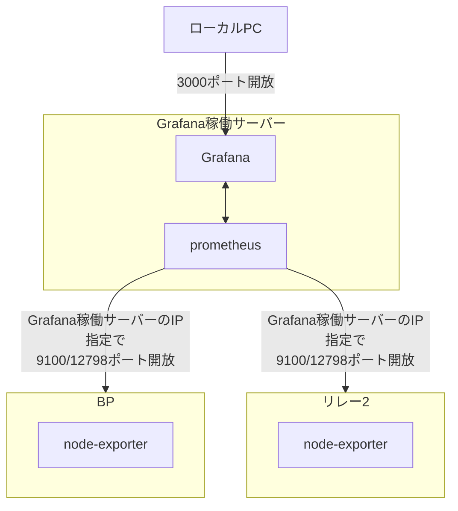
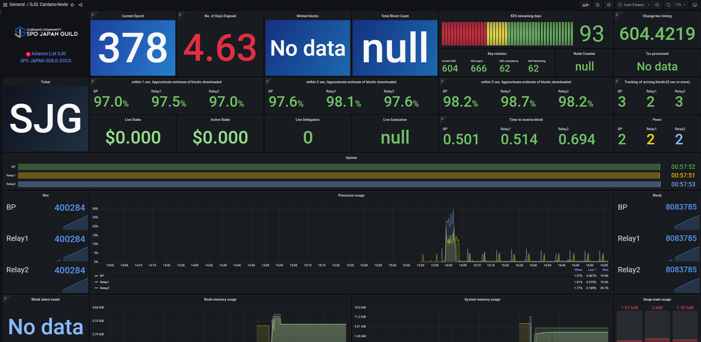

# **監視ツール設定**

プロメテウスはターゲットに指定したメトリックHTTPエンドポイントをスクレイピングし、情報を収集する監視ツールです。[オフィシャルドキュメントはこちら](https://prometheus.io/docs/introduction/overview/){target="_blank" rel="noopener"}  
グラファナは収集されたデータを視覚的に表示させるダッシュボードツールです。

## **1. インストール**

!!! abstract "概要"
    「prometheus」および「prometheus node exporter」をインストールします。  
    この手順では、**Grafana稼働サーバー（リレーサーバー1）**で`prometheus`と`Grafana`本体を稼働させ、各サーバーの情報を取得する方法です。

**構成図**


**prometheusのインストール**

=== "Grafana稼働サーバー"
    ```bash
    sudo apt update
    ```
    ```bash
    sudo apt install -y prometheus prometheus-node-exporter
    ```

=== "BPまたはリレー2以降"
    ```bash
    sudo apt update
    ```
    ```bash
    sudo apt install -y prometheus-node-exporter
    ```

**grafanaのインストール**

=== "Grafana稼働サーバー"

    ```bash
    sudo apt-get install -y apt-transport-https gnupg
    ```
    ```bash
    mkdir -p /etc/apt/keyrings
    ```
    ```bash
    wget -q -O - https://apt.grafana.com/gpg.key | sudo gpg --dearmor -o /etc/apt/keyrings/grafana.gpg
    ```
    ```bash
    sudo chmod 644 /etc/apt/keyrings/grafana.gpg
    ```
    ```bash
    echo "deb [signed-by=/etc/apt/keyrings/grafana.gpg] https://apt.grafana.com stable main" | sudo tee /etc/apt/sources.list.d/grafana.list
    ```
    ```bash
    sudo apt update && sudo apt install -y grafana
    ```

**サービス有効化とファイアウォールの設定**

=== "Grafana稼働サーバー"

    ```bash
    sudo systemctl enable --now grafana-server.service prometheus.service prometheus-node-exporter.service
    ```

    Grafanaポートを開放
    ```bash
    sudo ufw allow 3000/tcp
    ```
    ```bash
    sudo ufw reload
    ```

=== "BPまたはリレー2以降"
    
    ```bash
    sudo systemctl enable --now prometheus-node-exporter.service
    ```
    
    PrometheusメトリクスポートをGrafana稼働サーバーのIP限定で開放します。
    ```bash
    sudo ufw allow from <Grafana稼働サーバーのIP> to any port 12798
    ```
    ```bash
    sudo ufw allow from <Grafana稼働サーバーのIP> to any port 9100
    ```
    ```bash
    sudo ufw reload
    ```

## **2. 設定ファイルの作成**

Grafana稼働サーバーにインストールしたPrometheusの設定ファイルを作成します。  
ここに記載されたサーバーのデータを取得します。

!!! warning "注意"
    targets:の「xxx.xxx.xxx」は、BPのパブリックIP(静的)アドレスに置き換えて下さい。  
    targets:の「bb.xxx.xxx」は、リレー2のパブリックIP(静的)アドレスに置き換えて下さい。

=== "Grafana稼働サーバー"
    ```bash
    cat > $HOME/prometheus.yml << EOF
    global:
      scrape_interval:     15s # By default, scrape targets every 15 seconds.

      # Attach these labels to any time series or alerts when communicating with
      # external systems (federation, remote storage, Alertmanager).
      external_labels:
        monitor: 'codelab-monitor'

    scrape_configs:
      # Scrape configuration for system metrics and Cardano node metrics
      - job_name: 'prometheus'

        static_configs:
          - targets: ['localhost:9100']
            labels:
              alias: 'relaynode1'
              type:  'system'
          - targets: ['bb.xxx.xxx.xxx:9100']
            labels:
              alias: 'relaynode2'
              type:  'system'
          - targets: ['xx.xxx.xxx.xxx:9100']
            labels:
              alias: 'block-producing-node'
              type:  'system'
          - targets: ['xxx.xxx.xxx.xxx:12798']
            labels:
              alias: 'block-producing-node'
              type:  'cardano-node'
          - targets: ['localhost:12798']
            labels:
              alias: 'relaynode1'
              type:  'cardano-node'
          - targets: ['bb.xxx.xxx.xxx:12798']
            labels:
              alias: 'relaynode2'
              type:  'cardano-node'
    EOF
    ```
    > 補足：9100ポートはnode_exporterによるシステムメトリクス、12798ポートはCardanoノードのメトリクス出力ポートです。

**prometheus.yml構文チェック**
=== "Grafana稼働サーバー"
  ```
  sudo promtool check config $HOME/prometheus.yml
  ```
!!! hint "戻り値確認"
    構文エラーなしの場合
    ```{ .yaml .no-copy }
    Checking /home/$USER/prometheus.yml
    SUCCESS: /home/$USER/prometheus.yml is valid prometheus config file syntax
    ```

    !!! warning "構文エラーの場合(一例)"
        ```{ .yaml .no-copy }
        Checking /home/$USER/prometheus.yml
          FAILED: parsing YAML file /home/$USER/prometheus.yml: yaml: line **: did not find expected '-' indicator
        ```

        構文エラーだった場合は、$HOME/prometheus.ymlを開いて余分なスペースや記号の有無などを確認し、修正してください。
        ```
        sudo nano $HOME/prometheus.yml
        ```
        > 修正したら、`Ctrl + O`で保存し、Enter。その後`Ctrl + X`で閉じます。

  **prometheus.ymlファイルのバックアップ**
  ```bash
  sudo cp /etc/prometheus/prometheus.yml /etc/prometheus/prometheus.yml.bak
  ```

  **prometheus.ymlファイルの移動**
  ```bash
  sudo mv $HOME/prometheus.yml /etc/prometheus/prometheus.yml
  ```

  **Grafanaプラグインのインストール**
  ```
  sudo grafana-cli plugins install yesoreyeram-infinity-datasource
  ```
  > GrafanaダッシュボードでJSONデータを取得するため、Infinity datasourceプラグインをインストールします。

**サービス再起動**

=== "Grafana稼働サーバー"

    ```bash
    sudo systemctl restart grafana-server.service prometheus.service prometheus-node-exporter.service
    ```

**サービスが正しく実行されていることを確認します。**

=== "Grafana稼働サーバー"

    ```bash
    sudo systemctl --no-pager status grafana-server.service prometheus.service prometheus-node-exporter.service
    ```
!!! hint "戻り値確認"
    * grafana-server.service
    * prometheus.service
    * prometheus-node-exporter.service  
    上記3つのプログラムが 緑色 `active (running)` になっていることを確認します。

**バージョン確認**
=== "Grafana稼働サーバー"
    `Grafana`、`Prometheus`、`node_exporter`のバージョン確認
    ```bash
    grafana-server -v
    prometheus --version
    prometheus-node-exporter --version
    ```

=== "BPまたはリレー2以降"
    node_exporterのバージョン
    ```bash
    prometheus-node-exporter --version
    ```

!!! hint "戻り値確認"
    それぞれ以下のような形式で表示されれば正常です。

    ```text
    Version 12.4.1
    prometheus, version 2.45.3+ds
    node_exporter, version 1.7.0
    ```

### **2-1. 既存の設定ファイルを更新する場合**

??? tip "既存ファイルの更新"
    ```
    sudo nano /etc/prometheus/prometheus.yml
    ```
    > 修正したら、`Ctrl + O`で保存し、Enter。その後`Ctrl + X`で閉じます。

    **prometheus.yml構文チェック**
    === "Grafana稼働サーバー"
      ```
      sudo promtool check config /etc/prometheus/prometheus.yml
      ```

    !!! hint "戻り値確認"
        構文エラーなしの場合
        ```{ .yaml .no-copy }
        Checking /etc/prometheus/prometheus.yml
        SUCCESS: /etc/prometheus/prometheus.yml is valid prometheus config file syntax
        ```

        !!! warning "構文エラーの場合(一例)"
            ```{ .yaml .no-copy }
            Checking /etc/prometheus/prometheus.yml
              FAILED: parsing YAML file /etc/prometheus/prometheus.yml: yaml: line **: did not find expected '-' indicator
            ```
            /etc/prometheus/prometheus.ymlを開いて余分なスペースや記号の有無などを確認してください。

    **サービスの再起動**
    ```
    sudo systemctl restart prometheus.service
    ```

## **3. Grafanaダッシュボードの設定**

1. ローカルPCのブラウザから http://Grafana稼働サーバーIPアドレス:3000 を開きます。
2. ログイン名・PWは **admin** / **admin**
3. パスワードを変更します。
4. 左ペインの「**Connections**」→「**Data sources**」を選択します。
5. 「**Add data source**」を選択し、「**Prometheus**」を選択します。
6. 「**Name**」は以下を入力します。
```text
Prometheus
```
7. 「**URL**」は以下を入力します。
```text
http://localhost:9090
```
8. 最下部に配置されている「**Save & Test**」を選択し`Successfully queried the Prometheus API.`と表示されたら再度左ペインから「`Data sources`」を選択します。
9. 「**Add new data source**」を選択し、検索欄から「**Infinity**」を検索し、選択します。
10. 設定内容を変更することなく、「**Save & Test**」を選択し`Health check successful`と表示されたら問題ありません。
11. **BPサーバー**でパネル用JSONファイルをダウンロードします。
```bash
curl -s -o $NODE_HOME/SJG_Grafana_Dashboard.json https://raw.githubusercontent.com/akyo3/Extends-SJG-Knowledge/main/SJG_Grafana_Dashboard.json
```
```bash
sed -i \
    -e "s/bech32_id_of_your_pool/$(cat $NODE_HOME/pool.id-bech32)/g" \
    $NODE_HOME/SJG_Grafana_Dashboard.json
```
12. BPの`cnode`フォルダにある`SJG_Grafana_Dashboard.json`をローカルPCにダウンロードします。  
13. 左ペインの「**Dashboards**」→「**New**」→「**`Import`**」を選択します。  
14. 「**Upload dashboard JSON file**」を選択し、ダウンロードした`SJG_Grafana_Dashboard.json`を指定します。  
15. 「**DS_PROMETHEUS**」→「**Prometheus**」を選択し、「**DS_YESOREYERAM-INFINITY-DATASOURCE**」→「**yesoreyeram-infinity-datasource**」を選択し`Import`ボタンを選択します。  



!!! success "🎉"
    これで基本的な監視設定は完了です。
    
    以下の追加設定も実施してください。

    * [Grafanaアラート設定](../operation/grafana-alert.md)
    * [Grafanaセキュリティ強化](../operation/grafana-security.md)

---


<!--
aptで管理するため削除予定

node_exporterアップデート

=== "リレーノード/BP"
    node_exporterのパスを取得する
    ```bash
    cd $HOME/git
    nodeexPath=`which prometheus-node-exporter`
    ```

    1.10.2をダウンロードする
    ```bash
    wget https://github.com/prometheus/node_exporter/releases/download/v1.10.2/node_exporter-1.10.2.linux-amd64.tar.gz
    ```

    ダウンロードファイルを解凍する
    ```bash
    tar xvf node_exporter-1.10.2.linux-amd64.tar.gz
    ```

    サービスを停止する
    ```bash
    sudo systemctl stop prometheus-node-exporter.service
    ```
    
    バイナリファイルをシステムフォルダへコピーする
    ```bash
    cd node_exporter-1.10.2.linux-amd64
    sudo cp node_exporter $nodeexPath
    ```

    サービスをスタートする
    ```bash
    sudo systemctl start prometheus-node-exporter.service
    ```
    
    バージョン確認
    
    ```bash
    prometheus-node-exporter --version
    ```
    > 戻り値1行目が`node_exporter, version 1.10.2`ならOK
-->