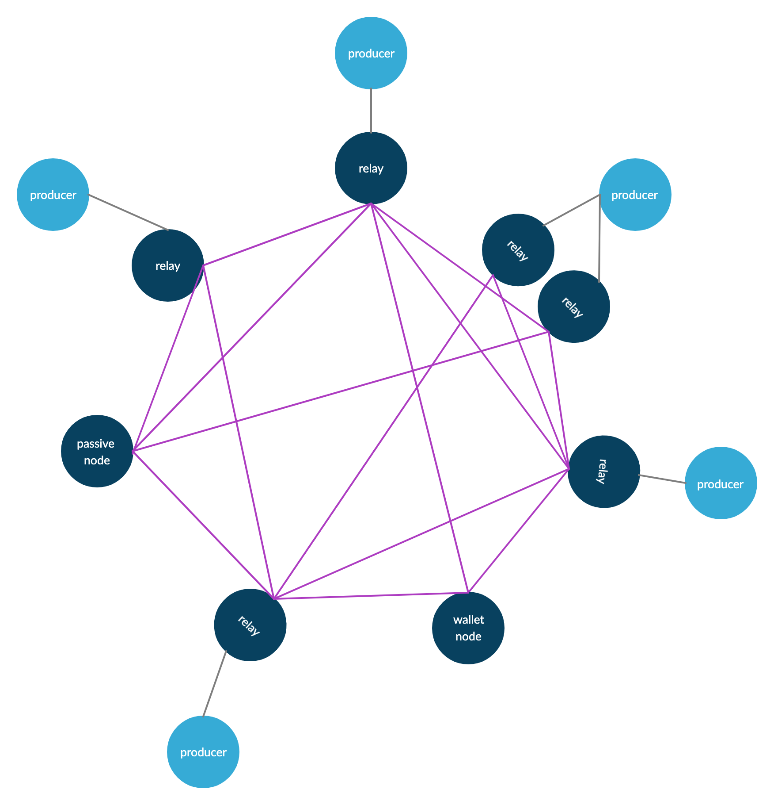

# リレー/BP接続設定



!!! abstract "リレーとBPの役割"

    - **リレー** … BP とネットワークの橋渡し。ブロック同期・伝播を行う。
    - **BP** … ブロック生成専用。`node.cert` / `kes.skey` / `vrf.skey` で起動し、**自リレーのみ**に接続する。

---

## 1. P2P接続とトポロジーの理解

P2P では接続先の多くはノードが自動で選びます。  
**必ずつなぎたい相手（自BP・自リレーなど）だけ** `localRoots` に書きます。

### 1-1. 接続状態（Hot / Warm / Cold）

ノードは接続先を次の3種類で管理します。

| 状態 | 説明 |
| --- | --- |
| **Hot** | ブロック同期・伝播に使っているアクティブな接続 |
| **Warm** | 接続は維持し、必要時に Hot に昇格する待機接続 |
| **Cold** | 候補として保持しているが、まだ接続していないピア |

**覚えておくとよいこと**

- `advertise`は`Peer Sharing`でその接続先を他ノードへ知らせてよいかを表します。  
- BPや内部用リレーなど、外部へ公開したくない接続先は `false`に設定。

---

## 2. トポロジーファイルの変更

!!! hint "`${NODE_CONFIG}-topology.json`"

    - **リレー** … 自BP・他リレーなど、固定したい相手を `localRoots` に記載。
    - **BP** … **自リレーだけ**。`useLedgerAfterSlot` は **`-1`**（台帳ピアを使わない）。
    - **IP** … サーバーの**パブリック（固定）アドレス**。ポートはノード用（SSH と混同しない）。

!!! caution "同期が 100% になってから"

    ```bash
    cardano-cli latest query tip ${NODE_NETWORK} | grep syncProgress
    ```

    `"syncProgress": "100.00"` になるまで待ってから進めてください。

### 2-1. 主な項目

| 項目 | 説明 |
| --- | --- |
| `localRoots` | 常に維持したいピアのグループ（**グループ間で同じピアを重ねない**） |
| `accessPoints` | IP または DNS とポート |
| `advertise` | Peer Sharing でその接続先を他ノードへ知らせてよいか。BP や内部用リレーなど、公開したくない接続先は `false`に設定 |
| `trustable` | `bootstrapPeers: null` の場合、初期接続先として信頼するピアには通常 `true` を指定。自BP・自リレーなど、自分で管理しているピアは通常 `true` に設定。 |
| `hotValency` | そのグループの Hot 接続数（旧 `valency` と同義） |
| `diffusionMode` | UFW 等で通信元を制限している場合、`InitiatorOnly` は不要です。`diffusionMode` を省略すると `InitiatorAndResponder` になります。 |
| `peerSnapshotFile` | 手順例どおりパスを書く（運用で `null` にする場合は別途確認） |
| `useLedgerAfterSlot` | リレーは手順例の値、BP は **`-1`** |

### 2-2. 手順

!!! danger "リレーノード"

    ??? warning "クラウドのセキュリティグループでファイアウォールを開けている場合"

        `ufw` は使わず、コンソールで**リレー用ポート（例: 6000）のインバウンド**を許可してください。

    ```bash
    sudo ufw allow 6000/tcp
    sudo ufw reload
    ```

    [4. ノード起動スクリプトの作成](../setup/node-setup.md/#__tabbed_3_2) で決めた**ノード用ポート**に合わせること。  
    コードの **`+`（注釈）** を開いて内容を確認してください。

    === "リレー1"

        ```yaml
        cat > $NODE_HOME/${NODE_CONFIG}-topology.json << EOF
        {
          "bootstrapPeers": [
            {
              "address": "backbone.cardano.iog.io",
              "port": 3001
            },
            {
              "address": "backbone.mainnet.cardanofoundation.org",
              "port": 3001
            },
            {
              "address": "backbone.mainnet.emurgornd.com",
              "port": 3001
            }
          ],
          "localRoots": [
            {
              "accessPoints": [
                {
                  "address": "BPのIP",#(1)!
                  "port": 00000 #(2)!
                }
              ],
              "advertise": false,#(3)!
              "trustable": true,
              "hotValency": 1
            },
            {
              "accessPoints": [
                {
                  "address": "リレー2のIP or DNS",#(4)!
                  "port": 6000 #(5)!
                }
              ],
              "advertise": true,
              "trustable": true,
              "hotValency": 1
            }
          ],
          "publicRoots": [],
          "useLedgerAfterSlot": 182044807
        }
        EOF
        ```
        { .annotate }

        1. BP の IP。
        2. BP のポート。
        3. BP は必ず `advertise: false`。
        4. リレー2 の IP または DNS。
        5. リレー2 のポート。

    === "リレー2"

        ```yaml
        cat > $NODE_HOME/${NODE_CONFIG}-topology.json << EOF
        {
          "bootstrapPeers": [
            {
              "address": "backbone.cardano.iog.io",
              "port": 3001
            },
            {
              "address": "backbone.mainnet.cardanofoundation.org",
              "port": 3001
            },
            {
              "address": "backbone.mainnet.emurgornd.com",
              "port": 3001
            }
          ],
          "localRoots": [
            {
              "accessPoints": [
                {
                  "address": "BPのIP",#(1)!
                  "port": 00000 #(2)!
                }
              ],
              "advertise": false,#(3)!
              "trustable": true,
              "hotValency": 1
            },
            {
              "accessPoints": [
                {
                  "address": "リレー1のIP or DNS",#(4)!
                  "port": 6000 #(5)!
                }
              ],
              "advertise": true,
              "trustable": true,
              "hotValency": 1
            }
          ],
          "publicRoots": [],
          "useLedgerAfterSlot": 182044807
        }
        EOF
        ```
        { .annotate }

        1. BP の IP。
        2. BP のポート。
        3. BP は必ず `advertise: false`。
        4. リレー1 の IP または DNS。
        5. リレー1 のポート。

<!--
    === "リレー1"

        ```yaml
        cat > $NODE_HOME/${NODE_CONFIG}-topology.json << EOF
        {
          "bootstrapPeers": null,
          "localRoots": [
            {
              "accessPoints": [
                {
                  "address": "BPのIP",#(1)!
                  "port": 00000 #(2)!
                }
              ],
              "advertise": false,#(3)!
              "trustable": true,
              "hotValency": 1
            },
            {
              "accessPoints": [
                {
                  "address": "リレー2のIP or DNS",#(4)!
                  "port": 6000 #(5)!
                }
              ],
              "advertise": true,
              "trustable": true,
              "hotValency": 1
            }
          ],
          "peerSnapshotFile": "$NODE_HOME/${NODE_CONFIG}-peer-snapshot.json",
          "publicRoots": [],
          "useLedgerAfterSlot": 182044807
        }
        EOF
        ```
        { .annotate }

        1. BP の IP。
        2. BP のポート。
        3. BP は必ず `advertise: false`。
        4. リレー2 の IP または DNS。
        5. リレー2 のポート。

    === "リレー2"

        ```yaml
        cat > $NODE_HOME/${NODE_CONFIG}-topology.json << EOF
        {
          "bootstrapPeers": null,
          "localRoots": [
            {
              "accessPoints": [
                {
                  "address": "BPのIP",#(1)!
                  "port": 00000 #(2)!
                }
              ],
              "advertise": false,#(3)!
              "trustable": true,
              "hotValency": 1
            },
            {
              "accessPoints": [
                {
                  "address": "リレー1のIP or DNS",#(4)!
                  "port": 6000 #(5)!
                }
              ],
              "advertise": true,
              "trustable": true,
              "hotValency": 1
            }
          ],
          "peerSnapshotFile": "$NODE_HOME/${NODE_CONFIG}-peer-snapshot.json",
          "publicRoots": [],
          "useLedgerAfterSlot": 182044807
        }
        EOF
        ```
        { .annotate }

        1. BP の IP。
        2. BP のポート。
        3. BP は必ず `advertise: false`。
        4. リレー1 の IP または DNS。
        5. リレー1 のポート。
-->

!!! danger "BP"
    ??? warning "クラウドのセキュリティグループでファイアウォールを開けている場合"

        `ufw` は使わず、コンソールで**BP用ポートのインバウンド**を許可してください。

    ```bash
    PORT=`grep "PORT=" $NODE_HOME/startBlockProducingNode.sh`
    b_PORT=${PORT#"PORT="}
    echo "BPポートは ${b_PORT} です"
    ```

    ```bash
    sudo ufw allow from <リレーサーバー1のIP> to any port ${b_PORT}
    ```
  
    ```bash
    sudo ufw allow from <リレーサーバー2のIP> to any port ${b_PORT}
    ```

    ```bash
    sudo ufw reload
    ```

    コードの **`+`（注釈）** を開いて内容を確認してください。

    ```yaml
    cat > $NODE_HOME/${NODE_CONFIG}-topology.json << EOF
    {
      "bootstrapPeers": null,
      "localRoots": [
        {
          "accessPoints": [
            {
              "address": "リレー1のIP or DNS",#(1)!
              "port": 6000 #(2)!
            },
            {
              "address": "リレー2のIP or DNS",#(3)!
              "port": 6000 #(4)!
            }
          ],
          "advertise": false,#(5)!
          "trustable": true,
          "hotValency": 2 #(6)!
        }
      ],
      "publicRoots": [],
      "useLedgerAfterSlot": -1 #(7)!
    }
    EOF
    ```
    { .annotate }

    1. リレー1 の IP または DNS。
    2. リレー1 のポート。
    3. リレー2 の IP または DNS。
    4. リレー2 のポート。
    5. `advertise: false`。
    6. 固定するリレー台数に合わせる。通常は `accessPoints` の数と同じにする。
    7. `-1` で BP モード（台帳ピアを使わない）。

<!--
    ```yaml
    cat > $NODE_HOME/${NODE_CONFIG}-topology.json << EOF
    {
      "bootstrapPeers": null,
      "localRoots": [
        {
          "accessPoints": [
            {
              "address": "リレー1のIP or DNS",#(1)!
              "port": 6000 #(2)!
            },
            {
              "address": "リレー2のIP or DNS",#(3)!
              "port": 6000 #(4)!
            }
          ],
          "advertise": false,#(5)!
          "trustable": true,
          "hotValency": 2 #(6)!
        }
      ],
      "peerSnapshotFile": "$NODE_HOME/${NODE_CONFIG}-peer-snapshot.json",
      "publicRoots": [],
      "useLedgerAfterSlot": -1 #(7)!
    }
    EOF
    ```
    { .annotate }

    1. リレー1 の IP または DNS。
    2. リレー1 のポート。
    3. リレー2 の IP または DNS。
    4. リレー2 のポート。
    5. `advertise: false`。
    6. 固定するリレー台数に合わせる。通常は `accessPoints` の数と同じにする。
    7. `-1` で BP モード（台帳ピアを使わない）。
-->

### 2-3. 構文チェックと再起動

```bash
jq . $NODE_HOME/${NODE_CONFIG}-topology.json
```

JSON がそのまま表示されれば問題ありません。  
`parse error` のときは `{}` `[]` `,` を確認してください。

```bash
cnrestart
```

---