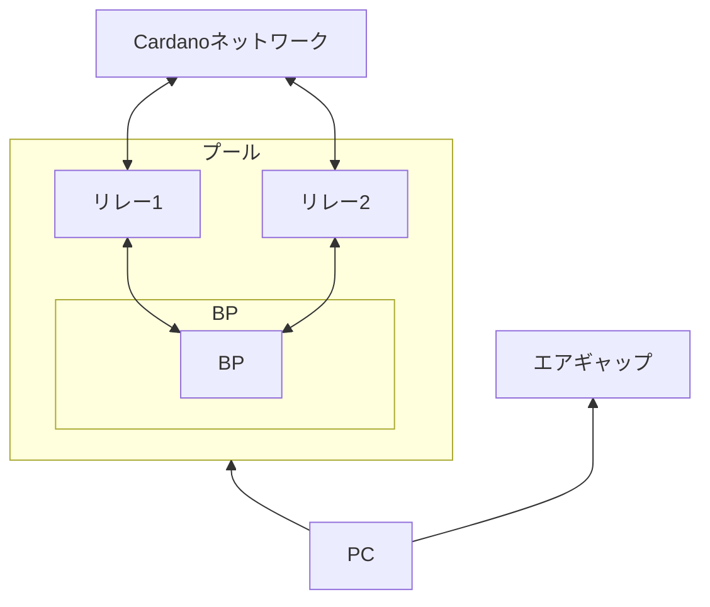

# **はじめに**

## Cardanoステークプールの構築・運用に関する技術マニュアル

**[SPO JAPAN GUILD](https://spojapanguild.net/)**では、Cardanoネットワークの分散化促進を目的として、日本語によるステークプール構築・運用の技術マニュアルを整備しています。  
このマニュアルでは、SPOに必要な知識や作業手順を体系的に習得できます。

!!! info "情報"
    最終更新日：2025年11月28日  
    マニュアルバージョン：`13.8.9`  
    対応ノードバージョン：`v10.5.3`

!!! tip "サポート"
    サポートが必要な場合は、Discordの[SPO JAPAN GUILD](https://discord.gg/U3gU54c)コミュニティで現役のSPOに相談できます。

## **ステークプールとは？**
CardanoネットワークのコンセンサスアルゴリズムはPoS（Proof of Stake）を採用しており、ステークプールがCardanoノードを運用し、トランザクション処理とブロック生成を担います。

## **SPOとは？**
SPO（Stake Pool Operator）は、ステークプールを運用するオペレーターを指します。  
Cardanoノードを適切に運用・監視し、Cardanoネットワークのセキュリティと安定性を維持します。

## **SPOに求められるスキル**
Cardanoステークプールを運営するには、次のスキルが必要です。

- Cardanoノードを継続的にセットアップ、実行、維持する運用スキル
- ノードを24時間365日稼働させるコミットメント
- システム運用スキル
- サーバ管理スキル （運用・保守）
- 開発と運用に関する知識（DevOps）
- サーバ強化およびセキュリティに関するスキル

## **SPOの主な業務**
- ステークプール構築
- サーバー(ノード)監視
- 割り当てられたブロックの生成（※ノード設定が正しければ自動生成されます）
- マーケティング・コミュニティ貢献活動

## **運用コスト**
| 項目      | コスト                          |
| :----------- | :------------------------------------: |
| プール登録料(初回のみ)       | 500 ADA  |
| ステークアドレス発行料(初回のみ)       | 2 ADA |
| トランザクション手数料    | 数 ADA |
| サーバー代（最小構成：計3台）/ 月 | 1台あたり 16,000〜32,000円 |

## **オペレーター報酬**
{==
  
① + (プール総報酬 - ①) * ② = オペレーター報酬
  
==}

| 項目      | 報酬                          |
| :----------- | :------------------------------------ |
| ① 固定報酬       | 最低 170 ADAから設定可能  |
| ② 変動報酬       | 0%～100% で設定可能  |

!!! warning "注意"
    オペレーター報酬を高く設定すると、委任者の報酬が減少します。

## **サーバースペック要件**
=== "最小構成"
    | 項目      | 要件                          |
    | :---------- | :----------------------------------- |
    | **サーバー**      | BP用1台 / リレー用2台  |
    | **OS**       | 64-bit Linux (Ubuntu 22.04 LTS) |
    | **CPU**   | 2GHz / 2コア以上の Intel または AMD x86 |
    | **メモリ**    | 24GB |
    | **ストレージ**    | 350GB |
    | **ネットワーク**    | 10Mbps |
    | **帯域**    | 1時間あたり1GB |
    | **電力**    | 24時間365日安定供給 |

=== "推奨構成"
    | 項目      | 要件                          |
    | :---------- | :----------------------------------- |
    | **サーバー**      | BP用1台 / リレー用2台  |
    | **OS**       | 64-bit Linux (Ubuntu 22.04 LTS) |
    | **CPU**   | 2GHz以上 4コアの Intel または AMD x86 |
    | **メモリ**    | 24GB以上 |
    | **ストレージ**    | 350GB以上 |
    | **ネットワーク**    | 100Mbps |
    | **帯域**    | 無制限 |
    | **電力**    | 24時間365日安定供給 |

## **エアギャップマシンスペック**
=== "推奨構成"
    | 項目      | 要件                          |
    | :---------- | :----------------------------------- |
    | **OS**       | 64-bit Linux (Ubuntu 22.04 LTS) |
    | **CPU**   | 2GHz以上 4コアの Intel または AMD x86 |
    | **メモリ**    | 8GB以上 |
    | **ストレージ**    | 100GB以上 |

## **サーバー構成イメージ**

    

## **サーバー選定について**
!!! note ""
    Cardanoは世界で最も分散化されたネットワークを目指しており、地理的に分散したノードネットワークの形成が非常に重要です。  
    この理念に基づき、当ギルドでは{==「おすすめのサーバー(VPS)業者」の情報共有は行っていません==}。  
    サーバー選定はご自身の判断で行ってください。  

---