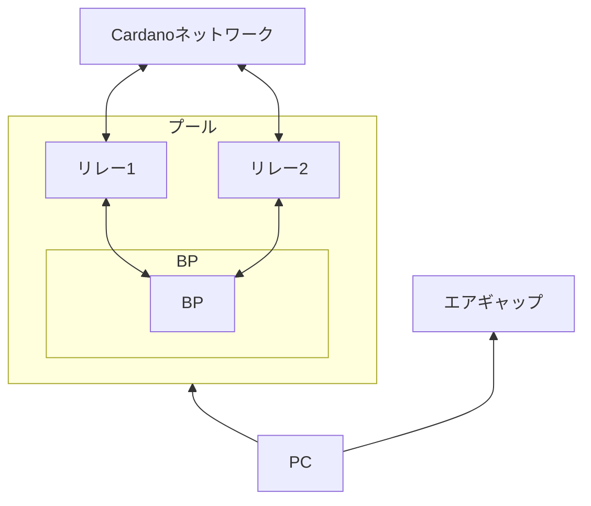

# Cardanoステークプールの構築・運用に関する技術マニュアル

## **はじめに**
**[SPO JAPAN GUILD](https://spojapanguild.net/){target="_blank" rel="noopener"}**では、Cardanoネットワークの分散化促進を目的として、日本語によるステークプール構築・運用の技術マニュアルを整備しています。  
このマニュアルでは、SPOに必要な知識や作業手順を体系的に習得できます。

!!! info "情報"
    最終更新日：2026年1月15日  
    マニュアルバージョン：`13.9.0`  
    対応ノードバージョン：`v10.5.3`

!!! tip "サポート"
    サポートが必要な場合は、Discordの[SPO JAPAN GUILD](https://discord.gg/U3gU54c){target="_blank" rel="noopener"}コミュニティで現役のSPOに相談できます。

## **ステークプールとは**
Cardanoネットワークのコンセンサスアルゴリズムは、PoS（Proof of Stake）を採用しており、ステークプールはCardanoノードを運用することで、トランザクション処理とブロック生成を担い、ネットワークのセキュリティと分散化を支えます。

## **SPOとは**
SPO（Stake Pool Operator）は、ステークプールを運用するオペレーターを指します。  
ブロック生成ノードおよびリレーノードを適切に構成・運用・監視し、Cardanoネットワークのセキュリティと安定性を維持します。

## **SPOに求められるスキル**
Cardanoステークプールを運営するには、次のスキルが必要です。

!!! note "スキル"
    **運用スキル**：  
    ・ Cardanoノードを継続的にセットアップ、実行、維持する運用スキル  
    ・ ノードを24時間365日稼働させるコミットメント  
    ・ サーバ監視・障害対応スキル  

    **技術スキル**：  
    ・ Linuxサーバ管理スキル（運用・保守）  
    ・ サーバ強化・セキュリティ強化スキル  
    ・ DevOpsに関する知識  

## **SPOの主な業務**
- ステークプール構築
- サーバー(ノード)監視
- 割り当てられたブロックの生成（※ノード設定が正しければ自動生成されます）
- メンテナンス作業（ノードアップデート等）
- マーケティング・コミュニティ貢献活動

## **運用コスト**
| 区分      | 内容                          |
| :----------- | :------------------------------------: |
| プール登録料(初回のみ)       | 500 ADA  |
| ステークキー登録保証金(初回のみ)       | 2 ADA |
| トランザクション手数料    | 数 ADA |
| サーバー代（最小構成：計3台）/ 月 | 1台あたり 16,000〜32,000円 |

## **SPOの報酬**
{==
  
① + (プール総報酬 - ①) * ② = SPOの報酬
  
==}

| 区分      | 内容                          |
| :----------- | :------------------------------------ |
| ① 固定費（Fixed Cost）       | 最低 170 ADAから設定可能  |
| ② 変動費（Variable Fee）       | 0%～100% で設定可能  |

!!! warning "注意"
    固定・変動費を高く設定しすぎると、委任者の報酬が減少します。

## **サーバースペック要件**
=== "最小構成"
    | 区分      | 要件                          |
    | :---------- | :----------------------------------- |
    | **サーバー**      | BP用1台 / リレー用2台  |
    | **OS**       | 64-bit Linux (Ubuntu 22.04 LTS) |
    | **CPU**   | 2GHz / 2コア以上の Intel または AMD（x86_64） |
    | **メモリ**    | 24GB |
    | **ストレージ**    | 350GB |
    | **ネットワーク**    | 10Mbps |
    | **帯域**    | 1時間あたり1GB |
    | **電力**    | 24時間365日安定供給 |

=== "推奨構成"
    | 区分      | 要件                          |
    | :---------- | :----------------------------------- |
    | **サーバー**      | BP用1台 / リレー用2台  |
    | **OS**       | 64-bit Linux (Ubuntu 22.04 LTS) |
    | **CPU**   | 2GHz以上 4コアの Intel または AMD（x86_64） |
    | **メモリ**    | 24GB以上 |
    | **ストレージ**    | 350GB以上 |
    | **ネットワーク**    | 100Mbps |
    | **帯域**    | 無制限 |
    | **電力**    | 24時間365日安定供給 |

## **エアギャップ環境のスペック要件**
=== "推奨構成"
    | 区分      | 要件                          |
    | :---------- | :----------------------------------- |
    | **OS**       | 64-bit Linux (Ubuntu 24.04 LTS) |
    | **CPU**   | 2GHz以上 4コアの Intel または AMD（x86_64） |
    | **メモリ**    | 8GB以上 |
    | **ストレージ**    | 100GB以上 |

## **サーバー構成例**

    

## **サーバー選定についての方針**
!!! quote "当ギルドの方針"
    Cardanoは世界で最も分散化されたネットワークを目指しており、地理的に分散したノードネットワークの形成が非常に重要です。  
    この理念に基づき、当ギルドでは{==**「おすすめのサーバー(VPS)業者」の情報共有は行っていません。**==}  
    そのため、地域・プロバイダ・回線品質・価格・信頼性を比較検討したうえで、ご自身の運用方針に合わせて選択してください。

---