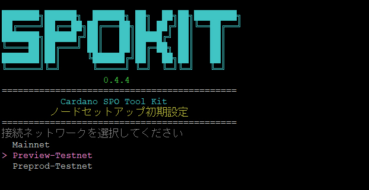
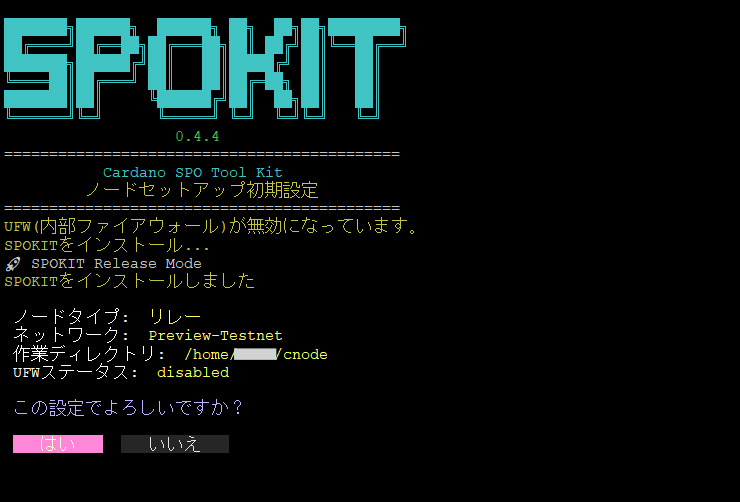
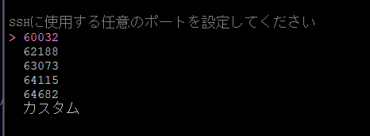
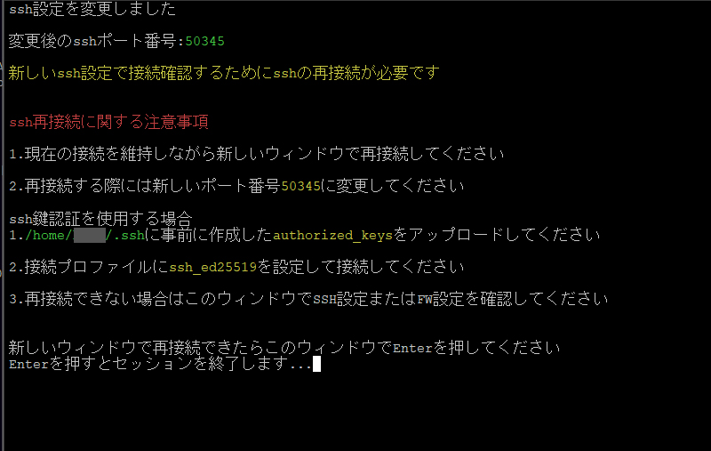
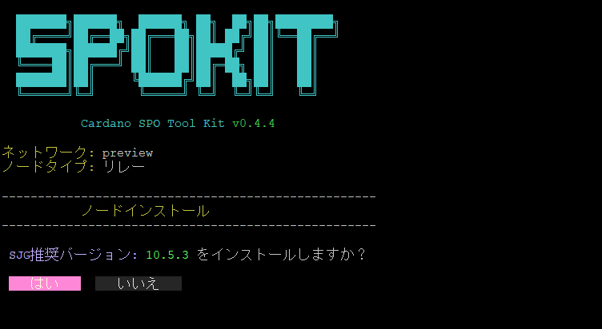
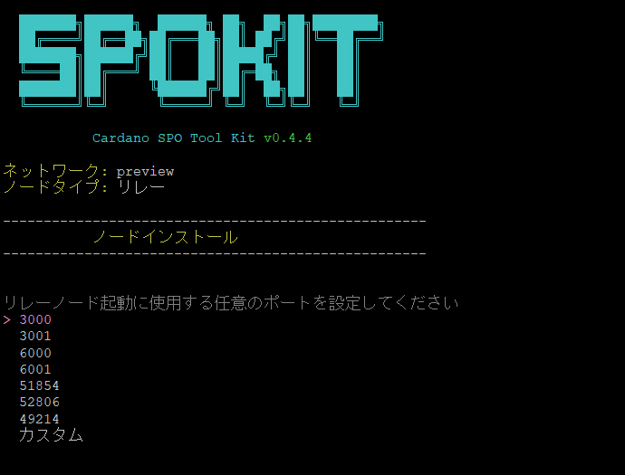
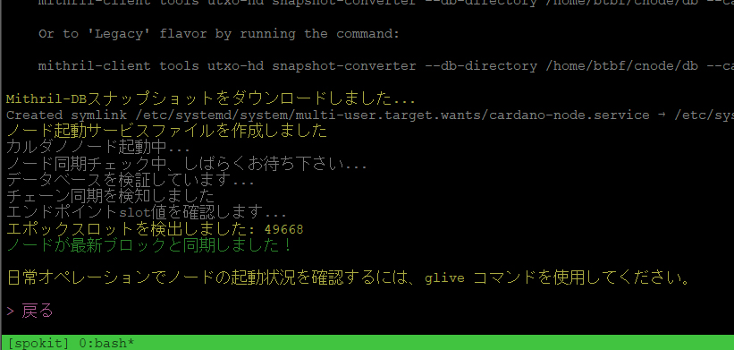

# **Cardanoインデクサーのセットアップ**

本ドキュメントは、`cardano-db-sync` と `PostgreSQL` を Linux 環境で構築するための手順です。  
Midnight バリデーター用途で preview テストネットで構成しております。

### **事前準備**

??? tip "ローカル環境での事前準備"

    SSH接続でログインする場合は、事前にローカル環境でSSH認証キーを作成してください。

    === "Windowsの場合"
        **1. 管理者モードでターミナルを起動します。**  

        `Win + X` を押下し、ターミナル（管理者）を選択し、SSHクライアントの有無を確認します。  
        ```powershell
        Get-WindowsCapability -Online | Where-Object Name -like 'OpenSSH.Client*'
        ```
        > `State : Installed`であれば問題ありません。

        ??? tip "`State : NotPresent`の場合"

            以下のコマンドで追加してください。
            ```powershell
            Add-WindowsCapability -Online -Name OpenSSH.Client~~~~0.0.1.0
            ```
        
        **2. SSH鍵生成**  
        ```powershell
        mkdir ~/.ssh -Force
        ssh-keygen -t ed25519 -N "" -C "ssh_connect" -f ~/.ssh/ssh_ed25519
        ```
        
        **3. 公開鍵ファイル名の変更**
        ```powershell
        cd ~/.ssh
        mv ssh_ed25519.pub authorized_keys
        ```


    === "Macの場合"
        **1. ターミナルを起動します。**  

        `⌘ + Space（Command + Space）`を押下し、「`terminal`」と入力し、Enterを押下します。

        **2. SSH鍵生成**
        ```bash
        mkdir -p ~/.ssh
        ssh-keygen -t ed25519 -N "" -C "ssh_connect" -f ~/.ssh/ssh_ed25519
        ```

        **3. 公開鍵ファイル名の変更**
        ```bash
        cd ~/.ssh
        mv ssh_ed25519.pub authorized_keys
        ```

    !!! danger "注意"
        以下の鍵は絶対に紛失しないでください。  
        紛失するとサーバーへ接続できなくなります。  

        `ssh_ed25519` （秘密鍵）  
        `authorized_keys` （公開鍵）

!!! info "サーバーでの事前準備"
    日常運用では`root`アカウントを使用せず、sudo権限を付与した一般ユーザーで操作します。

    新しいユーザーを作成します。  
    > 任意のアルファベット文字を入力してください。  
    > この例では`cardano` ユーザーとして以降進めます。

    ```bash
    adduser cardano
    ```

    ``` { .yaml .no-copy }
    New password:           # パスワードを設定
    Retype new password:    # 確認のため再入力

    Enter the new value, or press ENTER for the default
            Full Name []:   # フルネーム等の情報を設定（不要であればブランクでも問題ありません）
            Room Number []:
            Work Phone []:
            Home Phone []:
            Other []:
    Is the information correct? [Y/n] : y
    ```

    `cardano`にsudo権限を付与します。
    ```bash
    usermod -aG sudo cardano
    ```

    rootからログアウトします。
    ```bash
    exit
    ```

    !!! tip "ヒント"
        ターミナルソフトのユーザー名とパスワードを上記で作成したユーザー名とパスワードに書き換えて再接続します。


## **1. SPOKIT導入設定**

### **1-1. 初期設定**

!!! tip "パスワード入力について"
    管理者権限パスワードを求められた場合は、設定したパスワードを入力してください。

`SPOKIT`を導入して初期設定からノードインストールまでを行います。
```bash
wget -qO- https://spokit.spojapanguild.net/install.sh | bash
```


セットアップノードタイプ（リレー）を選択して ++enter++


接続ネットワーク (Preview-Testnet) を選択して ++enter++


作業ディレクトリパス指定　そのまま ++enter++


セットアップ内容に問題なければ ++enter++


環境設定読み込み  
赤枠に表示されているコマンドをコピーして実行  


### **1-2. Ubuntuセキュリティ設定**

!!! Question "Ubuntuセキュリティ設定モードについて"
    このモードでは、Cardanoノード実行に推奨されるUbuntuセキュリティ設定が含まれています。  
    ４～９については選択制となっておりますので、環境に応じて設定してください。

``` bash { py title="実行コマンド" }
spokit ubuntu
```

Ubuntuセキュリティ設定ウィザート  
１～４は自動インストール・有効化されます。


はい を選択して ++enter++  


chronyインストール・設定
> システム時刻を正確かつ安定して同期するための時刻同期デーモンです。

はい を選択して ++enter++  


SSH設定  
> リモートサーバを安全に操作・管理するための通信プロトコル

SSH鍵認証用のauthorized_keysファイルをローカルからサーバーに転送する写真を追加し、差し替え予定

はい を選択して ++enter++  


> rootログイン可否設定


SSHポート設定
> セキュリティを高めるためにはポート番号を変更してください


> ランダムな番号を割り当てるかカスタムで任意の番号を指定してください



> Ubuntu内部ファイアウォールを使用する場合は、はい を選択して ++enter++ 


> <font color="red">↓ここの注意事項をよく読んでください</font>




### **1-3. ノードインストール**

プール構築するため以下のコマンドを実行してください。
``` bash { py title="実行コマンド" }
spokit pool
```

「`ノードインストール`」を選択して ++enter++
> キーボードの`↑`と`↓`でカーソルを移動できます。

```{ py title="実行コマンド" }
spokit pool
```

ノードインストールを選択して ++enter++


「`はい`」を選択して ++enter++


ノード起動ポート番号の指定  
表示されたランダムな数字またはカスタムで任意の数字をノードポート番号に割り当てできます。


「`> 戻る`」が最終行に表示されるまで待ちます。

ここでは依存関係インストールからチェーン同期までを自動実行しています。  
ノードが最新ブロックと同期するまでお待ち下さい。



「`> 戻る`」が表示されたら ++enter++ を押下後、「`[q] 終了`」を選択し、SPOKITウィザードを閉じます。  

以下コマンドで、Cardanoノードのライブモニターを表示できます。
```bash
glive
```


!!! tip "ヒント"
    gliveを閉じたらブラケットモード無効化を反映させるために一度ターミナルを閉じて、その後再接続してください。

    ```bash
    exit
    ```


## **2. PostgreSQLの設定**

### **2-1. PostgreSQLインストール**

PostgreSQL 17 を使用します。  
順に実行してください。

```bash
sudo apt update
```
```bash
sudo apt install -y curl ca-certificates
```
```bash
sudo install -d /usr/share/postgresql-common/pgdg
```
```bash
sudo curl -s -o /usr/share/postgresql-common/pgdg/apt.postgresql.org.asc --fail https://www.postgresql.org/media/keys/ACCC4CF8.asc
```
```bash
sudo sh -c 'echo "deb [signed-by=/usr/share/postgresql-common/pgdg/apt.postgresql.org.asc] \
  https://apt.postgresql.org/pub/repos/apt $(lsb_release -cs)-pgdg main" \
  > /etc/apt/sources.list.d/pgdg.list'
```
```bash
sudo apt update
```
```bash
sudo apt -y install postgresql-17 postgresql-server-dev-17 postgresql-contrib libghc-hdbc-postgresql-dev
```

依存関係インストール

```bash
sudo apt install git jq bc automake tmux nano rsync htop curl build-essential pkg-config libffi-dev libgmp-dev libssl-dev libtinfo-dev libsystemd-dev zlib1g-dev make g++ wget libncursesw5 libtool autoconf liblmdb-dev -y
```

### **2-2. PostgreSQL 初期設定**

PostgreSQL用の自身のsuを作成
```bash
sudo -u postgres psql -c "CREATE ROLE \"$(whoami)\" LOGIN SUPERUSER;"
```

db-sync用テーブル作成
```bash
psql postgres -c "CREATE DATABASE cexplorer;"
```

.pgpass作成
```bash
cat <<EOF > $NODE_HOME/.pgpass
/var/run/postgresql:5432:cexplorer:*:*
EOF
chmod 600 $NODE_HOME/.pgpass
```

postgresqlパフォーマンス設定

!!! tip "設定概要"
    - cardano-db-sync / Midnight-node 専用チューニング
    - TCPオーバヘッド回避およびスループット向上の為、UNIXソケット待ち受け起動限定

```bash
sudo sed -i /etc/postgresql/17/main/postgresql.conf \
    -e 's!#synchronous_commit = on!synchronous_commit = off!' \
    -e 's!shared_buffers = 128MB!shared_buffers = 2GB!' \
    -e 's!#effective_cache_size = 4GB!effective_cache_size = 8GB!' \
    -e 's!#work_mem = 4MB!work_mem = 16MB!' \
    -e 's!#maintenance_work_mem = 64MB!maintenance_work_mem = 512MB!' \
    -e 's!max_wal_size = 1GB!max_wal_size = 4GB!' \
    -e 's!min_wal_size = 80MB!min_wal_size = 1GB!' \
    -e "s/^#listen_addresses = 'localhost'/listen_addresses = ''/"
```

postgresql再起動
```bash
sudo systemctl restart postgresql
```


## **3. cardano-db-syncの設定**

### **3-1. 依存関係インストール**

TMUXセッションを展開
```bash
tmux new -s build
```

#### **libsodiumインストール**

リビジョンの取得
```bash
REV=$(curl -sL https://github.com/input-output-hk/iohk-nix/releases/latest/download/INFO \
  | awk '$1 == "debian.libsodium-vrf.deb" { rev = gensub(/.*-(.*)\.deb/, "\\1", "g", $2); print rev }')
echo $REV
```

ダウンロード
```bash
cd $HOME/git
git clone https://github.com/IntersectMBO/libsodium
cd libsodium
git checkout $REV
```

ビルド
```bash
./autogen.sh
sleep 1
./configure
make
make check
sudo make install
```

#### **Secp256k1インストール**

リビジョンの取得
```bash
REV=$(curl -L https://github.com/input-output-hk/iohk-nix/releases/latest/download/INFO \
  | awk '$1 == "debian.libsecp256k1.deb" { rev = gensub(/.*-(.*)\.deb/, "\\1", "g", $2); print rev }')
echo $REV
```

ダウンロード
```bash
cd $HOME/git
git clone https://github.com/bitcoin-core/secp256k1
cd secp256k1
git checkout $REV
```

ビルド
```bash
./autogen.sh
sleep 1
./configure --enable-module-schnorrsig --enable-experimental
make
make check
sudo make install
```

動的リンカ設定
```bash
echo "/usr/local/lib" | sudo tee /etc/ld.so.conf.d/local-lib.conf
sudo ldconfig
```
確認
```bash
ldconfig -p | grep libsecp256k1
```
```{ .yaml .no-copy py title="戻り値"} 
libsecp256k1.so.2 (libc6,x86-64) => /usr/local/lib/libsecp256k1.so.2
libsecp256k1.so (libc6,x86-64) => /usr/local/lib/libsecp256k1.so
```

#### **blstインストール**

リビジョンの取得
```bash
REV=$(curl -L https://github.com/input-output-hk/iohk-nix/releases/latest/download/INFO \
  | awk '$1 == "debian.libblst.deb" { rev = gensub(/.*-(.*)\.deb/, "\\1", "g", $2); print rev }')
echo $REV
```

ダウンロード
```bash
cd $HOME/git
git clone https://github.com/supranational/blst
cd blst
git checkout v$REV
```

ビルド
```bash
./build.sh
```

インストール
```bash
cat > libblst.pc << EOF
prefix=/usr/local
exec_prefix=\${prefix}
libdir=\${exec_prefix}/lib
includedir=\${prefix}/include

Name: libblst
Description: Multilingual BLS12-381 signature library
URL: https://github.com/supranational/blst
Version: 0.3.10
Cflags: -I\${includedir}
Libs: -L\${libdir} -lblst
EOF
```
```bash
sudo cp libblst.pc /usr/local/lib/pkgconfig/
```
```bash
sudo cp bindings/blst_aux.h bindings/blst.h bindings/blst.hpp  /usr/local/include/
```
```bash
sudo cp libblst.a /usr/local/lib
```
```bash
sudo chmod u=rw,go=r /usr/local/{lib/{libblst.a,pkgconfig/libblst.pc},include/{blst.{h,hpp},blst_aux.h}}
```

#### **GHCUPインストール**

インストール変数設定
```bash
cd $HOME
export BOOTSTRAP_HASKELL_GHC_VERSION=9.6.7
export BOOTSTRAP_HASKELL_CABAL_VERSION=3.12.1.0
export BOOTSTRAP_HASKELL_NO_UPGRADE=1
export BOOTSTRAP_HASKELL_NONINTERACTIVE=1
export BOOTSTRAP_HASKELL_INSTALL_STACK=1
export BOOTSTRAP_HASKELL_ADJUST_BASHRC=1
unset BOOTSTRAP_HASKELL_INSTALL_HLS
```

インストール
```bash
curl --proto '=https' --tlsv1.2 -sSf https://get-ghcup.haskell.org | bash
```

バージョン確認
```bash
source ~/.bashrc
cabal update
cabal --version
ghc --version
```
```{ .yaml .no-copy py title="戻り値"} 
$ cabal --version
cabal-install version 3.12.1.0
compiled using version 3.12.1.0 of the Cabal library 

$ ghc --version
The Glorious Glasgow Haskell Compilation System, version 9.6.7
```

### **3-2. db-syncインストール**
```bash
cd ~/git
git clone https://github.com/intersectmbo/cardano-db-sync
cd cardano-db-sync
```

最新リポジトリの適用
```bash
git fetch --tags --all
git checkout tags/13.6.0.5
```

ビルドGHCバージョンの明示
```bash
grep -q '^with-compiler:' cabal.project.local 2>/dev/null \
  || echo 'with-compiler: ghc-9.6.7' >> cabal.project.local
```

ビルド
```bash
cabal update
cabal build all -v0 2>&1 | tee build-all.log
if [ ${PIPESTATUS[0]} -ne 0 ]; then
  echo "cabal build all failed. See build-all.log for details."
  exit 1
fi
```

db-sync バイナリーファイルコピー
```bash
mkdir -p ~/.local/bin

BIN="$(cabal list-bin exe:cardano-db-sync)"

if [ ! -f "$BIN" ]; then
  echo "cardano-db-sync の実行ファイルが存在しません: $BIN"
  echo "exe のビルドを再実行します（メモリ不足の環境では失敗する場合があります）。"
  cabal build exe:cardano-db-sync || exit 1
  BIN="$(cabal list-bin exe:cardano-db-sync)"
fi

cp -p "$BIN" ~/.local/bin/
```

バージョン確認
```bash
cardano-db-sync --version
```
```{ .yaml .no-copy py title="戻り値"} 
cardano-db-sync 13.6.0.5 - linux-x86_64 - ghc-9.6  
git revision cb61094c82254464fc9de777225e04d154d9c782
```

!!! tip "メモリ不足（SIGKILL）が出た場合の対処"
    ビルド中に SIGKILL（メモリ不足）が出る場合は、swap を追加して再実行してください。

    ```bash
    sudo bash -c '
    fallocate -l 8G /swapfile
    chmod 600 /swapfile
    mkswap /swapfile
    swapon /swapfile
    '
    ```
    ```bash
    grep -q '^/swapfile ' /etc/fstab || echo '/swapfile none swap sw 0 0' | sudo tee -a /etc/fstab
    ```

    状態確認：
    ```bash
    swapon --show
    free -h
    ```

### **3-3. スナップショットのダウンロード**

!!! hint "cardano-db-syncスナップショット詳細"

    - ネットワーク：Preview
    - エポック：1165
    - ブロック高：3910501
    - DLサイズ：約 3.58 GB
    
```bash
cd $NODE_HOME
curl -LO https://spojapanguild.net/db-sync/preview/db-sync-snapshot-schema-13.6-block-3910501-x86_64.tgz
```

ファイル検証
```bash
cd $NODE_HOME
sha256sum db-sync-snapshot-schema-13.6-block-3910501-x86_64.tgz \
  > db-sync-snapshot-schema-13.6-block-3910501-x86_64.tgz.sha256

sha256sum -c db-sync-snapshot-schema-13.6-block-3910501-x86_64.tgz.sha256
```
> db-sync-snapshot-schema-13.6-block-3910501-x86_64.tgz: OK

スナップショット復元
```bash
mkdir -p $NODE_HOME/ledger-state
cd ~/git/cardano-db-sync
PGPASSFILE=$NODE_HOME/.pgpass scripts/postgresql-setup.sh --restore-snapshot $NODE_HOME/db-sync-snapshot-schema-13.6-block-3910501-x86_64.tgz $NODE_HOME/ledger-state
```

```{ .yaml .no-copy} 
~~~
db/4135.dat.gz
100700514-355a474701.lstate.gz
All good!
```
> 復元には数十分を要します。

TMUXセッションを閉じます。
```bash
exit
```

### **3-4. db-sync環境設定**

Schemaシンボリックリンク作成
```bash
ln -s ~/git/cardano-db-sync/schema $NODE_HOME
```

設定ファイルダウンロード
```bash
cd $NODE_HOME
wget -q https://book.world.dev.cardano.org/environments/${NODE_CONFIG}/db-sync-config.json -O ${NODE_CONFIG}-db-sync-config.json
```

設定ファイル修正
```bash
sed -i $NODE_HOME/${NODE_CONFIG}-db-sync-config.json \
    -e 's!"NodeConfigFile": "config.json"!"NodeConfigFile": "'${NODE_CONFIG}'-config.json"!'
```

起動スクリプト作成
```bash
cat > $NODE_HOME/startDbSync.sh << EOF 
#!/bin/bash
PGPASSFILE=$NODE_HOME/.pgpass
export PGPASSFILE
$HOME/.local/bin/cardano-db-sync \\
--config $NODE_HOME/${NODE_CONFIG}-db-sync-config.json \\
--socket-path $NODE_HOME/db/socket \\
--state-dir $NODE_HOME/ledger-state \\
--schema-dir $NODE_HOME/schema/
EOF
```

権限設定
```bash
chmod 755 $NODE_HOME/startDbSync.sh
```

db-sync　systemdサービス化 (任意)

``` bash { py title="全てコピーして実行してください" }
cat > $NODE_HOME/cardano-db-sync.service << EOF 
[Unit]
Description=Cardano DB Sync
After=network.target postgresql.service

[Service]
Type=simple
User=${USER}
WorkingDirectory=${NODE_HOME}
ExecStart=/bin/bash -l -c "exec ${NODE_HOME}/startDbSync.sh"
KillSignal=SIGINT
RestartKillSignal=SIGINT
TimeoutStopSec=300
LimitNOFILE=32768
Restart=always
RestartSec=5
StandardOutput=syslog
StandardError=syslog
SyslogIdentifier=db-sync

[Install]
WantedBy=multi-user.target
EOF
```

```bash
sudo cp $NODE_HOME/cardano-db-sync.service /etc/systemd/system/cardano-db-sync.service
```
```bash
sudo chmod 644 /etc/systemd/system/cardano-db-sync.service
```

systemd有効化
``` bash
sudo bash -c 'systemctl daemon-reload && systemctl enable --now cardano-db-sync'
```

### **3-5. 動作確認**
```bash
sudo systemctl status cardano-db-sync --no-pager
```
```{ .yaml .no-copy py title="戻り値"} 
● cardano-db-sync.service - Cardano DB Sync
     Loaded: loaded (/etc/systemd/system/cardano-db-sync.service; enabled; vendor preset: enabled)
     Active: active (running) since Tue 2025-12-30 07:18:14 UTC; 4h 42min ago
   Main PID: 212117 (startDbSync.sh)
      Tasks: 18 (limit: 18679)
     Memory: 3.0G
        CPU: 3h 3min 55.713s
```
> `Active: active`であること

チェーン同期確認
``` bash { py title="ボックス内のコピーボタンでコピーして実行してください" }
sudo -u postgres psql -d cexplorer -c "
SELECT 100 * (
  EXTRACT(EPOCH FROM (MAX(time) AT TIME ZONE 'UTC')) -
  EXTRACT(EPOCH FROM (MIN(time) AT TIME ZONE 'UTC'))
) / (
  EXTRACT(EPOCH FROM (NOW() AT TIME ZONE 'UTC')) -
  EXTRACT(EPOCH FROM (MIN(time) AT TIME ZONE 'UTC'))
) AS sync_percent
FROM public.block;
"
```

db-syncが同期するまでお待ち下さい
``` { .yaml .no-copy py title="戻り値"} 
    sync_percent     
---------------------
 99.9999
```
> `100`となれば完全同期しています。

スナップショット削除
```bash
rm -f $NODE_HOME/db-sync-snapshot-schema-*-block-*-x86_64.*
```

以上でCardanoインデクサーのセットアップが完了しました。

!!! tip "db-syncのログ確認"
    ```bash
    sudo journalctl -u cardano-db-sync -f
    ```

---