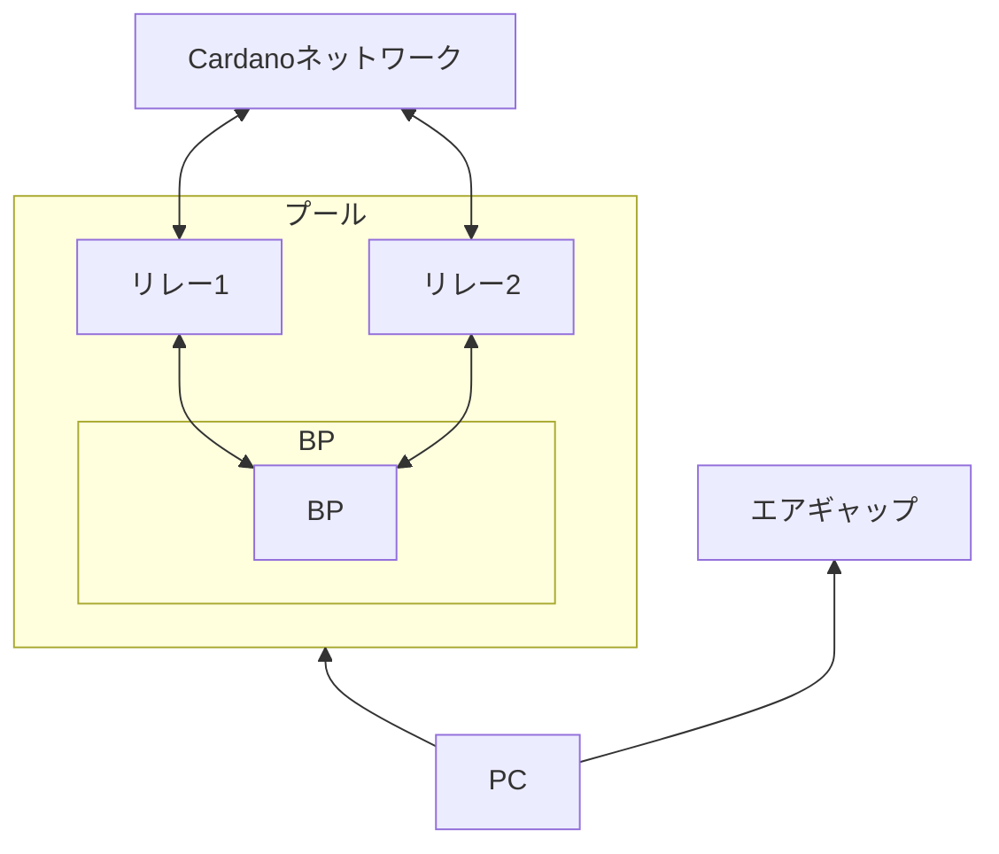
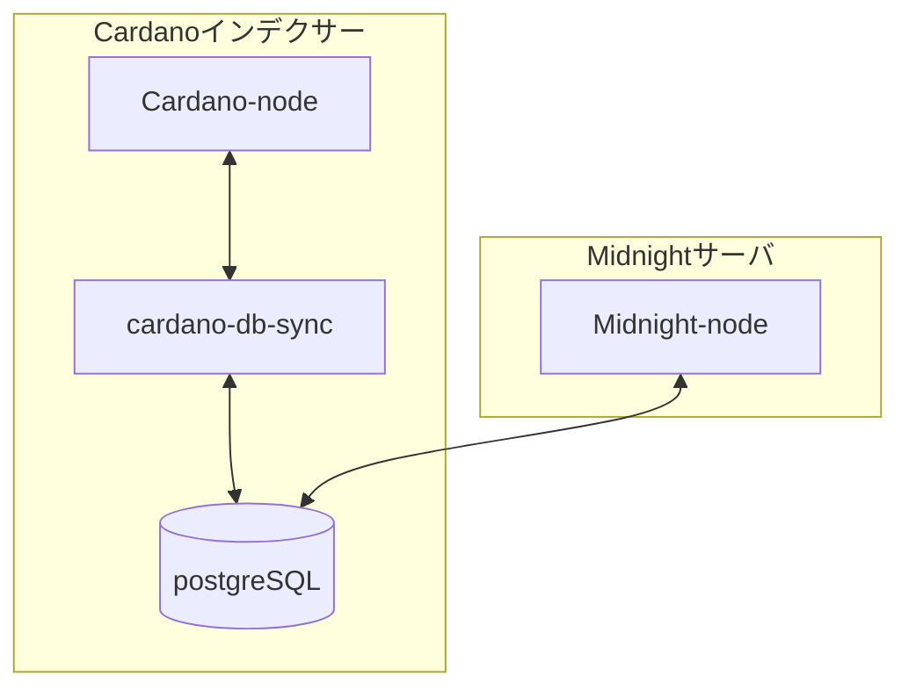

# **Midnightバリデータセットアップマニュアル**

!!! Abstract "本マニュアルについて"
    本マニュアルは、Midnight メインネットでの本番運用を前提として、要求される高いマシンスペック水準および各コンポーネント間のセキュリティ要件に対応し、Midnight バリデーター全体のセットアップ構成を `systemd` ベースで設計しています。

## **Midnightネットワーク別の環境対応表**

| ネットワーク | ノードバージョン | Ubuntu | 依存関係 |
| --- | --- | --- | --- |
| testnet-02(現行) | node-0.12.0 | 22.04 | glibc 2.35 |
| midnight-preview(近日移行) | node-0.18.0 | 24.04 | glibc 2.39 |

!!! info "midnight-node `v0.12.0`について"
    midnight-node `v0.12.0`バイナリは単独公開されておらず、独自に`midnight-node-docker`から抽出したものとなります。Midnightから`preview`テストネットへの移行アナウンスがあり次第、リポジトリ公開中の `v0.18.0`へ移行します。

## **前提条件**

!!! hint "ヒント"
    - Linux (Ubuntu 22.04 ) 
    - Cardano preview テストネットプール登録とブロック生成  
      (プール構築は[手動マニュアル](../setup/index.md)か[SPOKIT](https://github.com/btbf/spokit)をご利用ください)
    - 必要サーバー台数 テストネット4機　メインネット5機 

## **推奨構成**

### **Previewテストネット**

**Cardanoノード**：

| 役割 | サービス | CPU | メモリ | ストレージ | 備考 |
| --- | --- | --- | --- | --- | --- |
| ブロック生成ノード | cardano-node | ≥4 core | ≥8GB | ≥100GB SSD |  |
| リレーノード | cardano-node | ≥4 core | ≥8GB | ≥100GB SSD |  |

**Cardanoインデクサーサーバ**：

| 役割 | サービス | CPU | メモリ | ストレージ | 備考 |
| --- | --- | --- | --- | --- | --- |
| DB基盤 | cardano-db-sync + PostgreSQL | ≥4 core | ≥8GB | ≥100GB SSD | Relay / Midnight BPと同一リージョン |

**Midnightノード専用サーバ**：

| 役割 | サービス | CPU | メモリ | ストレージ | 備考 |
| --- | --- | --- | --- | --- | --- |
| Midnight BP | midnight-node | ≥4 core | ≥8GB | ≥100GB SSD | PostgreSQLと同一リージョン |

??? hint "Mainnet(参考)"

    **Cardano構成**：

    | 役割 | サービス | CPU | メモリ | ストレージ | 備考 |
    | --- | --- | --- | --- | --- | --- |
    | ブロック生成ノード | cardano-node | ≥4 core | 32GB | 350GB SSD |  |
    | リレーノード-1 | cardano-node | ≥4 core | 32GB | 350GB SSD |  |
    | リレーノード-2 | cardano-node | ≥4 core | 32GB | 350GB SSD | 冗長用 |

    **Cardanoインデクサーサーバ**：

    | 役割 | サービス | CPU | メモリ | ストレージ | IOPS | 備考 |
    | --- | --- | --- | --- | --- | --- | --- |
    | DB基盤 | cardano-db-sync + PostgreSQL | 4〜8 core | ≥64GB | 1TB NVMe SSD 推奨（最低700GB） | 60k IOPS 以上 | Relay / Midnight BPと同一リージョン |

    **Midnightブロック生成ノード専用**：

    | 役割 | サービス | CPU | メモリ | ストレージ | 備考 |
    | --- | --- | --- | --- | --- | --- |
    | Midnight BP | midnight-node | 4〜8 core | 32GB | 200〜500GB SSD | PostgreSQLと同一リージョン |

## **セットアップ構成**
カルダノステークプールサーバー構成

Midnightバリデータサーバ構成

Ogmios はパートナーチェーン登録時のみ必要となるため、ローカル運用セットアップには含めずパブリックエンドポイントを使用します。

---