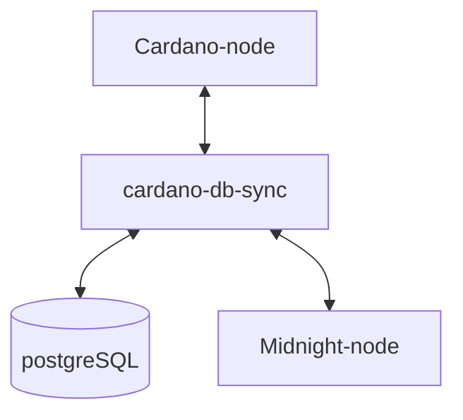

# Midnightバリデータセットアップマニュアル

本マニュアルは Midnight `testnet-02`及びmidnight-node`0.12.0`で構成しています。

!!! info "バリデーターセットアップ構成について"
    本マニュアルは、メインネット運用において求められる高いマシンスペック水準と各コンポーネント間で想定されるボトルネック回避に対応するため、バリデーター全体のセットアップ構成を `systemd` ベースで設計しています。  

## **Midnightネットワーク別の環境対応表**

| ネットワーク | ノードバージョン | Ubuntu | 依存関係 |
| --- | --- | --- | --- |
| testnet-02(現行) | node-0.12.0 | 22.04 | glibc 2.35 |
| midnight-preview(近日移行) | node-0.18.0 | 24.04 | glibc 2.39 |

!!! info "midnight-node `v0.12.0`について"
    midnight-node `v0.12.0`バイナリは単独公開されておらず、独自に`midnight-node-docker`から抽出したものとなります。  
    検証が終わり次第、リポジトリ公開中の `v0.18.0`へ移行します。

## **前提条件と推奨スペック**

!!! hint "ヒント"
    - Linux (Ubuntu 22.04 ) 
    - Cardano preview テストネットプール登録とブロック生成

### **ネットワーク**
#### **Preview**

**Cardano構成**：

| 役割 | サービス | CPU | メモリ | ストレージ | 備考 |
| --- | --- | --- | --- | --- | --- |
| ブロック生成ノード | cardano-node | ≥4 core | ≥8GB | ≥100GB SSD |  |
| リレーノード | cardano-node | ≥4 core | ≥8GB | ≥100GB SSD |  |

**DB基盤サーバー**：

| 役割 | サービス | CPU | メモリ | ストレージ | 備考 |
| --- | --- | --- | --- | --- | --- |
| DB基盤 | cardano-db-sync + PostgreSQL | ≥4 core | ≥8GB | ≥100GB SSD | Relay / Midnight BPと同一リージョン |

**Midnightブロック生成ノード専用**：

| 役割 | サービス | CPU | メモリ | ストレージ | 備考 |
| --- | --- | --- | --- | --- | --- |
| Midnight BP | midnight-node | ≥4 core | ≥8GB | ≥100GB SSD | Relay / Midnight BPと同一リージョン |

#### **Mainnet**
> 参考

**Cardano構成**：

| 役割 | サービス | CPU | メモリ | ストレージ | 備考 |
| --- | --- | --- | --- | --- | --- |
| ブロック生成ノード | cardano-node | ≥4 core | 32GB | 350GB SSD |  |
| リレーノード-1 | cardano-node | ≥4 core | 32GB | 350GB SSD |  |
| リレーノード-2 | cardano-node | ≥4 core | 32GB | 350GB SSD | 冗長用 |

**DB基盤サーバー**：

| 役割 | サービス | CPU | メモリ | ストレージ | IOPS | 備考 |
| --- | --- | --- | --- | --- | --- | --- |
| DB基盤 | cardano-db-sync + PostgreSQL | 4〜8 core | ≥64GB | 1TB NVMe SSD 推奨（最低700GB） | 60k IOPS 以上 | Relay / Midnight BPと同一リージョン |

**Midnightブロック生成ノード専用**：

| 役割 | サービス | CPU | メモリ | ストレージ | 備考 |
| --- | --- | --- | --- | --- | --- |
| Midnight BP | midnight-node | 4〜8 core | 32GB | 200〜500GB SSD | Relay / Midnight BPと同一リージョン |

## セットアップ構成

Ogmios はパートナーチェーン登録時のみ必要となるため、ローカル運用セットアップには含めずパブリックエンドポイントを使用します。

---