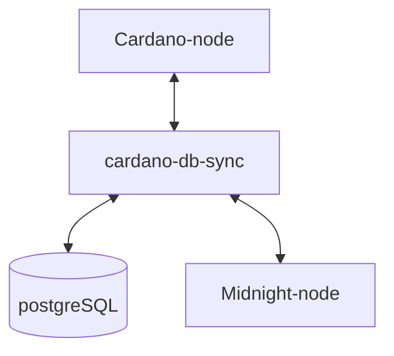

# Midnightバリデータセットアップマニュアル

!!! info "バリデーターセットアップ構成について"
    本マニュアルは、メインネット運用において求められる高いマシンスペック水準と各コンポーネント間で想定されるボトルネック回避に対応するため、バリデーター全体のセットアップ構成を `systemd` ベースで設計しています。
当マニュアルは Midnight `testnet-02`及びmidnight-node`0.12.0`で構成しています。

## **Midnightネットワーク別の環境対応表**

| ネットワーク | ノードバージョン | Ubuntu | 依存関係 |
| --- | --- | --- | --- |
| testnet-02(現行) | node-0.12.0 | 22.04 | glibc 2.35 |
| midnight-preview(近日移行) | node-0.18.0 | 24.04 | glibc 2.39 |

!!! info "midnight-node `v0.12.0`について"
    midnight-node `v0.12.0`バイナリは単独公開されておらず、独自に`midnight-node-docker`から抽出したものとなります。
    検証が終わり次第 リポジトリ公開中の `v0.18.0`へ移行します。

## **1. 前提条件と推奨スペック**

!!! hint ""
    - Linux (Ubuntu 22.04 ) 
    - Cardano preview テストネットプール登録とブロック生成

### previewテストネット

| 項目 | 推奨値 |
| --- | --- |
| RAM | 8GB 以上（node 2.8GB + db-sync 3.5GB ） |
| CPU | 4 コア以上 |
| ストレージ | 100GB 以上 |

### mainnetスペック(参考)

| 項目 | 推奨値 |
| --- | --- |
| RAM | 64GB 以上 |
| CPU | 4 コア以上 |
| IOPS | 60,000 以上 |
| ストレージ | 700GB 以上、NVMe SSD（PCIe 3.0 以上） 推奨 |

## セットアップ構成

Ogmios はパートナーチェーン登録時のみ必要となるため、ローカル運用セットアップには含めずパブリックエンドポイントを使用します。