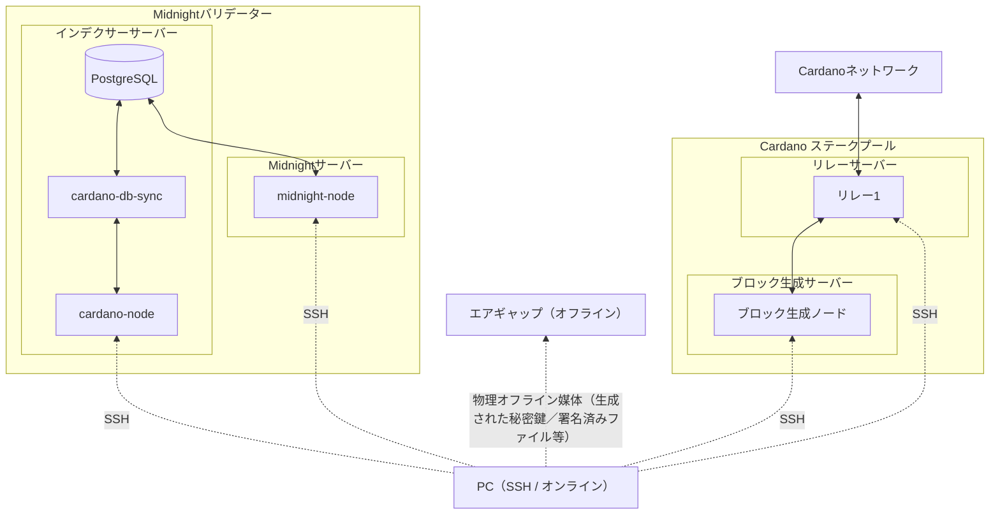

# **Midnightバリデーターセットアップマニュアル**

!!! info "お知らせ"
    Midnight公式では、Testnet-02からMōhaluフェーズへの移行期間中の混乱防止および新アーキテクチャとの整合性確保を目的として、バリデータードキュメントを一時的に非公開としています。  
    これに倣い、SJGにおいても次のフェーズが始まるまで、本ドキュメントを一時的に非公開とします。


👉 Mōhalu フェーズに向けた最新の技術仕様、オンボーディングガイド、スケジュール変更を確実に受け取るため、すべての SPO に Midnight Validator Digest への登録を推奨します。
[https://mpc.midnight.network/midnight-validator-digest](https://mpc.midnight.network/midnight-validator-digest){target="_blank" rel="noopener"}  

👉 他のバリデータやビルダーと交流するには、Midnight Discord に参加してください。
[https://discord.com/invite/midnightnetwork](https://discord.com/invite/midnightnetwork){target="_blank" rel="noopener"}  

---

<template>

本マニュアルは、{==**Midnight メインネット環境における本番運用を想定**==}し、  
要求される{==**高水準のマシンスペックおよび各コンポーネント間のセキュリティ要件**==}に対応するため、  
{==**Midnight バリデーター全体のセットアップ構成を systemd ベースで設計・定義**==}しています。  

<!--## **前提条件**-->

本マニュアルを実施する前に、**エアギャップマシン環境構築**と**Cardano Preview ネットワーク**において、
Cardano ステークプールの構築からブロック生成までの一連の作業を完了していることを前提とします。

- [エアギャップ環境構築](../cardano/setup/air-gapped-setup/)
- [カルダノステークプール構築ガイド](../cardano/setup/index.md)
- [SPOKIT](https://github.com/btbf/spokit){target="_blank" rel="noopener"}  
  > SPOKIT は、ノーコマンドで Cardano ステークプールの構築・管理を行える **Cardano SPO Tool Kit** です。

!!! tip "ヒント"
    プール構築後は、[Preview tADA Faucet](https://docs.cardano.org/cardano-testnets/tools/faucet){target="_blank" rel="noopener"}を利用してプール委任を行ってください。

対象ネットワーク別の必要サーバー台数は以下のとおりです。  

- **Preview**：4 台  
- **Mainnet**：5 台

<!--## **Midnightネットワーク別の環境対応表**-->

| ネットワーク | ノードバージョン | Ubuntu | 依存関係 |
| --- | --- | --- | --- |
| testnet-02(現行) | node-0.12.0 | 22.04 | glibc 2.35 |
| midnight-preview(近日移行) | node-0.18.0 | 24.04 | glibc 2.39 |

!!! info "midnight-node `v0.12.0`について"
    midnight-node `v0.12.0`バイナリは単独公開されておらず、独自に`midnight-node-docker`から抽出したものとなります。  

    Midnightから`Preview`への移行アナウンスがあり次第、リポジトリ公開中の `v0.18.0`へ移行します。

<!--## **推奨構成**-->

<!--### **Preview**-->

**Cardanoノード稼働サーバー**：

| 役割 | サービス | CPU | メモリ | ストレージ | 備考 |
| --- | --- | --- | --- | --- | --- |
| **ブロック生成ノード** | cardano-node | ≥4 vCPU | ≥8 GB | ≥100 GB SSD |  |
| **リレーノード** | cardano-node | ≥4 vCPU | ≥8 GB | ≥100 GB SSD |  |

**Cardanoインデクサーサーバー**：

| 役割 | サービス | CPU | メモリ | ストレージ | 備考 |
| --- | --- | --- | --- | --- | --- |
| **DB基盤** | cardano-node + cardano-db-sync + PostgreSQL | ≥4 vCPU | ≥16 GB | ≥100 GB SSD | Relay / Midnight BP と同一リージョン |

**Midnightノード稼働サーバー**：

| 役割 | サービス | CPU | メモリ | ストレージ | 備考 |
| --- | --- | --- | --- | --- | --- |
| **Midnight ブロック生成ノード** | midnight-node | ≥4 vCPU | ≥8 GB | ≥100 GB SSD | PostgreSQL と同一リージョン |


??? tip "Mainnet(参考)"

    **Cardanoノード稼働サーバー**：

    | 役割 | サービス | CPU | メモリ | ストレージ | 備考 |
    | --- | --- | --- | --- | --- | --- |
    | **ブロック生成ノード** | cardano-node | ≥4 vCPU | 32 GB | 350 GB SSD |  |
    | **リレーノード-1** | cardano-node | ≥4 vCPU | 32 GB | 350 GB SSD |  |
    | **リレーノード-2** | cardano-node | ≥4 vCPU | 32 GB | 350 GB SSD | 冗長用 |

    **Cardanoインデクサーサーバー**：

    | 役割 | サービス | CPU | メモリ | ストレージ | IOPS | 備考 |
    | --- | --- | --- | --- | --- | --- | --- |
    | **DB基盤** | cardano-node + cardano-db-sync + PostgreSQL | 4〜8 vCPU | ≥64 GB | 1 TB NVMe SSD 推奨（最低 700 GB） | ≥60k IOPS | Relay / Midnight BP と同一リージョン |

    **Midnightノード稼働サーバー**：

    | 役割 | サービス | CPU | メモリ | ストレージ | 備考 |
    | --- | --- | --- | --- | --- | --- |
    | **Midnight ブロック生成ノード** | midnight-node | 4〜8 vCPU | 32 GB | 200〜500 GB SSD | PostgreSQL と同一リージョン |


<!--## **システム全体構成図**-->



??? info "Mainnet"
    ```mermaid
    flowchart BT

        %% =========================
        %% Midnight Validator
        %% =========================
        subgraph mv[Midnightバリデーター]
            direction TB

            subgraph idx[インデクサーサーバー]
                cn[cardano-node]
                dbs[cardano-db-sync]
                pg[(PostgreSQL)]

                %% Indexer internal (P2P / local)
                cn <--> dbs
                dbs <--> pg
            end

            subgraph mnbox[Midnightサーバー]
                mn[midnight-node]
            end

            %% midnight-node reads indexed state
            mn <--> pg
        end


        %% =========================
        %% Stake Pool - Mainnet (Two Relays)
        %% =========================
        net[Cardanoネットワーク]

        subgraph pool[Cardano ステークプール]
            direction TB

            %% Relay nodes
            subgraph relay1_box[リレーサーバー]
                r1[リレー1]
            end

            subgraph relay2_box[リレーサーバー]
                r2[リレー2]
            end

            %% Block Producer
            subgraph bpgrp[ブロック生成サーバー]
                bp[ブロック生成ノード]
            end

            %% P2P inside pool
            bp <--> r1
            bp <--> r2
        end

        %% P2P to Cardano network
        r1 <--> net
        r2 <--> net


        %% =========================
        %% Operator PC
        %% =========================
        pc[PC（SSH / オンライン）]

        %% SSH access paths (operation only)
        pc -.->|SSH| r1
        pc -.->|SSH| r2
        pc -.->|SSH| bp
        pc -.->|SSH| mn
        pc -.->|SSH| cn


        %% =========================
        %% Air-gapped Offline Machine
        %% =========================
        ag[エアギャップ（オフライン）]

        %% Physical offline transfer ONLY
        pc -. "物理オフライン媒体（生成された秘密鍵／署名済みファイル等）" .-> ag
    ```

> 本マニュアルでは、`Ogmios`はパートナーチェーン登録時のみ必要となるため、ローカル運用セットアップには含めずパブリックエンドポイントを使用します。

---

</template>