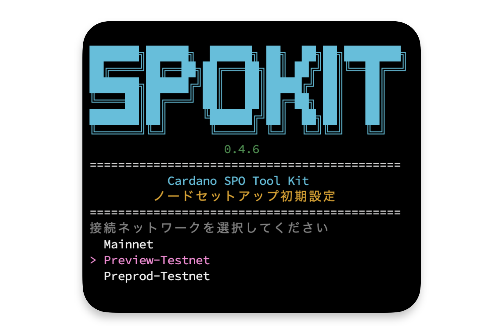
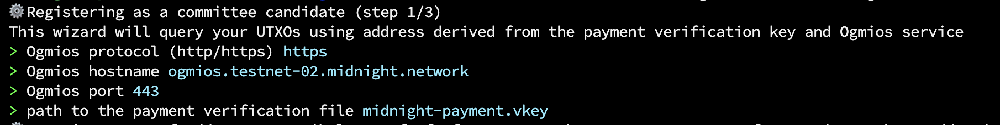
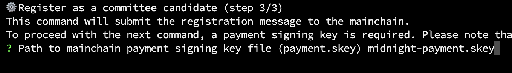

# **Midnightノード稼働サーバー構築**

本ドキュメントは、Midnightバリデーターサーバーで行うMidnight-node用サーバー構築とSPOバリデーター登録の手順です。  

## **事前準備**

=== "Midnightサーバー"

!!! info "サーバーでの事前準備"
    日常運用では`root`アカウントを使用せず、sudo権限を付与した一般ユーザーで操作します。

    新しいユーザーを作成します。  
    > 任意のアルファベット文字を入力してください。  
    > この例では`midnightd` ユーザーとして以降進めます。

    ```bash
    adduser midnightd
    ```

    ``` { .yaml .no-copy }
    New password:           # パスワードを設定
    Retype new password:    # 確認のため再入力

    Enter the new value, or press ENTER for the default
            Full Name []:   # フルネーム等の情報を設定（不要であればブランクでも問題ありません）
            Room Number []:
            Work Phone []:
            Home Phone []:
            Other []:
    Is the information correct? [Y/n] : y
    ```

    `midnightd`にsudo権限を付与します。
    ```bash
    usermod -aG sudo midnightd
    ```

    rootからログアウトします。
    ```bash
    exit
    ```

    !!! tip "ヒント"
        ターミナルソフトの接続ユーザーを、上記で作成した**ユーザー名（`midnightd`）およびパスワード**に変更して再接続してください。

## **1. SPOKIT導入設定**

### **1-1. 初期設定**

!!! tip "パスワード入力について"
    管理者権限パスワードを求められた場合は、ユーザー作成時に設定したパスワードを入力してください。

1. `SPOKIT`を導入して初期設定からノードインストールまで行います。
```bash
wget -qO- https://spokit.spojapanguild.net/install.sh | bash
```
> キーボードの`↑`と`↓`、`←`と`→`でカーソルを移動できます。

2. セットアップノードタイプでは「**`リレー`**」を選択して ++enter++


3. 接続ネットワークでは「**`Preview-Testnet`**」を選択して ++enter++


4. 作業ディレクトリPATHは、デフォルトを指定するのでそのまま ++enter++

5. 「**`はい`**」を選択し、 ++enter++

6. 「**`source`**」コマンドを必ず実行してください。  


### **1-2. Ubuntuセキュリティ設定**

!!! Question "Ubuntuセキュリティ設定モードについて"
    このモードでは、Cardanoノード実行に推奨されるUbuntuセキュリティ設定が含まれています。  

1. 以下のコマンドを実行します。
``` bash { py title="実行コマンド" }
spokit ubuntu
``` 
> 「`Enter...`」と表示されたら Enter キーを押下し、以降はスクリプトの指示に従って設定してください。  
> デフォルトは「`はい`」を選択します。  

2. 上記設定後、不要なディレクトリを削除します。
```bash
rm -rf $HOME/cnode
```

!!! tip "ヒント"
    ブラケットモード無効化を反映させるために一度ターミナルを閉じて、その後再接続してください。

    ```bash
    exit
    ```

## **2. midnight-nodeインストール**

### **2-1. 環境変数設定**

=== "Midnightサーバー"

!!! tip "設定"

    ```bash
    grep -q '^export MIDNIGHT_NETWORK=' "$HOME/.bashrc" || printf '\nexport MIDNIGHT_NETWORK=testnet-02\n' >> "$HOME/.bashrc"
    source "$HOME/.bashrc"
    ```

### **2-2. midnight-nodeダウンロード**

=== "Midnightサーバー"

``` bash
mkdir -p $HOME/midnight
cd $HOME/midnight
wget -q --show-progress https://spojapanguild.net/node_config/midnight/${MIDNIGHT_NETWORK}/midnight-node0.12.0.gz
```

midnight-node解凍
``` bash
gunzip -c midnight-node0.12.0.gz > midnight-node && rm midnight-node0.12.0.gz
```

``` bash
chmod +x midnight-node
```

バージョン確認
``` bash
./midnight-node --version
```
> midnight-node 0.12.0


設定ファイルダウンロード
``` bash
wget -q --show-progress https://spojapanguild.net/node_config/midnight/${MIDNIGHT_NETWORK}/pc-chain-config.json
wget -q --show-progress https://spojapanguild.net/node_config/midnight/${MIDNIGHT_NETWORK}/chain-spec.json
wget -q --show-progress https://spojapanguild.net/node_config/midnight/${MIDNIGHT_NETWORK}/addresses.json
```

## **3. 鍵・アドレスの生成**

### **3-1. 支払い用鍵の生成**
=== "エアギャップ"

環境変数の設定後、支払い用鍵を生成
```bash
grep -q '^export MIDNIGHT_NETWORK=' "$HOME/.bashrc" || printf '\nexport MIDNIGHT_NETWORK=testnet-02\n' >> "$HOME/.bashrc"
source "$HOME/.bashrc"
```
```bash
mkdir -p $HOME/midnight
```
```bash
cd $HOME/midnight
cardano-cli conway address key-gen \
  --verification-key-file midnight-payment.vkey \
  --signing-key-file midnight-payment.skey
```

### **3-2. パートナーチェーン用鍵の生成**

!!! important "ファイル転送"

    Midnightサーバーで取得した以下をエアギャップの`$HOME/midnight`ディレクトリへコピーします。

    - `addresses.json`
    - `chain-spec.json`
    - `midnight-node`
    - `pc-chain-config.json`
    > $HOME/midnight/


=== "エアギャップ"

    ```bash
    cd $HOME/midnight
    chmod +x midnight-node
    ```
    ```bash
    ./midnight-node --version
    ```
    > midnight-node 0.12.0

パートナーチェーン用の鍵を生成
``` bash
CFG_PRESET=${MIDNIGHT_NETWORK} ./midnight-node wizards generate-keys
```
鍵は現在の`$HOME/midnight`ディレクトリに保存するのでそのまま ++enter++ 
``` bash { .yaml .no-copy py title="ウィザード表示"} 
This 🧙 wizard will generate the following keys and save them to your node's keystore:
→  an ECDSA Cross-chain key
→  an ED25519 Grandpa key
→  an SR25519 Aura key
It will also generate a network key for your node if needed.

? node base path (./data) ←ここでEnter
```

``` bash { .yaml .no-copy py title="キーファイル構成"} 
data/
└── chains
    └── undeployed
        ├── keystore
        │   ├── 6175728281... # sidechain key
        │   ├── 63726367cd... # aura key
        │   └── 677a322ca6... # grandpa key
        └── network
            └── secret_ed25519 # network (node) key
```
> `$HOME/midnight`配下に`./data`が作成されます。

ディレクトリ名の変更
``` bash
mv ./data/chains/undeployed/ ./data/chains/partner_chains_template
```

### **3-3. 支払い用エンタープライズアドレス作成**

=== "エアギャップ"

エンタープライズアドレスの生成
```bash
cd $HOME/midnight
cardano-cli conway address build \
  $NODE_NETWORK \
  --payment-verification-key-file midnight-payment.vkey \
  --out-file midnight-payment.addr
```

!!! important "ファイル転送"

    エアギャップから、以下の内容一式をMidnightサーバーの`$HOME/midnight`ディレクトリにコピーします。

    - `data`
    - `midnight-payment.addr`
    - `midnight-payment.skey`
    - `midnight-payment.vkey`
    - `partner-chains-public-keys.json`
    - `pc-resources-config.json`
    > $HOME/midnight/

=== "Midnightサーバー"

[tADA Faucet](https://docs.cardano.org/cardano-testnets/tools/faucet){target="_blank" rel="noopener"}から`tADA`を以下のエンタープライズアドレスに送金します。  

``` bash
cd $HOME/midnight
echo $(cat midnight-payment.addr)
```


入金を確認するため、[preview.cardanoscan](https://preview.cardanoscan.io/){target="_blank" rel="noopener"}などのエクスプローラーで支払いアドレスを検索し、tADAが届いていることを確認してください。

## **4. バリデーター登録**

### **4-1. 登録ウィザード 1**

!!! info "事前説明：register1 実行時の入力内容"

    以下は、`register1` 実行時に表示される入力項目の**全体像**です。  
    実際の入力は次のセクションを参照し、ここでは流れを把握してください。

    

    1. 登録ウィザード 1 のコマンド実行
    2. `> Ogmios protocol (http/https)` → `https`
    3. `> Ogmios hostname (localhost)` → `ogmios.testnet-02.midnight.network`
    4. `> Ogmios port` → `443`
    5. `> path to the payment verification file` → `midnight-payment.vkey`
    6. `? Select UTXO to use for registration` →  ++enter++ 
    7. `midnight-node wizards register2`のコマンドが出力されるのでメモ帳などにコピー

=== "Midnightサーバー"

1. 以下のコマンドを実行します。
``` bash
cd $HOME/midnight
CFG_PRESET=${MIDNIGHT_NETWORK} ./midnight-node wizards register1
```

2. `> Ogmios protocol (http/https)`では、**`https`** を選択して ++enter++
``` {.yaml .no-copy}
  http
> https
```

3. `> Ogmios hostname (localhost)`では、以下のエンドポイントを入力して ++enter++
```bash
ogmios.testnet-02.midnight.network
```

4. `> Ogmios port`では、`443` を入力して ++enter++
```bash
443
```

5. `> path to the payment verification file`では、以下を入力して ++enter++ 
```bash
midnight-payment.vkey
```


6. `? Select UTXO to use for registration`では、そのまま ++enter++ 

7. 出力された`register2`のコマンドを、すべて ++copy++ します。

> コピーしたコマンドをメモ帳などに貼り付け保存してください。

### **4-2. 登録ウィザード 2**

!!! info "事前説明：register2 実行時の入力内容"

    以下は、`register2` 実行時に表示される入力項目の**全体像**です。  
    実際の入力は次のセクションを参照し、ここでは流れを把握してください。

    1. エアギャップの`$HOME/cold-keys`ディレクトリのロック解除し、`$HOME/midnight`ディレクトリに移動
    2. プールの秘密鍵ファイルの絶対パスを表示し、控えておく
    3. 登録ウィザード 2 のコマンド実行
    4. プールの秘密鍵ファイルの絶対パスを入力
    5. `midnight-node wizards register3`のコマンドが出力されるのでメモ帳などにコピー
    6. `$HOME/cold-keys`ディレクトリのロックします。

=== "エアギャップ"

1. `$HOME/cold-keys`ディレクトリのロックを解除し、`$HOME/midnight`ディレクトリに移動します。
``` bash
chmod u+rwx $HOME/cold-keys
```
```bash
cd $HOME/midnight
```

2. プールの秘密鍵ファイルの絶対パスを表示します。  
```bash
echo $HOME/cold-keys/node.skey
```
> /home/$USER/cold-keys/node.skey  
> 表示されたパスをメモ帳などにコピーして控えておいてください。

3. `register1`でコピーしたコマンドの`/home/$USER/midnight`を削除して`CFG_PRESET=${MIDNIGHT_NETWORK} .`に書き換えて実行してください。
``` { .yaml .no-copy py title="参考コマンド"} 
CFG_PRESET=${MIDNIGHT_NETWORK} ./midnight-node wizards register2 \
  --genesis-utxo 46876a2250ec0e523eccc30b0fc6d6fa55c61dd200b83140acaab291edeb0b11#0 \
  --registration-utxo d7ebd0b5f215ede15d25fc00c5e9fbfb24b36ffdf428f93fc83cde84440be376#0 \
  --aura-pub-key 0x0a66c6e1ca29d332a3b1738471bb4f27d4425b3001bbc9003757c2213b40b508 \
  --grandpa-pub-key 0xca364cd1c9a63988d9da8adc5e336220ee93fc6b9d65bca280133a55e21dc5f1 \
  --sidechain-pub-key 0x03de3d4544b1789d22aae9b4ae24d9e85282a300f690f7c0a534434f7f62362153 \
  --sidechain-signature d03d7900805e9aeb465278ca2f67465521d8c2abc680a5650e85105f407825df75de19df6cc45bac92b66250ccd2b51e3d93922925aa7e09f3b0a3e53bf7763b
```

4. `node.skey`のPATHを入力して ++enter++ 
``` { .yaml .no-copy py title="参考"} 
/home/$USER/cold-keys/node.skey
```


5. 出力された`register3`のコマンドを、すべて ++copy++ します。

> コピーしたコマンドをメモ帳などに貼り付け保存してください。

6. `$HOME/cold-keys`ディレクトリのロックします。
``` bash
chmod a-rwx $HOME/cold-keys
```

### **4-3. 登録ウィザード 3**

!!! info "事前説明：register3 実行時の入力内容"

    以下は、`register3` 実行時に表示される入力項目の**全体像**です。  
    実際の入力は次のセクションを参照し、ここでは流れを把握してください。

    1. `$HOME/midnight`ディレクトリに移動
    2. 登録ウィザード 3 のコマンド実行
    3. `? Path to mainchain payment signing key file` → `midnight-payment.skey`
    4. `> Ogmios protocol (http/https)` → `https`
    5. `> Ogmios hostname (localhost)` → `ogmios.testnet-02.midnight.network`
    6. `> Ogmios port` → `443`
    7. `Show registration status?(Y/n)`が表示されたら `n` を入力  

    その後オンチェーン登録確認

=== "Midnightサーバー"

1. `$HOME/midnight`ディレクトリに移動
```bash
cd $HOME/midnight
```

2. コピーしたコマンドの`/home/$USER/midnight`を削除して`CFG_PRESET=${MIDNIGHT_NETWORK} .`に書き換えて実行してください。
``` { .yaml .no-copy py title="参考コマンド"} 
CFG_PRESET=${MIDNIGHT_NETWORK} ./midnight-node wizards register3 \
  --genesis-utxo 46876a2250ec0e523eccc30b0fc6d6fa55c61dd200b83140acaab291edeb0b11#0 \
  --registration-utxo d7ebd0b5f215ede15d25fc00c5e9fbfb24b36ffdf428f93fc83cde84440be376#0 \
  --aura-pub-key 0x0a66c6e1ca29d332a3b1738471bb4f27d4425b3001bbc9003757c2213b40b508 \
  --grandpa-pub-key 0xca364cd1c9a63988d9da8adc5e336220ee93fc6b9d65bca280133a55e21dc5f1 \
  --partner-chain-pub-key 0x03de3d4544b1789d22aae9b4ae24d9e85282a300f690f7c0a534434f7f62362153 \
  --partner-chain-signature d03d7900805e9aeb465278ca2f67465521d8c2abc680a5650e85105f407825df75de19df6cc45bac92b66250ccd2b51e3d93922925aa7e09f3b0a3e53bf7763b \
  --spo-public-key 7ca8511e4b96c6d443304753685ea89660212e556a2c3c903fb10c99df292a72 \
  --spo-signature 019ec2205223ba0f47a26f3e732e2c00e623eb1af546339a36c8136a792d37c6f2d36e76efa03a401e0be6559488d94e09368257f19886be95f8496f56460803
```

3. `? Path to mainchain payment signing key file`では、以下を入力して ++enter++ 
```bash
midnight-payment.skey
```


4. Ogmios protocolでは `https` を選択して ++enter++
``` {.yaml .no-copy}
  http
> https
```

5. Ogmios hostnameでは以下のエンドポイントを入力して ++enter++
```bash
ogmios.testnet-02.midnight.network
```

6. Ogmios portでは `443` を入力して ++enter++
```bash
443
```

7. `Show registration status?(Y/n)`が表示されるまで少し待ち、表示されたら `n` を入力後 ++enter++ 


## **5. オンチェーン登録確認**

=== "Midnightサーバー"

エポック確認
``` bash { py title="全てコピーして実行してください" }
NEXT_EPOCH=$(curl -s -L -X POST -H "Content-Type: application/json" -d '{
  "jsonrpc": "2.0",
  "method": "sidechain_getStatus",
  "params": [],
  "id": 1
}' https://rpc.${MIDNIGHT_NETWORK}.midnight.network \
| jq '.result.mainchain.epoch + 2')
echo $NEXT_EPOCH
```

登録確認
``` bash { py title="全てコピーして実行してください" }
SIDECHAIN_KEY=$(jq -r '.sidechain_pub_key' ${HOME}/midnight/partner-chains-public-keys.json)

curl -s -L -X POST -H "Content-Type: application/json" -d "{
  \"jsonrpc\": \"2.0\",
  \"method\": \"sidechain_getAriadneParameters\",
  \"params\": [$NEXT_EPOCH],
  \"id\": 1
}" https://rpc.${MIDNIGHT_NETWORK}.midnight.network \
| jq --arg key "$SIDECHAIN_KEY" '
  .result.candidateRegistrations
  | to_entries[]
  | . as $e
  | $e.value[]
  | select(.sidechainPubKey == $key)
  | {
      mainchainPubKey: $e.key,
      sidechainPubKey,
      auraPubKey,
      grandpaPubKey,
      stakeDelegation,
      isValid
    }
'
```

`"isValid": true`が確認できれば、問題ありません。
``` { .yaml .no-copy py title="戻り値"} 
{
  "mainchainPubKey": "***************",
  "sidechainPubKey": "***************",
  "auraPubKey": "***************",
  "grandpaPubKey": "***************",
  "stakeDelegation": ***************,
  "isValid": true
}
```

!!! warning "**isValid: false**と表示されている場合"

    アクティブステークが `0` の場合、`isValid: false` となるため、以下を確認してください。

    !!! tip "Cardano ステークプールの有効ステーク確認方法"
        - **SPOKIT の場合**：  
        `spokit` > 「プール情報管理」> 「ブロック生成状態チェック」> 有効ステーク値  

        - **Cardanoscan の場合**:  
        自身のPool IDを検索し、Active Stakeの値を確認  

    !!! info "Active Stakeの反映タイミング (n + 2エポック)"
        **反映までの目安**：  
        Previewネットワークでは約 2 日後、メインネットでは約 10 日後に反映されます。
    
---