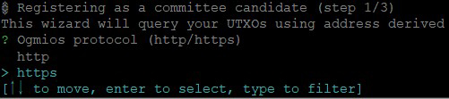
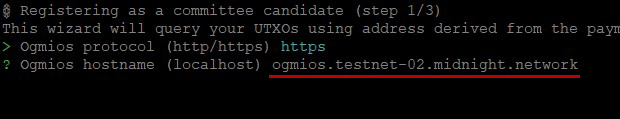
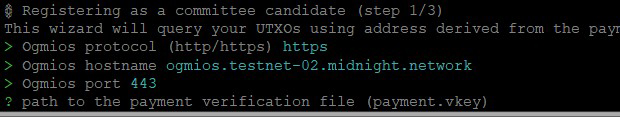
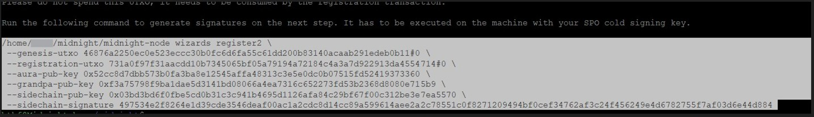
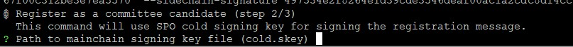
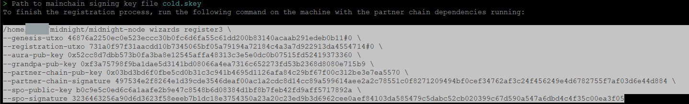
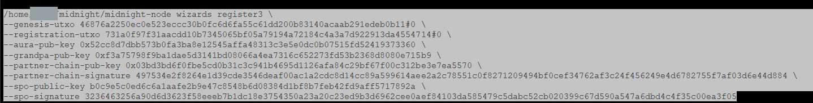
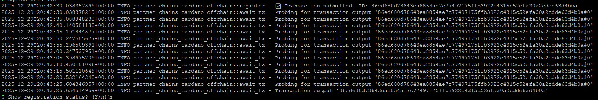

# **SPO Midnightバリデーター登録**

## **midnight-nodeインストール**

### **環境変数設定**

!!! tip "設定"

    === "Preview(テストネット)"

        ```bash
        grep -q '^export MIDNIGHT_NETWORK=' "$HOME/.bashrc" || printf '\nexport MIDNIGHT_NETWORK=testnet-02\n' >> "$HOME/.bashrc"
        source "$HOME/.bashrc"
        ```

### **midnight-nodeダウンロード**

=== "Preview(テストネット)"

``` bash
mkdir -p $HOME/midnight
cd $HOME/midnight
wget -q --show-progress https://spojapanguild.net/node_config/midnight/${MIDNIGHT_NETWORK}/midnight-node0.12.0.gz
```

midnight-node解凍
``` bash
gunzip -c midnight-node0.12.0.gz > midnight-node && rm midnight-node0.12.0.gz
```

``` bash
chmod +x midnight-node
sudo cp midnight-node /usr/local/bin/midnight-node
```

バージョン確認
``` bash
midnight-node --version
```
> midnight-node 0.12.0


設定ファイルダウンロード
``` bash
cd $HOME/midnight
wget -q --show-progress https://spojapanguild.net/node_config/midnight/${MIDNIGHT_NETWORK}/pc-chain-config.json -O ${MIDNIGHT_NETWORK}-pc-chain-config.json
wget -q --show-progress https://spojapanguild.net/node_config/midnight/${MIDNIGHT_NETWORK}/chain-spec.json -O ${MIDNIGHT_NETWORK}-chain-spec.json
wget -q --show-progress https://spojapanguild.net/node_config/midnight/${MIDNIGHT_NETWORK}/addresses.json -O ${MIDNIGHT_NETWORK}-addresses.json
```

    !!! important "ファイル転送"

        以下のファイルをエアギャップの`$HOME/midnight`ディレクトリにコピーします。
        ```mermaid
        graph LR
            A[Preview テストネット] -->|**midnight-node**| B[エアギャップ];
        ``` 

=== "エアギャップ"

    ```bash
    grep -q '^export MIDNIGHT_NETWORK=' "$HOME/.bashrc" || printf '\nexport MIDNIGHT_NETWORK=testnet-02\n' >> "$HOME/.bashrc"
    source "$HOME/.bashrc"
    ```

    ```bash
    mkdir -p $HOME/midnight
    ```
    ```bash
    cd $HOME/midnight
    chmod +x midnight-node
    sudo cp midnight-node /usr/local/bin/midnight-node
    ```
    ```bash
    midnight-node --version
    ```
    > midnight-node 0.12.0


## **パートナーチェーンキー生成**

=== "エアギャップ"

``` bash
cd $HOME/midnight
CFG_PRESET=${MIDNIGHT_NETWORK} midnight-node wizards generate-keys
```
キー保存パス指定でそのまま ++enter++ 
``` bash { .yaml .no-copy py title="ウィザード表示"} 
This 🧙 wizard will generate the following keys and save them to your node's keystore:
→  an ECDSA Cross-chain key
→  an ED25519 Grandpa key
→  an SR25519 Aura key
It will also generate a network key for your node if needed.

? node base path (./data) ←ここでEnter
```

`$HOME/midnight`配下に`./data`が作成されます
``` bash { .yaml .no-copy py title="キーファイル構成"} 
data/
└── chains
    └── undeployed
        ├── keystore
        │   ├── 6175728281... # sidechain key
        │   ├── 63726367cd... # aura key
        │   └── 677a322ca6... # grandpa key
        └── network
            └── secret_ed25519 # network (node) key
```

キーフォルダ名変更
``` bash
mv ./data/chains/undeployed/ ./data/chains/partner_chains_template
```

## **バリデーター登録**

=== "エアギャップ"

### **エンタープライズアドレス作成**
``` bash
cd $NODE_HOME
cardano-cli conway address build \
    $NODE_NETWORK \
    --payment-verification-key-file payment.vkey \
    --out-file $HOME/midnight/midnight-payment.addr
```

    !!! important "ファイル転送"

        エアギャップで生成した以下をサーバーの`$HOME/midnight`にコピーします。

        - `data`
        - `midnight-payment.addr`
        - `partner-chains-public-keys.json`
        > $HOME/midnight/

=== "Preview(テストネット)"

[tADA Faucet](https://docs.cardano.org/cardano-testnets/tools/faucet){target="_blank" rel="noopener"}から`tADA`を以下のエンタープライズアドレスに送金します。  

``` bash
cd $HOME/midnight
echo $(cat midnight-payment.addr)
```


入金を確認します。
``` bash
cardano-cli conway query utxo \
    --address $(cat $HOME/midnight/midnight-payment.addr) \
    $NODE_NETWORK \
    --output-text
```

``` { .yaml .no-copy py title="戻り値"} 
                           TxHash                                 TxIx        Amount
--------------------------------------------------------------------------------------
731a0f97f31aacdd10b7345065bf05a79194a72184c4a3a7d922913da4554714     0        10000000000 lovelace + TxOutDatumNone
```

`$HOME/cold-keys`ディレクトリのロック解除
``` bash
chmod u+rwx $HOME/cold-keys
```

!!! tip "ヒント"
    3つの登録ウィザードが表示されますのでそれぞれ入力します。

### **登録ウィザード1**
``` bash
cd $HOME/midnight
CFG_PRESET=${MIDNIGHT_NETWORK} midnight-node wizards register1
```

Ogmios protocolでは、 `https` を選択して ++enter++
``` {.yaml .no-copy}
  http
> https
```


Ogmios hostnameでは、以下のエンドポイントを入力して ++enter++
```bash
ogmios.${MIDNIGHT_NETWORK}.midnight.network
```


Ogmios portでは、 `443` を入力して ++enter++
```bash
443
```


`payment.vkey`のPATHを入力して ++enter++ 
```bash
$NODE_HOME/payment.vkey
```


UTxOの選択ではそのまま ++enter++ 


戻り値(register2コマンド)をすべて ++copy++ します。



### **登録ウィザード2**

コピーしたコマンドを貼り付けて ++enter++


`node.skey`のPATHを入力して ++enter++ 
```bash
$HOME/cold-keys/node.skey
```


戻り値(register3コマンド)をすべて ++copy++ します。



### **登録ウィザード3**

コピーしたコマンドを貼り付けて ++enter++


`payment.skey`のPATHを入力して ++enter++ 
```bash
$NODE_HOME/payment.skey
```


Ogmios protocolでは `https` を選択して ++enter++
``` {.yaml .no-copy}
  http
> https
```


Ogmios hostnameでは以下のエンドポイントを入力して ++enter++
```bash
ogmios.${MIDNIGHT_NETWORK}.midnight.network
```


Ogmios portでは `443` を入力して ++enter++
```bash
443
```


`Show registration status?(Y/n)`が表示されたら `n` を入力後 ++enter++ 


`$HOME/cold-keys`ディレクトリのロック
``` bash
chmod a-rwx $HOME/cold-keys
```


## **オンチェーン登録確認**

=== "Preview(テストネット)"

エポック確認
``` bash { py title="全てコピーして実行してください" }
NEXT_EPOCH=$(curl -s -L -X POST -H "Content-Type: application/json" -d '{
  "jsonrpc": "2.0",
  "method": "sidechain_getStatus",
  "params": [],
  "id": 1
}' https://rpc.${MIDNIGHT_NETWORK}.midnight.network \
| jq '.result.mainchain.epoch + 2')
echo $NEXT_EPOCH
```

登録確認
``` bash { py title="全てコピーして実行してください" }
SIDECHAIN_KEY=$(jq -r '.sidechain_pub_key' ${HOME}/midnight/partner-chains-public-keys.json)

curl -s -L -X POST -H "Content-Type: application/json" -d "{
  \"jsonrpc\": \"2.0\",
  \"method\": \"sidechain_getAriadneParameters\",
  \"params\": [$NEXT_EPOCH],
  \"id\": 1
}" https://rpc.${MIDNIGHT_NETWORK}.midnight.network \
| jq --arg key "$SIDECHAIN_KEY" '
  .result.candidateRegistrations
  | to_entries[]
  | . as $e
  | $e.value[]
  | select(.sidechainPubKey == $key)
  | {
      mainchainPubKey: $e.key,
      sidechainPubKey,
      auraPubKey,
      grandpaPubKey,
      stakeDelegation,
      isValid
    }
'
```

登録完了！
``` { .yaml .no-copy py title="戻り値"} 
{
    ~  チェーンキー表示省略  ~
  "isValid": true
}
```

!!! note "isvaild:falseと表示されている場合の確認事項"

    登録完了直後に`isVaild:false`と表示されている場合は以下のことを確認してください。

    - カルダノステークプールの有効ステーク(Active Stake)  
      **SPOKITの場合**：`spokit` > 「プール情報管理」> 「ブロック生成状態チェック」> 有効ステーク値  
      **Cardanoscanの場合**:　自身のPoolIDを検索し、Active Stakeの値確認
    
    - ActiveStake反映タイミング (n + 2エポック)  
      **反映待機期間**：Previewテストネット約2日、メインネット約10日後に反映します。