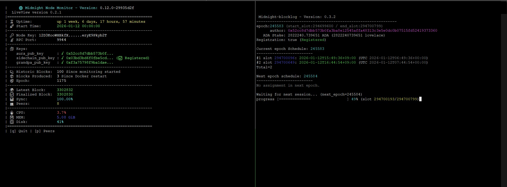

# **Midnightバリデーターモードで起動**

本ドキュメントは、Midnightサーバーで行うMidnight-node起動の手順です。  

## **1. PostgreSQL 接続設定**

ここではMidnightサーバーのコマンドからはじめ、インデクサーサーバーのタブに進んでください。

=== "Midnightサーバー"
    ``` bash
    FW_ALLOW_HOST="$(curl -s https://api.ipify.org)"
    echo "FW_ALLOW_HOST=${FW_ALLOW_HOST}"
    ```
    > 上記、コマンドで出力された戻り値をコピーして、<font color=red>インデクサーサーバー</font>で実行してください。

=== "インデクサーサーバー"
    ``` {.yaml .no-copy}
    FW_ALLOW_HOST=***.**.**.**
    ```
    > Midnightサーバーでコピーしたコマンドを実行します。
    
    postgreSQLポート許可
    ```bash
    sudo ufw allow from ${FW_ALLOW_HOST} to any port 5432
    ```
    > 戻り値： Rule added

    ``` bash
    sudo ufw reload
    ```
    > 戻り値：Firewall reloaded

    postgreSQLログイン許可設定
    ``` bash
    echo "hostssl cexplorer $(whoami) ${FW_ALLOW_HOST}/32 scram-sha-256" | \
    sudo tee -a /etc/postgresql/17/main/pg_hba.conf > /dev/null
    ```
    ```bash
    sudo grep -n "hostssl cexplorer" /etc/postgresql/17/main/pg_hba.conf
    ```
    ```{ .yaml .no-copy py title="戻り値"} 
    133:hostssl cexplorer <インデクサーサーバーのユーザー名> <MidnightサーバーのIP>/32 scram-sha-256
    ```

    postgresql再起動
    ```bash
    sudo systemctl restart postgresql
    ```

    !!! important "ファイル転送"
        インデクサーサーバーの`$HOME`直下にある`.pgpass`をMidnightサーバーの`$HOME`直下にコピーします。
        ``` mermaid
        graph LR
            A[インデクサーサーバー] -->|.pgpass| B[Midnightサーバー];
        ```
        `.pgpass`ファイルは必ず`$HOME`(ユーザーディレクトリ直下)に配置してください。

### **1-1. PostgreSQL接続チェック**

=== "Midnightサーバー"
    `.pgpass`ファイルパーミッション変更
    ```bash
    chmod 600 $HOME/.pgpass
    ```

    PostgreSQL 17 を使用するためインストールします。  
    順に実行してください。

    ```bash
    sudo apt update
    ```
    ```bash
    sudo apt install -y curl ca-certificates
    ```
    ```bash
    sudo install -d /usr/share/postgresql-common/pgdg
    ```
    ```bash
    sudo curl -s -o /usr/share/postgresql-common/pgdg/apt.postgresql.org.asc --fail https://www.postgresql.org/media/keys/ACCC4CF8.asc
    ```
    ```bash
    sudo sh -c 'echo "deb [signed-by=/usr/share/postgresql-common/pgdg/apt.postgresql.org.asc] \
      https://apt.postgresql.org/pub/repos/apt $(lsb_release -cs)-pgdg main" \
      > /etc/apt/sources.list.d/pgdg.list'
    ```
    ```bash
    sudo apt update
    ```
    ```bash
    sudo apt install postgresql-client-17 -y
    ```

    ```bash
    psql --version
    ```
    ``` { .yaml .no-copy py title="戻り値"} 
    psql (PostgreSQL) 17.7 (Ubuntu 17.7-3.pgdg22.04+1)
    ```

    接続テスト
    ```bash
    PGPASS_LINE=$(cat $HOME/.pgpass)
    DBSYNC_HOST=$(echo "$PGPASS_LINE" | cut -d: -f1)
    DBSYNC_USER=$(echo "$PGPASS_LINE" | cut -d: -f4)
    psql "postgresql://${DBSYNC_USER}@${DBSYNC_HOST}:5432/cexplorer?sslmode=require"
    ```
    ``` { .yaml .no-copy py title="戻り値"} 
    psql (17.7 (Ubuntu 17.7-3.pgdg22.04+1))
    SSL connection (protocol: TLSv1.3, cipher: TLS_AES_256_GCM_SHA384, compression: off, ALPN: postgresql)
    # ↑この文言があればSSL/TSL通信が確立しています。
    Type "help" for help.

    cexplorer=# \q
    ```
    > SSL/TSL通信の確立が確認できたら、`\q`を入力後、  ++enter++


## **2. Midnight 起動パラメーターファイル作成**
=== "Midnightサーバー"

    postgreSQL接続情報取得
    ```postgres
    PGPASS_LINE=$(cat $HOME/.pgpass)
    DBSYNC_HOST=$(echo "$PGPASS_LINE" | cut -d: -f1)
    DBSYNC_USER=$(echo "$PGPASS_LINE" | cut -d: -f4)
    ```

    ```bash { py title="全てコピーして実行してください" }
    cat > $HOME/midnight/.env << EOF

    #ネットワーク
    CFG_PRESET=${MIDNIGHT_NETWORK}

    #Midnightキーディレクトリ
    BASE_PATH='$HOME/midnight/data'

    #パートナーチェーン固有パラメーターファイル
    ADDRESSES_JSON=$HOME/midnight/addresses.json

    #Midnight起動ポート番号
    MIDNIGHT_PORT=30333

    #cardano-db-syncデータ取得 PostgreSQL接続URI
    DB_SYNC_POSTGRES_CONNECTION_STRING="postgresql://${DBSYNC_USER}@${DBSYNC_HOST}:5432/cexplorer?sslmode=require"

    #Midnight-nodeシークレットキー
    NODE_KEY="$(cat $HOME/midnight/data/chains/partner_chains_template/network/secret_ed25519)"

    #カルダノセキュリティパラメーター
    CARDANO_SECURITY_PARAMETER=432

    #P2P接続先
    BOOTNODES="/dns/boot-node-01.${MIDNIGHT_NETWORK}.midnight.network/tcp/30333/ws/p2p/12D3KooWMjUq13USCvQR9Y6yFzYNYgTQBLNAcmc8psAuPx2UUdnB \\
            /dns/boot-node-02.${MIDNIGHT_NETWORK}.midnight.network/tcp/30333/ws/p2p/12D3KooWR1cHBUWPCqk3uqhwZqUFekfWj8T7ozK6S18DUT745v4d \\
            /dns/boot-node-03.${MIDNIGHT_NETWORK}.midnight.network/tcp/30333/ws/p2p/12D3KooWQxxUgq7ndPfAaCFNbAxtcKYxrAzTxDfRGNktF75SxdX5"

    #追加オプション
    APPEND_ARGS="--validator --allow-private-ip --pool-limit 10 --trie-cache-size 0 --prometheus-external --rpc-methods=auto --rpc-port 9944 --public-addr /ip4/$(curl -4 -s ifconfig.me)/tcp/30333 --keystore-path=$HOME/midnight/data/chains/partner_chains_template/keystore/"

    #ネットワークスペックファイルパス
    CHAIN=$HOME/midnight/chain-spec.json
    EOF
    ```

### **2-1.Midnight-node起動設定**

systemdサービスファイル作成
``` bash { py title="全てコピーして実行してください" }
cat > $HOME/midnight/midnight-node.service << EOF 
[Unit]
Description     = Midnight Node Service
Wants           = network-online.target
After           = network-online.target 

[Service]
Type=simple
User=${USER}
WorkingDirectory=${HOME}/midnight
EnvironmentFile=${HOME}/midnight/.env
ExecStart="${HOME}/midnight/midnight-node"
KillSignal=SIGINT
RestartKillSignal=SIGINT
TimeoutStopSec=300
LimitNOFILE=32768
Restart=always
RestartSec=5
StandardOutput=syslog
StandardError=syslog
SyslogIdentifier=midnight-node

[Install]
WantedBy=multi-user.target
EOF
```

```bash
sudo cp $HOME/midnight/midnight-node.service /etc/systemd/system/midnight-node.service
```
```bash
sudo chmod 644 /etc/systemd/system/midnight-node.service
```

サービス有効化
``` bash
sudo systemctl daemon-reload && sudo systemctl enable --now midnight-node
```

Midnightノード動作確認
```bash
sudo systemctl status midnight-node --no-pager
```
```{ .yaml .no-copy py title="戻り値"} 
● midnight-node.service - Midnight Node Service
     Loaded: loaded (/etc/systemd/system/midnight-node.service; enabled; vendor preset: enabled)
     Active: active (running) since Tue 2025-12-30 07:18:14 UTC; 4h 42min ago
   Main PID: 212117 (midnight-node)
      Tasks: 18 (limit: 18679)
     Memory: 3.0G
        CPU: 3h 3min 55.713s
```
> Active: active であること

ログ確認
```bash
sudo journalctl -u midnight-node -f
```

``` { .yaml .no-copy py title="ログ"}
2025-12-31 05:56:14 Midnight Node    
2025-12-31 05:56:14 ✌️  version 0.12.0-29935d2f    
2025-12-31 05:56:14 ❤️  by Substrate DevHub <https://github.com/substrate-developer-hub>, 2017-2025    
2025-12-31 05:56:14 📋 Chain specification: testnet-02-1    
2025-12-31 05:56:14 🏷  Node name: madly-drug-7531    
2025-12-31 05:56:14 👤 Role: AUTHORITY    
2025-12-31 05:56:14 💾 Database: ParityDb at /home/midnightd/midnight/data/chains/testnet-02/paritydb/full    
2025-12-31 05:56:14 Creating idx_tx_out_address index. This may take a while.  
```
> ↑ 初回起動時は、インデックス作成のため処理に時間がかかります。  
> ログが再び出力され始めたことを確認したら、次の手順へ進んでください。

## **3. Midnight-Monitorインストール**

!!! hint "Midnight-monitor"
      - LiveViewノードモニタリング
      - Midnight-Blocklog スケジュール監視モード



=== "Midnightサーバー"

LiveViewダウンロード
```bash
cd $HOME/midnight
wget -O ./LiveView.sh  https://raw.githubusercontent.com/btbf/Midnight-Live-View/refs/heads/main/LiveView.sh
chmod +x LiveView.sh
```

Midnight-blocklogのインストール
```bash
curl --proto '=https' --tlsv1.2 -sSf https://sh.rustup.rs | sh
```
> 1) Proceed with standard installation (default - just press enter)  
> 1を選択するので ++enter++

```bash
source "$HOME/.cargo/env"
rustup toolchain install stable
rustup default stable
```
バージョン確認
```bash
rustc -V
cargo -V
```
``` { .yaml .no-copy py title="バージョン確認"}
$ rustc -V
rustc 1.92.0 (ded5c06cf 2025-12-08)

$ cargo -V
cargo 1.92.0 (344c4567c 2025-10-21)
```

```bash
sudo apt update
```
```bash
sudo apt install -y build-essential pkg-config libssl-dev
```

```bash
cd $HOME
release="$(curl -s https://api.github.com/repos/btbf/Midnight-blocklog/releases/latest | jq -r '.tag_name')"
```

```bash
git clone https://github.com/btbf/Midnight-blocklog.git
cd Midnight-blocklog
git checkout ${release}
cargo install --path . --bin mblog --locked --force
```

```bash
mblog --version
```
``` { .yaml .no-copy py title="バージョン確認"}
mblog 0.3.2
```

依存関係インストール
```bash
sudo apt install -y tmux nano ruby-rubygems
```
```bash
sudo gem install tmuxinator
```

環境変数追加
```bash
echo export EDITOR='nano' >> $HOME/.bashrc
echo alias mux=tmuxinator >> $HOME/.bashrc
source $HOME/.bashrc
```

bash保管ファイルDL
```bash
sudo wget https://raw.githubusercontent.com/tmuxinator/tmuxinator/master/completion/tmuxinator.bash -O /etc/bash_completion.d/tmuxinator.bash
```

tmuxパネル設定ファイルDL
```bash { py title="全てコピーして実行してください" }
mkdir -p $HOME/.config/tmuxinator

cat > $HOME/.config/tmuxinator/midnight-monitor.yml << EOF 
---
name: midnight-monitor
project_root: "$HOME/midnight"
windows:
- bash:
    layout: even-horizontal
    panes:
    - cd $HOME/midnight; ./LiveView.sh
    - mblog block --keystore-path $HOME/midnight/data/chains/partner_chains_template/keystore --tz Asia/Tokyo --db $HOME/midnight/mblog.db --watch
EOF
```

!!! tip "モニターパネルの操作方法"

    - **モニターパネルの起動（新規起動／アタッチ）**
    ```bash
    mux midnight-monitor
    ```
    > `midnight-monitor` セッションを起動し、モニターパネルに接続します。  
    > すでにセッションが存在する場合は、そのセッションに接続（アタッチ）されます。

    - **モニターパネルを一時的に離れる（デタッチ）**
    > ++ctrl++ + ++b++ (離して) ++d++   
    > モニターパネルを終了せず、バックグラウンドで動作させます。

    - **モニターパネルを再起動する（設定変更後など）**
    ```bash
    mux stop midnight-monitor
    mux midnight-monitor
    ```
    > 既存の `midnight-monitor` セッションを停止し、  
    > 設定を反映するためにセッションを新しく起動し直します。


!!! tip "オンチェーン登録の反映について"
    オンチェーン登録は即時反映されません。  
    エポック更新後に有効化される仕様のため、反映まで待ち時間が発生します。  

    - Preview：約 2 日後  
    - Mainnet：約 10 日後  

    この期間中は `❌ Not Registered` と表示される場合がありますが、異常ではありません。  
    上記の反映タイミングまでしばらくお待ちください。

以上となります。

### **3-1. Midnight-blocklogの使用方法**

スケジュール追跡モードは上記のMidnight-monitorで起動されていますが、他の使い方をご紹介します。

!!! tip "各種コマンド"
    - スケジュールJSONの出力

    ```bash
    mblog block --keystore-path $HOME/midnight/data/chains/partner_chains_template/keystore --tz UTC --output-json --current
    ```
    > 現在 epoch のスケジュールを JSON 出力

    ```bash
    mblog block --keystore-path $HOME/midnight/data/chains/partner_chains_template/keystore --tz UTC --output-json --next
    ```
    > 次 epoch のスケジュールを JSON 出力

    - ブロック生成実績の表示

    ```bash
    mblog log --db $HOME/midnight/mblog.db
    ```
    > 最新の epoch（デフォルト）

    ```bash
    mblog log --db $HOME/midnight/mblog.db --epoch ******
    ```
    > epoch 指定(`243133`等)

---