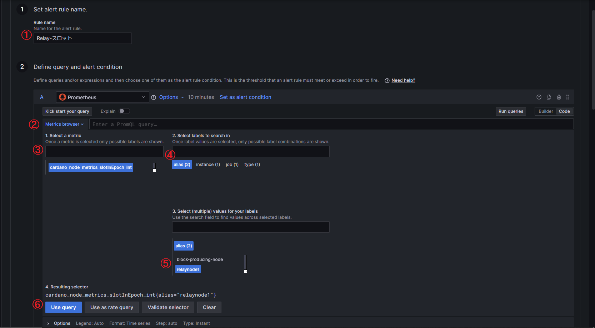
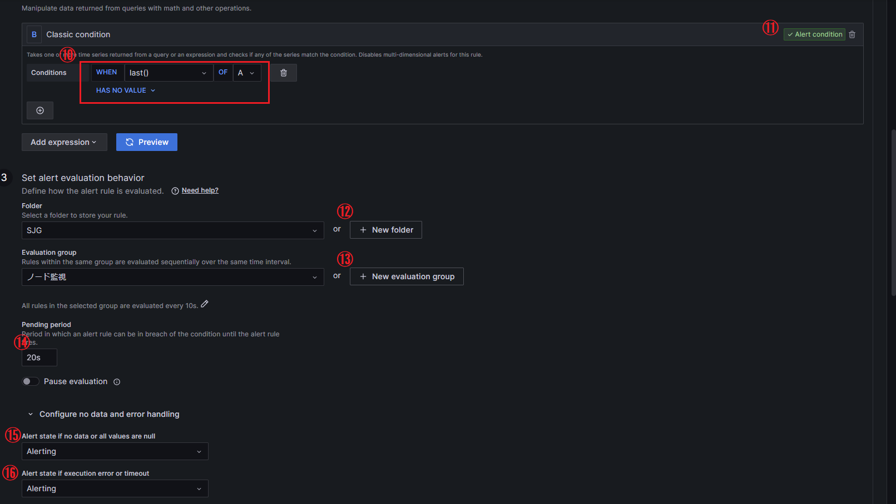
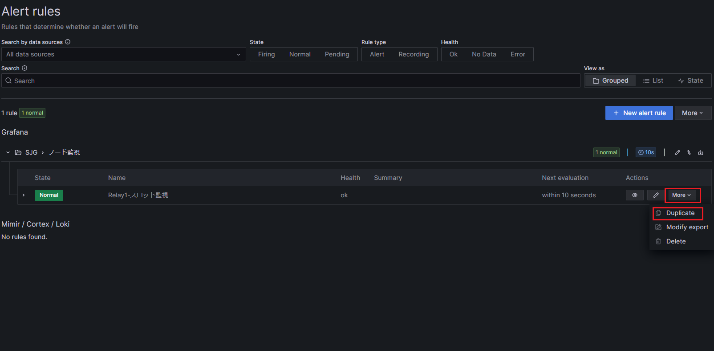
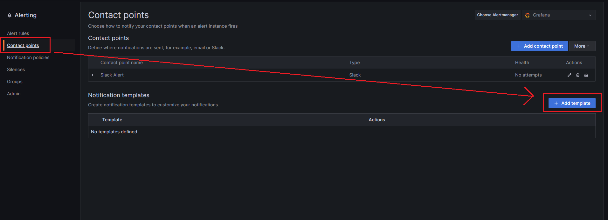
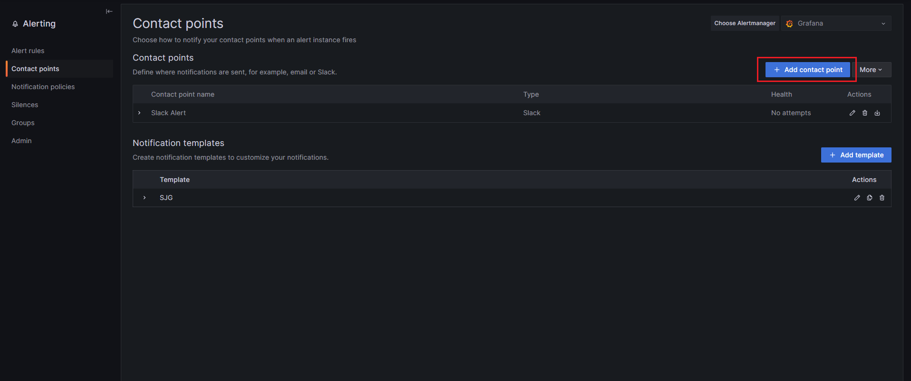
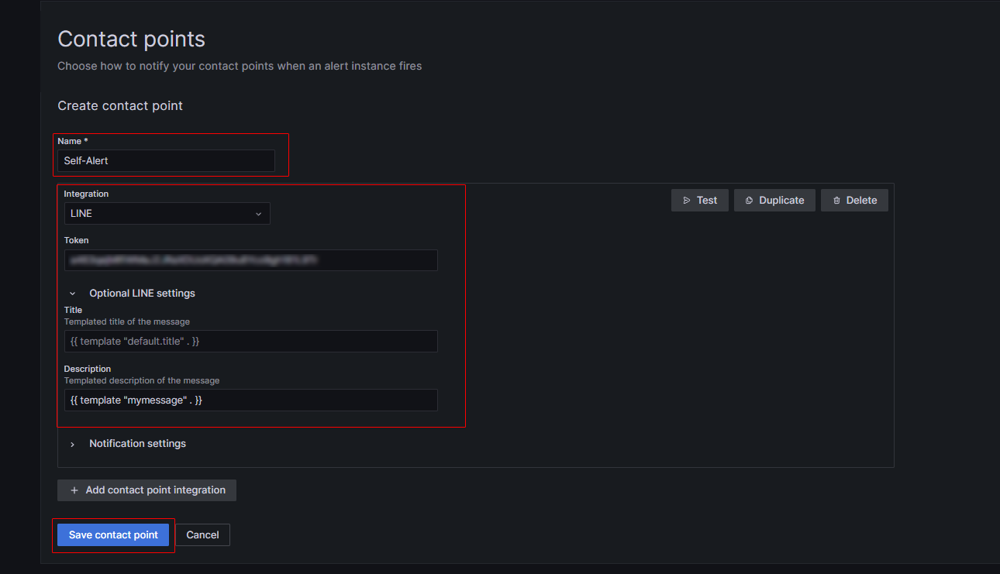
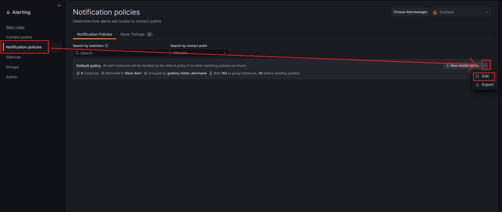
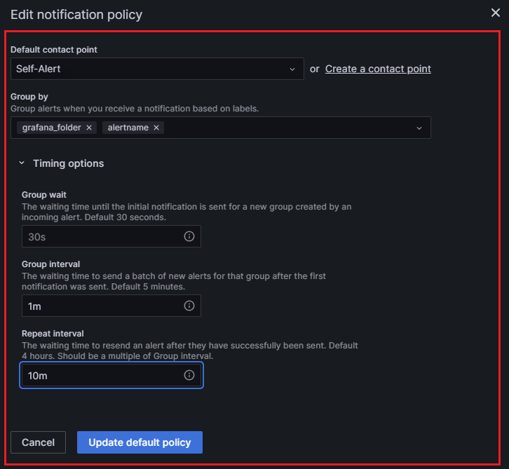

# Grafanaアラート設定

!!! note "概要"
    サーバー異常状態発生時に任意のアプリへ通知を送信する設定です。  
    サーバー監視には必須設定となります。

## 1.事前確認

* Grafanaバージョンv9.4.1以上
* Grafana [SJG最新ダッシュボード](../setup/9-monitoring-tools-setup.md#9-4grafana)適用済み

### Grafanaバージョン確認

```
grafana-cli -v
```

### Grafanaアップデート
```
sudo apt update -y && sudo apt upgrade -y
```

## 2.アラートルールの作成

通知の基準となるアラートルールを作成します。  

1.左サイドメニューから「ベルマーク」→「Alert rules」→「Create alert rule」の順にクリックする


### 2-1.ノードスロット監視

* ①:`Relay1-スロット監視`など任意のルール名
* ②:`Grafana managed alert`を選択
* ③:`Prometheus`を選択
* ④:`now-10m to now`を選択
* ⑤:`code`を選択
* ⑥:`Metrics Browser`をクリック
* ⑦:`cardano_node_metrics_slotInEpoch_int`を選択
* ⑧:`alias`を選択
* ⑨:監視するノード名を選択
* ⑩:`Option`をクリック
* ⑪:`Instant`を選択
* ⑫:`Use query`をクリック


* ⑬:`Classic_condition`を選択
* ⑭:`last()` / `A` / `HAS NO VALUE`選択
* Cパネルは削除する


* ⑮:`SJG`を入力し`+Add new`をクリックし`Enter`
* ⑯:`ノード監視`を入力し`+Add new`をクリック
* ⑰:`10s`を入力
* ⑱:`20s`を入力
* ⑲:`Alerting`を選択
* ⑳:`Alerting`を選択
* ㉑:削除
* ㉒:削除
* ㉓:`Summry`から`+Add new`をクリックし`検知内容`と入力
* 隣フィールドに検知メッセージを入力  
例）`Relay1のスロットを取得出来ませんでした。ノード起動状態を確認してください`
* ㉔:ページ上部へスクロールし、`Save and exit`をクリック


残りの全てのノードのスロット監視を設定する  

上記で作成したルールをコピーする


* ①を書き換える
* ⑥:`Metrics Browser`を書き換える  
例）  
`cardano_node_metrics_slotInEpoch_int{alias="block-producing-node"}`  
`cardano_node_metrics_slotInEpoch_int{alias="relaynode2"}`

* 「4 Add details for your alert rule」の検知内容のメッセージ内容を書き換える
* ㉔:ページ上部へスクロールし、Save and exitをクリック


### 2-2.BP→リレー接続監視
上記で作成したルールをコピーする


* ①:`BPリレー接続監視`など任意のルール名に書き換える
* ⑥:`Metrics Browser`を`cardano_node_metrics_peers_connectedPeers_int{alias="block-producing-node"}`に置き換える
* ⑭:`last()` / `A` / `IS BELOW`に切り替え`1`を入力
* ⑲:`Alerting`を選択
* ⑳:`Alerting`を選択
* 「4 Add details for your alert rule」の検知内容のメッセージ内容を書き換える  
例）`BPからリレーへの接続が確認できません。接続状況を確認してください`
* ㉔:ページ上部へスクロールし、`Save and exit`をクリック

### 2-3.チェーン密度監視
上記で作成したルールをコピーする


* ①:`チェーン密度監視`など任意のルール名に書き換える
* ⑥:`Metrics Browser`を`cardano_node_metrics_density_real{alias="relaynode1"} * 100`に置き換える
* ⑭:`last()` / `A` / `IS BELOW`に切り替え`4.5`を入力
* ⑲:`OK`を選択
* ⑳:`OK`を選択
* 「4 Add details for your alert rule」の検知内容のメッセージ内容を書き換える  
例）`チェーン密度が4.5％を下回っています。これはカルダノチェーン全体の問題です`
* ㉔:ページ上部へスクロールし、`Save and exit`をクリック

### 2-4.ノードタイム監視
上記で作成したルールをコピーする


* ①:`Relay1-ノードタイム監視`など任意のルール名に書き換える
* ⑥:`Metrics Browser`を`node_timex_maxerror_seconds{alias="relaynode1"} * 1000`に置き換える 
* ⑭:`last()` / `A` / `IS ABOVE`に切り替え`100`を入力
* ⑲:`OK`を選択
* ⑳:`OK`を選択
* 「4 Add details for your alert rule」の検知内容のメッセージ内容を書き換える  
例）`Relay1のノードタイムが100msを超えています。chronyを再起動してください`
* ㉔:ページ上部へスクロールし、`Save and exit`をクリック


残り全てのノードのノードタイム監視を設定する  

上記で作成したルールをコピーする


* ①を書き換える
* ⑥:`Metrics Browser`を書き換える  
例）  
`node_timex_maxerror_seconds{alias="block-producing-node"} * 1000`  
`node_timex_maxerror_seconds{alias="relaynode2"} * 1000`  

* 「4 Add details for your alert rule」の検知内容のメッセージ内容を書き換える
* ㉔:ページ上部へスクロールし、Save and exitをクリック


## 3.通知先アプリの設定

!!! note "通知先アプリの設定"
    アラートの通知先はLINE/Discord/Telegram/Slackを複数指定することが可能です。  
    ブロック生成ステータス通知の[通知アプリ設定](../setup/11-blocknotify-setup.md#11-2)で設定した手順と同様に、通知先名などを変えてトークンを発行してください。  

## 4.通知テンプレート設定

* 「Contact points」をクリックし「Add template」をクリック


* 任意のテンプレート名`SJG`を入力し、以下のテンプレートデータを入力
```
{{ define "myalert" }}
{{ if gt (len .Annotations) 0 }}{{ range .Annotations.SortedPairs }}{{ .Name }}: {{ .Value }}{{ end }}
{{ end }}{{ end }}


{{ define "mymessage" }}
{{ if gt (len .Alerts.Firing) 0 }} 【 ❌障害発生❌ 】{{len .Alerts.Firing}}件 {{ range .Alerts.Firing }}
{{ template "myalert" .}} {{ end }}{{ end }}
{{ if gt (len .Alerts.Resolved) 0 }}✅以下の障害は復旧しました✅{{len .Alerts.Resolved}}件{{ range .Alerts.Resolved }}
{{ template "myalert" .}} {{ end }}{{ end }}
{{ end }}
```


* 「Save tempelate」をクリック 

## 5.通知先設定
* 「Contact points」をクリックし「Add contact point」をクリック


通知先を指定する

* 任意の通知名`Self-Alert`を入力
* 通知先を選択し情報を入力
* [[3.通知先アプリの設定]](../setup/11-blocknotify-setup.md#11-2)で取得した通知アプリごとのトークンIDやWebhookURLを入力する
* `Option *** Settings`をクリックし`Discription`に以下のタグを入力
```
{{ template "mymessage" . }}
```

!!! hint "通知先ごとのタグ入力欄表記違い"

    * LINE→Description
    * Discord→Message Content
    * Slack→Text Body
    * Telegram→Message




* 「Save contact point」をクリック

!!! hint "複数の通知先を設定可能"
    「Add contact point integration」をクリックすれば、複数の通知先を設定可能


* 「Notification policies」→「Edit」をクリック


* `Self-Alert`を選択
* `Group by`に`grafana_folder`と`alertname`を指定
* `Group interval`→ `1 Minutes`に設定
* `Repeat interval`→ `10 Minutes`に設定
* Saveをクリック



## 6.通知内容URLカスタマイズ

!!! note "注意"
    * 事前に[Grafanaセキュリティ設定](./grafana-security.md)を実施してください
    * 以下はGrafanaインストールサーバーで実施してください


`xxxx.bbb.com`を[[Grafanaセキュリティ設定]](./grafana-security.md#1)で取得したドメイン(サブドメイン)に置き換えて実行する  
`https://`は不要
```
domain=xxxx.bbb.com
```

以下コマンドをすべてコピーして実行する
```
sudo sed -i /etc/grafana/grafana.ini \
    -e 's!;domain = localhost!domain = '${domain}'!' \
    -e 's!;root_url = %(protocol)s://%(domain)s:%(http_port)s/!root_url = https://%(domain)s/!'
```

Grafanaを再起動する
```
sudo systemctl restart grafana-server.service
```