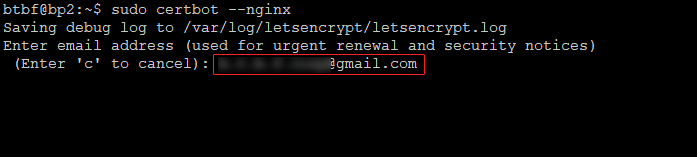

# Grafanaセキュリティ強化設定

!!! note "概要"
    このマニュアルではGrafanaのリモートアクセスセキュリティを強化するためHTTPS化とリバースプロキシの導入設定を行います。


## ■事前確認

以下の手順は、[9.監視ツールセットアップ](../setup/9-monitoring-tools-setup.md)でGrafanaを導入した既存のリレーサーバーで実施可能です。

～作業の流れ～

1. 独自ドメイン(サブドメイン)を取得  
　 ※無料ドメイン取得手順も掲載
2. WEBサーバーnginxのインストール・リバースプロキシ設定
3. certbotをインストール
4. 無料SSL証明書(Let’s Encrypt)を取得
5. nginx設定変更
6. SSL証明書自動更新を設定

!!! warning "作業前の注意事項"
    以下の文章をよく読みながら進めてください。コマンドの実行忘れ・コマンドコピーミスなどに十分注意してください。

## 1.ドメイン(サブドメイン)を取得する

!!! hint "確認"
    ホームページなどの運用ですでに独自ドメインを取得済みの場合はそちらを使用出来ます。独自ドメインをお持ちでない方は無料ダイナミックDNSでドメインを取得できます。

=== "独自ドメインをお持ちの方"


    独自ドメインをお持ちの方は、登録レジストラのDNS設定でGrafana用サブドメインを設定してください。

    参考）  
    ホスト名：任意のサブドメイン名  
    TYPE：A  
    VALUE(値):リレーサーバーIPアドレス  
    
    

=== "独自ドメインを持っていない方"

    [DDNS Now](https://ddns.kuku.lu/)で無料のドメインを取得します。
    DDNS Nowは完全無料・定期通知不要・サービス保障稼働率100%など、使いやすいDDNSサービスです。ただしサブドメインなどは設定できません。1アカウント1ドメイン
    
    **ドメイン(アカウント)を取得する**  
    ここで取得したサブドメインがGrafanaのURLになります。
    
    例）grafana-abc.f5.si  
    

    **詳細設定からDNSのAレコードを設定する**  
    「Aレコード(IPv4アドレス)」欄にGrafanaを導入しているサーバーのIPアドレスを入力して「設定を変更する」をクリックしてください
    

    **登録情報確認**  
    


## 2.nginxをインストールする
```
sudo apt install nginx -y
```
ステータス確認
```
sudo systemctl --no-pager status nginx
```
> 緑色で「active (running)」になっていることを確認する。

HTTP/HTTPS用ポートを開放する
```
sudo ufw allow 80/tcp
sudo ufw allow 443/tcp
```

開放中のGrafana用3000ポートを削除する  
numbered で表示された3000ポートの番号を指定して削除してください。
```
sudo ufw status numbered
sudo ufw delete 番号
```

ufwをリロードする
```
sudo ufw reload
```

!!! success "確認"
    ローカルブラウザから `http://リレーIPアドレス` にアクセスして  
    Nginx Welcomeページが表示されればOK！  
    


`xxxx.bbb.com`を[[1.ドメイン(サブドメイン)を取得する]](#1)で取得したドメイン(サブドメイン)に置き換えて実行する

```
domain=xxxx.bbb.com
```

仮想ホストファイルを作成する
```
sudo cat > $HOME/$domain.conf << EOF
server { 
    listen 80;
    server_name $domain;

    location / {
    proxy_set_header Host \$http_host;
    proxy_pass http://localhost:3000;
    } 
}
EOF
```

仮想ホストファイルをnginxフォルダへ移動する
```
sudo mv $HOME/$domain.conf /etc/nginx/sites-enabled/
```

nginxを再起動する
```
sudo systemctl restart nginx
```

!!! success "確認"
    ローカルブラウザから`http://ドメイン名`でアクセスし、Grafanaログイン画面が表示されればリバースプロキシ設定に成功しました！

デフォルトのホストファイルを削除する
```
sudo rm /etc/nginx/sites-enabled/default
```

## 3.certbotをインストールする
```
sudo snap install core; sudo snap refresh core
```
> 「Download snap "core" (14784) from channel "stable"」と表示され、ダウンロードに数分かかります。  

??? example "戻り値メッセージが異なる場合(クリックして開く)"
    === "パターン1"
        ``` { .yaml .no-copy }
        snap "core" is already installed, see 'snap help refresh'
        snap "core" has no updates available
        ```

        このメッセージはインストール済みです。次に進んでください。

    === "パターン2"
        ``` { .yaml .no-copy }
        sudo: snap: command not found 
        sudo: snap: command not found
        ```  
        このメッセージはsnapがインストールされていません。  
        以下のコマンドでインストールしてください。
        
        ```
        sudo apt update -y
        sudo apt install snapd -y
        ```

        snapのインストールが完了したら以下を実行してください。
        
        ```
        sudo snap install core; sudo snap refresh core
        ```
        
        ＜戻り値＞
        ``` { .yaml .no-copy }
        「Download snap "core" (14784) from channel "stable"」 
        
        2023-02-24T10:18:49+01:00 INFO Waiting for automatic snapd restart...
        core 16-2.58.2 from Canonical✓ installed
        snap "core" has no updates available
        ```

        と表示されたら次に進んでください。

```
sudo snap install --classic certbot
```
> 「Download snap "core20" (1822) from channel "stable」と表示され、ダウンロードに数分かかります


certbotをシステムフォルダへコピーする
```
sudo ln -s /snap/bin/certbot /usr/bin/certbot
```


## 4.無料SSL証明書(Let’s Encrypt)を取得する
```
sudo certbot --nginx
```

画面上の質問に回答します。

1. 任意のメールアドレスの登録  
ここで登録したメールアドレスにSSL証明書更新前・期限切れ情報の通知が届きます。  


2. Let's Encryptサービス利用規約への同意確認  


3. キャンペーンメール登録確認(不要ならN)  


4. SSL証明書登録ドメインの確認  
`1:`にご自身のドメインが表示されていることを確認し、`1`を入力  


5. SSL証明書取得確認  
`This certificate expires on`は取得したSSL証明書の有効期限なので覚えておきましょう！  
  
`Congratulations!`が表示されていれば署名書取得成功です！

!!! success "確認"
    ローカルブラウザから`https://ドメイン名`でアクセスし、Grafanaログイン画面が表示されればHTTPS化に成功しました！  
    ドメインでアクセスした際のURL欄において、httpの後にsがついているかどうかをチェックしてください。


## 5.nginx設定変更

1.websocketを有効にする  
`xxxx.bbb.com`を[[1.ドメイン(サブドメイン)を取得する]](#1)で取得したドメイン(サブドメイン)に置き換えて実行する
```
domain=xxxx.bbb.com
```

仮想ホストファイルを開く
```
sudo nano /etc/nginx/sites-enabled/$domain.conf
```

`location /`ブロックを以下の内容に書き換える
```
    location / {
    proxy_set_header Host $http_host;
    proxy_pass http://localhost:3000;
    }

    location /api/live {
    proxy_http_version 1.1;
    proxy_set_header Upgrade $http_upgrade;
    proxy_set_header Connection $connection_upgrade;
    proxy_set_header Host $http_host;
    proxy_pass http://localhost:3000;
    }
```

編集後参考）  
 


追記したら保存して閉じる


2.nginx 構成ファイルの強化
設定ファイルを開く
```
sudo nano /etc/nginx/nginx.conf
```

`SSL Settings`の `TLSv1`と` TLSv1.1`を削除する  
編集後参考）  
 


続けて、以下の文を全てコピーして`include /etc/nginx/site-enabled/*;`の後に追記する  
```
        ## Start: Size Limits & Buffer Overflows ##
        client_body_buffer_size  3K;
        client_header_buffer_size 3k;
        client_max_body_size 80k;
        large_client_header_buffers 2 10k;
        ## END: Size Limits & Buffer Overflows ##

        ### Directive describes the zone, in which the session states are stored i.e. store in slimits. ###
        ### 1m can handle 32000 sessions with 32 bytes/session, set to 5m x 32000 session ###
        limit_conn_zone $binary_remote_addr zone=addr:5m;

        ### Control maximum number of simultaneous connections for one session i.e. ###
        ### restricts the amount of connections from a single ip address ###
        limit_conn addr 10;

        map $http_upgrade $connection_upgrade {
            default upgrade;
            ''      close;
        }
```

赤枠の `}` の位置に注意してください。  
編集後参考） 
 


追記したら保存して閉じる

nginxエラーチェック
```
sudo nginx -t
```
!!! note "戻り値"
    === "正常な場合"
        ``` { .yaml .no-copy }
        nginx: the configuration file /etc/nginx/nginx.conf syntax is ok
        nginx: configuration file /etc/nginx/nginx.conf test is successful
        ```
    === "エラーがある場合(例) "
        ``` { .yaml .no-copy }
        nginx: [emerg] unexpected "}" in /etc/nginx/sites-enabled/******.conf:8
        nginx: configuration file /etc/nginx/nginx.conf test failed
        ```
        エラー箇所を修正してください。


nginxを再起動する
```
sudo systemctl restart nginx
```

## 6.SSL証明書自動更新

1.SSL証明書自動更新タイマー確認  
このプログラムでSSL証明書が自動更新されます。
```
systemctl status snap.certbot.renew.timer
```
> 緑色で「active(wating)」になっていることを確認する。


2.nginx自動起動スクリプト
自動更新されたSSL証明書を有効にするため、nginx再起動スクリプトを設定します。
```
cat > $HOME/nginx-reload.sh << EOF
#!/bin/bash 
sudo systemctl reload nginx
EOF
```
```
sudo mv $HOME/nginx-reload.sh /etc/letsencrypt/renewal-hooks/deploy/
```
```
sudo chmod 755 /etc/letsencrypt/renewal-hooks/deploy/nginx-reload.sh
```

3.指定ユーザーと指定コマンドでsudoパスワード要求を無効にする  
シェルスクリプト内でsudoコマンドを使用しているため、スクリプト自動実行にパスワード要求をスルー出来るように設定します。  

ログインユーザー名を確認する(控える)
```
whoami
```
sudo設定ファイルを開く
```
sudo visudo
```
以下コマンドの`xxxx`を、上記で調べたログインユーザー名に書き換えて追記する
```
xxxx ALL=NOPASSWD: /bin/systemctl
```
> このまま追記しないでください。xxxxをユーザー名に書き換えてください

編集後参考） 
 


追記したら保存して閉じる