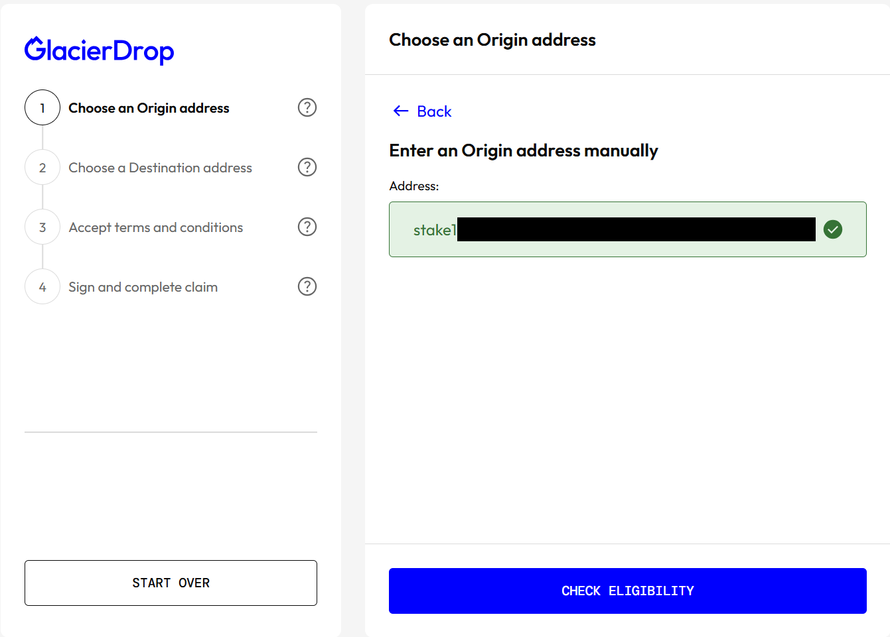
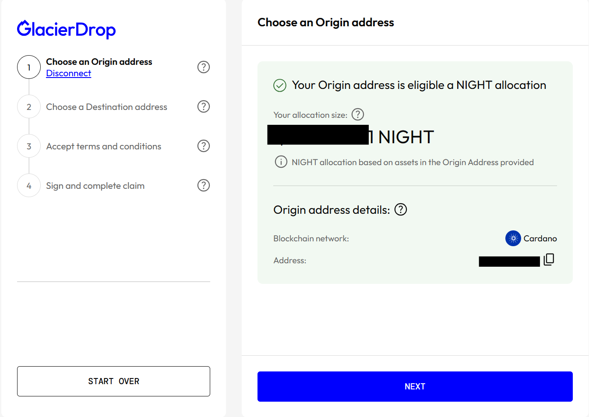
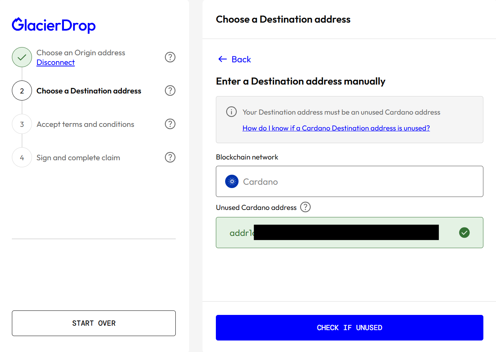
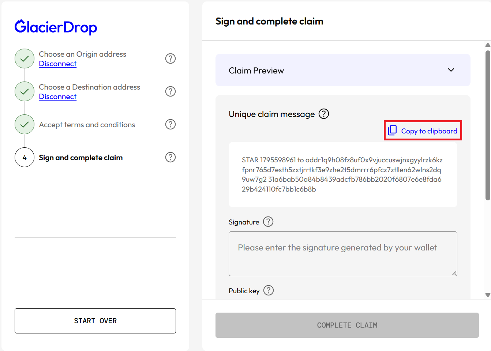
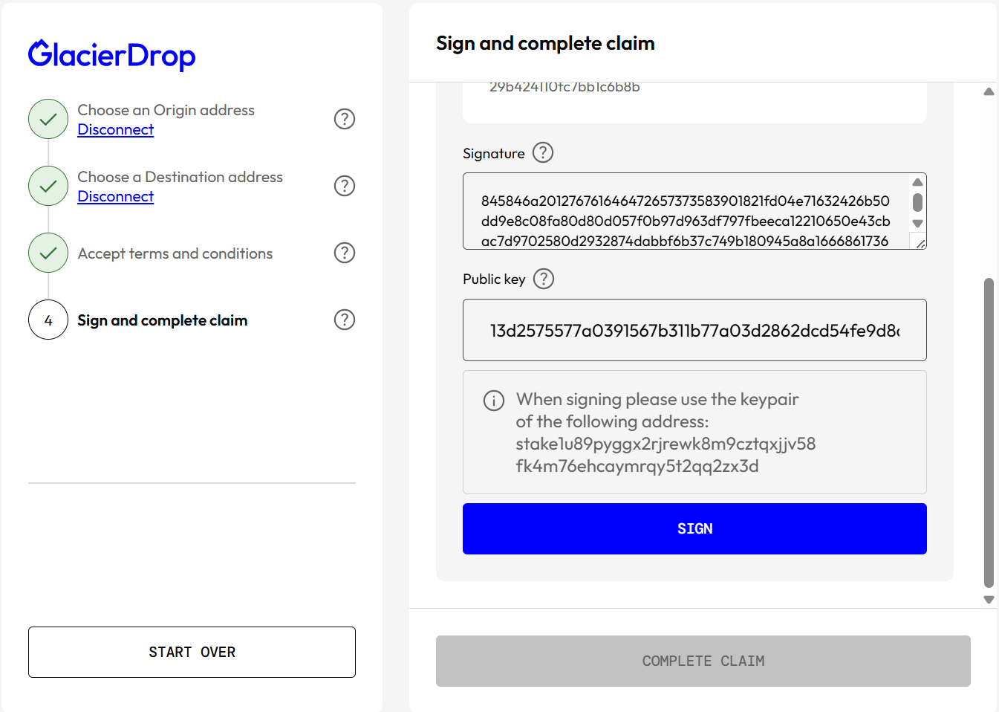
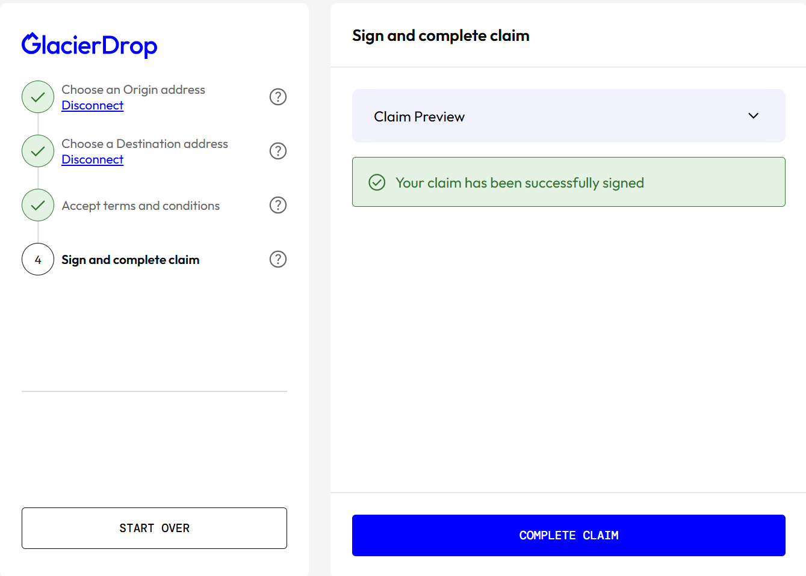
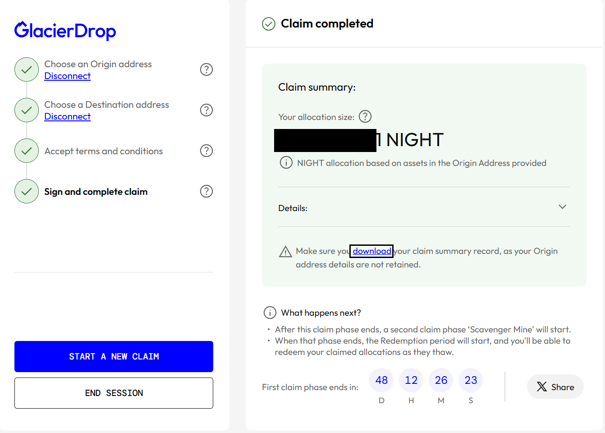

# **Glacier Drop SPO請求手続き手順**

!!! info "概要"
    - cardano-cli生成のステークアドレスに対応した請求手順となります。

## **1.cardano-signerインストール**

### **ブロックプロデューサー**

**ダウンロード**
=== "ブロックプロデューサーノード"  
    ```
    signer_release="$(curl -s https://api.github.com/repos/gitmachtl/cardano-signer/releases/latest | jq -r '.tag_name' | sed -e "s/^.\{1\}//")"
    cd $HOME/git
    wget -q https://github.com/gitmachtl/cardano-signer/releases/download/v${signer_release}/cardano-signer-${signer_release}_linux-x64.tar.gz
    ```
    ```
    tar -xzvf cardano-signer-${signer_release}_linux-x64.tar.gz
    rm cardano-signer-${signer_release}_linux-x64.tar.gz
    ```

**インストール** 
=== "ブロックプロデューサーノード"
    ```
    sudo cp cardano-signer /usr/local/bin/cardano-signer
    ```

**バージョン確認**
=== "ブロックプロデューサーノード"
    ```
    cardano-signer --version
    ```

### **エアギャップ**

!!! important "ファイル転送"
    BPの`$HOME/git`にある`cardano-signer`をエアギャップマシンの`$HOME/git`にコピーします。
    ``` mermaid
    graph LR
        A[BP] -->|cardano-signer| B[エアギャップ];
    ```

**システムフォルダへコピーする**
=== "エアギャップマシン"  
    ```
    cd $HOME/git
    chmod 755 cardano-signer
    sudo cp cardano-signer /usr/local/bin/cardano-signer
    ```

**バージョン確認** 
=== "エアギャップマシン" 
    ```
    cardano-signer --version
    ```


## **2.請求手続き**

### 2-1.未使用アドレス準備
NIGHT受け取り用の未使用アドレスまたは新規ウォレットをご準備ください

### 2-2.請求元アドレス確認
=== "ブロックプロデューサーノード"  
    ```
    echo "$(cat $NODE_HOME/stake.addr)"
    ```

### 2-3.請求サイト手続き
2-2で表示されたステークアドレスをマニュアル入力モードで入力してください



エアドロップ対象確認



2-1で準備した未使用アドレスをマニュアル入力モードで入力してください


未使用アドレス有効確認の後に、署名メッセージが表示されます。



エアギャップマシンで署名します。
=== "エアギャップマシン" 
    ```
    message='請求サイトに表示されているmessageをここに貼り付けてください'
    ```
    | ↑必ず''で囲ってから実行してください

    メッセージ確認
    ```
    echo $message
    ```
    | ↑請求サイトに表示されているmessageが表示されているか確認してください

    署名ファイル作成
    ```
    cardano-signer sign --cip8 --data-text "${message}" --secret-key $NODE_HOME/stake.skey --address $NODE_HOME/stake.addr --json-extended | jq > $NODE_HOME/midnight-sing.json
    ```
    
    値抽出
    ```
    publicKey=$(jq -r '.publicKey' $NODE_HOME/midnight-sing.json)
    COSE_Sign1_hex=$(jq -r '.output.COSE_Sign1_hex' $NODE_HOME/midnight-sing.json)
    echo
    echo "以下のコードをSignature欄に入力してください:"
    echo $COSE_Sign1_hex
    echo
    echo "以下のコードをPublic key欄に入力してください:"
    echo $publicKey
    ```
    | ↑このままコピーしてエアギャップで実行してください

    ターミナルに表示された`Signature`と`Public key`を請求サイトに貼り付けてSIGNをクリックしてください

    
    ここで必ず`COMPLETE CLAIM`をクリックしてください
    
    この画面が表示jされたら手続き完了です。必要に応じてPDFファイルをダウンロードしてください
    

