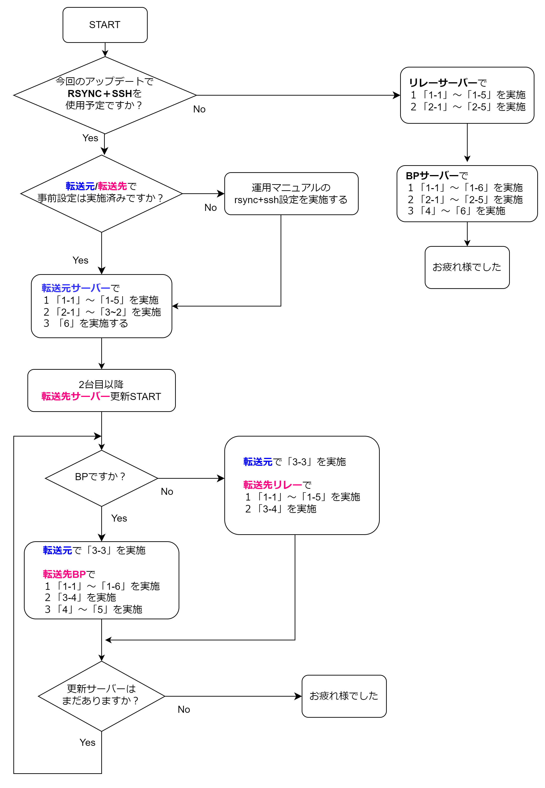

# **ノードアップデートマニュアル**

!!! note "対応バージョン" 
    2022年8月24日時点でこのガイドは v.1.35.3に対応しています


!!! info "概要"
    * 以下、バージョンアップ作業を行う場合、ブロック生成スケジュールがないタイミングで実施してください。
    * 以下手順実施後、ブロック生成確認済みです。
    * 1.35.3初回起動時に2~4時間以上のDBの再検証処理が行われますので時間に余裕を持った作業をお願いします。
    * RSYNCアップデートを使用しない場合は、 3.RSYNC+SSHアップデート の作業は実施不要


!!! info "v.1.35.3主な変更点と新機能"
    
    * KES更新時の証明書カウンター番号を直近で自プールが生成したブロックに刻まれてる番号の「＋1した数字」である必要があります。


!!! error "よくお読みになって進めてください"
    ご自身のアップデートスタイルによって手順が異なります。  
    更新フローチャートとアップデートマニュアルを照らし合わせながら、アップデート作業を進めてください。

### **更新フローチャート**
更新フローチャートは、画像をクリックすると別ウィンドウで開きます。
<a href="../../images/1.35.3-update.png" target=_blank></a>


## **1.依存環境アップデート**

### **1-1. システムアップデート**

```bash
sudo apt update -y
```
```bash
sudo apt upgrade -y
```
ノードをストップする
```bash
sudo systemctl stop cardano-node
```
サーバーを再起動する
```bash
sudo reboot
```

SSHで再接続する

### **1-2. cabal/GHCバージョン確認**

**cabalパス確認**
```
which cabal
```
> /home/user/.ghcup/bin/cabal なら正常

??? danger "戻り値が[/home/user/.local/bin/cabal]だった場合(クリックして開く)"
    **戻り値が[/home/user/.local/bin/cabal]だった場合のみ以下を実行**  
    
    パスを追加する
    ```
    echo PATH=$PATH:$HOME/.ghcup/bin >> $HOME/.bashrc
    source $HOME/.bashrc
    ```

    旧cabalリネーム
    ```
    cd $HOME/.local/bin/
    mv cabal cabal_bk
    ```

cabalバージョン確認
```
cabal --version
```
> 以下の戻り値ならOK  
cabal-install version 3.6.2.0  
compiled using version 3.6.2.0 of the Cabal library

??? danger "cabal 3.6.1.0以下だった場合(クリックして開く)"
    **cabal 3.6.1.0以下だった場合のみ実行**
    **cabalバージョンアップ**
    ```
    ghcup upgrade
    ghcup install cabal 3.6.2.0
    ghcup set cabal 3.6.2.0
    ```


GHCバージョン確認
```bash
ghc --version
```
> GHCのバージョンは「8.10.7」であることを確認してください。

??? danger "GHC 8.10.4以下だった場合(クリックして開く)"
    **GHC 8.10.4以下だった場合のみ実行**
    ```bash
    ghcup upgrade
    ghcup install ghc 8.10.7
    ghcup set ghc 8.10.7
    ```
    ```bash
    ghc --version
    ```
    > GHCのバージョンは「8.10.7」であればOK


### **1-3.Secp256k1のインストール**

```
cd $HOME/git
git clone https://github.com/bitcoin-core/secp256k1.git
```

```
cd secp256k1/
git reset --hard ac83be33d0956faf6b7f61a60ab524ef7d6a473a
./autogen.sh
./configure --prefix=/usr --enable-module-schnorrsig --enable-experimental
make
make check
```
!!! hint "確認"
    以下の戻り値であることを確認する
    ```
    Testsuite summary for libsecp256k1 0.1.0-pre
    ============================================================================
    # TOTAL: 2
    # PASS:  2
    # SKIP:  0
    # XFAIL: 0
    # FAIL:  0
    # XPASS: 0
    # ERROR: 0
    ============================================================================
    ```
インストールコマンドを実行
```
sudo make install
```

### **1-4.環境変数追加**
```
echo export PKG_CONFIG_PATH="/usr/local/lib/pkgconfig:$PKG_CONFIG_PATH" >> $HOME/.bashrc
echo export NODE_NETWORK="--mainnet" >> $HOME/.bashrc
source $HOME/.bashrc
```

### **1-5.Guildスクリプト再取得**
!!! error "注意"
    * リレーとBPでコマンドが異なりますので、タブを切り替えてください。


=== "リレーノード"
    スクリプトをバックアップ
    ```
    cd $NODE_HOME/scripts
    cp gLiveView.sh gLiveView-1.34.1.sh
    cp env env-1.34.1
    ```

    スクリプトをダウンロードする(上書き)
    ```
    wget https://raw.githubusercontent.com/cardano-community/guild-operators/master/scripts/cnode-helper-scripts/gLiveView.sh -O ./gLiveView.sh
    wget https://raw.githubusercontent.com/cardano-community/guild-operators/master/scripts/cnode-helper-scripts/env -O ./env
    ```

    ノードポート番号を確認する
    ```
    PORT=`grep "PORT=" $NODE_HOME/startRelayNode1.sh`
    b_PORT=${PORT#"PORT="}
    echo "リレーポートは${b_PORT}です"
    ```
    > ↑そのまま実行する


    envファイルを修正します
    ```
    sed -i $NODE_HOME/scripts/env \
    -e '1,73s!#CNODE_HOME="/opt/cardano/cnode"!CNODE_HOME=${NODE_HOME}!' \
    -e '1,73s!#CNODE_PORT=6000!CNODE_PORT='${b_PORT}'!' \
    -e '1,73s!#UPDATE_CHECK="Y"!UPDATE_CHECK="N"!' \
    -e '1,73s!#CONFIG="${CNODE_HOME}/files/config.json"!CONFIG="${CNODE_HOME}/'${NODE_CONFIG}'-config.json"!' \
    -e '1,73s!#SOCKET="${CNODE_HOME}/sockets/node0.socket"!SOCKET="${CNODE_HOME}/db/socket"!'
    ```

    

=== "ブロックプロデューサーノード"

    !!! hint "確認"
        各ファイル名を変更している場合はご自身の環境に合わせて修正してください

    **サービスを止める**
    ```
    sudo systemctl stop cnode-cncli-sync.service
    ```

    スクリプトをバックアップ
    ```
    cd $NODE_HOME/scripts
    cp gLiveView.sh gLiveView-1.34.1.sh
    cp env env-1.34.1
    cp cncli.sh cncli-1.34.1.sh
    cp cntools.library cntools-1.34.1.library
    cp cntools.config cntools-1.34.1.config
    ```

    スクリプトをダウンロードする(上書き)
    ```
    wget https://raw.githubusercontent.com/cardano-community/guild-operators/master/scripts/cnode-helper-scripts/cncli.sh -q -O ./cncli.sh
    wget https://raw.githubusercontent.com/cardano-community/guild-operators/master/scripts/cnode-helper-scripts/env -q -O ./env
    wget https://raw.githubusercontent.com/cardano-community/guild-operators/master/scripts/cnode-helper-scripts/gLiveView.sh -q -O ./gLiveView.sh
    wget https://raw.githubusercontent.com/btbf/spojapanguild/master/scripts/cntools.library -q -O ./cntools.library
    wget https://raw.githubusercontent.com/btbf/spojapanguild/master/scripts/blocks.sh -q -O ./blocks.sh
    wget https://raw.githubusercontent.com/btbf/spojapanguild/master/scripts/logMonitor.sh -q -O ./logMonitor.sh
    rm cntools.config
    ```

    ノードポート番号を確認する
    ```
    PORT=`grep "PORT=" $NODE_HOME/startBlockProducingNode.sh`
    b_PORT=${PORT#"PORT="}
    echo "BPポートは${b_PORT}です"
    ```

    envファイルを修正します
    ```
    sed -i $NODE_HOME/scripts/env \
    -e '1,73s!#CCLI="${HOME}/.cabal/bin/cardano-cli"!CCLI="/usr/local/bin/cardano-cli"!' \
    -e '1,73s!#CNODE_HOME="/opt/cardano/cnode"!CNODE_HOME='${NODE_HOME}'!' \
    -e '1,73s!#CNODE_PORT=6000!CNODE_PORT='${b_PORT}'!' \
    -e '1,73s!#UPDATE_CHECK="Y"!UPDATE_CHECK="N"!' \
    -e '1,73s!#CONFIG="${CNODE_HOME}/files/config.json"!CONFIG="${CNODE_HOME}/'${NODE_CONFIG}'-config.json"!' \
    -e '1,73s!#TOPOLOGY="${CNODE_HOME}/files/topology.json"!TOPOLOGY="${CNODE_HOME}/'${NODE_CONFIG}'-topology.json"!' \
    -e '1,73s!#SOCKET="${CNODE_HOME}/sockets/node0.socket"!SOCKET="${CNODE_HOME}/db/socket"!' \
    -e '1,73s!#BLOCKLOG_TZ="UTC"!BLOCKLOG_TZ="Asia/Tokyo"!' \
    -e '1,73s!#WALLET_PAY_ADDR_FILENAME="payment.addr"!WALLET_PAY_ADDR_FILENAME="payment.addr"!' \
    -e '1,73s!#WALLET_STAKE_ADDR_FILENAME="reward.addr"!WALLET_STAKE_ADDR_FILENAME="stake.addr"!' \
    -e '1,73s!#POOL_HOTKEY_VK_FILENAME="hot.vkey"!POOL_HOTKEY_VK_FILENAME="kes.vkey"!' \
    -e '1,73s!#POOL_HOTKEY_SK_FILENAME="hot.skey"!POOL_HOTKEY_SK_FILENAME="kes.skey"!' \
    -e '1,73s!#POOL_COLDKEY_VK_FILENAME="cold.vkey"!POOL_COLDKEY_VK_FILENAME="node.vkey"!' \
    -e '1,73s!#POOL_COLDKEY_SK_FILENAME="cold.skey"!POOL_COLDKEY_SK_FILENAME="node.skey"!' \
    -e '1,73s!#POOL_OPCERT_COUNTER_FILENAME="cold.counter"!POOL_OPCERT_COUNTER_FILENAME="node.counter"!' \
    -e '1,73s!#POOL_OPCERT_FILENAME="op.cert"!POOL_OPCERT_FILENAME="node.cert"!' \
    -e '1,73s!#POOL_VRF_SK_FILENAME="vrf.skey"!POOL_VRF_SK_FILENAME="vrf.skey"!'
    ```

    プールIDを確認する
    ```
    pool_ID=`cat $NODE_HOME/stakepoolid_hex.txt`
    echo "プールIDは${pool_ID}です"
    ```
    <strong><font color=red>ご自身のプールIDが表示されていることを確認してください</font></strong>  
    プールIDが表示されていない場合は、[こちらの手順](../setup/7-register-stakepool.md#4)を実行してください  
    
    <br>
    cncli.shファイルを修正します
    ```
    sed -i $NODE_HOME/scripts/cncli.sh \
    -e '1,73s!#POOL_ID=""!POOL_ID='${pool_ID}'!' \
    -e '1,73s!#POOL_VRF_SKEY=""!POOL_VRF_SKEY="${CNODE_HOME}/vrf.skey"!' \
    -e '1,73s!#POOL_VRF_VKEY=""!POOL_VRF_VKEY="${CNODE_HOME}/vrf.vkey"!'
    ```

### **1-6.CNCLIバージョンアップ(BPのみ)**

!!! info "確認"
    * BPのみで実施します
    * CNCLI4→5へバージョンアップします。


**CNCLIリポジトリを再構築する**

```
cd $HOME/git
rm -rf cncli
git clone --recurse-submodules https://github.com/cardano-community/cncli
```

**CNCLIをアップデートする**

```bash
rustup update
cd $HOME/git/cncli
git fetch --all --prune
git checkout $(curl -s https://api.github.com/repos/cardano-community/cncli/releases/latest | jq -r .tag_name)
cargo install --path . --force
```

バージョン確認
```
cncli --version
```
> cncli 5.1.2になったことを確認する  


** cncli.dbを初期化する **
```
cd $NODE_HOME/guild-db/
rm -rf cncli
```
> ここではまだサービスを再起動しない

## 2.通常アップデート

### **2-1.ビルド準備**

新しいTMUXセッションを開く

```
tmux new -s build
```
TMUXセッション内(緑帯が表示されてる状態)で  
ソースコードダウンロード(2-2)及びビルド(2-3)を実行します

### **2-2.ソースコードダウンロード**

```bash
cd $HOME/git
rm -rf cardano-node-old/
git clone https://github.com/input-output-hk/cardano-node.git cardano-node2
cd cardano-node2/
```

!!! hint "ヒント"

    * SSH接続が途中で切断されても処理が止まりません。  
    * ビルド中にデタッチ(Ctrl+B D)してバックグラウンド処理へ切り替えられます。

### **2-3.ソースコードからビルド**


```bash
cabal clean
cabal update
```

```
git fetch --all --recurse-submodules --tags
git checkout tags/1.35.3
cabal configure -O0 -w ghc-8.10.7
```

```bash
echo -e "package cardano-crypto-praos\n flags: -external-libsodium-vrf" > cabal.project.local
```
```bash
cabal build cardano-node cardano-cli
```

ビルド完了までに数十分ほどかかります。  

**バージョン確認**

```bash
$(find $HOME/git/cardano-node2/dist-newstyle/build -type f -name "cardano-cli") version  
$(find $HOME/git/cardano-node2/dist-newstyle/build -type f -name "cardano-node") version  
```
以下の戻り値を確認する  
>cardano-cli 1.35.3 - linux-x86_64 - ghc-8.10  
git rev 950c4e222086fed5ca53564e642434ce9307b0b9  

>cardano-node 1.35.3 - linux-x86_64 - ghc-8.10  
git rev 950c4e222086fed5ca53564e642434ce9307b0b9  


**ノードをストップする** 
```
sudo systemctl stop cardano-node
```

**バイナリーファイルをシステムフォルダーへコピーする**

```bash
sudo cp $(find $HOME/git/cardano-node2/dist-newstyle/build -type f -name "cardano-cli") /usr/local/bin/cardano-cli
```

```bash
sudo cp $(find $HOME/git/cardano-node2/dist-newstyle/build -type f -name "cardano-node") /usr/local/bin/cardano-node
```

**システムに反映されたノードバージョンを確認する**

```bash
cardano-cli version
cardano-node version
```

以下の戻り値を確認する  
>cardano-cli 1.35.3 - linux-x86_64 - ghc-8.10  
git rev 950c4e222086fed5ca53564e642434ce9307b0b9  

>cardano-node 1.35.3 - linux-x86_64 - ghc-8.10  
git rev 950c4e222086fed5ca53564e642434ce9307b0b9  

ビルド用TMUXセッションを終了する
```
exit
```

### **2-4.ノード起動**

```bash
sudo systemctl start cardano-node
```

**DB再構築処理状況確認する**

```
journalctl -u cardano-node -f
```
Progressが100%になるまで待ちます


!!! info "ヒント"
    * 1.35.3初回起動時に2~4時間以上のDBの再検証処理が行われます。  
    * ノードログの進捗状況%を確認し、通常ログが流れ出したらGliveViewでノード状況を確認する
    * Syncing 100%がTip(diff): ** :)となるまで待つ


### **2-5.作業フォルダリネーム**
前バージョンで使用していたバイナリフォルダをリネームし、バックアップとして保持します。最新バージョンを構築したフォルダをcardano-nodeとして使用します。

```bash
cd $HOME/git
mv cardano-node/ cardano-node-old/
mv cardano-node2/ cardano-node/
```

## 3.RSYNC+SSHアップデート


!!! note "メリット"
    **複数台のサーバーがある場合に、以下の処理を行うことでビルド時間の短縮やノードのダウンタイムを抑えることが出来ます。**

!!! error "デメリット"
    * RSYNC+SSHを利用したアップデート方法は、転送元・転送先サーバーのディスク空き容量が150GB以上必要となります。

!!! hint "はじめに"

    * RSYNCを使用する場合、最初に[事前設定](./rsync-ssh.md)を行ってください
    * 転送元サーバーで [2.通常アップデート](./node-update.md#2)を実施してください
    * 転送先サーバーで [1.依存環境アップデート](./node-update.md#1)を実施してください

### 3-1.容量確認
**転送元・転送先サーバー両方で確認してください**
```
df -h /usr
```
<strong><font color=red>Availが150GB以上あることを確認してください。</font></strong>


### 3-2.転送元サーバー作業
!!! hint "確認"
    この作業(3-2)は1回で大丈夫です。

=== "転送元サーバー"
    **バイナリーファイルを転送フォルダ用にコピーする**
    ```
    mkdir $NODE_HOME/Transfer
    cp $(find $HOME/git/cardano-node/dist-newstyle/build -type f -name "cardano-cli") $NODE_HOME/Transfer/cardano-cli
    cp $(find $HOME/git/cardano-node/dist-newstyle/build -type f -name "cardano-node") $NODE_HOME/Transfer/cardano-node
    ```

    バージョン確認
    ```
    $NODE_HOME/Transfer/cardano-cli version
    $NODE_HOME/Transfer/cardano-node version
    ```
    以下の戻り値を確認する
    >cardano-cli 1.35.3 - linux-x86_64 - ghc-8.10  
    git rev 950c4e222086fed5ca53564e642434ce9307b0b9  

    >cardano-node 1.35.3 - linux-x86_64 - ghc-8.10  
    git rev 950c4e222086fed5ca53564e642434ce9307b0b9  
    
    **ノードを停止する**
    ```
    sudo systemctl stop cardano-node
    ```

    **DBフォルダを圧縮する**

    新しいTMUXセッションを開く
    ```
    tmux new -s tar
    ```

    ```
    tar cvzf $NODE_HOME/Transfer/1.35.3-db.tar.gz -C $NODE_HOME db
    ```

    圧縮が終了したらTMUXを閉じる
    ```
    exit
    ```

    **ノードをスタートする**
    ```
    sudo systemctl start cardano-node
    ```


### 3-3.転送元から転送先へ転送する

変数`for`に転送先エイリアスを代入する

=== "転送元サーバー"

    新しいTMUXセッションを開く
    ```
    tmux new -s rsync
    ```

    転送先エイリアスを指定する

    ```
    for=xxxx
    ```
    > 転送先エイリアスは、事前設定の [1-2.SSH設定ファイル作成](./rsync-ssh.md#1-2ssh) で設定した転送先Host名(エイリアス)を指定します。

    ファイルを転送する
    ```
    rsync -P --rsh=ssh $NODE_HOME/Transfer/1.35.3-db.tar.gz $for::Server/1.35.3-db.tar.gz
    ```
    > 転送が完了するまで待つ

    ```
    rsync -P --rsh=ssh $NODE_HOME/Transfer/cardano-cli $for::Server/cardano-cli
    ```
    > 転送が完了するまで待つ

    ```
    rsync -P --rsh=ssh $NODE_HOME/Transfer/cardano-node $for::Server/cardano-node
    ```
    > 転送が完了するまで待つ

    転送が終了したらTMUXを閉じる
    ```
    exit
    ```


### 3-4.転送先サーバー作業

新しいTMUXセッションを開く
```
tmux new -s tar
```

=== "転送先サーバー"

    SSDの空き容量を再確認する
    ```
    df -h /usr
    ```
    <strong><font color=red>Availが90GB以上あることを確認してください。</font></strong>


    DBを解凍する
    ```
    mkdir $NODE_HOME/temp
    tar -xzvf $NODE_HOME/1.35.3-db.tar.gz -C $NODE_HOME/temp/
    ```
    > DBの解凍が終わるまで待ちます

    解凍が終わったらTMUXを閉じる
    ```
    exit
    ```

    ノードを停止する
    ```
    sudo systemctl stop cardano-node
    ```

    バイナリーファイルをシステムフォルダーへコピーする
    ```
    sudo cp $NODE_HOME/cardano-cli /usr/local/bin/cardano-cli
    ```
    ```
    sudo cp $NODE_HOME/cardano-node /usr/local/bin/cardano-node
    ```
    バージョン確認
    ```
    cardano-cli version
    cardano-node version
    ```
    以下の戻り値を確認する
    >cardano-cli 1.35.3 - linux-x86_64 - ghc-8.10  
    git rev 950c4e222086fed5ca53564e642434ce9307b0b9  

    >cardano-node 1.35.3 - linux-x86_64 - ghc-8.10  
    git rev 950c4e222086fed5ca53564e642434ce9307b0b9 

    DBフォルダを入れ替える
    ```
    mv $NODE_HOME/db $NODE_HOME/db_134
    mv $NODE_HOME/temp/db $NODE_HOME/db
    ```
    


    ノードを起動する
    ```
    sudo systemctl start cardano-node
    ```

    !!! info "ヒント"  
        * GliveViewでノード状況を確認する
        * Syncing 100%がTip(diff): ** :)となるまで待つ


    バイナリーファイルを移動する
    ```
    cd $HOME/git
    rm -rf cardano-node-old/
    mv $HOME/git/cardano-node/ $HOME/git/cardano-node-old/
    mkdir cardano-node
    mv $NODE_HOME/cardano-cli $HOME/git/cardano-node/
    mv $NODE_HOME/cardano-node $HOME/git/cardano-node/
    ```


    !!! hint "確認"
        ノードの同期が成功しブロック生成に成功し数エポック様子を見たあと、転送用ファイル・バックアップDBを削除してください
        === "転送元"
            ```
            rm -rf $NODE_HOME/Transfer
            ```
        === "転送先"
            ```
            rm -rf $NODE_HOME/db_134
            rm $NODE_HOME/1.35.3-db.tar.gz
            ```


<!--

以下のコードを実行して、ユニットファイルを作成します。



```bash
cat > $NODE_HOME/cardano-node.service << EOF 
# The Cardano node service (part of systemd)
# file: /etc/systemd/system/cardano-node.service 

[Unit]
Description     = Cardano node service
Wants           = network-online.target
After           = network-online.target 

[Service]
User            = ${USER}
Type            = simple
WorkingDirectory= ${NODE_HOME}
ExecStart       = /bin/bash -c '${NODE_HOME}/startRelayNode1.sh'
KillSignal=SIGINT
RestartKillSignal=SIGINT
TimeoutStopSec=300
LimitNOFILE=32768
Restart=always
RestartSec=5
SyslogIdentifier=cardano-node

[Install]
WantedBy	= multi-user.target
EOF
```



```bash
cat > $NODE_HOME/cardano-node.service << EOF 
# The Cardano node service (part of systemd)
# file: /etc/systemd/system/cardano-node.service 

[Unit]
Description     = Cardano node service
Wants           = network-online.target
After           = network-online.target 

[Service]
User            = ${USER}
Type            = simple
WorkingDirectory= ${NODE_HOME}
ExecStart       = /bin/bash -c '${NODE_HOME}/startBlockProducingNode.sh'
KillSignal=SIGINT
RestartKillSignal=SIGINT
TimeoutStopSec=300
LimitNOFILE=32768
Restart=always
RestartSec=5
SyslogIdentifier=cardano-node

[Install]
WantedBy	= multi-user.target
EOF
```




## 1-9.Serviceファイルをシステムフォルダにコピーする
```
sudo cp $NODE_HOME/cardano-node.service /etc/systemd/system/cardano-node.service
```

## 1-10.systemctlデーモンを再起動する
```
sudo systemctl daemon-reload
```
-->

## **4. サービス起動を確認する(BPのみ)**

BPノードが完全に同期した後、サービス起動状態を確認する
```bash
tmux ls
```

!!! info "ヒント"
    ノードを再起動してから、約20秒後に5プログラムがバックグラウンドで起動中であればOKです  

    * cncli  
    * leaderlog  
    * validate  
    * logmonitor  
    * blockcheck(ブロック生成ステータス通知を導入している場合)

```
tmux a -t cncli
```
>「100.00% synced」になるまで待ちます。
100%になったら、Ctrl+bを押した後に d を押し元の画面に戻ります
(バックグラウンド実行に切り替え)

## 5. KESカウンターを確認する(BP)

**SJG Tool を起動する**　未導入の場合は[こちら](./tool.md)から導入してください
```
gtool
```

* [2] ブロック生成状態チェックを選択する
* [プール運用証明書チェック]に、以下の警告が表示されている場合はKESを更新する  
　<font color=red>「NG カウンター番号がチェーンより2以上大きいです」</font>

■**KESを更新する場合**

SJGToolのホームに戻り、[3] KES更新を選択し、画面に表示された手順に沿ってKESを更新する


## 6. エアギャップマシンアップデート
!!! hint "SFTP機能ソフト導入"
    ファイル転送に便利な[SFTP機能ソフトの導入手順はこちら](./sftp.md)

### **6-1.エアギャップマシン用にバイナリファイルをコピーする**

=== "1.RSYNC+SSHでアップデートを行った場合"

    === "転送元サーバー"
        SFTP機能ソフト(Filezillaなど)で転送元サーバーに接続し以下をダウンロードする 
        
        * /home/usr/cnode/Transfer/cardano-cli
        * /home/usr/git/secp256k1 (フォルダごと)
        
        をローカルパソコンにダウンロードします  
        (エアギャップUbuntuとの共有フォルダ)

=== "2.通常アップデートのみで行った場合"

    2.通常アップデートを終えたBPかリレーサーバーで以下を実行する

    ```bash
    sudo cp $(find $HOME/git/cardano-node/dist-newstyle/build -type f -name "cardano-cli") ~/cardano-cli
    ```

    SFTP機能ソフト(Filezillaなど)で転送元サーバーに接続し、以下をダウンロードする 
    
    * /home/usr/cardano-cli
    * /home/usr/git/secp256k1 (フォルダごと)
    
    をローカルパソコンにダウンロードします  
    (エアギャップUbuntuとの共有フォルダ)

!!! hint "ヒント"
    R-loginの転送機能が遅いので、大容量ファイルをダウン・アップロードする場合は、SFTP接続可能なソフトを使用すると効率的です。（FileZilaなど）

<BR>
** ２．エアギャップマシンにファイルを入れる**  
=== "エアギャップ"

    * $HOME/git/cardano-node2/ に`cardano-cli`を入れる   
      <font color=red>(cardano-node2が無ければ作成する)</font>
    * $HOME/git/ に `secp256k1`フォルダを入れる


### **6-2.エアギャップマシンにインストールする**

エアギャップマシンで以下を実行する
=== "エアギャップ"
    cardano-cliをシステムフォルダへコピーする
    ```bash
    sudo cp $(find $HOME/git/cardano-node2 -type f -name "cardano-cli") /usr/local/bin/cardano-cli
    ```

    `make`がインストールされていることを確認する

    ```
    apt list make
    ```
    以下の戻り値を確認する
    >make/focal,now 4.2.1-1.2 amd64 [インストール済み]  
    make/focal 4.2.1-1.2 i386

    secp256k1をインストールする
    ```
    cd $HOME/git/secp256k1/
    chmod +x autogen.sh
    make clean
    ./autogen.sh
    ./configure --prefix=/usr --enable-module-schnorrsig --enable-experimental
    make
    make check
    ```
    !!! hint "確認"
        以下の戻り値であることを確認する
        ```
        Testsuite summary for libsecp256k1 0.1.0-pre
        ============================================================================
        # TOTAL: 2
        # PASS:  2
        # SKIP:  0
        # XFAIL: 0
        # FAIL:  0
        # XPASS: 0
        # ERROR: 0
        ============================================================================
        ```

    インストールコマンドを実行する
    ```
    sudo make install
    ```

    環境変数を設定する
    ```
    echo export PKG_CONFIG_PATH="/usr/local/lib/pkgconfig:$PKG_CONFIG_PATH" >> $HOME/.bashrc
    echo export NODE_NETWORK="--mainnet" >> $HOME/.bashrc
    source $HOME/.bashrc
    ```


### **6-3.システムに反映されたノードバージョンを確認する**

```bash
cardano-cli version
```

以下の戻り値を確認する  
>cardano-cli 1.35.3 - linux-x86_64 - ghc-8.10  
git rev 950c4e222086fed5ca53564e642434ce9307b0b9  


!!! denger "確認"
    エアギャップではcardano-nodeは使用しないため転送してもしなくてもOKです。


<!--
## **4.新メトリクスについて**

v1.31.0からブロックチェーンの状態をより可視化したメトリクスが追加されています。
Grafanaに新規パネルを追加することで確認することができます。

現時点では、このメトリクスをもってプールの性能が図れるわけではないですが、現状を把握する指標としてお使いいただけます。

```
■ブロックの伝搬について
1秒、3秒、5秒以内にブロックをダウンロードできたおおよその推定値
95%のブロックを3秒以内にダウンロードしていれば、よく稼働しているノード指標となります。
95%のブロックを5秒以内にダウンロードすることは、ウロボロスPraosのセキュリティ上の最低ラインとなります。
※ノードを再起動すると初期化されますので適正値になるまで時間がかかります。
cardano_node_metrics_blockfetchclient_blockdelay_cdfOne (1秒以内に伝播)
cardano_node_metrics_blockfetchclient_blockdelay_cdfThree (3秒以内に伝播)
cardano_node_metrics_blockfetchclient_blockdelay_cdfFive (5秒以内に伝播)
Panel Stat 
#Grafana Field Unit (Percent(0.0-1.0))

■ブロック受信までの時間
ブロックがミントされるべきだったときから、ローカルのリレーがブロックを受信するまでの遅延を推定した時間
この指標には、コンセンサス/元帳がそのブロックを採用するまでの時間は含まれていません（採用されない可能性もあります）。
cardano_node_metrics_blockfetchclient_blockdelay_s
#Grafana
Panel Stat 
Field Unit (none)


■ブロックサイズの確認
あるスロットのブロックを最初にダウンロードしたときのブロックサイズです。
cardano_node_metrics_blockfetchclient_blocksize
#Grafana
Panel Graph
Field Unit (Bytes(IEC))

■5秒以上後に到着したブロックの追跡
ミントされたはずのブロックが5秒以上後に到着したブロックを追跡します。
cardano_node_metrics_blockfetchclient_lateblocks
#Grafana
Panel Stat 
Field Unit (none)


■リレーノードの有用性判定
人気のないノードには0に近い値が与えられます。そして、非常に有用なノードには1以上の値が与えられます。
値が0の場合、誰もあなたのリレーからブロックを取得していないことを意味します。
1の値は、新しいブロックが作成されるたびに、誰かがそれを取得していることを意味します。
2以上の値は、ミントされたブロックごとに、2つのノードがあなたからそのブロックをフェッチしていることを意味します。
cardano.node.metrics.served.block.latest.count
#計算式
rate(cardano_node_metrics_served_block_latest_count_int[1h])/rate(cardano_node_metrics_blockNum_int[1h])
#Grafana
Panel Graph
Field Unit (none)

■チェーン上のフォーク数をカウント
ノードがスタートしてからのフォーク数。ブロック伝播遅延の影響で2秒前後のスロット間のスケジュールで発生
cardano_node_metrics_forks_int
#Grafana
Panel Graph
Field Unit (none)
```


# 5 ブロックログアップデート暫定調整

## BPの対応
GliveView、ブロックログのCNTOOL系モジュールの仕様変更に伴うアップデート作業です。

```
cd $NODE_HOME/scripts
wget https://raw.githubusercontent.com/cardano-community/guild-operators/master/scripts/cnode-helper-scripts/env -O env
```
```
sed -i $NODE_HOME/scripts/env \
    -e '1,73s!#CCLI="${HOME}/.cabal/bin/cardano-cli"!CCLI="/usr/local/bin/cardano-cli"!' \
    -e '1,73s!#CNODE_HOME="/opt/cardano/cnode"!CNODE_HOME='${NODE_HOME}'!' \
    -e '1,73s!#CNODE_PORT=6000!CNODE_PORT=6000!' \
    -e '1,73s!#CONFIG="${CNODE_HOME}/files/config.json"!CONFIG="${CNODE_HOME}/mainnet-config.json"!' \
    -e '1,73s!#SOCKET="${CNODE_HOME}/sockets/node0.socket"!SOCKET="${CNODE_HOME}/db/socket"!' \
    -e '1,73s!#SOCKET="#LOG_DIR="${CNODE_HOME}/logs"!LOG_DIR="${CNODE_HOME}/logs"!' \
    -e '1,73s!#UPDATE_CHECK="Y"!UPDATE_CHECK="N"!' \
    -e '1,73s!#BLOCKLOG_DIR="${CNODE_HOME}/guild-db/blocklog"!BLOCKLOG_DIR="${CNODE_HOME}/guild-db/blocklog"!' \
    -e '1,73s!#BLOCKLOG_TZ="UTC"!BLOCKLOG_TZ="Asia/Tokyo"!'
```
>BPのポート番号を変更している場合は6000を変更してください。

```
./gLiveView.sh
```
> Script update(s) detected, do you want to download the latest version? (yes/no): ***_no_***


> A new version of Guild LiveView is available  
> Installed Version : v1.22.4  
> Available Version : v1.24.0  
> Do you want to upgrade to the latest version of Guild LiveView? (yes/no):***_yes_***  

>Enter

```
./gLiveView.sh
```
> Script update(s) detected, do you want to download the latest version? (yes/no):***_no_***  
> このメッセージはしばらく手続けるため、煩わしい場合はenvファイルにある`UPDATE_CHECK="N"`へ変更する    

```
wget https://raw.githubusercontent.com/btbf/coincashew/master/guild-tools/blocks.sh -O blocks.sh
```

```
./blocks.sh
```
> The static content from env file does not match with guild-operators repository, do you want to download the updated file? (yes/no):***_no_*** 

## リレーの対応
```
cd $NODE_HOME/scripts
wget https://raw.githubusercontent.com/cardano-community/guild-operators/master/scripts/cnode-helper-scripts/env -O env
```
```
sed -i $NODE_HOME/scripts/env \
    -e '1,73s!#CNODE_HOME="/opt/cardano/cnode"!CNODE_HOME=${NODE_HOME}!' \
    -e '1,73s!#CNODE_PORT=6000!CNODE_PORT=6000!' \
    -e '1,73s!#CONFIG="${CNODE_HOME}/files/config.json"!CONFIG="${CNODE_HOME}/mainnet-config.json"!' \
    -e '1,73s!#SOCKET="${CNODE_HOME}/sockets/node0.socket"!SOCKET="${CNODE_HOME}/db/socket"!'
```
>リレーのポート番号を変更している場合は6000を変更してください。

```
./gLiveView.sh
```

> Script update(s) detected, do you want to download the latest version? (yes/no):***_no_*** 

> A new version of Guild LiveView is available  
> Installed Version : v1.22.4  
> Available Version : v1.24.0  
> Do you want to upgrade to the latest version of Guild LiveView? (yes/no):***_yes_***  

>Enter

```
./gLiveView.sh
```
> Script update(s) detected, do you want to download the latest version? (yes/no):***_yes_***  

>Enter

次回以降...
```
./gLiveView.sh
```
> Script update(s) detected, do you want to download the latest version? (yes/no):***_no_***  

> このメッセージはしばらく手続けるため、煩わしい場合はenvファイルにある`UPDATE_CHECK="N"`へ変更する  


以上、暫定的な対応となります。  

-->

<!--
## **99 前バージョンへロールバックする場合**
最新バージョンに問題がある場合は、以前のバージョンへ戻す場合のみ実行してください。

!!! danger "確認"
バイナリを更新する前にノードを停止します。

```bash
sudo systemctl stop cardano-node
```


古いリポジトリを復元します。

```bash
cd $HOME/git
mv cardano-node/ cardano-node-rolled-back/
mv cardano-node-old/ cardano-node/
```

バイナリーファイルを `/usr/local/bin`にコピーします。

```bash
sudo cp $(find $HOME/git/cardano-node/dist-newstyle/build -type f -name "cardano-cli") /usr/local/bin/cardano-cli
sudo cp $(find $HOME/git/cardano-node/dist-newstyle/build -type f -name "cardano-node") /usr/local/bin/cardano-node
```

バイナリーが希望するバージョンであることを確認します。

```bash
/usr/local/bin/cardano-cli version
/usr/local/bin/cardano-node version
```

```bash
sudo systemctl start cardano-node
```

!!! success "確認"
    再起動して同期が開始しているか確認して下さい。

--> 

