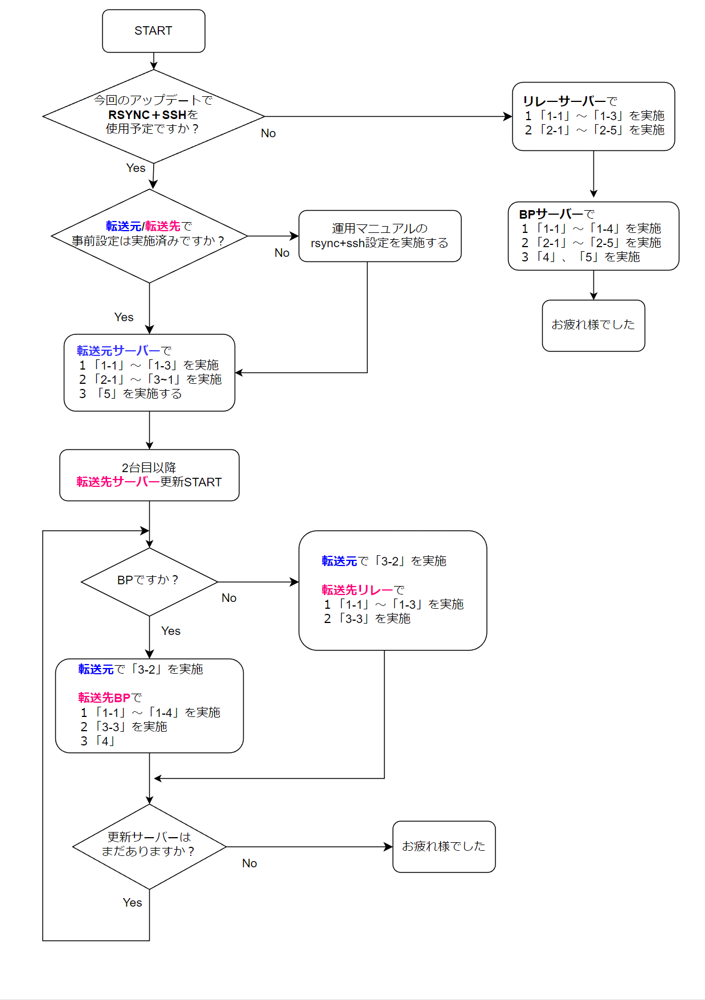

# **ノードアップデートマニュアル**

!!! info "概要"
    このガイドは ノードバージョン8.0.0に対応しています。最終更新日：2023年05月12日

    * ノードバージョンがプロトコルバージョンと一致するよう変更されました
    * 変更点が多数あります。慎重に作業を行ってください
    * 今回のアップデートではDB再構築が発生します。（5時間～8時間以上）


!!! hint "主な変更点と新機能"
    * libsodium更新

    * Conway台帳対応用設定ファイル追加

    * `--mainnet`や`--testnet-magic`を必要とするCLIクエリでは、環境変数に`CARDANO_NODE_NETWORK_ID=mainnet`または`CARDANO_NODE_NETWORK_ID=<number>`を設定することで、ネットワーク指定オプションが不要になりました。  
    > 例) `cardano-cli query tip`


    * 環境変数に`CARDANO_NODE_SOCKET_PATH=`が指定されていない場合、ソケットパスを必要とするCLIクエリでは`--socket-path`が必須となりました。

    * ノードmempoolにあるトランザクションを確認することが可能になりました。
    ```
    cardano-cli query tx-mempool info  #mempool統計情報を表示します。
    cardano-cli query tx-mempool next-tx #次に処理するトランザクションのIDを返します。
    cardano-cli query tx-mempool tx-exists <txid> #トランザクションがmempoolに存在するか確認できます。
    ```

    * `cardano-cli query tip`戻り値情報項目追加  
    `slotInEpoch`(現在のエポックスロット)と`slotsToEpochEnd`(エポック終了までのスロット数)

    * プール登録情報検索コマンド追加 `cardano-cli query pool-state`

    * SPO投票用コマンド追加 `cardano-cli governance poll`

    * P2P設定時、ローカルルートPeerに複数のDNS名を使用した際の接続不具合を解消

    * Peersメトリクス変更  
    1.35.x：`cardano_node_metrics_connectedPeers_int`  
    8.0.x :`cardano_node_metrics_peers_connectedPeers_int`  

!!! error "よくお読みになって進めてください"
    ご自身のアップデートスタイルによって手順が異なります。  
    更新フローチャートとアップデートマニュアルを照らし合わせながら、アップデート作業を進めてください。

### **更新フローチャート**
更新フローチャートは、画像をクリックすると別ウィンドウで開きます。
<a href="../../images/1.35.4-update.png" target=_blank></a>


## **1.依存環境アップデート**

### **1-1. システムアップデート**

システムアップデート
```bash
sudo apt update -y && sudo apt upgrade -y
```

### **1-2. cabal/GHCバージョン確認**

**cabalパス確認**
```
which cabal
```
> /home/user/.ghcup/bin/cabal なら正常

cabalバージョン確認
```
cabal --version
```
> 以下の戻り値ならOK  
cabal-install version 3.6.2.0  
compiled using version 3.6.2.0 of the Cabal library

GHCバージョン確認
```bash
ghc --version
```
> 現在のGHCのバージョンは「8.10.7」  
<font color=red>GHC9はベンチマークテストが終わってないため今ノードバージョンでは非推奨</font>

```
prometheus-node-exporter --version
```
> 戻り値1行目が`node_exporter, version 1.5.0`ならOK

??? example "各アプリのバージョンが異なる場合"

    ??? danger "戻り値が[/home/user/.local/bin/cabal]だった場合(クリックして開く)"
        **戻り値が[/home/user/.local/bin/cabal]だった場合のみ以下を実行**  
        
        パスを追加する
        ```
        echo PATH=$PATH:$HOME/.ghcup/bin >> $HOME/.bashrc
        source $HOME/.bashrc
        ```

        旧cabalリネーム
        ```
        cd $HOME/.local/bin/
        mv cabal cabal_bk
        ```

    ??? danger "cabal 3.6.1.0以下だった場合(クリックして開く)"
        **cabal 3.6.1.0以下だった場合のみ実行**
        **cabalバージョンアップ**
        ```
        ghcup upgrade
        ghcup install cabal 3.6.2.0
        ghcup set cabal 3.6.2.0
        ```

    ??? danger "GHC 8.10.4以下だった場合(クリックして開く)"
        **GHC 8.10.4以下だった場合のみ実行**
        ```bash
        ghcup upgrade
        ghcup install ghc 8.10.7
        ghcup set ghc 8.10.7
        ```
        ```bash
        ghc --version
        ```
        > GHCのバージョンは「8.10.7」であればOK


    ??? danger "node_exporter, version 1.4.1以下だった場合(クリックして開く)"
        prometheus-node-exporterのパスを取得する
        ```bash
        cd $HOME/git
        nodeexPath=`which prometheus-node-exporter`
        ```

        1.5.0をダウンロードする
        ```bash
        wget https://github.com/prometheus/node_exporter/releases/download/v1.5.0/node_exporter-1.5.0.linux-amd64.tar.gz
        ```

        ダウンロードファイルを解凍する
        ```bash
        tar xvf node_exporter-1.5.0.linux-amd64.tar.gz
        ```

        サービスを停止する
        ```bash
        sudo systemctl stop prometheus-node-exporter.service
        ```
        
        バイナリファイルをシステムフォルダへコピーする
        ```bash
        cd node_exporter-1.5.0.linux-amd64
        sudo cp node_exporter $nodeexPath
        ```

        バージョン確認
        
        ```bash
        prometheus-node-exporter --version
        ```
        > 戻り値1行目が`node_exporter, version 1.5.0`ならOK

        サービスをスタートする
        ```bash
        sudo systemctl start prometheus-node-exporter.service
        ```

<!--
### **1-4.Guildスクリプト再取得**
!!! error "注意"
    * リレーとBPでコマンドが異なりますので、タブを切り替えてください。


=== "リレーノード"
    スクリプトをバックアップ
    ```
    cd $NODE_HOME/scripts
    cp gLiveView.sh gLiveView-1.35.4.sh
    cp env env-1.35.4
    ```

    スクリプトをダウンロードする(上書き)
    ```
    wget https://raw.githubusercontent.com/cardano-community/guild-operators/master/scripts/cnode-helper-scripts/gLiveView.sh -O ./gLiveView.sh
    wget https://raw.githubusercontent.com/cardano-community/guild-operators/master/scripts/cnode-helper-scripts/env -O ./env
    ```

    ノードポート番号を確認する。以下のコマンドをすべてコピーして実行してください
    ```
    PORT=`grep "PORT=" $NODE_HOME/startRelayNode1.sh`
    b_PORT=${PORT#"PORT="}
    echo "リレーポートは${b_PORT}です"
    ```
    > リレーのポート番号が表示されることを確認する

    envファイルの修正します。以下のコマンドをすべてコピーして実行してください
    ```
    sed -i $NODE_HOME/scripts/env \
    -e '1,73s!#CNODE_HOME="/opt/cardano/cnode"!CNODE_HOME=${NODE_HOME}!' \
    -e '1,73s!#CNODE_PORT=6000!CNODE_PORT='${b_PORT}'!' \
    -e '1,73s!#UPDATE_CHECK="Y"!UPDATE_CHECK="N"!' \
    -e '1,73s!#CONFIG="${CNODE_HOME}/files/config.json"!CONFIG="${CNODE_HOME}/'${NODE_CONFIG}'-config.json"!' \
    -e '1,73s!#SOCKET="${CNODE_HOME}/sockets/node0.socket"!SOCKET="${CNODE_HOME}/db/socket"!'
    ```
    

=== "ブロックプロデューサーノード"

    **サービスを止める**
    ```
    sudo systemctl stop cnode-cncli-sync.service
    ```

    スクリプトをバックアップ
    ```
    cd $NODE_HOME/scripts
    cp gLiveView.sh gLiveView-1.35.4.sh
    cp env env-1.35.4
    cp cncli.sh cncli-1.35.4.sh
    ```

    スクリプトをダウンロードする(上書き)
    ```
    wget https://raw.githubusercontent.com/cardano-community/guild-operators/master/scripts/cnode-helper-scripts/cncli.sh -q -O ./cncli.sh
    wget https://raw.githubusercontent.com/cardano-community/guild-operators/master/scripts/cnode-helper-scripts/env -q -O ./env
    wget https://raw.githubusercontent.com/cardano-community/guild-operators/master/scripts/cnode-helper-scripts/gLiveView.sh -q -O ./gLiveView.sh
    ```

    ノードポート番号を確認する
    ```
    PORT=`grep "PORT=" $NODE_HOME/startBlockProducingNode.sh`
    b_PORT=${PORT#"PORT="}
    echo "BPポートは${b_PORT}です"
    ```
    > ↑そのまま実行し、BPのポート番号が表示されることを確認する

    envファイルを修正します。以下のコマンドをすべてコピーして実行してください

    ```
    sed -i $NODE_HOME/scripts/env \
    -e '1,73s!#CCLI="${HOME}/.local/bin/cardano-cli"!CCLI="/usr/local/bin/cardano-cli"!' \
    -e '1,73s!#CNCLI="${HOME}/.local/bin/cncli"!CNCLI="${HOME}/.cargo/bin/cncli"!' \
    -e '1,73s!#CNODE_HOME="/opt/cardano/cnode"!CNODE_HOME='${NODE_HOME}'!' \
    -e '1,73s!#CNODE_PORT=6000!CNODE_PORT='${b_PORT}'!' \
    -e '1,73s!#UPDATE_CHECK="Y"!UPDATE_CHECK="N"!' \
    -e '1,73s!#CONFIG="${CNODE_HOME}/files/config.json"!CONFIG="${CNODE_HOME}/'${NODE_CONFIG}'-config.json"!' \
    -e '1,73s!#TOPOLOGY="${CNODE_HOME}/files/topology.json"!TOPOLOGY="${CNODE_HOME}/'${NODE_CONFIG}'-topology.json"!' \
    -e '1,73s!#SOCKET="${CNODE_HOME}/sockets/node0.socket"!SOCKET="${CNODE_HOME}/db/socket"!' \
    -e '1,73s!#BLOCKLOG_TZ="UTC"!BLOCKLOG_TZ="Asia/Tokyo"!' \
    -e '1,73s!#WALLET_PAY_ADDR_FILENAME="payment.addr"!WALLET_PAY_ADDR_FILENAME="payment.addr"!' \
    -e '1,73s!#WALLET_STAKE_ADDR_FILENAME="reward.addr"!WALLET_STAKE_ADDR_FILENAME="stake.addr"!' \
    -e '1,73s!#POOL_HOTKEY_VK_FILENAME="hot.vkey"!POOL_HOTKEY_VK_FILENAME="kes.vkey"!' \
    -e '1,73s!#POOL_HOTKEY_SK_FILENAME="hot.skey"!POOL_HOTKEY_SK_FILENAME="kes.skey"!' \
    -e '1,73s!#POOL_COLDKEY_VK_FILENAME="cold.vkey"!POOL_COLDKEY_VK_FILENAME="node.vkey"!' \
    -e '1,73s!#POOL_COLDKEY_SK_FILENAME="cold.skey"!POOL_COLDKEY_SK_FILENAME="node.skey"!' \
    -e '1,73s!#POOL_OPCERT_COUNTER_FILENAME="cold.counter"!POOL_OPCERT_COUNTER_FILENAME="node.counter"!' \
    -e '1,73s!#POOL_OPCERT_FILENAME="op.cert"!POOL_OPCERT_FILENAME="node.cert"!' \
    -e '1,73s!#POOL_VRF_SK_FILENAME="vrf.skey"!POOL_VRF_SK_FILENAME="vrf.skey"!'
    ```

    プールIDを確認する。以下のコマンドをすべてコピーして実行してください
    ```
    pool_hex=`cat $NODE_HOME/stakepoolid_hex.txt`
    pool_bech32=`cat $NODE_HOME/stakepoolid_bech32.txt`
    printf "\nプールID(hex)は \e[32m${pool_hex}\e[m です\n\n"
    printf "\nプールID(bech32)は \e[32m${pool_bech32}\e[m です\n\n"
    ```

    <strong><font color=red>ご自身のプールID `2種類`が表示されていることを確認してください</font></strong>  
    プールIDが表示されていない場合は、[こちらの手順](../setup/7-register-stakepool.md#4)を実行してください  
    
    <br>
    cncli.shファイルを修正します。以下のコマンドをすべてコピーして実行してください
    ```
    sed -i $NODE_HOME/scripts/cncli.sh \
    -e '1,73s!#POOL_ID=""!POOL_ID="'${pool_hex}'"!' \
    -e '1,73s!#POOL_ID_BECH32=""!POOL_ID_BECH32="'${pool_bech32}'"!' \
    -e '1,73s!#POOL_VRF_SKEY=""!POOL_VRF_SKEY="${CNODE_HOME}/vrf.skey"!' \
    -e '1,73s!#POOL_VRF_VKEY=""!POOL_VRF_VKEY="${CNODE_HOME}/vrf.vkey"!'
    ```
-->

### **1-3.libsodium更新**

```
cd ~/git/libsodium
git fetch --all --prune
git checkout dbb48cc
./autogen.sh
./configure
make
make check
sudo make install
```
> `make`コマンド実行後半に出現する `warning` は無視して大丈夫です。


### **1-4.CNCLIバージョン確認(BPのみ)**

CNCLIバージョン確認
```
cncli --version
```
> 以下の戻り値ならOK  
cncli 5.3.2

??? danger "cncli v5.3.1以下だった場合(クリックして開く)"
    
    **依存関係の追加とアップデート**
    ``` bash
    sudo apt update -y && sudo apt install -y automake build-essential pkg-config libffi-dev libgmp-dev libssl-dev libtinfo-dev libsystemd-dev zlib1g-dev make g++ tmux git jq wget libncursesw5 libtool autoconf musl-tools
    ```

    **CNCLIをアップデートする**

    ```bash
    rustup update
    rustup target add x86_64-unknown-linux-musl
    cd $HOME/git/cncli
    git fetch --all --prune
    git checkout $(curl -s https://api.github.com/repos/cardano-community/cncli/releases/latest | jq -r .tag_name)
    cargo install --path . --force
    ```

    バージョン確認
    ```
    cncli --version
    ```
    > cncli 5.3.2になったことを確認する  


## 2.通常アップデート

### **2-1.ビルド準備**

新しいTMUXセッションを開く

```
tmux new -s build
```
TMUXセッション内(緑帯が表示されてる状態)で  
ソースコードダウンロード(2-2)及びビルド(2-3)を実行します


### **2-2.ソースコードダウンロード**

```bash
cd $HOME/git
rm -rf cardano-node-old/
git clone https://github.com/input-output-hk/cardano-node.git cardano-node2
cd cardano-node2/
```

!!! hint "ヒント"

    * SSH接続が途中で切断されても処理が止まりません。  
    * ビルド中にデタッチ(Ctrl+B D)してバックグラウンド処理へ切り替えられます。

### **2-3.ソースコードからビルド**

```bash
cabal clean
cabal update
```

```
git fetch --all --recurse-submodules --tags
git checkout tags/8.0.0
cabal configure -O0 -w ghc-8.10.7
```
!!! hint "libsodium-vrfフラグについて"
    `cabal.project.local`に追記していた`-external-libsodium-vrf`は、セキュリティ上実稼働ノードでは非推奨となりました。

<!--```bash
echo -e "package cardano-crypto-praos\n flags: -external-libsodium-vrf" > cabal.project.local
```-->

<!--sed -i $HOME/git/cardano-node2/cabal.project -e 's!HSOpenSSL >= 0.11.7.2!HsOpenSSL == 0.11.7.2!'-->

```bash
cabal build cardano-node cardano-cli
```

ビルド完了までに数十分ほどかかります。  

**バージョン確認**

```bash
$(find $HOME/git/cardano-node2/dist-newstyle/build -type f -name "cardano-cli") version  
$(find $HOME/git/cardano-node2/dist-newstyle/build -type f -name "cardano-node") version  
```
以下の戻り値を確認する  
>cardano-cli 8.0.0 - linux-x86_64 - ghc-8.10  
git rev 69a117b7be3db0f4ce6d9fc5cd4c16a2a409dcb8 

>cardano-node 8.0.0 - linux-x86_64 - ghc-8.10  
git rev 69a117b7be3db0f4ce6d9fc5cd4c16a2a409dcb8  

**ビルド用TMUXセッションを終了する** 
```
exit
```

**ノードをストップする** 
```
sudo systemctl stop cardano-node
```

**バイナリーファイルをシステムフォルダーへコピーする**

```bash
sudo cp $(find $HOME/git/cardano-node2/dist-newstyle/build -type f -name "cardano-cli") /usr/local/bin/cardano-cli
```

```bash
sudo cp $(find $HOME/git/cardano-node2/dist-newstyle/build -type f -name "cardano-node") /usr/local/bin/cardano-node
```

**システムに反映されたノードバージョンを確認する**

```bash
cardano-cli version
cardano-node version
```

以下の戻り値を確認する  
>cardano-cli 8.0.0 - linux-x86_64 - ghc-8.10  
git rev 69a117b7be3db0f4ce6d9fc5cd4c16a2a409dcb8 

>cardano-node 8.0.0 - linux-x86_64 - ghc-8.10  
git rev 69a117b7be3db0f4ce6d9fc5cd4c16a2a409dcb8  

**設定ファイルの追加と更新**
```
cd $NODE_HOME
wget --no-use-server-timestamps -q https://book.world.dev.cardano.org/environments/${NODE_CONFIG}/conway-genesis.json -O ${NODE_CONFIG}-conway-genesis.json
wget --no-use-server-timestamps -q https://book.world.dev.cardano.org/environments/${NODE_CONFIG}/config.json -O ${NODE_CONFIG}-config.json
```

設定ファイルを書き換える

=== "非P2Pの場合"
    ```bash
    sed -i ${NODE_CONFIG}-config.json \
        -e 's!"AlonzoGenesisFile": "alonzo-genesis.json"!"AlonzoGenesisFile": "'${NODE_CONFIG}'-alonzo-genesis.json"!' \
        -e 's!"ByronGenesisFile": "byron-genesis.json"!"ByronGenesisFile": "'${NODE_CONFIG}'-byron-genesis.json"!' \
        -e 's!"ShelleyGenesisFile": "shelley-genesis.json"!"ShelleyGenesisFile": "'${NODE_CONFIG}'-shelley-genesis.json"!' \
        -e 's!"ConwayGenesisFile": "conway-genesis.json"!"ConwayGenesisFile": "'${NODE_CONFIG}'-conway-genesis.json"!' \
        -e "s/TraceMempool\": true/TraceMempool\": false/g" \
        -e 's!"TraceBlockFetchDecisions": false!"TraceBlockFetchDecisions": true!' \
        -e '/"defaultScribes": \[/a\    \[\n      "FileSK",\n      "logs/node.json"\n    \],' \
        -e '/"setupScribes": \[/a\    \{\n      "scFormat": "ScJson",\n      "scKind": "FileSK",\n      "scName": "logs/node.json"\n    \},' \
        -e "s/127.0.0.1/0.0.0.0/g"
    ```
=== "P2Pの場合"
    ```bash
    sed -i ${NODE_CONFIG}-config.json \
        -e '2i \  "EnableP2P": true,' \
        -e 's!"AlonzoGenesisFile": "alonzo-genesis.json"!"AlonzoGenesisFile": "'${NODE_CONFIG}'-alonzo-genesis.json"!' \
        -e 's!"ByronGenesisFile": "byron-genesis.json"!"ByronGenesisFile": "'${NODE_CONFIG}'-byron-genesis.json"!' \
        -e 's!"ShelleyGenesisFile": "shelley-genesis.json"!"ShelleyGenesisFile": "'${NODE_CONFIG}'-shelley-genesis.json"!' \
        -e 's!"ConwayGenesisFile": "conway-genesis.json"!"ConwayGenesisFile": "'${NODE_CONFIG}'-conway-genesis.json"!' \
        -e "s/TraceMempool\": true/TraceMempool\": false/g" \
        -e 's!"TraceBlockFetchDecisions": false!"TraceBlockFetchDecisions": true!' \
        -e '/"defaultScribes": \[/a\    \[\n      "FileSK",\n      "logs/node.json"\n    \],' \
        -e '/"setupScribes": \[/a\    \{\n      "scFormat": "ScJson",\n      "scKind": "FileSK",\n      "scName": "logs/node.json"\n    \},' \
        -e "s/127.0.0.1/0.0.0.0/g"
    ```

??? テストネットの場合はこちら
    === "非P2Pの場合"
        ```bash
        sed -i ${NODE_CONFIG}-config.json \
            -e 's!"EnableP2P": true!"EnableP2P": false!' \
            -e 's!"AlonzoGenesisFile": "alonzo-genesis.json"!"AlonzoGenesisFile": "'${NODE_CONFIG}'-alonzo-genesis.json"!' \
            -e 's!"ByronGenesisFile": "byron-genesis.json"!"ByronGenesisFile": "'${NODE_CONFIG}'-byron-genesis.json"!' \
            -e 's!"ShelleyGenesisFile": "shelley-genesis.json"!"ShelleyGenesisFile": "'${NODE_CONFIG}'-shelley-genesis.json"!' \
            -e 's!"ConwayGenesisFile": "conway-genesis.json"!"ConwayGenesisFile": "'${NODE_CONFIG}'-conway-genesis.json"!' \
            -e "s/TraceMempool\": true/TraceMempool\": false/g" \
            -e 's!"TraceBlockFetchDecisions": false!"TraceBlockFetchDecisions": true!' \
            -e '/"defaultScribes": \[/a\    \[\n      "FileSK",\n      "logs/node.json"\n    \],' \
            -e '/"setupScribes": \[/a\    \{\n      "scFormat": "ScJson",\n      "scKind": "FileSK",\n      "scName": "logs/node.json"\n    \},' \
            -e "s/127.0.0.1/0.0.0.0/g"
        ```
    === "P2Pの場合"
        ```bash
        sed -i ${NODE_CONFIG}-config.json \
            -e 's!"AlonzoGenesisFile": "alonzo-genesis.json"!"AlonzoGenesisFile": "'${NODE_CONFIG}'-alonzo-genesis.json"!' \
            -e 's!"ByronGenesisFile": "byron-genesis.json"!"ByronGenesisFile": "'${NODE_CONFIG}'-byron-genesis.json"!' \
            -e 's!"ShelleyGenesisFile": "shelley-genesis.json"!"ShelleyGenesisFile": "'${NODE_CONFIG}'-shelley-genesis.json"!' \
            -e 's!"ConwayGenesisFile": "conway-genesis.json"!"ConwayGenesisFile": "'${NODE_CONFIG}'-conway-genesis.json"!' \
            -e "s/TraceMempool\": true/TraceMempool\": false/g" \
            -e 's!"TraceBlockFetchDecisions": false!"TraceBlockFetchDecisions": true!' \
            -e '/"defaultScribes": \[/a\    \[\n      "FileSK",\n      "logs/node.json"\n    \],' \
            -e '/"setupScribes": \[/a\    \{\n      "scFormat": "ScJson",\n      "scKind": "FileSK",\n      "scName": "logs/node.json"\n    \},' \
            -e "s/127.0.0.1/0.0.0.0/g"
        ```

**環境変数を追加する**
```
echo export CARDANO_NODE_NETWORK_ID=mainnet >> $HOME/.bashrc
```
??? テストネットの場合はこちら
    === "Preview(テストネット)"
        ```
        echo export CARDANO_NODE_NETWORK_ID=2 >> $HOME/.bashrc
        ```
    === "PreProd(テストネット)"
        ```
        echo export CARDANO_NODE_NETWORK_ID=1 >> $HOME/.bashrc
        ```

**環境変数再読み込み**
```
source $HOME/.bashrc
```

### **2-4.サーバー再起動**

サーバーを再起動する
```bash
sudo reboot
```

SSH接続してDB再構築進捗を確認する
```
journalctl --unit=cardano-node --follow
```
> `Progress:`が100%になるまで5時間～8時間以上かかる場合があります。


### **2-5.作業フォルダリネーム**
前バージョンで使用していたバイナリフォルダをリネームし、バックアップとして保持します。最新バージョンを構築したフォルダをcardano-nodeとして使用します。

```bash
cd $HOME/git
mv cardano-node/ cardano-node-old/
mv cardano-node2/ cardano-node/
```

!!! info "ダイナミックP2Pの設定について"
    1.35.6以降からシングルリレーでP2Pモードの使用が許可されています。リレーを複数お持ちの方は1つのリレーをP2Pモードに設定できます。設定手順は[こちらのマニュアル](./p2p-settings.md)をご参照下さい。

## 3.RSYNC+SSHアップデート


!!! note "概要"
    ■メリット

    * **複数台のサーバーがある場合に、以下の処理を行うことでビルド時間の短縮やノードのダウンタイムを抑えることが出来ます。**

    ■デメリット

    * DBフォルダ転送を行う場合に転送元・転送先サーバーのディスク空き容量が200GB以上必要となります。

    ■事前準備

    * RSYNCを使用する場合、最初に[事前設定](./rsync-ssh.md)を行ってください
    * 転送元サーバーで [2.通常アップデート](./node-update.md#2)を実施してください
    * 転送先サーバーで [1.依存環境アップデート](./node-update.md#1)を実施してください

    ■転送内容を選べます

    * バイナリのみ・・・cardano-node / cardano-cliのみを転送します
    * バイナリ+DB・・・cardano-node / cardano-cli / 圧縮DBフォルダを転送します


### 3-1.転送元サーバー作業

=== "バイナリのみ"

    !!! Success "確認"
        こちらの手順はcardano-node / cardano-cliのみを転送します

    !!! Warning "確認"
        この作業は1回で大丈夫です。

    === "転送元サーバー"
        **バイナリーファイルを転送フォルダ用にコピーする**
        ```
        mkdir $NODE_HOME/Transfer
        cp $(find $HOME/git/cardano-node/dist-newstyle/build -type f -name "cardano-cli") $NODE_HOME/Transfer/cardano-cli
        cp $(find $HOME/git/cardano-node/dist-newstyle/build -type f -name "cardano-node") $NODE_HOME/Transfer/cardano-node
        ```

        バージョン確認
        ```
        $NODE_HOME/Transfer/cardano-cli version
        $NODE_HOME/Transfer/cardano-node version
        ```
        以下の戻り値を確認する  
        >cardano-cli 8.0.0 - linux-x86_64 - ghc-8.10  
        git rev 69a117b7be3db0f4ce6d9fc5cd4c16a2a409dcb8 

        >cardano-node 8.0.0 - linux-x86_64 - ghc-8.10  
        git rev 69a117b7be3db0f4ce6d9fc5cd4c16a2a409dcb8   


=== "バイナリ+DB"

    !!! Success "確認"
        cardano-node / cardano-cli / 圧縮DBフォルダを転送します

    容量確認
    **転送元・転送先サーバー両方で確認してください**
    ```
    df -h /usr
    ```
    <strong><font color=red>Availが200GB以上あることを確認してください。</font></strong>

    !!! hint "確認"
        この作業は1回で大丈夫です。

    === "転送元サーバー"
        **バイナリーファイルを転送フォルダ用にコピーする**
        ```
        mkdir $NODE_HOME/Transfer
        cp $(find $HOME/git/cardano-node/dist-newstyle/build -type f -name "cardano-cli") $NODE_HOME/Transfer/cardano-cli
        cp $(find $HOME/git/cardano-node/dist-newstyle/build -type f -name "cardano-node") $NODE_HOME/Transfer/cardano-node
        ```

        バージョン確認
        ```
        $NODE_HOME/Transfer/cardano-cli version
        $NODE_HOME/Transfer/cardano-node version
        ```
        以下の戻り値を確認する  
        >cardano-cli 8.0.0 - linux-x86_64 - ghc-8.10  
        git rev 69a117b7be3db0f4ce6d9fc5cd4c16a2a409dcb8 

        >cardano-node 8.0.0 - linux-x86_64 - ghc-8.10  
        git rev 69a117b7be3db0f4ce6d9fc5cd4c16a2a409dcb8   


        **ノードを停止する**
        ```
        sudo systemctl stop cardano-node
        ```

        **DBフォルダを圧縮する**

        新しいTMUXセッションを開く
        ```
        tmux new -s tar
        ```
        圧縮する
        ```
        tar cvzf $NODE_HOME/Transfer/8.0.0-db.tar.gz -C $NODE_HOME db
        ```

        圧縮が終了したらTMUXを閉じる
        ```
        exit
        ```

        **ノードをスタートする**
        ```
        sudo systemctl start cardano-node
        ```
        
    

### 3-2.転送元から転送先へ転送

=== "バイナリのみ"

    === "転送元サーバー"
        
        設定済みの転送先エイリアスを調べる
        ```
        cat ~/.ssh/config
        ```

        転送先エイリアスを指定する
        変数`for`に転送先エイリアスを代入する
        ```
        for=xxxx
        ```
        > 転送先エイリアスは、事前設定の [1-2.SSH設定ファイル作成](./rsync-ssh.md#1-2ssh) で設定した転送先Host名(エイリアス)を指定します。

        バイナリファイルを転送する
        ```
        rsync -P --rsh=ssh $NODE_HOME/Transfer/cardano-cli $for::Server/cardano-cli
        ```
        > 転送が完了するまで待つ

        ```
        rsync -P --rsh=ssh $NODE_HOME/Transfer/cardano-node $for::Server/cardano-node
        ```
        > 転送が完了するまで待つ


=== "バイナリ+DB"

    === "転送元サーバー"
        
        新しいTMUXセッションを開く
        ```
        tmux new -s rsync
        ```
        
        設定済みの転送先エイリアスを調べる
        ```
        cat ~/.ssh/config
        ```

        転送先エイリアスを指定する
        変数`for`に転送先エイリアスを代入する
        ```
        for=xxxx
        ```
        > 転送先エイリアスは、事前設定の [1-2.SSH設定ファイル作成](./rsync-ssh.md#1-2ssh) で設定した転送先Host名(エイリアス)を指定します。

        バイナリファイルを転送する
        ```
        rsync -P --rsh=ssh $NODE_HOME/Transfer/cardano-cli $for::Server/cardano-cli
        ```
        > 転送が完了するまで待つ

        ```
        rsync -P --rsh=ssh $NODE_HOME/Transfer/cardano-node $for::Server/cardano-node
        ```
        > 転送が完了するまで待つ

        圧縮ファイルを転送する
        ```
        rsync -P --rsh=ssh $NODE_HOME/Transfer/8.0.0-db.tar.gz $for::Server/8.0.0-db.tar.gz
        ```
        > 転送が完了するまで待つ

### 3-3.転送先サーバー作業

=== "バイナリのみ"
    
    ノードを停止する
    ```
    sudo systemctl stop cardano-node
    ```

    バイナリーファイルをシステムフォルダーへコピーする
    ```
    sudo cp $NODE_HOME/cardano-cli /usr/local/bin/cardano-cli
    ```
    ```
    sudo cp $NODE_HOME/cardano-node /usr/local/bin/cardano-node
    ```
    バージョン確認
    ```
    cardano-cli version
    cardano-node version
    ```
    以下の戻り値を確認する  
    >cardano-cli 8.0.0 - linux-x86_64 - ghc-8.10  
    git rev 69a117b7be3db0f4ce6d9fc5cd4c16a2a409dcb8 

    >cardano-node 8.0.0 - linux-x86_64 - ghc-8.10  
    git rev 69a117b7be3db0f4ce6d9fc5cd4c16a2a409dcb8   

=== "バイナリ+DB"

    新しいTMUXセッションを開く
    ```
    tmux new -s tar
    ```

    SSDの空き容量を再確認する
    ```
    df -h /usr
    ```
    <strong><font color=red>Availが140GB以上あることを確認してください。</font></strong>
    
    
    DBを解凍する
    ```
    mkdir $NODE_HOME/temp
    tar -xzvf $NODE_HOME/8.0.0-db.tar.gz -C $NODE_HOME/temp/
    ```
    
    
    解凍が終わったらTMUXを閉じる
    ```
    exit
    ```
    

    ノードを停止する
    ```
    sudo systemctl stop cardano-node
    ```

    バイナリーファイルをシステムフォルダーへコピーする
    ```
    sudo cp $NODE_HOME/cardano-cli /usr/local/bin/cardano-cli
    ```
    ```
    sudo cp $NODE_HOME/cardano-node /usr/local/bin/cardano-node
    ```
    バージョン確認
    ```
    cardano-cli version
    cardano-node version
    ```
    以下の戻り値を確認する  
    >cardano-cli 8.0.0 - linux-x86_64 - ghc-8.10  
    git rev 69a117b7be3db0f4ce6d9fc5cd4c16a2a409dcb8 

    >cardano-node 8.0.0 - linux-x86_64 - ghc-8.10  
    git rev 69a117b7be3db0f4ce6d9fc5cd4c16a2a409dcb8   

    
    DBフォルダを入れ替える
    ```
    mv $NODE_HOME/db $NODE_HOME/db_135
    mv $NODE_HOME/temp/db $NODE_HOME/db
    ```

**設定ファイル追加と更新**
```
cd $NODE_HOME
wget --no-use-server-timestamps -q https://book.world.dev.cardano.org/environments/${NODE_CONFIG}/conway-genesis.json -O ${NODE_CONFIG}-conway-genesis.json
wget --no-use-server-timestamps -q https://book.world.dev.cardano.org/environments/${NODE_CONFIG}/config.json -O ${NODE_CONFIG}-config.json
```

設定ファイルを書き換える

=== "非P2Pの場合"
    ```bash
    sed -i ${NODE_CONFIG}-config.json \
        -e 's!"AlonzoGenesisFile": "alonzo-genesis.json"!"AlonzoGenesisFile": "'${NODE_CONFIG}'-alonzo-genesis.json"!' \
        -e 's!"ByronGenesisFile": "byron-genesis.json"!"ByronGenesisFile": "'${NODE_CONFIG}'-byron-genesis.json"!' \
        -e 's!"ShelleyGenesisFile": "shelley-genesis.json"!"ShelleyGenesisFile": "'${NODE_CONFIG}'-shelley-genesis.json"!' \
        -e 's!"ConwayGenesisFile": "conway-genesis.json"!"ConwayGenesisFile": "'${NODE_CONFIG}'-conway-genesis.json"!' \
        -e "s/TraceMempool\": true/TraceMempool\": false/g" \
        -e 's!"TraceBlockFetchDecisions": false!"TraceBlockFetchDecisions": true!' \
        -e '/"defaultScribes": \[/a\    \[\n      "FileSK",\n      "logs/node.json"\n    \],' \
        -e '/"setupScribes": \[/a\    \{\n      "scFormat": "ScJson",\n      "scKind": "FileSK",\n      "scName": "logs/node.json"\n    \},' \
        -e "s/127.0.0.1/0.0.0.0/g"
    ```
=== "P2Pの場合"
    ```bash
    sed -i ${NODE_CONFIG}-config.json \
        -e '2i \  "EnableP2P": true,' \
        -e 's!"AlonzoGenesisFile": "alonzo-genesis.json"!"AlonzoGenesisFile": "'${NODE_CONFIG}'-alonzo-genesis.json"!' \
        -e 's!"ByronGenesisFile": "byron-genesis.json"!"ByronGenesisFile": "'${NODE_CONFIG}'-byron-genesis.json"!' \
        -e 's!"ShelleyGenesisFile": "shelley-genesis.json"!"ShelleyGenesisFile": "'${NODE_CONFIG}'-shelley-genesis.json"!' \
        -e 's!"ConwayGenesisFile": "conway-genesis.json"!"ConwayGenesisFile": "'${NODE_CONFIG}'-conway-genesis.json"!' \
        -e "s/TraceMempool\": true/TraceMempool\": false/g" \
        -e 's!"TraceBlockFetchDecisions": false!"TraceBlockFetchDecisions": true!' \
        -e '/"defaultScribes": \[/a\    \[\n      "FileSK",\n      "logs/node.json"\n    \],' \
        -e '/"setupScribes": \[/a\    \{\n      "scFormat": "ScJson",\n      "scKind": "FileSK",\n      "scName": "logs/node.json"\n    \},' \
        -e "s/127.0.0.1/0.0.0.0/g"
    ```

??? テストネットの場合はこちら
    === "非P2Pの場合"
        ```bash
        sed -i ${NODE_CONFIG}-config.json \
            -e 's!"EnableP2P": true!"EnableP2P": false!' \
            -e 's!"AlonzoGenesisFile": "alonzo-genesis.json"!"AlonzoGenesisFile": "'${NODE_CONFIG}'-alonzo-genesis.json"!' \
            -e 's!"ByronGenesisFile": "byron-genesis.json"!"ByronGenesisFile": "'${NODE_CONFIG}'-byron-genesis.json"!' \
            -e 's!"ShelleyGenesisFile": "shelley-genesis.json"!"ShelleyGenesisFile": "'${NODE_CONFIG}'-shelley-genesis.json"!' \
            -e 's!"ConwayGenesisFile": "conway-genesis.json"!"ConwayGenesisFile": "'${NODE_CONFIG}'-conway-genesis.json"!' \
            -e "s/TraceMempool\": true/TraceMempool\": false/g" \
            -e 's!"TraceBlockFetchDecisions": false!"TraceBlockFetchDecisions": true!' \
            -e '/"defaultScribes": \[/a\    \[\n      "FileSK",\n      "logs/node.json"\n    \],' \
            -e '/"setupScribes": \[/a\    \{\n      "scFormat": "ScJson",\n      "scKind": "FileSK",\n      "scName": "logs/node.json"\n    \},' \
            -e "s/127.0.0.1/0.0.0.0/g"
        ```
    === "P2Pの場合"
        ```bash
        sed -i ${NODE_CONFIG}-config.json \
            -e 's!"AlonzoGenesisFile": "alonzo-genesis.json"!"AlonzoGenesisFile": "'${NODE_CONFIG}'-alonzo-genesis.json"!' \
            -e 's!"ByronGenesisFile": "byron-genesis.json"!"ByronGenesisFile": "'${NODE_CONFIG}'-byron-genesis.json"!' \
            -e 's!"ShelleyGenesisFile": "shelley-genesis.json"!"ShelleyGenesisFile": "'${NODE_CONFIG}'-shelley-genesis.json"!' \
            -e 's!"ConwayGenesisFile": "conway-genesis.json"!"ConwayGenesisFile": "'${NODE_CONFIG}'-conway-genesis.json"!' \
            -e "s/TraceMempool\": true/TraceMempool\": false/g" \
            -e 's!"TraceBlockFetchDecisions": false!"TraceBlockFetchDecisions": true!' \
            -e '/"defaultScribes": \[/a\    \[\n      "FileSK",\n      "logs/node.json"\n    \],' \
            -e '/"setupScribes": \[/a\    \{\n      "scFormat": "ScJson",\n      "scKind": "FileSK",\n      "scName": "logs/node.json"\n    \},' \
            -e "s/127.0.0.1/0.0.0.0/g"
        ```

**環境変数を追加する**
```
echo export CARDANO_NODE_NETWORK_ID=mainnet >> $HOME/.bashrc
```
??? テストネットの場合はこちら
    === "Preview(テストネット)"
        ```
        echo export CARDANO_NODE_NETWORK_ID=2 >> $HOME/.bashrc
        ```
    === "PreProd(テストネット)"
        ```
        echo export CARDANO_NODE_NETWORK_ID=1 >> $HOME/.bashrc
        ```

**環境変数再読み込み**
```
source $HOME/.bashrc
```

サーバーを再起動する
```bash
sudo reboot
```

SSH接続してノード同期状況を確認する
```
journalctl --unit=cardano-node --follow
```
> `Progress:`が100%になるまで待ちます。


バイナリーファイルを移動する
```
cd $HOME/git
rm -rf cardano-node-old/
mv $HOME/git/cardano-node/ $HOME/git/cardano-node-old/
mkdir cardano-node
mv $NODE_HOME/cardano-cli $HOME/git/cardano-node/
mv $NODE_HOME/cardano-node $HOME/git/cardano-node/
```


!!! hint "旧DB削除の確認"
    ＜バイナリ+DBで転送した場合のみ＞
    ノードの同期が成功しブロック生成に成功し数エポック様子を見たあと、転送用ファイル・バックアップDBを削除してください
    === "転送元"
        ```
        rm -rf $NODE_HOME/Transfer
        ```
    === "転送先"
        ```
        rm -rf $NODE_HOME/db_135
        rm $NODE_HOME/8.0.0-db.tar.gz
        ```


<!--

以下のコードを実行して、ユニットファイルを作成します。



```bash
cat > $NODE_HOME/cardano-node.service << EOF 
# The Cardano node service (part of systemd)
# file: /etc/systemd/system/cardano-node.service 

[Unit]
Description     = Cardano node service
Wants           = network-online.target
After           = network-online.target 

[Service]
User            = ${USER}
Type            = simple
WorkingDirectory= ${NODE_HOME}
ExecStart       = /bin/bash -c '${NODE_HOME}/startRelayNode1.sh'
KillSignal=SIGINT
RestartKillSignal=SIGINT
TimeoutStopSec=300
LimitNOFILE=32768
Restart=always
RestartSec=5
SyslogIdentifier=cardano-node

[Install]
WantedBy	= multi-user.target
EOF
```



```bash
cat > $NODE_HOME/cardano-node.service << EOF 
# The Cardano node service (part of systemd)
# file: /etc/systemd/system/cardano-node.service 

[Unit]
Description     = Cardano node service
Wants           = network-online.target
After           = network-online.target 

[Service]
User            = ${USER}
Type            = simple
WorkingDirectory= ${NODE_HOME}
ExecStart       = /bin/bash -c '${NODE_HOME}/startBlockProducingNode.sh'
KillSignal=SIGINT
RestartKillSignal=SIGINT
TimeoutStopSec=300
LimitNOFILE=32768
Restart=always
RestartSec=5
SyslogIdentifier=cardano-node

[Install]
WantedBy	= multi-user.target
EOF
```




## 1-9.Serviceファイルをシステムフォルダにコピーする
```
sudo cp $NODE_HOME/cardano-node.service /etc/systemd/system/cardano-node.service
```

## 1-10.systemctlデーモンを再起動する
```
sudo systemctl daemon-reload
```
-->

## **4. サービス起動確認(BPのみ)**

BPノードが完全に同期した後、サービス起動状態を確認する
```bash
tmux ls
```

!!! info "ヒント"
    ノードを再起動してから、約20秒後に5プログラムがバックグラウンドで起動中であればOKです  

    * cncli  
    * leaderlog  
    * validate  
    * logmonitor  
    * blockcheck(ブロック生成ステータス通知を導入している場合)

```
tmux a -t cncli
```
>「100.00% synced」になるまで待ちます。
100%になったら、Ctrl+bを押した後に d を押し元の画面に戻ります
(バックグラウンド実行に切り替え)


## 5. エアギャップアップデート
!!! hint "SFTP機能ソフト導入"
    ファイル転送に便利な[SFTP機能ソフトの導入手順はこちら](./sftp.md)

### **5-1.バイナリファイルコピー**

=== "1.RSYNC+SSHでアップデートを行った場合"

    === "転送元サーバー"
        SFTP機能ソフト(Filezillaなど)で転送元サーバーに接続し以下をダウンロードする 
        
        * /home/usr/cnode/Transfer/cardano-cli
        
        をローカルパソコンにダウンロードします  
        (エアギャップUbuntuとの共有フォルダ)

=== "2.通常アップデートのみで行った場合"

    2.通常アップデートを終えたBPかリレーサーバーで以下を実行する

    ```bash
    sudo cp $(find $HOME/git/cardano-node/dist-newstyle/build -type f -name "cardano-cli") ~/cardano-cli
    ```

    SFTP機能ソフト(Filezillaなど)で転送元サーバーに接続し、以下をダウンロードする 
    
    * /home/usr/cardano-cli
    
    をローカルパソコンにダウンロードします  
    (エアギャップUbuntuとの共有フォルダ)

!!! hint "ヒント"
    R-loginの転送機能が遅いので、大容量ファイルをダウン・アップロードする場合は、SFTP接続可能なソフトを使用すると効率的です。（FileZilaなど）

<BR>
** ２．エアギャップマシンにファイルを入れる**  
=== "エアギャップ"

    * $HOME/git/cardano-node2/ に`cardano-cli`を入れる   
      <font color=red>(cardano-node2が無ければ作成する)</font>


### **5-2.インストール**

エアギャップマシンで以下を実行する
=== "エアギャップ"
    cardano-cliをシステムフォルダへコピーする
    ```bash
    sudo cp $(find $HOME/git/cardano-node2 -type f -name "cardano-cli") /usr/local/bin/cardano-cli
    ```
    <!--
    `make`がインストールされていることを確認する
    -->
    <!--
    ```
    apt list make
    ```
    以下の戻り値を確認する
    -->
    <!--
    make/focal,now 4.2.1-1.2 amd64 [インストール済み]  
    make/focal 4.2.1-1.2 i386
    -->
    <!--
    secp256k1をインストールする
    ```
    cd $HOME/git/secp256k1/
    chmod +x autogen.sh
    ./autogen.sh
    ./configure --prefix=/usr --enable-module-schnorrsig --enable-experimental
    make
    make check
    ```
    -->
    <!--
    インストールコマンドを実行する
    ```
    sudo make install
    ```
    -->
    <!--
    環境変数を設定する
    ```
    echo export PKG_CONFIG_PATH="/usr/local/lib/pkgconfig:$PKG_CONFIG_PATH" >> $HOME/.bashrc
    echo export NODE_NETWORK="--mainnet" >> $HOME/.bashrc
    source $HOME/.bashrc
    ```
    -->

    **環境変数を追加する**
    ```
    echo export CARDANO_NODE_NETWORK_ID=mainnet >> $HOME/.bashrc
    ```
    ??? テストネットの場合はこちら
        === "Preview(テストネット)"
            ```
            echo export CARDANO_NODE_NETWORK_ID=2 >> $HOME/.bashrc
            ```
        === "PreProd(テストネット)"
            ```
            echo export CARDANO_NODE_NETWORK_ID=1 >> $HOME/.bashrc
            ```

    **環境変数再読み込み**
    ```
    source $HOME/.bashrc
    ```

### **5-3.バージョン確認**

```bash
cardano-cli version
```

以下の戻り値を確認する   
>cardano-cli 8.0.0 - linux-x86_64 - ghc-8.10  
git rev 69a117b7be3db0f4ce6d9fc5cd4c16a2a409dcb8 


!!! denger "確認"
    エアギャップではcardano-nodeは使用しないため転送してもしなくてもOKです。


## 6.Grafanaダッシュボード修正

ピアパネルのMetricsを修正する

`ピア`パネルのメニューからEditを開き、`metrics browser`欄を以下の文字に置き換える
```
cardano_node_metrics_peers_connectedPeers_int
```

アラート修正

１．ダッシュボード左メニュー→「Alerting」→「Alert rules」→「ノード監視」の中にある「BPリレー接続監視」をEdit(ペンマーク)で開く  
２．`Metrics browser`を以下の文に置き換える
```
cardano_node_metrics_peers_connectedPeers_int{alias="block-producing-node"}
```

<!--
## **4.新メトリクスについて**

v1.31.0からブロックチェーンの状態をより可視化したメトリクスが追加されています。
Grafanaに新規パネルを追加することで確認することができます。

現時点では、このメトリクスをもってプールの性能が図れるわけではないですが、現状を把握する指標としてお使いいただけます。

```
■ブロックの伝搬について
1秒、3秒、5秒以内にブロックをダウンロードできたおおよその推定値
95%のブロックを3秒以内にダウンロードしていれば、よく稼働しているノード指標となります。
95%のブロックを5秒以内にダウンロードすることは、ウロボロスPraosのセキュリティ上の最低ラインとなります。
※ノードを再起動すると初期化されますので適正値になるまで時間がかかります。
cardano_node_metrics_blockfetchclient_blockdelay_cdfOne (1秒以内に伝播)
cardano_node_metrics_blockfetchclient_blockdelay_cdfThree (3秒以内に伝播)
cardano_node_metrics_blockfetchclient_blockdelay_cdfFive (5秒以内に伝播)
Panel Stat 
#Grafana Field Unit (Percent(0.0-1.0))

■ブロック受信までの時間
ブロックがミントされるべきだったときから、ローカルのリレーがブロックを受信するまでの遅延を推定した時間
この指標には、コンセンサス/元帳がそのブロックを採用するまでの時間は含まれていません（採用されない可能性もあります）。
cardano_node_metrics_blockfetchclient_blockdelay_s
#Grafana
Panel Stat 
Field Unit (none)


■ブロックサイズの確認
あるスロットのブロックを最初にダウンロードしたときのブロックサイズです。
cardano_node_metrics_blockfetchclient_blocksize
#Grafana
Panel Graph
Field Unit (Bytes(IEC))

■5秒以上後に到着したブロックの追跡
ミントされたはずのブロックが5秒以上後に到着したブロックを追跡します。
cardano_node_metrics_blockfetchclient_lateblocks
#Grafana
Panel Stat 
Field Unit (none)


■リレーノードの有用性判定
人気のないノードには0に近い値が与えられます。そして、非常に有用なノードには1以上の値が与えられます。
値が0の場合、誰もあなたのリレーからブロックを取得していないことを意味します。
1の値は、新しいブロックが作成されるたびに、誰かがそれを取得していることを意味します。
2以上の値は、ミントされたブロックごとに、2つのノードがあなたからそのブロックをフェッチしていることを意味します。
cardano.node.metrics.served.block.latest.count
#計算式
rate(cardano_node_metrics_served_block_latest_count_int[1h])/rate(cardano_node_metrics_blockNum_int[1h])
#Grafana
Panel Graph
Field Unit (none)

■チェーン上のフォーク数をカウント
ノードがスタートしてからのフォーク数。ブロック伝播遅延の影響で2秒前後のスロット間のスケジュールで発生
cardano_node_metrics_forks_int
#Grafana
Panel Graph
Field Unit (none)
```


# 5 ブロックログアップデート暫定調整

## BPの対応
GliveView、ブロックログのCNTOOL系モジュールの仕様変更に伴うアップデート作業です。

```
cd $NODE_HOME/scripts
wget https://raw.githubusercontent.com/cardano-community/guild-operators/master/scripts/cnode-helper-scripts/env -O env
```
```
sed -i $NODE_HOME/scripts/env \
    -e '1,73s!#CCLI="${HOME}/.cabal/bin/cardano-cli"!CCLI="/usr/local/bin/cardano-cli"!' \
    -e '1,73s!#CNODE_HOME="/opt/cardano/cnode"!CNODE_HOME='${NODE_HOME}'!' \
    -e '1,73s!#CNODE_PORT=6000!CNODE_PORT=6000!' \
    -e '1,73s!#CONFIG="${CNODE_HOME}/files/config.json"!CONFIG="${CNODE_HOME}/mainnet-config.json"!' \
    -e '1,73s!#SOCKET="${CNODE_HOME}/sockets/node0.socket"!SOCKET="${CNODE_HOME}/db/socket"!' \
    -e '1,73s!#SOCKET="#LOG_DIR="${CNODE_HOME}/logs"!LOG_DIR="${CNODE_HOME}/logs"!' \
    -e '1,73s!#UPDATE_CHECK="Y"!UPDATE_CHECK="N"!' \
    -e '1,73s!#BLOCKLOG_DIR="${CNODE_HOME}/guild-db/blocklog"!BLOCKLOG_DIR="${CNODE_HOME}/guild-db/blocklog"!' \
    -e '1,73s!#BLOCKLOG_TZ="UTC"!BLOCKLOG_TZ="Asia/Tokyo"!'
```
>BPのポート番号を変更している場合は6000を変更してください。

```
./gLiveView.sh
```
> Script update(s) detected, do you want to download the latest version? (yes/no): ***_no_***


> A new version of Guild LiveView is available  
> Installed Version : v1.22.4  
> Available Version : v1.24.0  
> Do you want to upgrade to the latest version of Guild LiveView? (yes/no):***_yes_***  

>Enter

```
./gLiveView.sh
```
> Script update(s) detected, do you want to download the latest version? (yes/no):***_no_***  
> このメッセージはしばらく手続けるため、煩わしい場合はenvファイルにある`UPDATE_CHECK="N"`へ変更する    

```
wget https://raw.githubusercontent.com/btbf/coincashew/master/guild-tools/blocks.sh -O blocks.sh
```

```
./blocks.sh
```
> The static content from env file does not match with guild-operators repository, do you want to download the updated file? (yes/no):***_no_*** 

## リレーの対応
```
cd $NODE_HOME/scripts
wget https://raw.githubusercontent.com/cardano-community/guild-operators/master/scripts/cnode-helper-scripts/env -O env
```
```
sed -i $NODE_HOME/scripts/env \
    -e '1,73s!#CNODE_HOME="/opt/cardano/cnode"!CNODE_HOME=${NODE_HOME}!' \
    -e '1,73s!#CNODE_PORT=6000!CNODE_PORT=6000!' \
    -e '1,73s!#CONFIG="${CNODE_HOME}/files/config.json"!CONFIG="${CNODE_HOME}/mainnet-config.json"!' \
    -e '1,73s!#SOCKET="${CNODE_HOME}/sockets/node0.socket"!SOCKET="${CNODE_HOME}/db/socket"!'
```
>リレーのポート番号を変更している場合は6000を変更してください。

```
./gLiveView.sh
```

> Script update(s) detected, do you want to download the latest version? (yes/no):***_no_*** 

> A new version of Guild LiveView is available  
> Installed Version : v1.22.4  
> Available Version : v1.24.0  
> Do you want to upgrade to the latest version of Guild LiveView? (yes/no):***_yes_***  

>Enter

```
./gLiveView.sh
```
> Script update(s) detected, do you want to download the latest version? (yes/no):***_yes_***  

>Enter

次回以降...
```
./gLiveView.sh
```
> Script update(s) detected, do you want to download the latest version? (yes/no):***_no_***  

> このメッセージはしばらく手続けるため、煩わしい場合はenvファイルにある`UPDATE_CHECK="N"`へ変更する  


以上、暫定的な対応となります。  

-->

<!--
## **99 前バージョンへロールバックする場合**
最新バージョンに問題がある場合は、以前のバージョンへ戻す場合のみ実行してください。

!!! danger "確認"
バイナリを更新する前にノードを停止します。

```bash
sudo systemctl stop cardano-node
```


古いリポジトリを復元します。

```bash
cd $HOME/git
mv cardano-node/ cardano-node-rolled-back/
mv cardano-node-old/ cardano-node/
```

バイナリーファイルを `/usr/local/bin`にコピーします。

```bash
sudo cp $(find $HOME/git/cardano-node/dist-newstyle/build -type f -name "cardano-cli") /usr/local/bin/cardano-cli
sudo cp $(find $HOME/git/cardano-node/dist-newstyle/build -type f -name "cardano-node") /usr/local/bin/cardano-node
```

バイナリーが希望するバージョンであることを確認します。

```bash
/usr/local/bin/cardano-cli version
/usr/local/bin/cardano-node version
```

```bash
sudo systemctl start cardano-node
```

!!! success "確認"
    再起動して同期が開始しているか確認して下さい。

--> 

