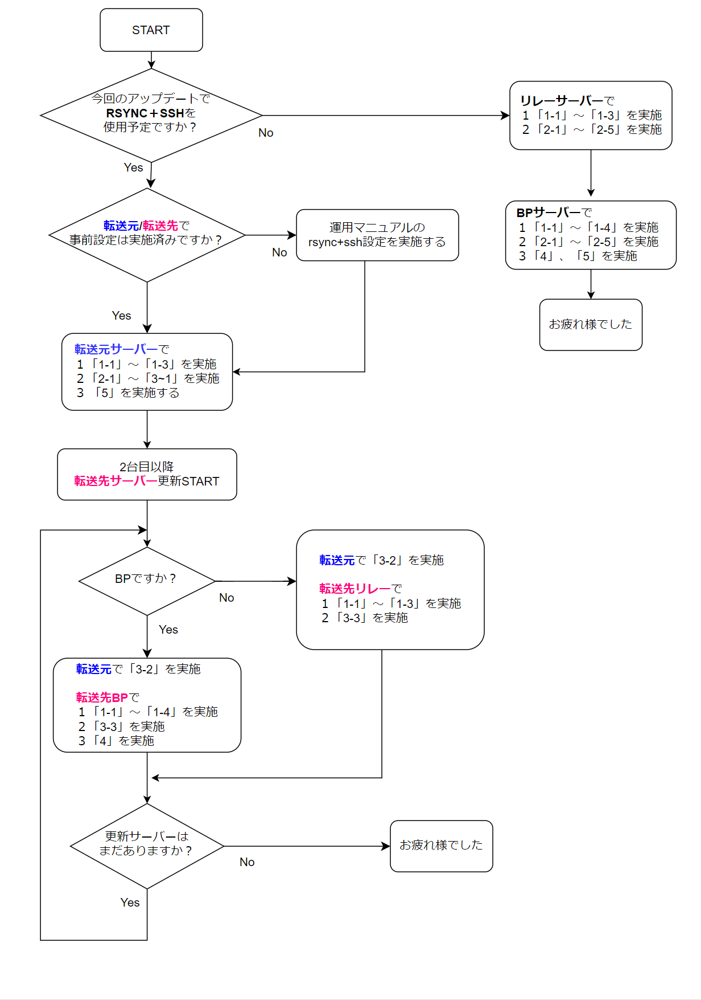

# **ノードアップデートマニュアル**

!!! info "概要"
    このガイドは ノードバージョン8.7.3に対応しています。最終更新日：2024年1月26日

    | Node | CLI | GHC | Cabal | CNCLI |
    | :---------- | :---------- | :---------- | :---------- | :---------- |
    | 8.7.3 | 8.17.0.0 | 8.10.7 | 3.8.1.0 | 6.0.1 |

    * <font color=red>よくお読みになって進めてください</font>
    * <font color=blue>複数行のコードをコードボックスのコピーボタンを使用してコマンドラインに貼り付ける場合は、最後の行が自動実行されないため確認の上Enterを押してコードを実行してください。</font>


!!! hint "主な変更点と新機能"

    **■cardano-node v8.7.3**

    * 8.1.2以前からのダイナミックP2Pの潜在的なバグが解消されています。
    * RAM 24GB以上必須

    **■ビルド済みバイナリの使用**

    * SJGではこれまでソースコードからビルドしてきましたが、検証体制が整ったことで安全性・安定性を十分に確認できるためビルド時間工数削減を目的にIntersectMBO(旧IOG)発行のビルド済みバイナリを使用したインストールを採用を採用します。
    これにより、これまで約30分前後かかっていたバイナリファイル作成のビルド時間を省略できます。

    **■Mithrilブートストラップの導入**
    
    * Mithrilクライアントを用いてDBスナップショットからブートストラップします。  
    8.1.2以前のバージョンから8.7.3へのバージョンアップはDB再構築処理が入るため、ノード同期までに6時間～7時間かかりますがこのブートストラップを導入することで約20分で同期することが可能になります。

    * <font color=red>ビルド済みバイナリの使用＋Mithrilブートストラップを使用した場合、アップデート全工程所要時間は1サーバーにつき約30分～40分ですべて完了します。</font>


<!--### **更新フローチャート**
更新フローチャートは、画像をクリックすると別ウィンドウで開きます。
<a href="../../images/8.7.2-update.png" target=_blank></a>-->


## **1.依存環境アップデート**

### **1-1. システムアップデート**


システムアップデート
```bash
sudo apt update -y && sudo apt upgrade -y
```

### **1-2. cabal/GHCバージョン確認**

**cabalパス確認**
```
which cabal
```
> /home/user/.ghcup/bin/cabal なら正常

**cabalバージョン確認**
```
cabal --version
```
> 以下の戻り値ならOK  
cabal-install version 3.8.1.0  
compiled using version 3.8.1.0 of the Cabal library

**GHCバージョン確認**
```bash
ghc --version
```
> 現在のGHCのバージョンは「8.10.7」  
<font color=red>GHC9はベンチマークテストが終わってないため今ノードバージョンでは非推奨</font>

**libsodiumコミット確認**
```
cd $HOME/git/libsodium
git branch --contains | grep -m1 HEAD | cut -c 21-28
```
> 戻り値が `dbb48cce` ならOK

??? example "各アプリのバージョンが異なる場合"

    ??? danger "戻り値が[/home/user/.local/bin/cabal]だった場合"
        **戻り値が[/home/user/.local/bin/cabal]だった場合のみ以下を実行**  
        
        パスを追加する
        ```
        echo PATH=$PATH:$HOME/.ghcup/bin >> $HOME/.bashrc
        source $HOME/.bashrc
        ```

        旧cabalリネーム
        ```
        cd $HOME/.local/bin/
        mv cabal cabal_bk
        ```

    ??? danger "cabal 3.6.2.0以下だった場合"
        **cabal 3.6.2.0以下だった場合のみ実行**
        **cabalバージョンアップ**
        ```
        ghcup upgrade
        ghcup install cabal 3.8.1.0
        ghcup set cabal 3.8.1.0
        ```
        cabalバージョン確認
        ```
        cabal --version
        ```
        > 以下の戻り値ならOK  
        cabal-install version 3.8.1.0  
        compiled using version 3.8.1.0 of the Cabal library

    ??? danger "GHC 8.10.4以下だった場合"
        **GHC 8.10.4以下だった場合のみ実行**
        ```bash
        ghcup upgrade
        ghcup install ghc 8.10.7
        ghcup set ghc 8.10.7
        ```
        ```bash
        ghc --version
        ```
        > GHCのバージョンは「8.10.7」であればOK


    ??? danger "libsodiumコミット値が違う場合"
        ```
        cd ~/git/libsodium
        git fetch --all --prune
        git checkout dbb48cc
        ./autogen.sh
        ./configure
        make
        make check
        sudo make install
        ```
        > `make`コマンド実行後半に出現する `warning` は無視して大丈夫です。
<!--
prometheus-node-exporterのパスを取得する
```bash
cd $HOME/git
nodeexPath=`which prometheus-node-exporter`
```

1.5.0をダウンロードする
```bash
wget https://github.com/prometheus/node_exporter/releases/download/v1.5.0/node_exporter-1.5.0.linux-amd64.tar.gz
```

ダウンロードファイルを解凍する
```bash
tar xvf node_exporter-1.5.0.linux-amd64.tar.gz
```

サービスを停止する
```bash
sudo systemctl stop prometheus-node-exporter.service
```

バイナリファイルをシステムフォルダへコピーする
```bash
cd node_exporter-1.5.0.linux-amd64
sudo cp node_exporter $nodeexPath
```

バージョン確認

```bash
prometheus-node-exporter --version
```
> 戻り値1行目が`node_exporter, version 1.5.0`ならOK

サービスをスタートする
```bash
sudo systemctl start prometheus-node-exporter.service
```
-->

<!--
### **1-4.Guildスクリプト再取得**
!!! error "注意"
    * リレーとBPでコマンドが異なりますので、タブを切り替えてください。


=== "リレーノード"
    スクリプトをバックアップ
    ```
    cd $NODE_HOME/scripts
    cp gLiveView.sh gLiveView-1.35.4.sh
    cp env env-1.35.4
    ```

    スクリプトをダウンロードする(上書き)
    ```
    wget https://raw.githubusercontent.com/cardano-community/guild-operators/master/scripts/cnode-helper-scripts/gLiveView.sh -O ./gLiveView.sh
    wget https://raw.githubusercontent.com/cardano-community/guild-operators/master/scripts/cnode-helper-scripts/env -O ./env
    ```

    ノードポート番号を確認する。以下のコマンドをすべてコピーして実行してください
    ```
    PORT=`grep "PORT=" $NODE_HOME/startRelayNode1.sh`
    b_PORT=${PORT#"PORT="}
    echo "リレーポートは${b_PORT}です"
    ```
    > リレーのポート番号が表示されることを確認する

    envファイルの修正します。以下のコマンドをすべてコピーして実行してください
    ```
    sed -i $NODE_HOME/scripts/env \
    -e '1,73s!#CNODE_HOME="/opt/cardano/cnode"!CNODE_HOME=${NODE_HOME}!' \
    -e '1,73s!#CNODE_PORT=6000!CNODE_PORT='${b_PORT}'!' \
    -e '1,73s!#UPDATE_CHECK="Y"!UPDATE_CHECK="N"!' \
    -e '1,73s!#CONFIG="${CNODE_HOME}/files/config.json"!CONFIG="${CNODE_HOME}/'${NODE_CONFIG}'-config.json"!' \
    -e '1,73s!#SOCKET="${CNODE_HOME}/sockets/node0.socket"!SOCKET="${CNODE_HOME}/db/socket"!'
    ```
    

=== "ブロックプロデューサーノード"

    **サービスを止める**
    ```
    sudo systemctl stop cnode-cncli-sync.service
    ```

    スクリプトをバックアップ
    ```
    cd $NODE_HOME/scripts
    cp gLiveView.sh gLiveView-1.35.4.sh
    cp env env-1.35.4
    cp cncli.sh cncli-1.35.4.sh
    ```

    スクリプトをダウンロードする(上書き)
    ```
    wget https://raw.githubusercontent.com/cardano-community/guild-operators/master/scripts/cnode-helper-scripts/cncli.sh -q -O ./cncli.sh
    wget https://raw.githubusercontent.com/cardano-community/guild-operators/master/scripts/cnode-helper-scripts/env -q -O ./env
    wget https://raw.githubusercontent.com/cardano-community/guild-operators/master/scripts/cnode-helper-scripts/gLiveView.sh -q -O ./gLiveView.sh
    ```

    ノードポート番号を確認する
    ```
    PORT=`grep "PORT=" $NODE_HOME/startBlockProducingNode.sh`
    b_PORT=${PORT#"PORT="}
    echo "BPポートは${b_PORT}です"
    ```
    > ↑そのまま実行し、BPのポート番号が表示されることを確認する

    envファイルを修正します。以下のコマンドをすべてコピーして実行してください

    ```
    sed -i $NODE_HOME/scripts/env \
    -e '1,73s!#CCLI="${HOME}/.local/bin/cardano-cli"!CCLI="/usr/local/bin/cardano-cli"!' \
    -e '1,73s!#CNCLI="${HOME}/.local/bin/cncli"!CNCLI="${HOME}/.cargo/bin/cncli"!' \
    -e '1,73s!#CNODE_HOME="/opt/cardano/cnode"!CNODE_HOME='${NODE_HOME}'!' \
    -e '1,73s!#CNODE_PORT=6000!CNODE_PORT='${b_PORT}'!' \
    -e '1,73s!#UPDATE_CHECK="Y"!UPDATE_CHECK="N"!' \
    -e '1,73s!#CONFIG="${CNODE_HOME}/files/config.json"!CONFIG="${CNODE_HOME}/'${NODE_CONFIG}'-config.json"!' \
    -e '1,73s!#TOPOLOGY="${CNODE_HOME}/files/topology.json"!TOPOLOGY="${CNODE_HOME}/'${NODE_CONFIG}'-topology.json"!' \
    -e '1,73s!#SOCKET="${CNODE_HOME}/sockets/node0.socket"!SOCKET="${CNODE_HOME}/db/socket"!' \
    -e '1,73s!#BLOCKLOG_TZ="UTC"!BLOCKLOG_TZ="Asia/Tokyo"!' \
    -e '1,73s!#WALLET_PAY_ADDR_FILENAME="payment.addr"!WALLET_PAY_ADDR_FILENAME="payment.addr"!' \
    -e '1,73s!#WALLET_STAKE_ADDR_FILENAME="reward.addr"!WALLET_STAKE_ADDR_FILENAME="stake.addr"!' \
    -e '1,73s!#POOL_HOTKEY_VK_FILENAME="hot.vkey"!POOL_HOTKEY_VK_FILENAME="kes.vkey"!' \
    -e '1,73s!#POOL_HOTKEY_SK_FILENAME="hot.skey"!POOL_HOTKEY_SK_FILENAME="kes.skey"!' \
    -e '1,73s!#POOL_COLDKEY_VK_FILENAME="cold.vkey"!POOL_COLDKEY_VK_FILENAME="node.vkey"!' \
    -e '1,73s!#POOL_COLDKEY_SK_FILENAME="cold.skey"!POOL_COLDKEY_SK_FILENAME="node.skey"!' \
    -e '1,73s!#POOL_OPCERT_COUNTER_FILENAME="cold.counter"!POOL_OPCERT_COUNTER_FILENAME="node.counter"!' \
    -e '1,73s!#POOL_OPCERT_FILENAME="op.cert"!POOL_OPCERT_FILENAME="node.cert"!' \
    -e '1,73s!#POOL_VRF_SK_FILENAME="vrf.skey"!POOL_VRF_SK_FILENAME="vrf.skey"!'
    ```

    プールIDを確認する。以下のコマンドをすべてコピーして実行してください
    ```
    pool_hex=`cat $NODE_HOME/stakepoolid_hex.txt`
    pool_bech32=`cat $NODE_HOME/stakepoolid_bech32.txt`
    printf "\nプールID(hex)は \e[32m${pool_hex}\e[m です\n\n"
    printf "\nプールID(bech32)は \e[32m${pool_bech32}\e[m です\n\n"
    ```

    <strong><font color=red>ご自身のプールID `2種類`が表示されていることを確認してください</font></strong>  
    プールIDが表示されていない場合は、[こちらの手順](../setup/7-register-stakepool.md#4)を実行してください  
    
    <br>
    cncli.shファイルを修正します。以下のコマンドをすべてコピーして実行してください
    ```
    sed -i $NODE_HOME/scripts/cncli.sh \
    -e '1,73s!#POOL_ID=""!POOL_ID="'${pool_hex}'"!' \
    -e '1,73s!#POOL_ID_BECH32=""!POOL_ID_BECH32="'${pool_bech32}'"!' \
    -e '1,73s!#POOL_VRF_SKEY=""!POOL_VRF_SKEY="${CNODE_HOME}/vrf.skey"!' \
    -e '1,73s!#POOL_VRF_VKEY=""!POOL_VRF_VKEY="${CNODE_HOME}/vrf.vkey"!'
    ```
-->

### **1-3.blstインストール**

blstダウンロード
```
cd $HOME/git
git clone https://github.com/supranational/blst
cd blst
git checkout v0.3.10
./build.sh
```

設定ファイル作成
> このボックスはすべてコピーして実行してください

```
cat > libblst.pc << EOF
prefix=/usr/local
exec_prefix=\${prefix}
libdir=\${exec_prefix}/lib
includedir=\${prefix}/include

Name: libblst
Description: Multilingual BLS12-381 signature library
URL: https://github.com/supranational/blst
Version: 0.3.10
Cflags: -I\${includedir}
Libs: -L\${libdir} -lblst
EOF
```

設定ファイルコピー
> このボックスは1行ずつコピーして実行してください

```
sudo cp libblst.pc /usr/local/lib/pkgconfig/
sudo cp bindings/blst_aux.h bindings/blst.h bindings/blst.hpp  /usr/local/include/
sudo cp libblst.a /usr/local/lib
sudo chmod u=rw,go=r /usr/local/{lib/{libblst.a,pkgconfig/libblst.pc},include/{blst.{h,hpp},blst_aux.h}}
```


### **1-4.CNCLIバージョン確認(BPのみ)**

CNCLIバージョン確認
```
cncli --version
```
> 以下の戻り値ならOK  
cncli 6.0.1

??? danger "cncli v6.0.0以下だった場合(クリックして開く)"
    
    **CNCLIをアップデートする**

    ```bash
    rustup update
    cd $HOME/git/cncli
    git fetch --all --prune
    git checkout $(curl -s https://api.github.com/repos/cardano-community/cncli/releases/latest | jq -r .tag_name)
    cargo install --path . --force
    ```

    バージョン確認
    ```
    cncli --version
    ```
    > cncli 6.0.1になったことを確認する  


## **2.ノードアップデート**

!!! danger "バイナリファイルインストール方法の違いについて"
    
    * **_ビルド済みバイナリ_**・・・IntersectMBO(旧IOG)リポジトリソースコードからビルドされたバイナリファイルをダウンロードします。ビルド不要のためビルド時間を短縮できます。
    * **_ソースコードからビルド_**・・・ご自身のサーバーでソースコードからビルドしてバイナリファイルを作成します。検証目的やソースコードからビルドしたい場合に利用できます。ビルドに30分前後かかります。

    どちらも同じソースコードからビルドされたバイナリファイルなので安定性・安全面に差異はございません。お好みの方法でインストールして頂けます。

=== "ビルド済みバイナリを使用する場合"

    ### 2-1.バイナリダウンロード
    旧バイナリを削除する
    ```bash
    rm -rf $HOME/git/cardano-node-old/
    ```

    バイナリファイルをダウンロードする
    ```
    mkdir $HOME/git/cardano-node2
    cd $HOME/git/cardano-node2
    wget https://github.com/IntersectMBO/cardano-node/releases/download/8.7.3/cardano-node-8.7.3-linux.tar.gz
    ```

    解凍する
    ```
    tar zxvf cardano-node-8.7.3-linux.tar.gz ./cardano-node ./cardano-cli
    ```

    **バージョン確認**

    ```bash
    $(find $HOME/git/cardano-node2 -type f -name "cardano-cli") version  
    $(find $HOME/git/cardano-node2 -type f -name "cardano-node") version  
    ```
    以下の戻り値を確認する  
    >cardano-cli 8.17.0.0 - linux-x86_64 - ghc-8.10  
    git rev a4a8119b59b1fbb9a69c79e1e6900e91292161e7  

    >cardano-node 8.7.3 - linux-x86_64 - ghc-8.10  
    git rev a4a8119b59b1fbb9a69c79e1e6900e91292161e7  


    **ノードをストップする** 
    ```
    sudo systemctl stop cardano-node
    ```

    ### 2-2.バイナリインストール

    **バイナリーファイルをシステムフォルダーへコピーする**

    ```bash
    sudo cp $(find $HOME/git/cardano-node2 -type f -name "cardano-cli") /usr/local/bin/cardano-cli
    ```

    ```bash
    sudo cp $(find $HOME/git/cardano-node2 -type f -name "cardano-node") /usr/local/bin/cardano-node
    ```


=== "ソースコードからビルドする場合はこちら"
    **2-1.ソースコードダウンロード**

    新しいTMUXセッションを開く

    ```
    tmux new -s build
    ```
    > アップデート作業中にSSHが中断した場合は、`tmux a -t build`で再開できます。

    旧ビルドを削除する
    ```bash
    rm -rf $HOME/git/cardano-node-old/
    ```

    ソースコードをダウンロードする
    ```
    cd $HOME/git
    git clone https://github.com/IntersectMBO/cardano-node.git cardano-node2
    cd cardano-node2/
    ```

    **2-2.ソースコードからビルド**

    ```bash
    cabal clean
    cabal update
    ```

    ```
    git fetch --all --recurse-submodules --tags
    git checkout tags/8.7.3
    cabal configure --with-compiler=ghc-8.10.7
    ```

    <!--```bash
    echo -e "package cardano-crypto-praos\n flags: -external-libsodium-vrf" > cabal.project.local
    ```-->

    <!--sed -i $HOME/git/cardano-node2/cabal.project -e 's!HSOpenSSL >= 0.11.7.2!HsOpenSSL == 0.11.7.2!'-->

    ```bash
    cabal build cardano-node cardano-cli
    ```
    !!! hint "ヒント"
        * ビルド完了までに数十分ほどかかります。
        * SSH接続が途中で切断された場合、再度接続して`tmux a -t build`で再開してください。  
        * ビルド中にデタッチ(Ctrl+B D)してバックグラウンド処理へ切り替えられます。

    

    **バージョン確認**

    ```bash
    $(find $HOME/git/cardano-node2/dist-newstyle/build -type f -name "cardano-cli") version  
    $(find $HOME/git/cardano-node2/dist-newstyle/build -type f -name "cardano-node") version  
    ```
    以下の戻り値を確認する  
    >cardano-cli 8.17.0.0 - linux-x86_64 - ghc-8.10  
    git rev a4a8119b59b1fbb9a69c79e1e6900e91292161e7  

    >cardano-node 8.7.3 - linux-x86_64 - ghc-8.10  
    git rev a4a8119b59b1fbb9a69c79e1e6900e91292161e7  

    **ビルド用TMUXセッションを終了する** 
    ```
    exit
    ```

    **ノードをストップする** 
    ```
    sudo systemctl stop cardano-node
    ```

    **バイナリーファイルをシステムフォルダーへコピーする**

    ```bash
    sudo cp $(find $HOME/git/cardano-node2/dist-newstyle/build -type f -name "cardano-cli") /usr/local/bin/cardano-cli
    ```

    ```bash
    sudo cp $(find $HOME/git/cardano-node2/dist-newstyle/build -type f -name "cardano-node") /usr/local/bin/cardano-node
    ```

**システムに反映されたノードバージョンを確認する**

```bash
cardano-cli version
cardano-node version
```

以下の戻り値を確認する  
>cardano-cli 8.17.0.0 - linux-x86_64 - ghc-8.10  
git rev a4a8119b59b1fbb9a69c79e1e6900e91292161e7  

>cardano-node 8.7.3 - linux-x86_64 - ghc-8.10  
git rev a4a8119b59b1fbb9a69c79e1e6900e91292161e7  


### **2-3.設定ファイルの追加と更新**

既存ファイルバックアップ
```
mkdir $NODE_HOME/backup
cp $NODE_HOME/${NODE_CONFIG}-config.json $NODE_HOME/backup/${NODE_CONFIG}-config.json
cp $NODE_HOME/${NODE_CONFIG}-conway-genesis.json $NODE_HOME/backup/${NODE_CONFIG}-conway-genesis.json\n
```

新ファイルダウンロード
```
cd $NODE_HOME
wget --no-use-server-timestamps -q https://book.play.dev.cardano.org/environments/${NODE_CONFIG}/conway-genesis.json -O ${NODE_CONFIG}-conway-genesis.json
wget --no-use-server-timestamps -q https://book.play.dev.cardano.org/environments/${NODE_CONFIG}/config.json -O ${NODE_CONFIG}-config.json
```

設定ファイルを書き換える

!!! tip "運用中のP2P形式を調べる方法"
    ```
    cat mainnet-topology.json | grep localRoots
    ```

    * 戻り値がない場合・・・手動P2P運用  
    * `"localRoots": [`の戻り値がある場合・・・ダイナミックP2P

=== "手動P2P運用の場合"
    ```bash
    sed -i ${NODE_CONFIG}-config.json \
        -e '2i \  "SnapshotInterval": 86400,' \
        -e 's!"EnableP2P": true!"EnableP2P": false!' \
        -e 's!"AlonzoGenesisFile": "alonzo-genesis.json"!"AlonzoGenesisFile": "'${NODE_CONFIG}'-alonzo-genesis.json"!' \
        -e 's!"ByronGenesisFile": "byron-genesis.json"!"ByronGenesisFile": "'${NODE_CONFIG}'-byron-genesis.json"!' \
        -e 's!"ShelleyGenesisFile": "shelley-genesis.json"!"ShelleyGenesisFile": "'${NODE_CONFIG}'-shelley-genesis.json"!' \
        -e 's!"ConwayGenesisFile": "conway-genesis.json"!"ConwayGenesisFile": "'${NODE_CONFIG}'-conway-genesis.json"!' \
        -e 's!"TraceBlockFetchDecisions": false!"TraceBlockFetchDecisions": true!' \
        -e 's!"rpKeepFilesNum": 10!"rpKeepFilesNum": 30!' \
        -e 's!"rpMaxAgeHours": 24!"rpMaxAgeHours": 48!' \
        -e '/"defaultScribes": \[/a\    \[\n      "FileSK",\n      "'${NODE_HOME}'/logs/node.json"\n    \],' \
        -e '/"setupScribes": \[/a\    \{\n      "scFormat": "ScJson",\n      "scKind": "FileSK",\n      "scName": "'${NODE_HOME}'/logs/node.json"\n    \},' \
        -e "s/127.0.0.1/0.0.0.0/g"
    ```
=== "ダイナミックP2P運用の場合"
    ```bash
    sed -i ${NODE_CONFIG}-config.json \
        -e '2i \  "SnapshotInterval": 86400,' \
        -e 's!"AlonzoGenesisFile": "alonzo-genesis.json"!"AlonzoGenesisFile": "'${NODE_CONFIG}'-alonzo-genesis.json"!' \
        -e 's!"ByronGenesisFile": "byron-genesis.json"!"ByronGenesisFile": "'${NODE_CONFIG}'-byron-genesis.json"!' \
        -e 's!"ShelleyGenesisFile": "shelley-genesis.json"!"ShelleyGenesisFile": "'${NODE_CONFIG}'-shelley-genesis.json"!' \
        -e 's!"ConwayGenesisFile": "conway-genesis.json"!"ConwayGenesisFile": "'${NODE_CONFIG}'-conway-genesis.json"!' \
        -e 's!"TraceBlockFetchDecisions": false!"TraceBlockFetchDecisions": true!' \
        -e 's!"rpKeepFilesNum": 10!"rpKeepFilesNum": 30!' \
        -e 's!"rpMaxAgeHours": 24!"rpMaxAgeHours": 48!' \
        -e '/"defaultScribes": \[/a\    \[\n      "FileSK",\n      "'${NODE_HOME}'/logs/node.json"\n    \],' \
        -e '/"setupScribes": \[/a\    \{\n      "scFormat": "ScJson",\n      "scKind": "FileSK",\n      "scName": "'${NODE_HOME}'/logs/node.json"\n    \},' \
        -e "s/127.0.0.1/0.0.0.0/g"
    ```

??? テストネットの場合はこちら
    === "手動P2P運用の場合"
        ```bash
        sed -i ${NODE_CONFIG}-config.json \
            -e 's!"EnableP2P": true!"EnableP2P": false!' \
            -e 's!"AlonzoGenesisFile": "alonzo-genesis.json"!"AlonzoGenesisFile": "'${NODE_CONFIG}'-alonzo-genesis.json"!' \
            -e 's!"ByronGenesisFile": "byron-genesis.json"!"ByronGenesisFile": "'${NODE_CONFIG}'-byron-genesis.json"!' \
            -e 's!"ShelleyGenesisFile": "shelley-genesis.json"!"ShelleyGenesisFile": "'${NODE_CONFIG}'-shelley-genesis.json"!' \
            -e 's!"ConwayGenesisFile": "conway-genesis.json"!"ConwayGenesisFile": "'${NODE_CONFIG}'-conway-genesis.json"!' \
            -e 's!"TraceBlockFetchDecisions": false!"TraceBlockFetchDecisions": true!' \
            -e '/"defaultScribes": \[/a\    \[\n      "FileSK",\n      "'${NODE_HOME}'/logs/node.json"\n    \],' \
            -e '/"setupScribes": \[/a\    \{\n      "scFormat": "ScJson",\n      "scKind": "FileSK",\n      "scName": "'${NODE_HOME}'/logs/node.json"\n    \},' \
            -e "s/127.0.0.1/0.0.0.0/g"
        ```
    === "ダイナミックP2P運用の場合"
        ```bash
        sed -i ${NODE_CONFIG}-config.json \
            -e 's!"AlonzoGenesisFile": "alonzo-genesis.json"!"AlonzoGenesisFile": "'${NODE_CONFIG}'-alonzo-genesis.json"!' \
            -e 's!"ByronGenesisFile": "byron-genesis.json"!"ByronGenesisFile": "'${NODE_CONFIG}'-byron-genesis.json"!' \
            -e 's!"ShelleyGenesisFile": "shelley-genesis.json"!"ShelleyGenesisFile": "'${NODE_CONFIG}'-shelley-genesis.json"!' \
            -e 's!"ConwayGenesisFile": "conway-genesis.json"!"ConwayGenesisFile": "'${NODE_CONFIG}'-conway-genesis.json"!' \
            -e 's!"TraceBlockFetchDecisions": false!"TraceBlockFetchDecisions": true!' \
            -e '/"defaultScribes": \[/a\    \[\n      "FileSK",\n      "'${NODE_HOME}'/logs/node.json"\n    \],' \
            -e '/"setupScribes": \[/a\    \{\n      "scFormat": "ScJson",\n      "scKind": "FileSK",\n      "scName": "'${NODE_HOME}'/logs/node.json"\n    \},' \
            -e "s/127.0.0.1/0.0.0.0/g"
        ```

## 3.Mithrilクライアント設定

### **3-1. インストール**
```
cd $HOME/git
mithril_release="$(curl -s https://api.github.com/repos/input-output-hk/mithril/releases/latest | jq -r '.tag_name')"
wget https://github.com/input-output-hk/mithril/releases/download/${mithril_release}/mithril-${mithril_release}-linux-x64.tar.gz -O mithril.tar.gz
```

設定
```
tar zxvf mithril.tar.gz mithril-client
sudo cp mithril-client /usr/local/bin/mithril-client
```
パーミッション設定
```
sudo chmod +x /usr/local/bin/mithril-client
```

DLファイル削除
```
rm mithril.tar.gz mithril-client
```

バージョン確認
```
mithril-client -V
```
> mithril-client 0.5.17+254d266


### 3-2.スナップショット復元

作業用TMUX起動
```
tmux new -s mithril
```

変数セット
```
export NETWORK=mainnet
export AGGREGATOR_ENDPOINT=https://aggregator.release-mainnet.api.mithril.network/aggregator
export GENESIS_VERIFICATION_KEY=$(wget -q -O - https://raw.githubusercontent.com/input-output-hk/mithril/main/mithril-infra/configuration/release-mainnet/genesis.vkey)
export SNAPSHOT_DIGEST=latest
```

??? 旧DBをバックアップしたい方はこちら
    !!! danger "空き容量に関しての注意事項"
        DBをバックアップする場合、サーバーディスクの空き容量をご確認ください。
        安定稼働のためには250GB以上の空き容量が必要です。
        ```
        df -h /usr | awk '{print $4}'
        ```
        <strong><font color=red>Availが250GB以上あることを確認してください。</font></strong>

    dbをリネームする
    ```
    mv $NODE_HOME/db/ $NODE_HOME/backup/db8-1-2/
    ```

    ノードバージョンアップ後、稼働に問題がないことが確認できれば削除することをお勧めます
    ```
    rm -rf $NODE_HOME/backup/db8-1-2/
    ```

既存DB削除
```
rm -rf $NODE_HOME/db
```

最新スナップショットDL
```
mithril-client snapshot download --download-dir $NODE_HOME latest
```
> スナップショットダウンロード～解凍まで自動的に行われます。1/5～5/5が終了するまで待ちましょう  
> 5/5 - Verifying the snapshotsignature…        
Snapshot 'xxxxx' has been unpacked and successfully checked against Mithril multi-signature contained in the certificate.
('xxxxx'は作業時期によって変わります。下の文字列は無視して大丈夫です)

tmux作業ウィンドウを終了する
```
exit
```

### **3-3.サーバー再起動**

**作業フォルダリネーム**

前バージョンで使用していたバイナリフォルダをリネームし、バックアップとして保持します。最新バージョンを構築したフォルダをcardano-nodeとして使用します。

```bash
cd $HOME/git
mv cardano-node/ cardano-node-old/
mv cardano-node2/ cardano-node/
```


サーバーを再起動する
```bash
sudo reboot
```

SSH接続してDB再構築進捗を確認する
```
journalctl --unit=cardano-node --follow
```
> 数分経過しても`Progress: xx.xx%`が表示されない場合、何かが不備でエラーになっています。


## **4. サービス起動確認(BPのみ)**

BPノードが完全に同期した後、サービスを再起動し起動状態を確認する
```bash
sudo systemctl restart cnode-cncli-sync.service
```

!!! info "ヒント"
    ノードを再起動してから、約20秒後に5プログラムがバックグラウンドで起動中であればOKです  

    ```
    tmux ls
    ```

    * cncli  
    * leaderlog  
    * validate  
    * logmonitor  
    * blockcheck(ブロック生成ステータス通知を導入している場合)

```
tmux a -t cncli
```
>「100.00% synced」になっていることを確認します
100%になったら、Ctrl+bを押した後に d を押し元の画面に戻ります
(バックグラウンド実行に切り替え)


## **5. エアギャップアップデート**
!!! hint "SFTP機能ソフト導入"
    R-loginの転送機能が遅いので、大容量ファイルをダウン・アップロードする場合は、SFTP接続可能なソフトを使用すると効率的です。（FileZilaなど）  
    ファイル転送に便利な[SFTP機能ソフトの導入手順はこちら](./sftp.md)

### **5-1.バイナリファイルコピー**

=== "ビルド済みバイナリをダウンロードした場合"

    リレーサーバーで以下を実行する

    ```bash
    sudo cp $(find $HOME/git/cardano-node -type f -name "cardano-cli") ~/cardano-cli
    ```


=== "ソースコードからビルドした場合"

    リレーサーバーで以下を実行する

    ```bash
    sudo cp $(find $HOME/git/cardano-node/dist-newstyle/build -type f -name "cardano-cli") ~/cardano-cli
    ```

SFTP機能ソフト(Filezillaなど)で転送元サーバーに接続し、以下をダウンロードする 

* /home/usr/cardano-cli

をローカルパソコンにダウンロードします  
(エアギャップUbuntuとの共有フォルダ)


<BR>

**エアギャップマシンにファイルを入れる**  

=== "エアギャップ"

    * $HOME/git/cardano-node2/ に`cardano-cli`を入れる   
      <font color=red>(cardano-node2が無ければ作成する)</font>


### **5-2.インストール**

エアギャップマシンで以下を実行する
=== "エアギャップ"
    cardano-cliをシステムフォルダへコピーする
    ```bash
    sudo cp $(find $HOME/git/cardano-node2 -type f -name "cardano-cli") /usr/local/bin/cardano-cli
    ```
    <!--
    `make`がインストールされていることを確認する
    -->
    <!--
    ```
    apt list make
    ```
    以下の戻り値を確認する
    -->
    <!--
    make/focal,now 4.2.1-1.2 amd64 [インストール済み]  
    make/focal 4.2.1-1.2 i386
    -->
    <!--
    secp256k1をインストールする
    ```
    cd $HOME/git/secp256k1/
    chmod +x autogen.sh
    ./autogen.sh
    ./configure --prefix=/usr --enable-module-schnorrsig --enable-experimental
    make
    make check
    ```
    -->
    <!--
    インストールコマンドを実行する
    ```
    sudo make install
    ```
    -->
    <!--
    環境変数を設定する
    ```
    echo export PKG_CONFIG_PATH="/usr/local/lib/pkgconfig:$PKG_CONFIG_PATH" >> $HOME/.bashrc
    echo export NODE_NETWORK="--mainnet" >> $HOME/.bashrc
    source $HOME/.bashrc
    ```
    -->

### **5-3.バージョン確認**

```bash
cardano-cli version
```

以下の戻り値を確認する  
>cardano-cli 8.17.0.0 - linux-x86_64 - ghc-8.10  
git rev a4a8119b59b1fbb9a69c79e1e6900e91292161e7   


!!! denger "確認"
    エアギャップではcardano-nodeは使用しないため転送してもしなくてもOKです。


<!--
## **4.新メトリクスについて**

v1.31.0からブロックチェーンの状態をより可視化したメトリクスが追加されています。
Grafanaに新規パネルを追加することで確認することができます。

現時点では、このメトリクスをもってプールの性能が図れるわけではないですが、現状を把握する指標としてお使いいただけます。

```
■ブロックの伝搬について
1秒、3秒、5秒以内にブロックをダウンロードできたおおよその推定値
95%のブロックを3秒以内にダウンロードしていれば、よく稼働しているノード指標となります。
95%のブロックを5秒以内にダウンロードすることは、ウロボロスPraosのセキュリティ上の最低ラインとなります。
※ノードを再起動すると初期化されますので適正値になるまで時間がかかります。
cardano_node_metrics_blockfetchclient_blockdelay_cdfOne (1秒以内に伝播)
cardano_node_metrics_blockfetchclient_blockdelay_cdfThree (3秒以内に伝播)
cardano_node_metrics_blockfetchclient_blockdelay_cdfFive (5秒以内に伝播)
Panel Stat 
#Grafana Field Unit (Percent(0.0-1.0))

■ブロック受信までの時間
ブロックがミントされるべきだったときから、ローカルのリレーがブロックを受信するまでの遅延を推定した時間
この指標には、コンセンサス/元帳がそのブロックを採用するまでの時間は含まれていません（採用されない可能性もあります）。
cardano_node_metrics_blockfetchclient_blockdelay_s
#Grafana
Panel Stat 
Field Unit (none)


■ブロックサイズの確認
あるスロットのブロックを最初にダウンロードしたときのブロックサイズです。
cardano_node_metrics_blockfetchclient_blocksize
#Grafana
Panel Graph
Field Unit (Bytes(IEC))

■5秒以上後に到着したブロックの追跡
ミントされたはずのブロックが5秒以上後に到着したブロックを追跡します。
cardano_node_metrics_blockfetchclient_lateblocks
#Grafana
Panel Stat 
Field Unit (none)


■リレーノードの有用性判定
人気のないノードには0に近い値が与えられます。そして、非常に有用なノードには1以上の値が与えられます。
値が0の場合、誰もあなたのリレーからブロックを取得していないことを意味します。
1の値は、新しいブロックが作成されるたびに、誰かがそれを取得していることを意味します。
2以上の値は、ミントされたブロックごとに、2つのノードがあなたからそのブロックをフェッチしていることを意味します。
cardano.node.metrics.served.block.latest.count
#計算式
rate(cardano_node_metrics_served_block_latest_count_int[1h])/rate(cardano_node_metrics_blockNum_int[1h])
#Grafana
Panel Graph
Field Unit (none)

■チェーン上のフォーク数をカウント
ノードがスタートしてからのフォーク数。ブロック伝播遅延の影響で2秒前後のスロット間のスケジュールで発生
cardano_node_metrics_forks_int
#Grafana
Panel Graph
Field Unit (none)
```


# 5 ブロックログアップデート暫定調整

## BPの対応
GliveView、ブロックログのCNTOOL系モジュールの仕様変更に伴うアップデート作業です。

```
cd $NODE_HOME/scripts
wget https://raw.githubusercontent.com/cardano-community/guild-operators/master/scripts/cnode-helper-scripts/env -O env
```
```
sed -i $NODE_HOME/scripts/env \
    -e '1,73s!#CCLI="${HOME}/.cabal/bin/cardano-cli"!CCLI="/usr/local/bin/cardano-cli"!' \
    -e '1,73s!#CNODE_HOME="/opt/cardano/cnode"!CNODE_HOME='${NODE_HOME}'!' \
    -e '1,73s!#CNODE_PORT=6000!CNODE_PORT=6000!' \
    -e '1,73s!#CONFIG="${CNODE_HOME}/files/config.json"!CONFIG="${CNODE_HOME}/mainnet-config.json"!' \
    -e '1,73s!#SOCKET="${CNODE_HOME}/sockets/node0.socket"!SOCKET="${CNODE_HOME}/db/socket"!' \
    -e '1,73s!#SOCKET="#LOG_DIR="${CNODE_HOME}/logs"!LOG_DIR="${CNODE_HOME}/logs"!' \
    -e '1,73s!#UPDATE_CHECK="Y"!UPDATE_CHECK="N"!' \
    -e '1,73s!#BLOCKLOG_DIR="${CNODE_HOME}/guild-db/blocklog"!BLOCKLOG_DIR="${CNODE_HOME}/guild-db/blocklog"!' \
    -e '1,73s!#BLOCKLOG_TZ="UTC"!BLOCKLOG_TZ="Asia/Tokyo"!'
```
>BPのポート番号を変更している場合は6000を変更してください。

```
./gLiveView.sh
```
> Script update(s) detected, do you want to download the latest version? (yes/no): ***_no_***


> A new version of Guild LiveView is available  
> Installed Version : v1.22.4  
> Available Version : v1.24.0  
> Do you want to upgrade to the latest version of Guild LiveView? (yes/no):***_yes_***  

>Enter

```
./gLiveView.sh
```
> Script update(s) detected, do you want to download the latest version? (yes/no):***_no_***  
> このメッセージはしばらく手続けるため、煩わしい場合はenvファイルにある`UPDATE_CHECK="N"`へ変更する    

```
wget https://raw.githubusercontent.com/btbf/coincashew/master/guild-tools/blocks.sh -O blocks.sh
```

```
./blocks.sh
```
> The static content from env file does not match with guild-operators repository, do you want to download the updated file? (yes/no):***_no_*** 

## リレーの対応
```
cd $NODE_HOME/scripts
wget https://raw.githubusercontent.com/cardano-community/guild-operators/master/scripts/cnode-helper-scripts/env -O env
```
```
sed -i $NODE_HOME/scripts/env \
    -e '1,73s!#CNODE_HOME="/opt/cardano/cnode"!CNODE_HOME=${NODE_HOME}!' \
    -e '1,73s!#CNODE_PORT=6000!CNODE_PORT=6000!' \
    -e '1,73s!#CONFIG="${CNODE_HOME}/files/config.json"!CONFIG="${CNODE_HOME}/mainnet-config.json"!' \
    -e '1,73s!#SOCKET="${CNODE_HOME}/sockets/node0.socket"!SOCKET="${CNODE_HOME}/db/socket"!'
```
>リレーのポート番号を変更している場合は6000を変更してください。

```
./gLiveView.sh
```

> Script update(s) detected, do you want to download the latest version? (yes/no):***_no_*** 

> A new version of Guild LiveView is available  
> Installed Version : v1.22.4  
> Available Version : v1.24.0  
> Do you want to upgrade to the latest version of Guild LiveView? (yes/no):***_yes_***  

>Enter

```
./gLiveView.sh
```
> Script update(s) detected, do you want to download the latest version? (yes/no):***_yes_***  

>Enter

次回以降...
```
./gLiveView.sh
```
> Script update(s) detected, do you want to download the latest version? (yes/no):***_no_***  

> このメッセージはしばらく手続けるため、煩わしい場合はenvファイルにある`UPDATE_CHECK="N"`へ変更する  


以上、暫定的な対応となります。  

-->

<!--
## **99 前バージョンへロールバックする場合**
最新バージョンに問題がある場合は、以前のバージョンへ戻す場合のみ実行してください。

!!! danger "確認"
バイナリを更新する前にノードを停止します。

```bash
sudo systemctl stop cardano-node
```


古いリポジトリを復元します。

```bash
cd $HOME/git
mv cardano-node/ cardano-node-rolled-back/
mv cardano-node-old/ cardano-node/
```

バイナリーファイルを `/usr/local/bin`にコピーします。

```bash
sudo cp $(find $HOME/git/cardano-node/dist-newstyle/build -type f -name "cardano-cli") /usr/local/bin/cardano-cli
sudo cp $(find $HOME/git/cardano-node/dist-newstyle/build -type f -name "cardano-node") /usr/local/bin/cardano-node
```

バイナリーが希望するバージョンであることを確認します。

```bash
/usr/local/bin/cardano-cli version
/usr/local/bin/cardano-node version
```

```bash
sudo systemctl start cardano-node
```

!!! success "確認"
    再起動して同期が開始しているか確認して下さい。

--> 
