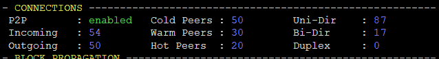
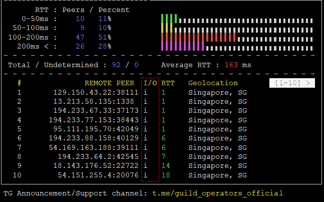

# **ダイナミックP2P設定マニュアル**

!!! hint "事前学習のススメ"
    ダイナミックP2P(以下、P2P)はノード同士の接続方式が大きく変更になります。  
    変更点をまとめた資料を作成しましたので事前学習をオススメします。[資料はこちら](https://drive.google.com/file/d/1xpZs8d9f04WE3Ga5E116LO47uwKSQW-k/view?usp=share_link)

    * P2Pはカルダノネットワークチェーン密度の維持と安全性を担保するため、少しずつ切り替えていく方針となります。そのため2023年4月3日時点では複数リレーのうち単一のリレーで実行し非P2Pリレーと一緒に稼働させる必要があります。
    * <font color=red>BPへの適用は非推奨となっております。</font>


!!! danger "注意事項"
    * P2Pへの切り替えは設定ファイルを変更するため、ノードを停止してから作業します。
    * 以下の手順はリレーノード用です。BPには適用しないでください。
## **1.ノードバージョン確認**

```
cardano-node version
```
!!! hint "ノードバージョン"
    P2Pは1.35.7以上で利用可能です。  
    1.35.6以下の場合は[ノードアップデートマニュアル](./node-update.md)に添ってバージョンアップをお願いします。

ノードを停止する
```
sudo systemctl stop cardano-node
```


## **2.設定ファイル変更**

mainnet-config.jsonにP2Pフラグを追記する
=== "ノード8.1.2の場合"
    ```
    sed -i -e '2i \  "EnableP2P": true,' $NODE_HOME/mainnet-config.json
    ```

=== "ノード8.7.2の場合"
    ```
    sed -i -e 's!"EnableP2P": false!"EnableP2P": true!' $NODE_HOME/mainnet-config.json
    ```


トポロジーファイルのバックアップを作成する
```
mv $NODE_HOME/mainnet-topology.json $NODE_HOME/mainnet-topology-non2p2.json
```

## **3.新トポロジーファイル作成**
実行前に `+`をクリックして注釈を確認してください。  
`localRoots`には常にHot接続にしたい接続先を記入します。

=== "単一接続の場合"

    ``` yaml
    cat > $NODE_HOME/${NODE_CONFIG}-topology.json << EOF
    {
    "localRoots": [
        { "accessPoints": [
            {
            "address": "xxx.xxx.xxx.xx", #(1)!
            "port": yyyy #(2)!
            }
            ],
            "advertise": false,
            "valency": 1
        }
    ],
    "publicRoots": [
      { "accessPoints": [
        {
          "address": "backbone.cardano-mainnet.iohk.io",
          "port": 3001
        },
        {
          "address": "backbone.cardano.iog.io",
          "port": 3001
        },
        {
          "address": "backbone.mainnet.emurgornd.com",
          "port": 3001
        }
        ],
        "advertise": false
        }
    ],
    "useLedgerAfterSlot": 87200000
    }
    EOF
    ```

    1.  BPのIPまたはDNSアドレスに置き換えてください
    2.  BPのポートに置き換えてください

=== "複数接続の場合(IP指定)"

    ``` yaml
    cat > $NODE_HOME/${NODE_CONFIG}-topology.json << EOF
    {
    "localRoots": [
        { "accessPoints": [
            {
            "address": "xx.xxx.xx.xxx", #(1)!
            "port": yyyy #(2)!
            },
            {
            "address": "bb.bbb.bb.bbb", #(3)!
            "port": aaaa #(4)!
            }
            ],
            "advertise": false,
            "valency": 2
        }
    ],
    "publicRoots": [
        { "accessPoints": [
            {
            "address": "backbone.cardano-mainnet.iohk.io",
            "port": 3001
            },
            {
            "address": "backbone.cardano.iog.io",
            "port": 3001
            },
            {
            "address": "backbone.mainnet.emurgornd.com",
            "port": 3001
            }
        ],
        "advertise": false
        }
    ],
    "useLedgerAfterSlot": 110332824
    }
    EOF
    ```

    1.  BP1のIPアドレスに置き換えてください
    2.  BP1のポートに置き換えてください
    3.  BP2または他リレーのIPアドレスに置き換えてください
    4.  BP2または他リレーのポートに置き換えてください

=== "複数接続の場合(DNS指定)"

    ``` yaml
    cat > $NODE_HOME/${NODE_CONFIG}-topology.json << EOF
    {
    "localRoots": [
        { "accessPoints": [
            {
            "address": "xxx1.xxx.com", #(1)!
            "port": yyyy #(2)!
            }
            ],
            "advertise": false,
            "valency": 1
        },
        { "accessPoints": [
            {
            "address": "bbb2.ccc.com", #(3)!
            "port": aaaa #(4)!
            }
            ],
            "advertise": false,
            "valency": 1
        }
    ],
    "publicRoots": [
        { "accessPoints": [
        {
            "address": "relays-new.cardano-mainnet.iohk.io",
            "port": 3001
        }
        ],
        "advertise": false
        }
    ],
    "useLedgerAfterSlot": 110332824
    }
    EOF
    ```

    1.  BP1のDNSアドレスに置き換えてください
    2.  BP1のポートに置き換えてください
    3.  BP2または他リレーのDNSアドレスに置き換えてください
    4.  BP2または他リレーのポートに置き換えてください

新トポロジーファイル項目解説

| 項目     | 説明                          |
| ----------- | ------------------------------------ |
| `localRoots`       | 常にHotにしたい接続先を記入 |
| `accessPoints`       |  接続先グループ |
| `advertise`    | PeerSharing実装後に使用するフラグ(今は`false`) |
| `valency`    | 接続数(接続先グループ内に記載した数と一致させる必要があります) |
| `publicRoots`    | ブートストラップ用バックアップ接続先 |
| `seLedgerAfterSlot`    | 初期同期の際に台帳Peer検索を有効にするスロット番号 |


mainnet-topology.json構文チェック
```
cat $NODE_HOME/mainnet-topology.json | jq .
```
=== "正常"
    mainnet-topology.jsonの中身がそのまま表示されます

=== "エラー"
    以下のエラーが表示されます。mainnet-topology.jsonを開いて適切な記号`{}` `[]` `,` の有無をご確認ください。
    ```{ .yaml .no-copy }
    parse error: Expected another key-value pair at line x, column x
    ```

## **4. ノード起動**
```
sudo systemctl start cardano-node
```

## **5.トポロジーアップデータ修正**
relay-topology_pull.sh内容変更  
mainnet-topology.json上書き防止のため、生成ファイルをリネームします。
```
sed -i $NODE_HOME/relay-topology_pull.sh \
    -e "s/mainnet-topology.json/mainnet-topology-nonp2p.json/g"
```
!!! danger ""
    P2Pモードにしたリレーでは定期的に`relay-topology_pull.sh`を実行する必要はありません。

!!! hint "生存通知について"
    Cronに設定している、トポロジーアップデータサーバーへの生存通知はしばらく継続して下さい。  
    廃止時期は別途ご案内致します。

## **6.トポロジーリロード設定**
リロード用環境変数を追加
```
echo alias cnreload='"kill -SIGHUP $(pidof cardano-node)"' >> $HOME/.bashrc
source $HOME/.bashrc
```
!!! hint "P2P有効時の新機能"
    トポロジーファイル更新時のノード再起動が不要になりました！！  
    mainnet-topology.jsonファイルを修正した後、`cnreload`コマンドを実行することで
    ノードを再起動することなく、トポロジーファイルの再読み込みが可能です。


## **7. gLiveViewの見方**
P2P専用項目を解説します。  
  

`Cold` `Warm` `Hot`が適正値に落ち着くまでに数時間かかる場合があります。

| 項目     | 説明                          |備考
| ----------- | ------------------------------------ |--------- |
| `Incoming`       | 他リレーからの接続数 | Outで双方向の場合Inもカウントされる |
| `Outgoing`       |  自リレーからの接続数 | Warm + Hot の合計値 |
| `Cold Peers`    | 検知済みの予備Peer(未接続ピア　バックアップ) | デフォルト 50 |
| `Warm Peers`    | バックアップ接続Peer数(ミニプロトコル未使用)| デフォルト30 |
| `Hot Peers`    | アクティブ接続のPeer数(ミニプロトコル使用) | 20が最適値 |
| `Uni-Dir`    | 接続先/接続元いずれかが非P2P  | (UniDirectional 単一方向接続 ) |
| `Bi-Dir`    | 接続先/接続元が両端でP2P |  (Bidirectional 双方向接続) |
| `Duplex`    | 接続先/接続元がP2Pで両端でHotで接続状態 | 相互アクティブ接続 |

Peerアナリティクスについて  

!!! hint "Peerアナリティクスの変更点"
    P2PモードのOutgoingはノードポートを使用するため、コマンドの特性上全て`In`でカウントされます。

!!! hint "ノード間の距離について"
    P2Pモードで最適な接続先と接続するとは言え、距離の多様性(近・中・遠距離)は維持されます。  
    インターネットルーティングの変更、接続性の部分的な喪失、物理的なインフラ障害により接続が失われた場合、ノードの一部または全部が他のより長い距離のウォーム接続を維持していれば、それらをホット接続に迅速に昇格させて回復できます。
