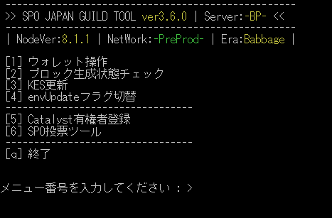

# **SJGツール導入設定**

最終更新日：2025/11/3 v4.0.0

!!! info "主な機能"
    * payment.addr残高照会
    * 報酬引き出し
    * ブロック生成可能可否確認
    * envファイルアップデート切り替え
    * Catalyst有権者登録
    * ガバナンス登録・投票



## **設定**

**スクリプトダウンロード**
```
cd $NODE_HOME/scripts
wget https://raw.githubusercontent.com/btbf/spojapanguild/master/scripts/sjgtool.sh -O sjgtool.sh
chmod 755 sjgtool.sh
```

**envファイル修正**

そのまま全コピーして実行してください。
```
sed -i $NODE_HOME/scripts/env \
    -e '1,116s!#WALLET_PAY_ADDR_FILENAME="payment.addr"!WALLET_PAY_ADDR_FILENAME="payment.addr"!' \
    -e '1,116s!#WALLET_STAKE_ADDR_FILENAME="reward.addr"!WALLET_STAKE_ADDR_FILENAME="stake.addr"!' \
    -e '1,116s!#POOL_HOTKEY_VK_FILENAME="hot.vkey"!POOL_HOTKEY_VK_FILENAME="kes.vkey"!' \
    -e '1,116s!#POOL_HOTKEY_SK_FILENAME="hot.skey"!POOL_HOTKEY_SK_FILENAME="kes.skey"!' \
    -e '1,116s!#POOL_COLDKEY_VK_FILENAME="cold.vkey"!POOL_COLDKEY_VK_FILENAME="node.vkey"!' \
    -e '1,116s!#POOL_COLDKEY_SK_FILENAME="cold.skey"!POOL_COLDKEY_SK_FILENAME="node.skey"!' \
    -e '1,116s!#POOL_OPCERT_COUNTER_FILENAME="cold.counter"!POOL_OPCERT_COUNTER_FILENAME="node.counter"!' \
    -e '1,116s!#POOL_OPCERT_FILENAME="op.cert"!POOL_OPCERT_FILENAME="node.cert"!' \
    -e '1,116s!#POOL_VRF_SK_FILENAME="vrf.skey"!POOL_VRF_SK_FILENAME="vrf.skey"!'
```

=== "各ファイル名を独自のファイル名変更している場合"
    ~/cnode/scripts/envファイル内の以下の変数に対し、先頭の#を削除しご自身の環境に合わせてファイル名を設定してください。  
    !!! memo ""
        WALLET_PAY_ADDR_FILENAME="payment.addr"  
        WALLET_STAKE_ADDR_FILENAME="stake.addr"  
        POOL_HOTKEY_VK_FILENAME="kes.vkey"  
        POOL_OPCERT_FILENAME="node.cert"  
        POOL_VRF_SK_FILENAME="vrf.skey"  
        POOL_OPCERT_COUNTER_FILENAME="node.counter"  
        POOL_OPCERT_FILENAME="node.cert  
        POOL_VRF_SK_FILENAME="vrf.skey


**スクリプトへのパスを通し、任意の単語で起動出来るようにする**
```
echo alias gtool="'cd $NODE_HOME/scripts; ./sjgtool.sh'" >> $HOME/.bashrc
source $HOME/.bashrc
```

TOOLを実行する
```
gtool
```

**エアギャップマシンに環境変数を追加する**
```
echo alias airgap="'cd $HOME/cnode && [ -f airgap-set.tar.gz ] && tar -xOzf airgap-set.tar.gz airgap_script | bash -s verify || echo "airgap-set.tar.gz が見つかりません"'" >> $HOME/.bashrc
```

!!! bug "既知の不具合"

    なし

    また、その他バグを発見した場合はGithubで[issue](https://github.com/btbf/spojapanguild/issues)を提出してください。

---

## **更新履歴**

### **v4.0.2**
    * bech32インストール時バグ修正

### **v4.0.0**
    * KES更新フロー簡略化
    * Airgap Scripts導入
    * ADAハンドル名前解決バグ修正

エアギャップに環境変数を追加してください

```
echo alias airgap="'cd $HOME/cnode && [ -f airgap-set.tar.gz ] && tar -xOzf airgap-set.tar.gz airgap_script | bash -s verify || echo "airgap-set.tar.gz が見つかりません"'" >> $HOME/.bashrc
source $HOME/.bashrc
```

### **v3.9.7**
    * cardano-cli 10.11.0.0対応

### **v3.9.6**
    * ガバナンスSPO投票バグ修正

### **v3.9.5**
    * ブロック生成状態チェック表示修正

### **v3.9.4**
    * cardano-cli 10.8.0.0対応
    * ADAハンドル名前解決バグ修正
    
### **v3.9.3**
    * cardano-node 10.2.1対応
    * Tx送信後のチェーン検証導入

### **v3.9.2**
    * バージョンアップ不具合修正

### **v3.9.1**
    * ステークアドレスDRep委任機能バグ修正

### **v3.9.0**
    * ステークアドレスDRep委任機能実装

### **v3.8.2**
    * 軽微な修正

### **v3.8.1**
    * メニュー修正
    * 軽微な修正

### **v3.8.0**
    * ガバナンスアクションSPO投票実装
    * 軽微な修正

### **v3.7.5**
    * 報酬/資金出金のトランザクションが失敗するバグを修正

### **v3.7.4**
    * ADAハンドル名前解決バグ解消

### **v3.7.3**
    * envから任意Prometheusポート取得 `PROM_PORT`

### **v3.7.1**
    * ブロック生成状態チェック　誓約チェック判定修正
       (payment.addr + stake.addr報酬合計)
    * Pledge変更時の有効エポックチェック導入

### **v3.7.0**
    * CLI 8.17.0.0対応
    * ディスク空き容量とDB容量表示追加

### **v3.6.4**
    * gLiveView1.28.xアップデート機能
    * プールIDファイル名変更  
    　stakepoolid_hex → pool.id  
    　stakepoolid_bech32 → pool.id-bech32 

### **v3.6.3**
    * Catalyst有権者登録機能　payment.addrエラー修正

### **v3.6.2**
    * Catalyst有権者登録機能　表示文言修正

### **v3.6.0**
    * Catalyst有権者登録機能　実装
    　payment.addrのADAをCatalyst Votingパワーに使用できます。

### **v3.5.1**
    * SPO投票機能
    　cardano-cli 8.0.0-untested使用時、Txが作成されない不具合を解消

### **v3.5.0**
    * SPO投票機能実装
    　簡易メッセージ添付可能

### **v3.4.6**

    * ブロック生成状態チェック
        * メタデータハッシュチェック追加
        * PeerInカウントから127.0.0.1を除外
    * PreviewネットワークTx確認リンクをCardanoScanへ変更

### **v3.4.4**

    * Preview / PreProd テストネット対応（envファイル更新必須）
    * ブロック生成チェック総合判定導入

### **v3.4.3**

    * 軽微な修正

### **v3.4.2**

    * 364特別対応削除
    * envファイルアップデートチェックフラグ切替機能追加
    * トランザクション送信後、トランザクション確認URLを表示

### **v3.3.1**

    * 364エポック特別対応 cncli.shパッチ適用追加

### **v3.3.0**

    * 報酬/資金出金　任意アドレス出金ADA Handleに対応

### **v3.2.1**

    * エアギャップコマンドを修正

### **v3.2.0**

    * KES更新時のカウンターファイルチェック・作成手順追加
    * ブロック生成状態チェック KESファイルチェックルール変更

### **v3.1.0**

    * KES更新時のnode.certバックアップ/削除追加

### **v3.0.0**

!!! hint ""

    * KES更新機能追加

    このアップデートに伴い、envファイルの修正が必要となります。
    v2.x.x以上をすでにインストールされていて、プールのKES秘密鍵のファイル名がkes.skeyの場合は以下のコードを1回だけ実行してください。
    違うファイル名をご利用の場合は任意に書き換えてください。
    ```
    sed -i $NODE_HOME/scripts/env \
    -e '1,116s!#POOL_HOTKEY_SK_FILENAME="hot.skey"!POOL_HOTKEY_SK_FILENAME="kes.skey"!'
    ```

### **v2.1.0**

!!! hint ""

    * DdzFアドレスへの報酬/資金出金を許可
    * payment.addr出金時、出金額表示単位バグを修正

---