# **Ubuntu20.04→22.04への移行**

!!! abstract "アップグレード前の確認事項"

    * 2025年3月時点において、このアップグレードは<font color=red>必須</font>です。
    * 20.04LTSのセキュリティサポートは2025年4月まで有効です。
    * 作業前に一通り熟読し、作業フローを理解して下さい。
    * OSアップグレードのため、作業は慎重に実施してください。


## **1. 事前準備**

### **1-1. スナップショットの作成**

!!! warning "スナップショットの作成"
    アップグレード前に<font color=red>**必ず**</font>、VPSのサーバー管理画面から現時点のスナップショット(バックアップ)を作成してください。万一アップグレードに失敗した場合、素早く復旧できます。

### **1-2. SSH鍵の種類を確認する**

SSH接続用のローカルパソコンに保存されている、SSH秘密鍵ファイルの種類を確認してください。

* id_rsa
* ssh_ed25519

のどちらか

### **1-3. SSHターミナルバージョン最新化**

WindowsでR-loginをご利用の場合は、[最新のRLogin](https://github.com/kmiya-culti/RLogin/releases/)を使用して下さい。

### **1-4. 作業対象サーバログイン**

!!! Tip "接続方法"
    1-4～1-8は通常のSSH接続で作業する

=== "id_rsaの場合"
    22.04ではRSA方式が無効となっており、新しい鍵ペア(ed25519暗号方式)を作成します。

    **ペア鍵の作成**

    ```sh
    ssh-keygen -t ed25519 -N '' -C ssh_connect -f ~/.ssh/ssh_ed25519
    ```

    ssh_ed25519（秘密鍵）とssh_ed25519.pub（公開鍵）というファイルが作成されているか確認する。

    ```sh
    cd ~/.ssh
    ls
    ```
    
    公開鍵を認証ファイルに書き込む
    ```sh
    cat ssh_ed25519.pub >> authorized_keys
    ```

    !!! note "SSH鍵ファイルをダウンロードする"

        1. R-loginの場合はファイル転送ウィンドウを開く  
        2. 左側ウィンドウ(ローカル側)は任意の階層にフォルダを作成する。  
        3. 右側ウィンドウ(サーバ側)は「.ssh」フォルダを選択する  
        4. 右側ウィンドウから、`ssh_ed25519`と`ssh_ed25519.pub`の上で右クリックして  「ファイルのダウンロード」を選択する  
        5. 一旦サーバからログアウトする  
        6. R-Loginのサーバ接続編集画面を開き、「SSH認証鍵」をクリックし4でダウンロードした`ssh_ed25519`ファイルを選ぶ  
        7. サーバへ接続する

        <font color=red>※4でローカルにダウンロードしたSSH鍵ペアはバックアップを作成することをオススメします。</font>

    サーバーに接続できたことを確認して、サーバー内の鍵を削除する
    ```
    rm ~/.ssh/ssh_ed25519
    rm ~/.ssh/ssh_ed25519.pub
    ```


=== "ssh_ed25519の場合"
    Ubuntu22.04に対応した暗号方式です。次の項目に移動して下さい。
   

### **1-5. ノードを停止する**
```
sudo systemctl stop cardano-node
```

自動起動を一旦停止する
```
sudo systemctl disable cardano-node
```

### **1-6. システムアップデート**
```
sudo apt update -y && sudo apt upgrade -y
```
```
cd /usr/lib/python3/dist-packages/
sudo cp apt_pkg.cpython-38-x86_64-linux-gnu.so apt_pkg.so
```
```
sudo apt install --reinstall python3-apt
```

Pythonバージョンを確認する
```
python3 -V
```
> 3.10以下であればOK

??? danger "戻り値がpython3.12の場合"
    ```
    sudo update-alternatives --install /usr/bin/python3 python3 /usr/bin/python3.8 2
    ```
    ```
    python3 -V
    ```
    > Python 3.8.10になったことを確認する


### **1-7. パッケージインストール**
```
sudo apt install update-manager-core
```

### **1-8. Ubuntuバージョン確認**

現在のバージョンを確認する

```
cat /etc/os-release | grep "VERSION="
```
> VERSION="20.04.x LTS (Focal Fossa)"　xの数字はアップグレード時期によって変わります

アップグレード可能なバージョンを確認する

```
sudo do-release-upgrade -c | grep "New release"
```
> New release '22.04.x LTS' available.　xの数字はアップグレード時期によって変わります

### **1-9. システムを再起動**
```
sudo reboot
```


## **2. Ubuntuアップグレード**

!!! warning "アップグレードの注意点"
    Ubuntu22.04アップグレード(以下の作業)において、SSH接続での作業は不意な切断が発生した場合に復旧が困難になるため<font color=red>非推奨</font>となっております。

    そのため、契約事業者(VPS)のマイページまたはサーバパネルに付随しているコンソール画面(VNCまたはKVNなど)からの作業をオススメします。
    
    ただし以下の点にご了承頂ける場合はSSH接続で作業することも可能です。
    
    * 事前にスナップショット(バックアップ)作成が可能な方
    * 不意なSSH切断でアップグレードが中断してもご自身で復旧出来る方

    !!! hit "SSHで作業する場合"

        * 予備のSSHポートを開放してください。  
        ※ただしAWSやIONOSなど、VPSサーバー管理画面からファイアウォールを設定する場合は、<font color=red>以下のコードは実行せず</font>VPS管理画面から設定してください。
        ```
        sudo ufw allow 1022/tcp
        sudo ufw reload
        ```

        * R-loginを使用する場合は、不意な切断を防ぐため以下の設定を行って下さい。

        「ファイル」→「サーバーに接続」→ 接続先右クリックし「接続を編集する」→「プロトコル」→ SSH枠の「KeepAlveパケット送信間隔(sec)」にチェックを入れ、空欄に`20`を入力する。


### **2-1. アップグレード実行**

!!! Question "接続パターン"
    * パターン1：VPSサーバー管理画面のコンソールから接続する
    * パターン2：ローカルPCにインストールしたVNCクライアントから接続する(主にContabo)
    * パターン3：いつも通りSSHで接続する

アップグレードコマンドを実行する
```
sudo do-release-upgrade
```

### **2-2. アップグレードメッセージ**
以下、確認メッセージ例です。<font color=red>ご利用のサーバーによって表示内容が異なる場合があります。</font>表示された内容をよく読んで下さい。

!!! hit "SSHで作業する場合"

    バックアップSSHポート開放  
    `y` を入力してEnter
    ``` { .yaml .no-copy }
    Continue running under SSH?

    This session appears to be running under ssh. It is not recommended
    to perform a upgrade over ssh currently because in case of failure it
    is harder to recover.

    If you continue, an additional ssh daemon will be started at port
    '1022'.
    Do you want to continue?

    Continue [yN] y      # y を入力してEnter
    ```

    sshdに1022ポート追加のお知らせ  
    そのまま`ENTER`
    ``` { .yaml .no-copy }
    Starting additional sshd

    To make recovery in case of failure easier, an additional sshd will
    be started on port '1022'. If anything goes wrong with the running
    ssh you can still connect to the additional one.
    If you run a firewall, you may need to temporarily open this port. As
    this is potentially dangerous it's not done automatically. You can
    open the port with e.g.:
    'iptables -I INPUT -p tcp --dport 1022 -j ACCEPT'

    To continue please press [ENTER]  # ENTER 
    ```

パッケージダウンロードリポジトリ更新しますか？  
`y` を入力してEnter
``` { .yaml .no-copy }
Updating repository information

No valid mirror found

While scanning your repository information no mirror entry for the
upgrade was found. This can happen if you run an internal mirror or
if the mirror information is out of date.

Do you want to rewrite your 'sources.list' file anyway? If you choose
'Yes' here it will update all 'focal' to 'jammy' entries.
If you select 'No' the upgrade will cancel.

Continue [yN] y      # y を入力してEnter
```


アップグレード開始しますか？  
`y` を入力してEnter
``` { .yaml .no-copy }
Do you want to start the upgrade?


3 installed packages are no longer supported by Canonical. You can
still get support from the community.

5 packages are going to be removed. 117 new packages are going to be
installed. 629 packages are going to be upgraded.

You have to download a total of 694 M. This download will take about
2 minutes with a 40Mbit connection and about 18 minutes with a 5Mbit
connection.

Fetching and installing the upgrade can take several hours. Once the
download has finished, the process cannot be canceled.

 Continue [yN]  Details [d] y      # y を入力してEnter
```

libc6などのサービスを再起動しますか？  
カーソルキーで`YES`を選択して`ENTER`
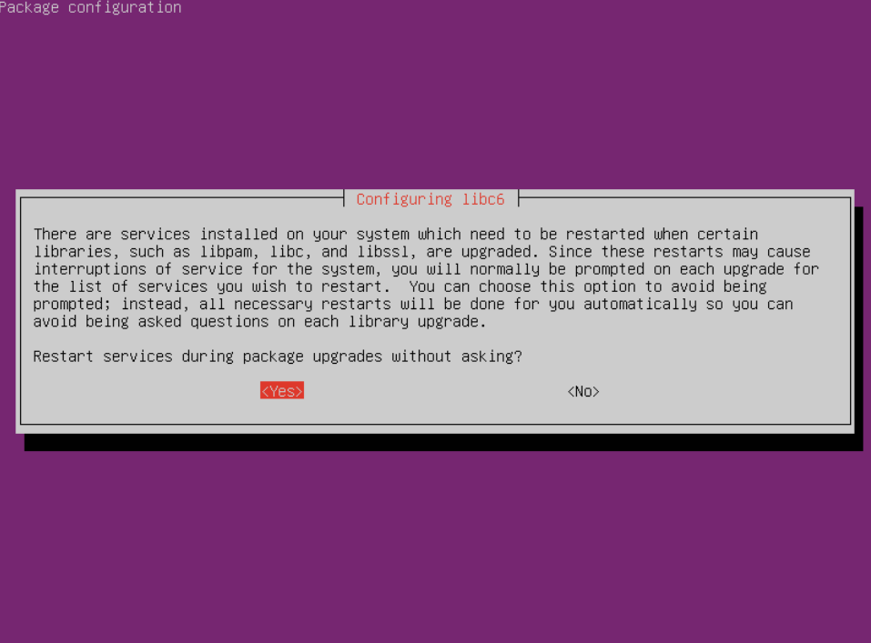


設定ファイル更新の有無  
`N` を入力してEnter
``` { .yaml .no-copy }
Configuration file '/etc/ssh/ssh_config'
 ==> Modified (by you or by a script) since installation.
 ==> Package distributor has shipped an updated version.
   What would you like to do about it ? Your options are:
    Y or I : install the package maintainer's version
    N or O : keep your currently-installed version
      D : show the differences between the versions
      Z : start a shell to examine the situation
 The default action is to keep your current version.
*** ssh_config (Y/I/N/O/D/Z) [default=N] ?  N       # N を入力してEnter
```
!!! danger "注意"

    * この種類のメッセージは必ず `N` を入力して、「keep your currently-installed version（現在の設定を維持する）」を選択して下さい。
    * サーバーによっては`ssh_config`以外にも同様のメッセージが表示される場合があります。(`chrony`,`opne-ssh`,`sudoers`,`sysctl.conf`など) いずれも `N` 「keep your currently-installed version（現在の設定を維持する）」を選択して下さい。

新しい設定ファイルの処理方法について  
`keep the local version currently installed`（インストール済みのローカルバージョンを維持する）が選択された状態で`ENTER`
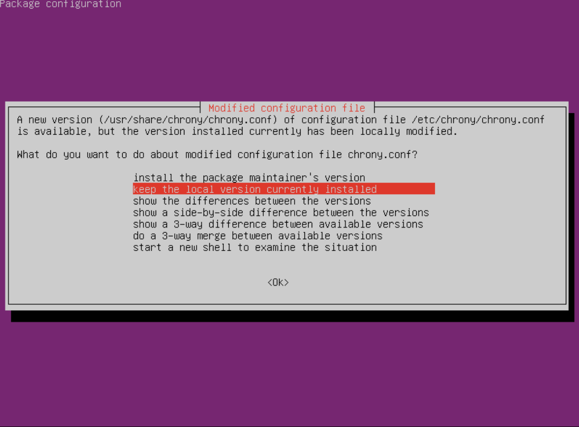

!!! danger "注意"

    * この種類のメッセージは必ず 「`keep the local version currently installed`（インストール済みのローカルバージョンを維持する）」を選択して下さい。
    * サーバーによっては`chrony`以外にも同様のメッセージが表示される場合があります。(`sshd`など) いずれも `keep the local version currently installed`（インストール済みのローカルバージョンを維持する）」を選択して下さい。


古いパッケージを削除しますか？  
`y` を入力してEnter
``` { .yaml .no-copy }
Remove obsolete packages?


73 packages are going to be removed.

 Continue [yN]  Details [d] y      # y を入力してEnter
```


アップグレードが完了しました。再起動しますか？  
`y` を入力してEnter
``` { .yaml .no-copy }
System upgrade is complete.

Restart required

To finish the upgrade, a restart is required.
If you select 'y' the system will be restarted.

Continue [yN] y      # y を入力してEnter
```

## **3. アップグレード確認(SSH接続)**

!!! Tip "接続方法"
    3~5はSSH接続で作業する

### **3-1. 現在のUbuntuバージョンを確認する**

``` { .yaml .annotate }
cat /etc/os-release | grep "VERSION=" # (1)!
```

1.  22.04はブラケットペーストモードが有効になっているためコマンドペースト後、ENTERで実行する必要があります。

> VERSION="22.04.x LTS (Jammy Jellyfish)"　xの数字はアップグレード時期によって変わります

### **3-2. ブラケットペーストモードOFF**
```
echo "set enable-bracketed-paste off" >> ~/.inputrc
```

### **3-3. SSH再接続**
```
exit
```
> SSHで再接続する


## **4. 依存関係再インストール**

システムアップデート
```
sudo apt update -y && sudo apt upgrade -y
```

=== "リレーの場合"
    ```
    sudo apt install needrestart git jq bc automake tmux rsync htop curl build-essential pkg-config libffi-dev libgmp-dev libssl-dev libtinfo-dev libsystemd-dev zlib1g-dev make g++ wget libncursesw5 libtool autoconf liblmdb-dev -y
    ```

=== "BPの場合"
    ```
    sudo apt install needrestart git jq bc automake tmux rsync htop curl build-essential pkg-config libffi-dev libgmp-dev libssl-dev libtinfo-dev libsystemd-dev zlib1g-dev make g++ wget libncursesw5 libtool autoconf liblmdb-dev -y
    ```
    ```
    pip install discordwebhook python-dotenv slackweb
    ```

デーモン再起動自動化
```
echo "\$nrconf{restart} = 'a';" | sudo tee /etc/needrestart/conf.d/50local.conf
```
```
echo "\$nrconf{blacklist_rc} = [qr(^cardano-node\\.service$) => 0,];" | sudo tee -a /etc/needrestart/conf.d/50local.conf
```

<!--
libssl3アンインストール
```
sudo apt --purge remove libssl-dev
```

libssl-dev1.1インストール
```
cd $HOME
wget http://security.ubuntu.com/ubuntu/pool/main/o/openssl/libssl-dev_1.1.1f-1ubuntu2.17_amd64.deb
sudo dpkg -i libssl-dev_1.1.1f-1ubuntu2.17_amd64.deb
```

libssl1.1インストール
```
wget wget wget wget http://security.ubuntu.com/ubuntu/pool/main/o/openssl/libssl1.1_1.1.1f-1ubuntu2.17_amd64.deb
sudo dpkg -i libssl1.1_1.1.1f-1ubuntu2.17_amd64.deb
```

DLファイル削除
```
rm $HOME/libssl-dev_1.1.1f-1ubuntu2.17_amd64.deb
rm $HOME/libssl1.1_1.1.1f-1ubuntu2.17_amd64.deb
```
-->

自動起動有効化
```
sudo systemctl enable cardano-node
```

コンパイル済みHaskellパッケージ削除
```
cd ~/.cabal/store
rm -rf ghc-8.10.7
```


!!! tip "SSHでアップグレードを実施した場合" 
    1022ポートを削除する（AWSやIONOSなどはVPSのサーバー管理画面から）
    ```
    sudo ufw deny 1022/tcp
    sudo ufw reload
    ```

## **5. ノード再インストール**

<font color=red>ソースコードからビルドされたcardano-node/cliを使用していた場合のみ、以下の手順で再ビルドしてください</font>
!!! info "再ビルド"
    [ノードアップデートマニュアル](./node-update.md)  
    1-1、1-2、2-1、2-2を実施


## **6. エアギャップマシンアップグレード**

### **6-1. 事前準備**

- [x] 6-1-1.Ubuntuへログインし、主要ファイルのアクセス制限を解除する

```
cd $NODE_HOME
chmod 700 payment.vkey
chmod 700 payment.skey
chmod 700 stake.vkey
chmod 700 stake.skey
chmod 700 stake.addr
chmod 700 payment.addr
chmod u+rwx $HOME/cold-keys
```

- [x] 6-1-2.以下フォルダ内すべてのファイルを外部ストレージに退避させる

* /home/user/cnode (userは各自で設定したユーザー名)
* /home/cold-keys

- [x] 6-1-3.退避させたら、上記ディレクトリ内のファイルをすべて削除する  
(ディレクトリフォルダは残して下さい)

- [x] 6-1-4.Ubuntuをシャットダウン(電源オフ)する


### **6-2. VirtualBoxアップグレード**

VirtualBoxのダウンロードサイトにアクセスし、`VirtualBox 7.0.8 platform packages`の`Windows hosts`または`macOS`のリンクからダウンロードし、既存のVirtuialBoxに対して<font color=red>**上書きインストール**</font>してください

 * [VirtualBoxの入手](https://www.virtualbox.org/wiki/Downloads)


### **6-3. システムアップデート**

- [x] 6-3-1.VirtualBoxのマシン設定からネットワークを有効にする
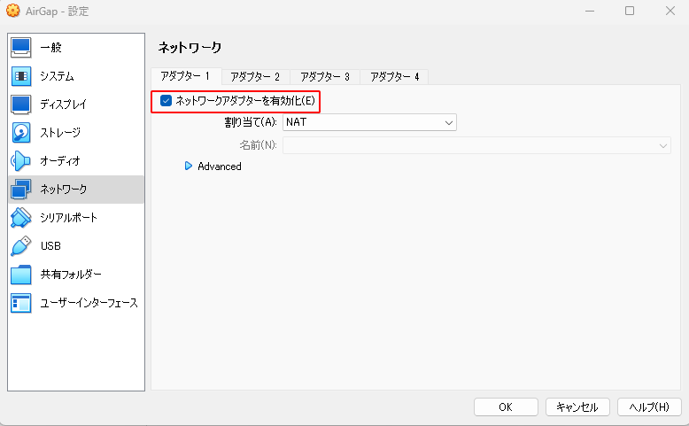

- [x] 6-3-2.Ubuntuを起動する

- [x] 6-3-3.ディスク容量を確認する

```
df -h /root
```
> Availの値が10G以上であることを確認する


- [x] Ubuntu設定から「電源管理」→「ブランクスクリーン」→「しない」に設定
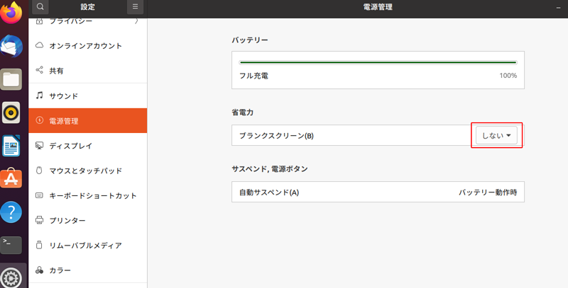

- [x] アプリケーション一覧から`soft`と検索し、[ソフトウェアとアップデート]を起動
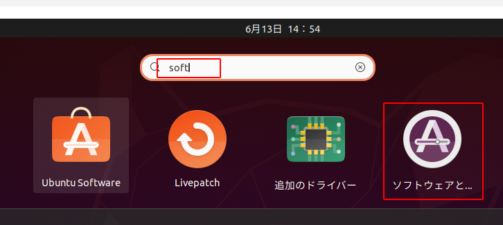

- [x] [アップデート]タブの長期サポート(LTS)版が選択されていることを確認し、閉じる
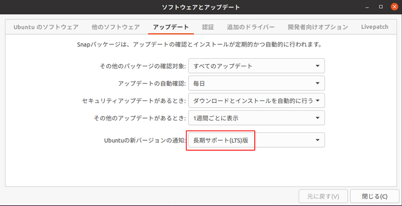

- [x] アプリケーション一覧から`update`と検索し、[ソフトウェアの更新]を起動
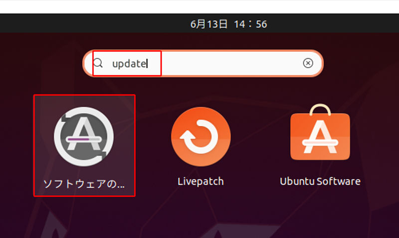

- [x] 「今すぐインストール」をクリック。
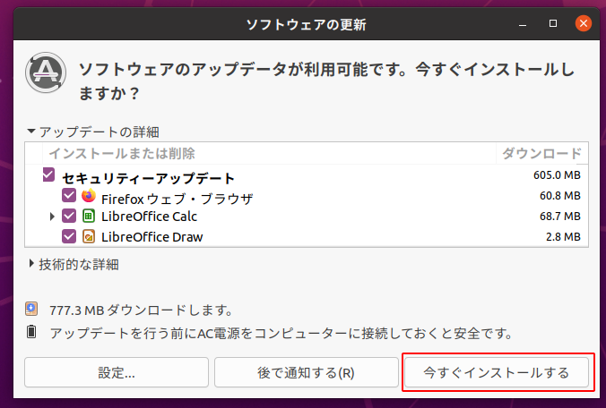

- [x] インストール後再起動を求められたら再起動する。


### **6-4. Ubuntuアップグレード**

- [x] 6-4-1.アプリケーション一覧から`update`と検索し、[ソフトウェアの更新]を起動


- [x] 6-4-2.「アップグレード」をクリックする
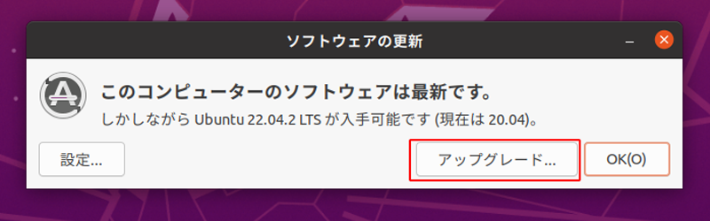

!!! Question "アップグレード"
    表示された内容に沿ってアップグレードしてください。アップグレードには数十分かかります。

- [x] 6-4-3.処理が進むと以下のような画像が表示されます。
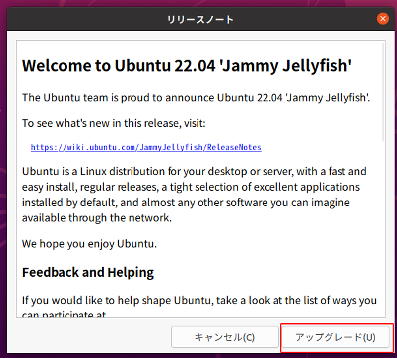

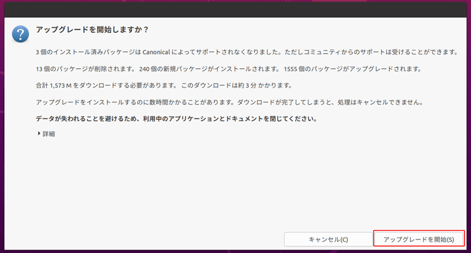

- [x] 6-4-4.FireFoxがインストールされている場合は以下の画像が表示されます。「NEXT」をクリックしてください。
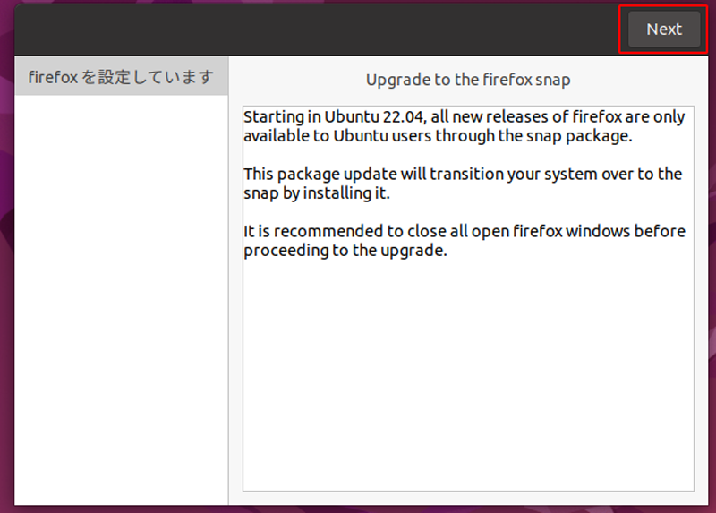

- [x] 6-4-5.更に処理が進み、サポート外パッケージを削除します
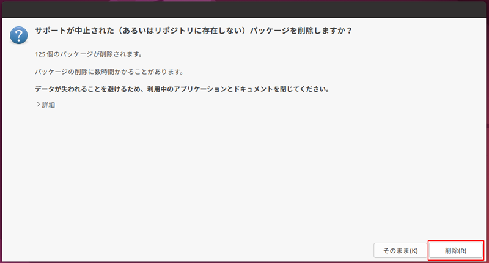


### **6-5. GuestAddtionsアップグレード**

- [x] 6-5-1.GuestAddtionsをアップグレードする
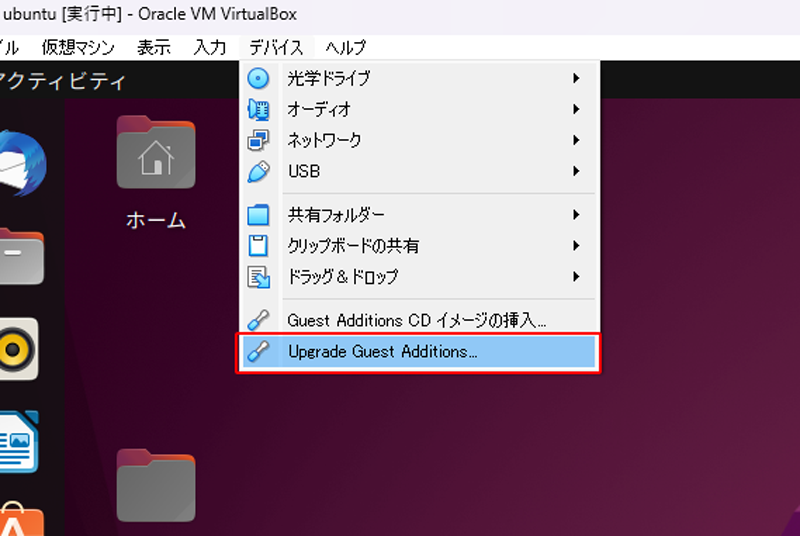

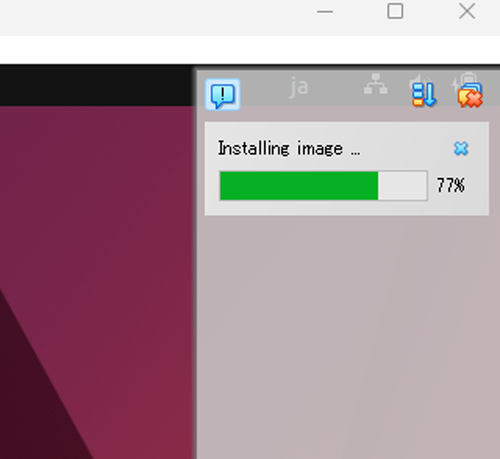


- [x] 6-5-2.Ubuntuをシャットダウン(電源オフ)する


### **6-6. 最終仕上げ**

- [x] 6-6-1.ネットワークオフ
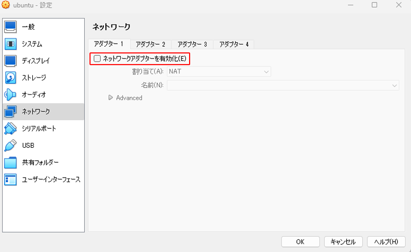

- [x] 6-6-2.Ubuntuを起動する

- [x] 6-6-3.ブラケットペーストモードOFF

```
echo "set enable-bracketed-paste off" >> ~/.inputrc
```

- [x] 6-6-4.退避したキーファイルを`cnode`ディレクトリに戻す

- [x] 6-6-5.戻した主要ファイルのアクセス制限

```
cd $NODE_HOME
chmod 400 payment.vkey
chmod 400 payment.skey
chmod 400 stake.vkey
chmod 400 stake.skey
chmod 400 stake.addr
chmod 400 payment.addr
chmod a-rwx $HOME/cold-keys
```

- [x] 6-6-6.Ubuntu22.04で再ビルドしたcardano-cliをコピーする([参考手順](./node-update.md#5))

---