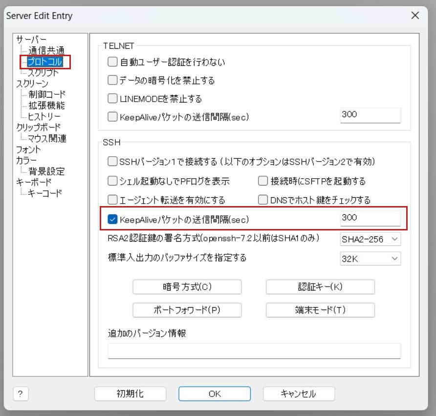

# **1.Ubuntu初期設定**

!!! tip "AWSをご利用の方"
    AWS EC2及びlightsailは特殊環境なため、このマニュアル通りに動かない場合がございます。  
    不明な点はGuildコミュニティで質問してみてください。


!!! tip "ヒント"
    この手順はエアギャップオフラインマシン(VirtualBox上のUbuntu)では実施する必要はありません


## **1-1.オススメのターミナルソフト**

1.R-Login(Windows)   
[https://kmiya-culti.github.io/RLogin/](https://kmiya-culti.github.io/RLogin/) 
!!! tip "接続状態維持のための設定"
    R-Login使用の際は、未操作時の接続状態を保持するため以下の設定を行ってください。
    


2.Terminal(Mac)  
[https://www.webdesignleaves.com/pr/plugins/mac_terminal_basics_01.html](https://www.webdesignleaves.com/pr/plugins/mac_terminal_basics_01.html)  
  


## **1-2.ユーザーアカウントの作成**

!!! summary "ヒント"
    rootアカウントはサーバーの最上位権限です。
    サーバを操作する場合はrootアカウントを使用せず、root権限を付与したユーザーアカウントで操作するようにしましょう。


新しいユーザーの追加　(例：cardano)

1.上記ターミナルソフトを使用し、サーバーに割り当てられた初期アカウント(rootなど)でログインする。  

2.新しいユーザーアカウントを作る(任意のアルファベット文字)  

```sh
adduser cardano
```

```text
New password:           # ユーザーのパスワードを設定
Retype new password:    # 確認再入力

Enter the new value, or press ENTER for the default
        Full Name []:   # フルネーム等の情報を設定 (不要であればブランクでも OK)
        Room Number []:
        Work Phone []:
        Home Phone []:
        Other []:
Is the information correct? [Y/n]:y
```

cardanoをsudoグループに追加する

```text
usermod -G sudo cardano
```

rootユーザーからログアウトする

```
exit
```

3.ターミナルソフトのユーザーをパスワードを上記で作成したユーザーとパスワードに書き換えて再接続します。

!!! hint "Ubuntu22.04の場合の特別設定"
    ご利用のOSがUbuntu22.04の場合は、以下のコマンドを実行してください。

    ブラケットペーストモードOFF
    ```
    echo "set enable-bracketed-paste off" >> ~/.inputrc
    ```

    デーモン再起動自動化
    ```
    echo "\$nrconf{restart} = 'a';" | sudo tee /etc/needrestart/conf.d/50local.conf
    ```
    ```
    echo "\$nrconf{blacklist_rc} = [qr(^cardano-node\\.service$) => 0,];" | sudo tee -a /etc/needrestart/conf.d/50local.conf
    ```

## **1-3.SSH鍵認証方式へ切り替え**

!!! summary
    SSHを強化する基本的なルールは次の通りです。

    * SSHログイン時パスワード無効化 \(秘密鍵を使用\)
    * SSHデフォルトポート(22)の変更
    * rootアカウントでのSSHログイン無効化 \(root権限が必要なコマンドは`su` or `sudo`コマンドを使う\)
    * 許可されていないアカウントからのログイン試行をログに記録する \(fail2banなどの、不正アクセスをブロックまたは禁止するソフトウェアの導入を検討する\)
    * SSHログイン元のIPアドレス範囲のみに限定する \(希望する場合のみ\)※利用プロバイダーによっては、定期的にグローバルIPが変更されるので注意が必要

**ペア鍵の作成**

```sh
ssh-keygen -t ed25519 -N '' -C ssh_connect -f ~/.ssh/ssh_ed25519
```

```sh
cd ~/.ssh
ls
```
ssh_ed25519（秘密鍵）とssh_ed25519.pub（公開鍵）というファイルが作成されているか確認する。

```sh
cd ~/.ssh/
cat ssh_ed25519.pub >> authorized_keys
chmod 600 authorized_keys
chmod 700 ~/.ssh
```

**SSH鍵ファイルをダウンロードする** 

1.R-loginの場合はファイル転送ウィンドウを開く  
2.左側ウィンドウ(ローカル側)は任意の階層にフォルダを作成する。  
3.右側ウィンドウ(サーバ側)は「.ssh」フォルダを選択する  
4.右側ウィンドウから、ssh_ed25519とssh_ed25519.pubの上で右クリックして「ファイルのダウンロード」を選択する  
5.一旦サーバからログアウトする  
6.R-Loginのサーバ接続編集画面を開き、「SSH認証鍵」をクリックし4でダウンロードしたssh_ed25519ファイルを選ぶ  
7.サーバへ接続する  

**SSHの設定変更**

`/etc/ssh/sshd_config`ファイルを開く

```text
sudo nano /etc/ssh/sshd_config
```

**ResponseAuthentication**の項目を「no」にします。
=== "Ubuntu20.04の場合"
    ```text
    ChallengeResponseAuthentication no
    ```

=== "Ubuntu22.04の場合"
    ```text
    KbdInteractiveAuthentication no
    ```

**PasswordAuthentication**の項目を「no」にする

```text
PasswordAuthentication no 
```

**PermitRootLogin**の項目を「no」にする

```text
PermitRootLogin no
```

**PermitEmptyPasswords**の項目を「no」にする

```text
PermitEmptyPasswords no
```


!!! hint "SSHポートのヒント"
    SSHポートは世界標準で22番が割り当てられています。  
    しかし、ポートアタックの標的となり得るため任意の番号へ変更することをおすすめしています。任意の番号は<font color=red>49513～65535</font>までの数字で設定してください。

SSHポートを任意の番号へ変更する。先頭の#を削除して番号を指定してください。
```bash
Port xxxxx
```

> Ctrl+O で保存し、Ctrl+Xで閉じる

SSH構文にエラーがないかチェックします。

```text
sudo sshd -t
```

SSH構文エラーがない場合、SSHプロセスを再起動します。

```text
sudo service sshd reload
```

接続したまま、ターミナルソフトをもう一つ起動する。

!!! info "ターミナルソフト設定について"
    接続設定のSSHポート番号を変更し秘密鍵を設定しサーバーへログインできるか確認して下さい。
    接続できない場合は、接続されてるターミナル画面でサーバー設定を確認して下さい。


## **1-4.ファイアウォール有効化**

標準のUFWファイアウォールを使用して、インバウンドアクセスポートを限定します。

??? info "設定前の注意事項"
    ご利用のVPSによっては管理画面からFWを設定する場合があります（例AWS系など）  
    その場合は以下の設定を行わず、VPSマイページ管理画面などから個別に設定してください。

??? info "さくらVPSをご利用の場合"
    管理画面からパケットフィルターを、”利用しない”に設定してください。    

SSHポートを許可する  

```
PORT=`grep "Port" /etc/ssh/sshd_config`
s_PORT=${PORT#"Port"}
ssh_PORT=`echo ${s_PORT} | sed -e 's/[^0-9]//g'`
echo ${ssh_PORT}
```

```bash
sudo ufw allow ${ssh_PORT}/tcp
```
FWを有効化
```bash
sudo ufw enable
```
以下のメッセージが表示されたら `y` を入力して `Enter`
> Command may disrupt existing ssh connections. Proceed with operation (y|n)? y

ステータス確認
```
sudo ufw status
```
以下の戻り値があればOK
> Status: active

## **1-5.システムを更新する**

!!! tip "重要"
    不正アクセスを予防するには、システムに最新のパッチを適用することが重要です。

```bash title="Ubuntu22.04の場合は１行づつ実行してください"
sudo apt update -y && sudo apt upgrade -y
sudo apt autoremove
sudo apt autoclean
```

自動更新を有効にすると、手動でインストールする手間を省けます。
> `YES`を選択しEnter

```bash title="Ubuntu22.04の場合は１行づつ実行してください"
sudo apt install unattended-upgrades
sudo dpkg-reconfigure --priority=low unattended-upgrades
```

## **1-6.rootアカウントを無効にする**

サーバーのセキュリティを維持するために、頻繁にrootアカウントでログインしないでください。
!!! check "通常はrootアカウント無効にします"
    ```bash
    sudo passwd -l root
    ```

!!! caution "# 何らかの理由でrootアカウントを有効にする必要がある場合は、-uオプションを使用します。"
    ```bash
    sudo passwd -u root
    ```

## **1-7.安全な共有メモリー**

システムで共有されるメモリを保護します。

`/etc/fstab`を開きます

```text
sudo nano /etc/fstab
```

次の行をファイルの最後に追記して保存します。

```text
tmpfs	/run/shm	tmpfs	ro,noexec,nosuid	0 0
```

## **1-8.Fail2banのインストール**

!!! info ""
    Fail2banは、ログファイルを監視し、ログイン試行に失敗した特定のパターンを監視する侵入防止システムです。特定のIPアドレスから（指定された時間内に）一定数のログイン失敗が検知された場合、Fail2banはそのIPアドレスからのアクセスをブロックします。


```text
sudo apt install fail2ban -y
```

SSHログインを監視する設定ファイルを開きます。

```text
sudo nano /etc/fail2ban/jail.local
```

ファイルの最後に次の行を追加し保存します。

> コマンド中の (SSHポートを入力してください) については1-3で設定したSSHポートを入力してください。()は不要です。

```bash
[sshd]
enabled = true
port = (SSHポートを入力してください)
filter = sshd
logpath = /var/log/auth.log
maxretry = 3
```

fail2banを再起動して設定を有効にします。

```text
sudo systemctl restart fail2ban
```

## **1-9.Chronyを設定する**


chronyをインストールします。

```sh
sudo apt install chrony
```

/etc/chrony/chrony.conf を更新します。

```bash title="このボックスはすべてコピーして実行してください"
cat > $HOME/chrony.conf << EOF
pool time.google.com       iburst minpoll 2 maxpoll 2 maxsources 3 maxdelay 0.3
pool time.facebook.com     iburst minpoll 2 maxpoll 2 maxsources 3 maxdelay 0.3
pool time.euro.apple.com   iburst minpoll 2 maxpoll 2 maxsources 3 maxdelay 0.3
pool time.apple.com        iburst minpoll 2 maxpoll 2 maxsources 3 maxdelay 0.3
pool ntp.ubuntu.com        iburst minpoll 2 maxpoll 2 maxsources 3 maxdelay 0.3

# This directive specify the location of the file containing ID/key pairs for
# NTP authentication.
keyfile /etc/chrony/chrony.keys

# This directive specify the file into which chronyd will store the rate
# information.
driftfile /var/lib/chrony/chrony.drift

# Uncomment the following line to turn logging on.
#log tracking measurements statistics

# Log files location.
logdir /var/log/chrony

# Stop bad estimates upsetting machine clock.
maxupdateskew 5.0

# This directive enables kernel synchronisation (every 11 minutes) of the
# real-time clock. Note that it can’t be used along with the 'rtcfile' directive.
rtcsync

# Step the system clock instead of slewing it if the adjustment is larger than
# one second, but only in the first three clock updates.
makestep 0.1 -1

# Get TAI-UTC offset and leap seconds from the system tz database
leapsectz right/UTC

# Serve time even if not synchronized to a time source.
local stratum 10
EOF
```

作成したchrony.confを/etc/chrony/chrony.confに移動します。
```
sudo mv $HOME/chrony.conf /etc/chrony/chrony.conf
```

UFWで以下を設定します。
```
sudo ufw allow 123/udp
```

設定を有効にするには、Chronyを再起動します。

```text
sudo systemctl reload-or-restart chronyd.service
```

ヘルプコマンド

同期データのソースを確認します。

```text
chronyc sources
```

現在のステータスを表示します。

```text
chronyc tracking
```


## **1-10.SSHの2段階認証を設定する**

!!! danger "注意"
    * こちらの導入は必須ではありません。導入する場合、事前にお手元のスマートフォンに「Google認証システムアプリ」のインストールが必要です

    * 設定に失敗するとログインできなくなる場合があるので、設定前に二つ目のウィンドウでサーバーにログインしておいてください。万が一ログインできなくなった場合、復旧できます。


```bash title="Ubuntu22.04の場合は１行づつ実行してください"
sudo apt update
sudo apt upgrade
sudo apt install libpam-google-authenticator -y
```

SSHがGoogle Authenticator PAM モジュールを使用するために、`/etc/pam.d/sshd`ファイルを編集します。

```text
sudo nano /etc/pam.d/sshd 
```

4行目の `@include common-auth`の先頭へ#を付与してコメントアウトする。
```
#@include common-auth
```

以下の行を追加します。

```text
auth required pam_google_authenticator.so
```

以下を使用して`sshd`デーモンを再起動します。

```text
sudo systemctl restart sshd.service
```

`/etc/ssh/sshd_config` ファイルを開きます。

```text
sudo nano /etc/ssh/sshd_config
```

**ResponseAuthentication**の項目を「yes」にします。
=== "Ubuntu20.04の場合"
    ```text
    ChallengeResponseAuthentication yes
    ```

=== "Ubuntu22.04の場合"
    ```text
    KbdInteractiveAuthentication yes
    ```

**UsePAM**の項目を「yes」にします。

```text
UsePAM yes
```

最後の行に1行追加します。(SSH公開鍵秘密鍵ログインを利用の場合)

```text
AuthenticationMethods publickey,keyboard-interactive
```

ファイルを保存して閉じます。

以下を使用して`sshd`デーモンを再起動します。

```text
sudo systemctl restart sshd.service
```

**google-authenticator** コマンドを実行します。

```text
google-authenticator
```

いくつか質問事項が表示されます。推奨項目は以下のとおりです。

``` { .yaml .no-copy }
Do you want authentication tokens to be time-based (y/n) : y
```

``` { .yaml .no-copy }
Do you want me to update your 
"/home/cardano/.google_authenticator" file? (y/n): y
```

``` { .yaml .no-copy }
Do you want to disallow multiple uses of the same authentication
token? This restricts you to one login about every 30s, but it increases
your chances to notice or even prevent man-in-the-middle attacks (y/n): y
```

``` { .yaml .no-copy }
By default, a new token is generated every 30 seconds by the mobile app.
In order to compensate for possible time-skew between the client and the server,
we allow an extra token before and after the current time. This allows for a
time skew of up to 30 seconds between authentication server and client. If you
experience problems with poor time synchronization, you can increase the window
from its default size of 3 permitted codes (one previous code, the current
code, the next code) to 17 permitted codes (the 8 previous codes, the current
code, and the 8 next codes). This will permit for a time skew of up to 4 minutes
between client and server.
Do you want to do so? (y/n): n
```
``` { .yaml .no-copy }
If the computer that you are logging into isn't hardened against brute-force
login attempts, you can enable rate-limiting for the authentication module.
By default, this limits attackers to no more than 3 login attempts every 30s.
Do you want to enable rate-limiting? (y/n) : y
```

プロセス中に大きなQRコードが表示されますが、その下には緊急時のスクラッチコードが表示されますので、忘れずに書き留めておいて下さい。

スマートフォンでGoogle認証システムアプリを開き、QRコードを読み取り2段階認証を機能させます。


