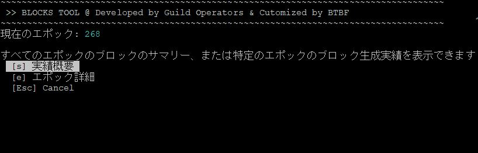

# **10.ステークプールブロックログ導入手順**


!!! info "ブロックログについて"
    このツールはウロボロスにおける自プールのブロック生成スケジュールを事前に取得するツールです。  
    <font color=red>ブロック生成スケジュールはセキュリティ上パブリックには公開されません。</font>


## **10-0. インストール要件**

!!! abstract "設定サーバー"
    * BPノード限定

!!! abstract "稼働要件"

    * ４つのサービス(プログラム)をsystemdにて常駐させます。
    * ブロックチェーン同期用DBを新しく設置します(sqlite3)
    * 日本語マニュアルのフォルダ構成に合わせて作成されています。
    * vrf.skey と vrf.vkeyが必要です。

!!! abstract "プログラム構成図"
    ``` mermaid
        flowchart TB
            a1[cardano-node] --> a2[logファイル]
            a3 --> a5[leaderlog.service]
            a3 --> a6[validate.service]
            a1[cardano-node] --> a3[cncli.service]
            a2 --> a4[logmonitor.service]
            a3[cncli.service]
            a4[logmonitor.service]
            a5[leaderlog.service]
            a6[validate.service]
            subgraph Guild-DB
                a7[cncli.db]
                a8[blocklog.db]
            end
            subgraph ステータス通知
                a9[blocknotify] --> 各アプリ
            end
            Guild-DB --> blocks.sh
            a8[blocklog.db] --> a9[blocknotify]
            a3[cncli.service] --> a7[cncli.db]
            a5[leaderlog.service] --> a8[blocklog.db]
            a6[validate.service] --> a8[blocklog.db]
            
    ```


 

## **10-1. CNCLIインストール**

!!! info "CNCLIについて"
    [AndrewWestberg](https://twitter.com/amw7)さんによって開発された[CNCLI](https://github.com/cardano-community/cncli)はプールのブロック生成スケジュールを算出し、Shelley期におけるSPOに革命をもたらしました。

  
RUST環境を準備します

```bash
mkdir $HOME/.cargo && mkdir $HOME/.cargo/bin
chown -R $USER $HOME/.cargo
touch $HOME/.profile
chown $USER $HOME/.profile
```

rustupをインストールします-デフォルトのインストールを続行します（オプション1）
```bash
curl --proto '=https' --tlsv1.2 -sSf https://sh.rustup.rs | sh
```

> 1) Proceed with installation (default)  1を入力してEnter

```bash
source $HOME/.cargo/env
rustup install stable
rustup default stable
rustup update
rustup component add clippy rustfmt
rustup target add x86_64-unknown-linux-musl
```

依存関係をインストールします

```bash
source $HOME/.cargo/env
sudo apt update -y && sudo apt install -y automake build-essential pkg-config libffi-dev libgmp-dev libssl-dev libtinfo-dev libsystemd-dev zlib1g-dev make g++ tmux git jq wget libncursesw5 libtool autoconf musl-tools
```

CNCLIをダウンロード・インストール
```bash
cd $HOME
cncli_release="$(curl -s https://api.github.com/repos/cardano-community/cncli/releases/latest | jq -r '.tag_name' | sed -e "s/^.\{1\}//")"
```
```
curl -sLJ https://github.com/cardano-community/cncli/releases/download/v${cncli_release}/cncli-${cncli_release}-ubuntu22-x86_64-unknown-linux-gnu.tar.gz -o $HOME/cncli-${cncli_release}-x86_64-unknown-linux-gnu.tar.gz
```
```
tar xzvf $HOME/cncli-${cncli_release}-x86_64-unknown-linux-gnu.tar.gz -C $HOME/.cargo/bin/
```
```
rm $HOME/cncli-${cncli_release}-x86_64-unknown-linux-gnu.tar.gz
```

CNCLIのバージョンを確認します。
```bash
cncli --version
```
> 6.3.0 が最新バージョンです

## **10-2. sqlite3インストール**

```bash
sudo apt install sqlite3
sqlite3 --version
```
> 3.31.1以上のバージョンがインストールされたらOKです。


## **10-3. 依存ファイルダウンロード**

依存関係のあるプログラムをダウンロードします。

```bash
cd $NODE_HOME
mkdir scripts
cd $NODE_HOME/scripts
wget https://raw.githubusercontent.com/cardano-community/guild-operators/master/scripts/cnode-helper-scripts/cncli.sh -O ./cncli.sh
wget https://raw.githubusercontent.com/cardano-community/guild-operators/master/scripts/cnode-helper-scripts/env -O ./env
wget https://raw.githubusercontent.com/cardano-community/guild-operators/master/scripts/cnode-helper-scripts/gLiveView.sh -O ./gLiveView.sh
wget https://raw.githubusercontent.com/cardano-community/guild-operators/master/scripts/cnode-helper-scripts/cntools.library -O ./cntools.library
wget https://raw.githubusercontent.com/btbf/spojapanguild/master/scripts/blocks.sh -O ./blocks.sh 
wget https://raw.githubusercontent.com/btbf/spojapanguild/master/scripts/logMonitor.sh -q -O ./logMonitor.sh
```

**パーミッションを設定する**
```bash
chmod 755 cncli.sh
chmod 755 logMonitor.sh
chmod 755 gLiveView.sh
chmod 755 blocks.sh
```

**設定ファイルを修正する**

envファイルを修正します

```bash
PORT=`grep "PORT=" $NODE_HOME/startBlockProducingNode.sh`
b_PORT=${PORT#"PORT="}
echo "BPポートは${b_PORT}です"
```
```bash
sed -i $NODE_HOME/scripts/env \
  -e '1,73s!#CNODEBIN="${HOME}/.local/bin/cardano-node"!CNODEBIN="/usr/local/bin/cardano-node"!' \
  -e '1,73s!#CCLI="${HOME}/.local/bin/cardano-cli"!CCLI="/usr/local/bin/cardano-cli"!' \
  -e '1,73s!#CNCLI="${HOME}/.local/bin/cncli"!CNCLI="${HOME}/.cargo/bin/cncli"!' \
  -e '1,73s!#CNODE_HOME="/opt/cardano/cnode"!CNODE_HOME='${NODE_HOME}'!' \
  -e '1,73s!#CNODE_PORT=6000!CNODE_PORT='${b_PORT}'!' \
  -e '1,73s!#UPDATE_CHECK="Y"!UPDATE_CHECK="N"!' \
  -e '1,73s!#CONFIG="${CNODE_HOME}/files/config.json"!CONFIG="${CNODE_HOME}/'${NODE_CONFIG}'-config.json"!' \
  -e '1,73s!#SOCKET="${CNODE_HOME}/sockets/node.socket"!SOCKET="${CNODE_HOME}/db/socket"!' \
  -e '1,73s!#BLOCKLOG_TZ="UTC"!BLOCKLOG_TZ="Asia/Tokyo"!' \
  -e '1,73s!#POOL_NAME=""!POOL_DIR=${CNODE_HOME}!'
```

**cncli.shファイルを修正します**

プールIDを確認する。以下のコマンドをすべてコピーして実行してください
```
pool_hex=`cat $NODE_HOME/pool.id`
pool_bech32=`cat $NODE_HOME/pool.id-bech32`
printf "\nプールID(hex)は \e[32m${pool_hex}\e[m です\n\n"
printf "\nプールID(bech32)は \e[32m${pool_bech32}\e[m です\n\n"
```

<strong><font color=red>ご自身のプールID `2種類`が表示されていることを確認してください</font></strong>  
プールIDが表示されていない場合は、[こちらの手順](../setup/7-register-stakepool.md#4)を実行してください  

<br>
cncli.shファイルを修正します。以下のコマンドをすべてコピーして実行してください
```
sed -i $NODE_HOME/scripts/cncli.sh \
-e '1,30s!#POOL_ID=""!POOL_ID="'${pool_hex}'"!' \
-e '1,30s!#POOL_ID_BECH32=""!POOL_ID_BECH32="'${pool_bech32}'"!' \
-e '1,30s!#POOL_VRF_SKEY=""!POOL_VRF_SKEY="${CNODE_HOME}/vrf.skey"!' \
-e '1,30s!#POOL_VRF_VKEY=""!POOL_VRF_VKEY="${CNODE_HOME}/vrf.vkey"!'
```

## **10-4. サービスファイル作成・登録**

```bash
cd $NODE_HOME
mkdir service
cd service
```

=== "cncli"
    ```bash title="このボックスはすべてコピーして実行してください"
    cat > $NODE_HOME/service/cnode-cncli-sync.service << EOF 
    # file: /etc/systemd/system/cnode-cncli-sync.service

    [Unit]
    Description=Cardano Node - CNCLI sync
    BindsTo=cardano-node.service
    After=cardano-node.service

    [Service]
    Type=simple
    Restart=on-failure
    RestartSec=20
    User=$(whoami)
    WorkingDirectory=${NODE_HOME}/scripts
    ExecStart=/bin/bash -l -c "exec ${NODE_HOME}/scripts/cncli.sh sync"
    ExecStop=/bin/bash -l -c "exec kill -2 \$(ps -ef | grep [c]ncli.sync.*.${NODE_HOME}/ | tr -s ' ' | cut -d ' ' -f2) &>/dev/null"
    KillSignal=SIGINT
    SuccessExitStatus=143
    StandardOutput=syslog
    StandardError=syslog
    SyslogIdentifier=cnode-cncli-sync
    TimeoutStopSec=5
    KillMode=mixed

    [Install]
    WantedBy=cardano-node.service
    EOF
    ```

=== "validate"
    ```bash title="このボックスはすべてコピーして実行してください"
    cat > $NODE_HOME/service/cnode-cncli-validate.service << EOF 
    # file: /etc/systemd/system/cnode-cncli-validate.service

    [Unit]
    Description=Cardano Node - CNCLI validate
    BindsTo=cnode-cncli-sync.service
    After=cnode-cncli-sync.service

    [Service]
    Type=simple
    Restart=on-failure
    RestartSec=20
    User=$(whoami)
    WorkingDirectory=${NODE_HOME}/scripts
    ExecStartPre=/bin/sleep 5
    ExecStart=/bin/bash -l -c "exec ${NODE_HOME}/scripts/cncli.sh validate"
    SuccessExitStatus=143
    StandardOutput=syslog
    StandardError=syslog
    SyslogIdentifier=cnode-cncli-validate
    TimeoutStopSec=5
    KillMode=mixed

    [Install]
    WantedBy=cnode-cncli-sync.service
    EOF
    ```

=== "leaderlog"
    ```bash title="このボックスはすべてコピーして実行してください"
    cat > $NODE_HOME/service/cnode-cncli-leaderlog.service << EOF
    # file: /etc/systemd/system/cnode-cncli-leaderlog.service

    [Unit]
    Description=Cardano Node - CNCLI Leaderlog
    BindsTo=cnode-cncli-sync.service
    After=cnode-cncli-sync.service

    [Service]
    Type=simple
    Restart=on-failure
    RestartSec=20
    User=$(whoami)
    WorkingDirectory=${NODE_HOME}
    ExecStart=/bin/bash -l -c "exec ${NODE_HOME}/scripts/cncli.sh leaderlog"
    SuccessExitStatus=143
    StandardOutput=syslog
    StandardError=syslog
    SyslogIdentifier=cnode-cncli-leaderlog
    TimeoutStopSec=5
    KillMode=mixed

    [Install]
    WantedBy=cnode-cncli-sync.service
    EOF
    ```

=== "logmonitor"
    ```bash title="このボックスはすべてコピーして実行してください"
    cat > $NODE_HOME/service/cnode-logmonitor.service << EOF 
    # file: /etc/systemd/system/cnode-logmonitor.service

    [Unit]
    Description=Cardano Node - CNCLI logmonitor
    BindsTo=cardano-node.service
    After=cardano-node.service

    [Service]
    Type=simple
    Restart=on-failure
    RestartSec=1
    User=$(whoami)
    WorkingDirectory=${NODE_HOME}
    ExecStart=/bin/bash -l -c "exec ${NODE_HOME}/scripts/logMonitor.sh"
    ExecStop=/bin/bash -l -c "exec kill -2 \$(ps -ef | grep -m1 ${NODE_HOME}/scripts/logMonitor.sh | tr -s ' ' | cut -d ' ' -f2) &>/dev/null"
    KillSignal=SIGINT
    SuccessExitStatus=143
    StandardOutput=syslog
    StandardError=syslog
    SyslogIdentifier=cnode-logmonitor
    TimeoutStopSec=5
    KillMode=mixed

    [Install]
    WantedBy=cardano-node.service
    EOF
    ```


**サービスファイルをシステムフォルダにコピーして権限を付与します**

**1行ずつコマンドに貼り付けてください**
```bash
sudo cp $NODE_HOME/service/cnode-cncli-sync.service /etc/systemd/system/cnode-cncli-sync.service
sudo cp $NODE_HOME/service/cnode-cncli-validate.service /etc/systemd/system/cnode-cncli-validate.service
sudo cp $NODE_HOME/service/cnode-cncli-leaderlog.service /etc/systemd/system/cnode-cncli-leaderlog.service
sudo cp $NODE_HOME/service/cnode-logmonitor.service /etc/systemd/system/cnode-logmonitor.service
```

```bash
sudo chmod 644 /etc/systemd/system/cnode-cncli-sync.service
sudo chmod 644 /etc/systemd/system/cnode-cncli-validate.service
sudo chmod 644 /etc/systemd/system/cnode-cncli-leaderlog.service
sudo chmod 644 /etc/systemd/system/cnode-logmonitor.service
```

**サービスファイルを有効化します**

```bash
sudo systemctl daemon-reload
sudo systemctl enable cnode-cncli-sync.service
sudo systemctl enable cnode-cncli-validate.service
sudo systemctl enable cnode-cncli-leaderlog.service
sudo systemctl enable cnode-logmonitor.service
```

**便利なエイリアス設定**
!!! hint "エイリアス設定"
    スクリプトへのパスを通し、エイリアスで起動出来るようにする。
    ```
    echo alias cnclilog='"journalctl --no-hostname -u cnode-cncli-sync -f"' >> $HOME/.bashrc
    echo alias validate='"journalctl --no-hostname -u cnode-cncli-validate -f"' >> $HOME/.bashrc
    echo alias leaderlog='"journalctl --no-hostname -u cnode-cncli-leaderlog -f"' >> $HOME/.bashrc
    echo alias logmonitor='"journalctl --no-hostname -u cnode-logmonitor -f"' >> $HOME/.bashrc
    ```

    環境変数再読み込み
    ```
    source $HOME/.bashrc
    ```

    以下のコマンドを入力して実行すると、サービスファイルログが閲覧できます。  
    単語を入力するだけで、起動状態(ログ)を確認できます。  
    `cnclilog`　`validate`　`leaderlog`　`logmonitor`

## **10-5. ブロックチェーンとDBを同期**

**cncli-sync**サービスを開始します
```bash
sudo systemctl start cnode-cncli-sync.service
```

cncliログ確認
```
cnclilog
```

!!! info "確認"
    * cncli同期確認「100.00% synced」になるまで待ちます。  
    100%になったら、Ctrl+cで閉じます。

他サービスの起動確認

=== "validate"

    !!! info ""
        こちらのサービスは生成したブロックがブロックチェーン上に記録されているか照合します。

        ```
        validate
        ```

        以下の表示なら正常です。
        > ~ CNCLI Block Validation started ~
        
        Ctrl+cで閉じます

=== "leaderlog"

    !!! info ""

        こちらのサービスはスロットリーダーを自動的に算出します。 
        次エポックの1.5日前から次エポックのスケジュールを算出することができます。

        ```
        leaderlog
        ```

        以下の表示なら正常です。  
        > ~ CNCLI Leaderlog started ~

        Ctrl+cで閉じます

=== "logmonitor"

    !!! info ""
        こちらのサービスはプールのノードログからブロック生成結果を抽出します。

        ```
        logmonitor
        ```

        以下の表示なら正常です。  

        > ~~ LOG MONITOR STARTED ~~  
        > monitoring logs/node.json for traces

        Ctrl+cで閉じます


## **10-6. ブロックログを表示する**

このツールでは上記で設定してきたプログラムを組み合わせ、割り当てられたスロットリーダーに対してのブロック生成結果をデータベースに格納し、確認することができます。

```bash
cd $NODE_HOME/scripts
./blocks.sh
```

!!! hint "便利な設定"
    スクリプトへのパスを通し、任意の単語で起動出来るようにする。
    ```bash
    echo alias blocks="'cd $NODE_HOME/scripts; ./blocks.sh'" >> $HOME/.bashrc
    source $HOME/.bashrc
    ```

    ターミナル上で`blocks`と入力し実行するだけで起動できます。  
     




（ｓ）実績概要---エポック毎のブロック生成実績参照  
（ｅ）エポック詳細---個別エポックのブロック生成スケジュールおよび生成実績参照


ブロックステータス

| 項目     | 意味                          |
| ----------- | ------------------------------------ |
| **Leader**       | ブロック生成割り当て数  |
| **Ideal**       | アクティブステーク（シグマ）に基づいて割り当てられたブロック数の期待値/理想値 |
| **Luck**    | 期待値における実際に割り当てられたスロットリーダー数のパーセンテージ |
| **Adopted**    | ブロック生成フラグ |
| **Confirmed**    | 生成したブロックのうち確実にオンチェーンであることが検証されたブロック (ブロック生成成功) |
| **Missed**    | スロットでスケジュールされているが、 cncli DB には記録されておらず他のプールがこのスロットのためにブロックを作った可能性 |
| **Ghosted**    | ブロックは作成されましたが「Orphans(孤立ブロック)」となっております。 スロットバトル・ハイトバトルで敗北したか、ブロック伝播の問題で有効なブロックになっていません |
| **Stolen**    | 別のプールに有効なブロックが登録されているため、スロットバトルで敗北した可能性 |
| **Invalid**    | プールはブロックの作成に失敗しました。base64でエンコードされたエラーメッセージがlogmonitorに表示されます |
 
Invalidのエラー内容は次のコードでデコードできます 
```
echo (base64コードを入れる) | base64 -d | jq -r
```

メニュー項目が文字化けする場合は、システム文字コードが「UTF-8」であることを確認してください。  
```bash
echo $LANG
```


## **10-7. スケジュールを取得する**

!!! hit "ブロック生成スケジュール取得のタイミングについて"
    取得タイミングは、エポックスロットが約302400を過ぎてから次エポックのスケジュールを自動取得します(次エポックの1.5日前)  
    [11.ブロック生成ステータス通知](./11-blocknotify-setup.md)を導入することで任意の通知プラットフォームへ通知することが可能です。    


!!! Tip

    * スケジュールの中に`Error: database is locked`がある場合は、よくある質問の[Q4.スケジュール取得時「Error: database is locked」が表示される](../faq/blocklog.md#q4error-database-is-locked)をご確認ください
    * `Leaderslots: 0 - Ideal slots for epoch based on active stake: 0.01 - Luck factor 0%`が表示された場合は、残念がらブロック生成スケジュールはありません。


1エポックで1ブロック割り当てられるために必要な委任量の目安は以下の通りです。%は確率  
1M 60%  
2M 85%  
3M 95%  
  
プール開設時は、2エポック後から割り当てがスタートします。  
303 プール登録   
304 待機期間 次エポックスケジュール算出  
305 委任有効 ブロック生成  
306 報酬計算  
307 報酬振り込み   


!!! info "ブロック生成ステータスを通知する"
    ブロックログDBに保存されるブロック生成ステータスをLINE/Slack/discord/telegramに通知することができます。  
    設定手順は[SPO BlockNotify設定](./11-blocknotify-setup.md)を参照してください。


## 10-99.CNCLI更新手順
**以下は最新版がリリースされた場合に実行してください**  

cncli旧バージョンからの更新手順

!!! info "注意"
    １時間以内にブロック生成スケジュールがないことを確認してから、以下を実施してください


**CNCLIをアップデートする**

```bash
cd $HOME
cncli_release="$(curl -s https://api.github.com/repos/cardano-community/cncli/releases/latest | jq -r '.tag_name' | sed -e "s/^.\{1\}//")"
```
```
curl -sLJ https://github.com/cardano-community/cncli/releases/download/v${cncli_release}/cncli-${cncli_release}-ubuntu22-x86_64-unknown-linux-gnu.tar.gz -o $HOME/cncli-${cncli_release}-x86_64-unknown-linux-gnu.tar.gz
```
```
tar xzvf $HOME/cncli-${cncli_release}-x86_64-unknown-linux-gnu.tar.gz -C $HOME/.cargo/bin/
```
```
rm $HOME/cncli-${cncli_release}-x86_64-unknown-linux-gnu.tar.gz
```

バージョン確認
```
cncli --version
```
> cncli 6.0.1になったことを確認する 

ノードを再起動する
```bash
sudo systemctl reload-or-restart cardano-node
```
> ノードが同期したことを確認する

```
cnclilog
```
>100% syncedになったことを確認する


### スケジュールにないブロックが生成される場合

CNCLIのブロック生成スケジュールは正しい値が取得できていれば、100%正確です。  
cncli.dbを再作成することで正しいスケジュールを取得することができます。

修正手順

・サービスを止める
```
sudo systemctl stop cnode-cncli-sync.service
```

cncli.dbを削除する
```
cd $NODE_HOME/guild-db/cncli
rm cncli.db
```

サービスを起動し、同期が100％になるまで待つ
```
sudo systemctl start cnode-cncli-sync.service
```


!!! info "制作クレジット"
    このツールは海外ギルドオペレーター制作の[CNCLI By AndrewWestberg](https://github.com/cardano-community/cncli)、[logmonitor by Guild Operators](https://cardano-community.github.io/guild-operators/#/Scripts/logmonitor)、[Guild LiveView](https://cardano-community.github.io/guild-operators/#/Scripts/gliveview)、[BLOCK LOG for CNTools](https://cardano-community.github.io/guild-operators/#/Scripts/cntools)を組み合わせたツールとなっております。カスタマイズするにあたり、開発者の[AHLNET(AHL)](https://twitter.com/olaahlman)にご協力頂きました。ありがとうございます。