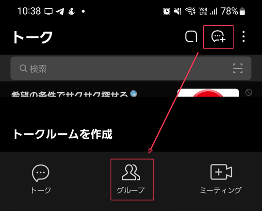
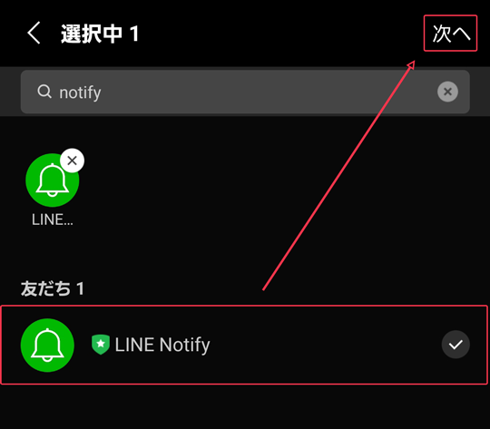
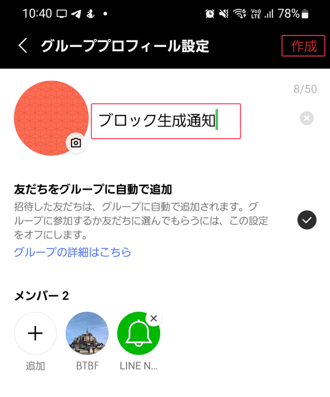
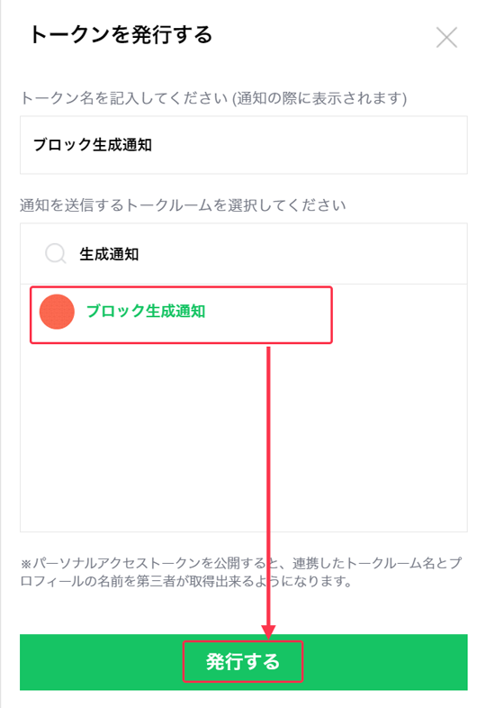
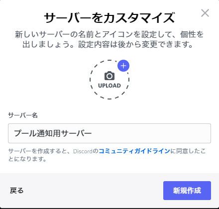
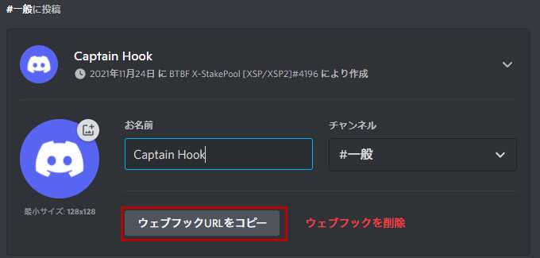
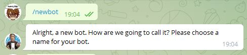
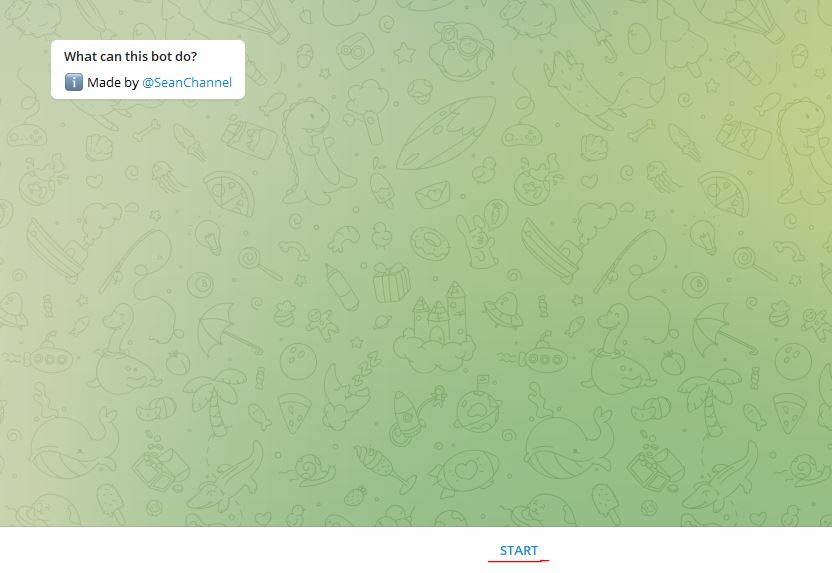
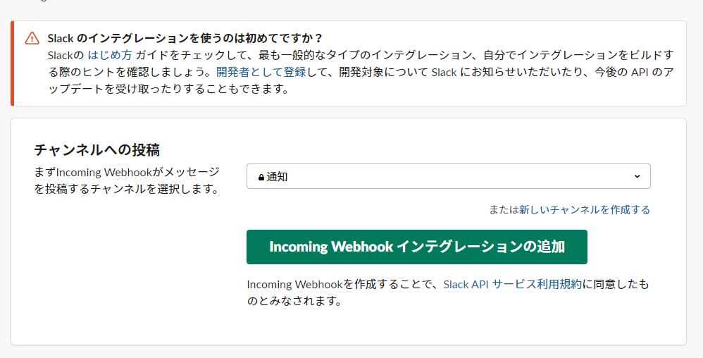
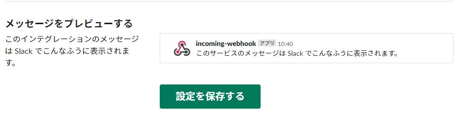

# ** ブロック生成ステータス通知 **

!!! info "概要"
    最終更新日：2023/03/11  v1.9.0

    * ブロックログで表示されるブロック生成結果を任意のソーシャルアプリへ通知します。 
    

    * ブロック生成スケジュールを自動取得し、取得スケジュール一覧を通知します。
    

    * 通知先対応アプリ LINE/Slack/discord/telegram
 
    * ブロックログと連動しておりますので、まだ設定されてない場合は[ブロックログ導入手順](./10-blocklog-setup.md)を先に導入してください。

    * 以下の作業はguild-dbが存在するBPサーバーのみで実施し、ブロック生成スケジュールがないタイミングで実施してください。 

    * 設定は任意です。(設定しなくてもブロック生成に影響はありません)


??? info "更新履歴▼"
    * 1.9.0　・ノード再起動時のエラー修正
    * 1.8.9　・エポック境界の通知内容不具合修正  
    　　　・通知内容フォーマット変更
    
    * 1.8.8 ・ステータス通知サービス起動時に通知  
    　　　・通知先トークン未入力の場合にサービス画面でエラー排出
    * 1.8.7 ノード再起動後、通知されない不具合を修正
    * 1.8.6 スケジュール取得自動化導入(選択式)  
    　　　・取得スケジュール一覧通知
    * 1.7 スケジュール取得タイミング通知  
    　　　・生成ブロックのPooltoolリンク追加
    * 1.6 ブロック未生成プールで使用する場合の起動時エラーを修正
    * 1.5 10分以内に複数のスケジュールがある場合の通知バグ修正
    * 1.4 次のスケジュールを表示
    * 1.3 ノード再起動時の不具合を修正
    * 1.2.3 エポック取得フロー修正
    * 1.2.2 通知バグ修正
    * 1.2 ・Telegram、Slackに対応  
    　　　・通知基準設定( 全て/confirm以外全て/Missedとivaildのみ)  
    　　　・通知内容を変更(X番目/トータルスケジュール数)  
    * 1.1 スケジュール取得時、その他通知判定修正  
    * 1.0.1 軽微な修正  
    * 1.0 初版リリース  


## **11-1. 依存プログラムをインストールする**

### **Python環境をセットアップする**

pythonバージョンを確認する
```bash
python3 -V
```
> Python 3.8.10以上 

パッケージを更新する
```bash
sudo apt update -y
```

```bash
sudo apt install -y python3-watchdog python3-tz python3-dateutil python3-requests build-essential libssl-dev libffi-dev python3-dev python3-pip
```
```bash
pip install discordwebhook python-dotenv slackweb
```

### **実行スクリプトと設定ファイルをダウンロードする**

```bash
cd $NODE_HOME/guild-db/blocklog
wget -N https://raw.githubusercontent.com/btbf/spojapanguild/master/scripts/block_notify/block_check.py
wget -N https://raw.githubusercontent.com/btbf/spojapanguild/master/scripts/block_notify/.env
chmod 755 block_check.py
```
### cncli.sh適用状態確認
** cncli.sh適用状態を確認する**  
スケジュール取得自動化にはKOIOS-API対応のcncli.shが必要となります。以下のコマンドを実行し確認してください。
```
cat $NODE_HOME/scripts/cncli.sh | grep -o '#USE_KOIOS_API=Y'
```
!!! hint "戻り値確認"
    === "戻り値あり"
        `#USE_KOIOS_API=Y` の戻り値があれば、対応するcncli.shが適用されています。  
        次へ進んでください。

    === "戻り値なし"
        * cardano-node1.35.5へ[アップデート](../operation/node-update.md)を実施してください。
        * ノード1.35.5適用済の方は[Guildスクリプト](../operation/node-update.md#__tabbed_1_2)のバージョンアップを実施してください。


## **11-2. 通知アプリの設定**

通知させたいアプリのタブをクリックし設定を確認してください。

=== "LINE"
    * **1.LINEグループを作成する**  
    

    * **2.「Line Notify」を追加する**
    

    * **3.任意のグループ名を設定し「作成」をクリックする**
    

    * **4.[LINE Notifyマイページ](https://notify-bot.line.me/my/)にアクセスする**  
    
    * **5.トークンを発行するをクリックします**  
    
    
    * **6.トークン名「ブロック生成通知」(任意)を入力し、3で作成したグループ名を選択する**  
    
    
    * **7.「発行する」をクリックする**
    
    * **8.表示されたトークンをコピーし、一旦メモ帳などに貼り付ける**    
    （発行されたトークンを閉じると2度と確認できませんのでご注意ください）  
    

=== "Discord"

    * 1.サーバーを追加する  
    
    
    * 2.「オリジナルの作成」を選択する  
    
    
    * 3.「自分と友達のため」を選択する  
    
    
    * 4.任意のサーバー名を入力して「新規作成」をクリックする  
    
    
    * 5.通知したいチャンネルの歯車マークをクリックする  
    
    
    * 6.「連携サービス」をクリックし、「ウェブフックを作成」をクリックする  
    
    
    * 7.「ウェブフックURLをコピー」をクリックし、一旦メモ帳などに貼り付ける  
    


=== "Telegram"
    * 1.Telegramの検索欄で「@botFather」を検索して認証マーク付きのアカウントをクリックする  
    

    * 2.「START」をクリックする  
    

    * 3.「/newbot」コマンドを入力する  
    

    * 4.任意のbot名を入力する 例）「btbf_bot」最後は必ず`_bot`で終わるようにする  
    

    * 5.緑で隠した部分のAPIトークンをメモ帳に控える  
    

    * 6.赤枠で囲ったbotチャンネルに参加する  
    

    * 7.検索欄で「@RawDataBot」を検索してクリックする  
    

    * 8.「START」をクリックする  
    

    * 9.「Chat id」をメモ帳に控える  
    

=== "Slack"
    * 1.Slackを起動し、通知用のワークスペースとチャンネルを設定する

    * 2.[Incoming Webhook](https://my.slack.com/services/new/incoming-webhook/)の設定ページへアクセスする

    * 3.通知したいワークスペースとチャンネルを選択する  
    

    * 4.「Webhook URL」をメモ帳に控える  
    

    * 5.ページ下部の「設定を保存する」をクリックする  
    

## **11-3. 通知プログラムの設定**

###  **設定ファイルの編集**
```bash
cd $NODE_HOME/guild-db/blocklog
nano .env
```
> .envは隠しファイルになっているので、`ls -a`コマンドで一覧表示されます。

!!! hint "envファイル内容詳細"
    | 項目      | 使用用途                          |
    | ----------- | ------------------------------------ |
    | `ticker`       | プールティッカー名を入力する  |
    | `line_notify_token`      | Line Notifyトークンを入力する |
    | `dc_notify_url`    | DiscordウェブフックURLを入力する |
    | `slack_notify_url`    | SlackウェブフックURLを入力する |
    | `teleg_token`    | Telegram APIトークンを入力する |
    | `teleg_id`    | Telegram ChatIDを入力する |
    | `b_timezone`    | お住いのタイムゾーンを指定する |
    | `bNotify`    | 通知先を指定する |
    | `bNotify_st`    | 通知基準を設定する |
    | `auto_leader`    | スケジュール取得方法を設定する |

    * 各自の運用方針に合せて、次エポックのスケジュール **「自動取得」**または **「手動取得」** を選択してください。 
    * **「自動取得」** は、エポックスロットが約302400を過ぎてから自動的に発動します。
    * **「手動取得」** は、[手動でのコマンド実行](./10-blocklog-setup.md#10-9)によるスケジュール取得となります。


### **サービスファイルを設定する**
=== "ブロックプロデューサーノード"
    ```bash
    cat > $NODE_HOME/service/cnode-blockcheck.service << EOF 
    # file: /etc/systemd/system/cnode-blockcheck.service

    [Unit]
    Description=Cardano Node - CNCLI blockcheck
    BindsTo=cnode-cncli-sync.service
    After=cnode-cncli-sync.service

    [Service]
    Type=oneshot
    RemainAfterExit=yes
    Restart=on-failure
    RestartSec=20
    User=$(whoami)
    WorkingDirectory=$NODE_HOME
    ExecStart=/usr/bin/tmux new -d -s blockcheck
    ExecStartPost=/usr/bin/tmux send-keys -t blockcheck 'cd $NODE_HOME/guild-db/blocklog' Enter
    ExecStartPost=/usr/bin/tmux send-keys -t blockcheck python3 Space block_check.py Enter
    ExecStop=/usr/bin/tmux kill-session -t blockcheck
    KillSignal=SIGINT
    RestartKillSignal=SIGINT
    SuccessExitStatus=143
    StandardOutput=syslog
    StandardError=syslog
    SyslogIdentifier=cnode-blockcheck
    TimeoutStopSec=5

    [Install]
    WantedBy=cnode-cncli-sync.service
    EOF
    ```

    ```
    sudo cp $NODE_HOME/service/cnode-blockcheck.service /etc/systemd/system/cnode-blockcheck.service
    sudo chmod 644 /etc/systemd/system/cnode-blockcheck.service
    ```

    ```
    sudo systemctl daemon-reload
    sudo systemctl enable cnode-blockcheck.service
    ```
    ノードを再起動する
    ```
    sudo systemctl reload-or-restart cardano-node
    ```

### **起動確認**
```
tmux a -t blockcheck
```
> 「Guild-db monitoring started」 が表示されていればOKです  
> 任意の通知先に通知が届いているか確認してください  
> cnode-cncli-sync.serviceと同じく、node再起動・停止と連動します

### **通知確認**
ブロック生成スケジュール予定時刻が過ぎてから、約15分以内に通知が届きます。

## **11-4. バージョンアップ手順**

サービスを停止する
```
sudo systemctl stop cnode-blockcheck.service
```

**バージョン確認**
```
cd $NODE_HOME/guild-db/blocklog
cat block_check.py | grep -HnI -m1 -r btbf
```

??? danger "バージョン1.7以下の場合はこちらを先に実行する(クリックして開く)"
    **1) cncli.sh適用状態を確認する**  
    スケジュール取得自動化にはKOIOS-API対応のcncli.shが必要となります。以下のコマンドを実行し確認してください。
    ```
    cat $NODE_HOME/scripts/cncli.sh | grep -o '#USE_KOIOS_API=Y'
    ```
    !!! hint "戻り値確認"
        === "戻り値あり"
            `#USE_KOIOS_API=Y` の戻り値があれば、対応するcncli.shが適用されています。  
            2)へ進んでください。

        === "戻り値なし"
            * cardano-node1.35.5へ[アップデート](../operation/node-update.md)を実施してください。
            * ノード1.35.5適用済の方は[Guildスクリプト](../operation/node-update.md#__tabbed_1_2)のバージョンアップを実施してください。

    <br>
    **2) ステータス通知用`.env`ファイルを修正する**  

    * 各自の運用方針に合せて、次エポックのスケジュール **「自動取得」**または **「手動取得」** を選択してください。 
    * **「自動取得」** は、エポックスロットが約302400を過ぎてから自動的に発動します。
    * **「手動取得」** は、[手動でのコマンド実行](./10-blocklog-setup.md#10-9)によるスケジュール取得となります。

    === "自動取得にする場合"
        ```
        sed -i $NODE_HOME/guild-db/blocklog/.env \
        -e '1,73s!###############################!\n#リーダースケジュール自動取得 自動:1 手動:0\nauto_leader = "1"!'
        ```
    === "手動取得にする場合"
        ```
        sed -i $NODE_HOME/guild-db/blocklog/.env \
        -e '1,73s!###############################!\n#リーダースケジュール自動取得 自動:1 手動:0\nauto_leader = "0"!'
        ```

    !!! hint "参考"
        上記で実行するコマンドは、スケジュール自動/手動化に対応するフラグを`.env`に追加しています。 
        ```
        #リーダースケジュール自動取得 自動:1 手動:0
        auto_leader = "1"
        ```


スクリプトをダウンロードする
```
cd $NODE_HOME/guild-db/blocklog
wget https://raw.githubusercontent.com/btbf/spojapanguild/master/scripts/block_notify/block_check.py -O block_check.py
```
**バージョン確認**
```
cd $NODE_HOME/guild-db/blocklog
cat block_check.py | grep -HnI -m1 -r btbf
```
現在の最新バージョン
> #2023/03/11 v1.9.0 @btbf

サービスを再起動する
```
sudo systemctl start cnode-blockcheck.service
```

サービス起動確認
```
tmux a -t blockcheck
```
> 「Guild-db monitoring started」 が表示されていればOKです。(デタッチして戻る)   
> 任意の通知先に通知が届いているか確認してください 


## **11-5.通知を停止(アンインストール)する手順**

```
sudo systemctl stop cnode-blockcheck.service
sudo systemctl disable cnode-blockcheck.service
sudo rm /etc/systemd/system/cnode-blockcheck.service
```
