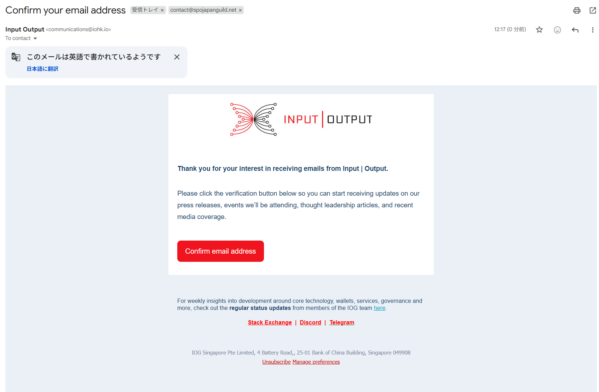

# **12.SPO ニュースレター登録**

!!! info "概要"
    SPOニュースレター日本語版はInput Outputが毎月1回発行するSPO向けのメールマガジンです。  
    海外版にはない日本独自のトピックスや、ハードフォーク情報、パラメータ変更、研究、主要なエコシステムに関する議論に関する最新情報を提供しツールメンテナー、ノードビルダー、研究者、コア開発者、支持者、メンター、サービスプロバイダーなど、エコシステム全体のパートナーと協力して、SPO エクスペリエンスを向上させる情報と機会となっております。

## 登録方法

登録はこちら  
[https://services.iohk.io/ja-jp/spo-newsletter-jp](https://services.iohk.io/ja-jp/spo-newsletter-jp)

入力フォーム参考例  
1. ニュースレターを受け取りたいメールアドレスを入力してください
2. DRepの方はDRepIDの入力もお願い致します
3. SPOギルド所属欄には「SPO JAPAN GUILD」を入力してください

## メールアドレス認証
フォーム入力後、メールアドレス認証用のメールが送られてきますので「Confirm email address」をクリックして認証してください。

この画面が表示されたら認証完了です。  
※表示されるメールアドレスは登録時に入力したメールアドレスです。

## Xフォロー
SPO JAPAN GUILDの最新情報はXでも発信しております！  
[https://x.com/spojapanguild](https://x.com/spojapanguild)  
