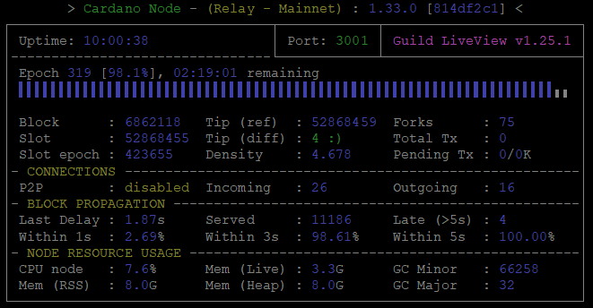

# **2. ノードインストール**

!!! hint "インストールバージョン"
    | Node | CLI | GHC | Cabal | CNCLI |
    | :---------- | :---------- | :---------- | :---------- | :---------- |
    | 9.2.1 | 9.4.1.0 | 8.10.7 | 3.8.1.0 | 6.3.0 |

!!! danger "コマンド実行時の注意点"
    * Ubuntuコマンド初心者の方は、コードボックスに複数行のコマンドがある場合でも、コマンドを1行づつコピーして実行するようにしてください。ただし `cat > xxx << EOF`のボックスについてはコードボックスのコピーボタンを使用してコマンドラインに貼り付けてください。
    * 複数行のコードをコードボックスのコピーボタンを使用してコマンドラインに貼り付ける場合、途中のコマンドでエラーが表示されている場合がありますので見落とさないようご注意ください。また、最後の行が自動実行されないため確認の上Enterを押してコードを実行してください。
    * 複数行のsudoコマンドを一度に貼り付けてsudoパスワードを求められた場合、1行目のコマンドしか実行されませんので残りのコマンドを再度実行してください。
    * Ubuntu22.04の場合、複数行のsudoコマンドを1度に貼り付けると1行目しか実行されませんので、必ず1行ずつ貼り付けて実行してください。

## **2-1. 依存関係インストール**

ターミナルを起動し、以下のコマンドを入力しましょう！

まずはじめに、パッケージを更新しUbuntuを最新の状態に保ちます。

```bash
sudo apt update -y && sudo apt upgrade -y
```
```bash
sudo apt install git jq bc automake tmux rsync htop curl build-essential pkg-config libffi-dev libgmp-dev libssl-dev libtinfo-dev libsystemd-dev zlib1g-dev make g++ wget libncursesw5 libtool autoconf liblmdb-dev -y
```

新しいTMUXセッションを開く

```
tmux new -s build
```

### **Libsodiumインストール**

```bash
mkdir $HOME/git
cd $HOME/git
git clone https://github.com/IntersectMBO/libsodium
cd libsodium
git checkout dbb48cc
./autogen.sh
./configure
make
make check
```
> makeコマンド実行後半に出現する `warning` は無視して大丈夫です。

!!! note "戻り値確認"
    ``` { .yaml .no-copy }
    Testsuite summary for libsodium 1.0.18
    ============================================================================
    # TOTAL: 82
    # PASS:  82
    # SKIP:  0
    # XFAIL: 0
    # FAIL:  0
    # XPASS: 0
    # ERROR: 0
    ============================================================================
    ```

**インストールコマンドを必ず実行する**
```
sudo make install
```


### **Secp256k1ライブラリインストール**

```
cd $HOME/git
git clone https://github.com/bitcoin-core/secp256k1.git
```

```
cd secp256k1/
git checkout acf5c55
./autogen.sh
./configure --prefix=/usr --enable-module-schnorrsig --enable-experimental
make
make check
```
!!! note "戻り値確認"
    ``` { .yaml .no-copy }
    Testsuite summary for libsecp256k1 0.3.2
    ============================================================================
    # TOTAL: 3
    # PASS:  3
    # SKIP:  0
    # XFAIL: 0
    # FAIL:  0
    # XPASS: 0
    # ERROR: 0
    ============================================================================
    ```
    > PASS:3であることを確認する

**インストールコマンドを必ず実行する**
```
sudo make install
```

### **blstインストール**

1.blstダウンロード
```bash
cd $HOME/git
git clone https://github.com/supranational/blst
cd blst
git checkout v0.3.11
./build.sh
```

2.設定ファイル作成

```bash title="このボックスはすべてコピーして実行してください"
cat > libblst.pc << EOF
prefix=/usr/local
exec_prefix=\${prefix}
libdir=\${exec_prefix}/lib
includedir=\${prefix}/include

Name: libblst
Description: Multilingual BLS12-381 signature library
URL: https://github.com/supranational/blst
Version: 0.3.11
Cflags: -I\${includedir}
Libs: -L\${libdir} -lblst
EOF
```

3.設定ファイルコピー

```bash title="Ubuntu22.04の場合は１行づつ実行してください"
sudo cp libblst.pc /usr/local/lib/pkgconfig/
sudo cp bindings/blst_aux.h bindings/blst.h bindings/blst.hpp  /usr/local/include/
sudo cp libblst.a /usr/local/lib
sudo chmod u=rw,go=r /usr/local/{lib/{libblst.a,pkgconfig/libblst.pc},include/{blst.{h,hpp},blst_aux.h}}
```

バージョン確認
```
cat /usr/local/lib/pkgconfig/libblst.pc | grep Version
```
> Version 0.3.11


### **GHCUPインストール**
インストール変数設定
```bash
cd $HOME
BOOTSTRAP_HASKELL_NONINTERACTIVE=1
BOOTSTRAP_HASKELL_NO_UPGRADE=1
BOOTSTRAP_HASKELL_INSTALL_NO_STACK=yes
BOOTSTRAP_HASKELL_ADJUST_BASHRC=1
unset BOOTSTRAP_HASKELL_INSTALL_HLS
export BOOTSTRAP_HASKELL_NONINTERACTIVE BOOTSTRAP_HASKELL_INSTALL_STACK BOOTSTRAP_HASKELL_ADJUST_BASHRC
```

インストール
```bash
curl --proto '=https' --tlsv1.2 -sSf https://get-ghcup.haskell.org | bash
```

<!--
!!! note ""
    戻り値対応

> Press ENTER to proceed or ctrl-c to abort.
Note that this script can be re-run at any given time.

⇒Enter

> Detected bash shell on your system...
Do you want ghcup to automatically add the required PATH variable to "/home/btalonzo/.bashrc"?

> [P] Yes, prepend  [A] Yes, append  [N] No  [?] Help (default is "P").

⇒Pと入力しEnter

> Do you want to install haskell-language-server (HLS)?
HLS is a language-server that provides IDE-like functionality
and can integrate with different editors, such as Vim, Emacs, VS Code, Atom, ...
Also see https://github.com/haskell/haskell-language-server/blob/master/README.md

> [Y] Yes  [N] No  [?] Help (default is "N").

⇒Nと入力しEnter

> Do you want to enable better integration of stack with GHCup?
This means that stack won't install its own GHC versions, but uses GHCup's.
For more information see:
https://docs.haskellstack.org/en/stable/yaml_configuration/#ghc-installation-customisation-experimental
If you want to keep stacks vanilla behavior, answer 'No'.

⇒Nと入力しEnter

> Press ENTER to proceed or ctrl-c to abort.
Installation may take a while.

⇒Enter
-->

!!! attention "Cabal/GHCバージョンについて"
    最新バージョンはcardano-node/cliのビルドに失敗するため必ず以下で指定されたバージョンをインストールしてください。

cabalインストール
```bash
source ~/.bashrc
ghcup upgrade
ghcup install cabal 3.8.1.0
ghcup set cabal 3.8.1.0
```

GHCインストール

```bash
ghcup install ghc 8.10.7
ghcup set ghc 8.10.7
```

バージョン確認

```bash
cabal update
cabal --version
ghc --version
```

!!! check "チェック"
    Cabalバージョン：「3.8.1.0」  
    GHCバージョン：「8.10.7」であることを確認してください。


## **2-2. ソースコードからビルド**

!!! info "確認"
    IOGは現在ARMアーキテクチャ用のバイナリファイルを提供していません。Raspberry Piを使用してプールを構築する場合は、ARM用コンパイラでコンパイルする必要があります。


Gitからソースコードをダウンロードし、最新のタグに切り替えます。

```bash
cd $HOME/git
git clone https://github.com/IntersectMBO/cardano-node.git
cd cardano-node
git fetch --all --recurse-submodules --tags
git checkout tags/9.2.1
```

Cabalのビルドオプションを構成します。

```bash
cabal clean
cabal update
cabal configure --with-compiler=ghc-8.10.7
```

カルダノノードをビルドします。

```sh
cabal build all cardano-cli
```

!!! info "ヒント"
    サーバスペックによって、ビルド完了までに数分から数時間かかる場合があります。


**cardano-cli**ファイルと **cardano-node**ファイルをbinディレクトリにコピーします。

```bash
cd $HOME/git/cardano-node
sudo cp $(./scripts/bin-path.sh cardano-cli) /usr/local/bin/cardano-cli
```

```bash
cd $HOME/git/cardano-node
sudo cp $(./scripts/bin-path.sh cardano-node) /usr/local/bin/cardano-node
```

**cardano-cli** と **cardano-node**のバージョンが最新Gitタグバージョンであることを確認してください。

```bash
cardano-cli version
cardano-node version
```

以下の戻り値を確認する  
>cardano-cli 9.4.1.0 - linux-x86_64 - ghc-8.10  
git rev 5d3da8ac771ee5ed424d6c78473c11deabb7a1f3  

>cardano-node 9.2.1 - linux-x86_64 - ghc-8.10  
git rev 5d3da8ac771ee5ed424d6c78473c11deabb7a1f3  
  

TMUXセッションを閉じる

```
exit
```


環境変数を設定しパスを通します。  
ノード設定ファイルは **$NODE\_HOME**(例：/home/user/cnode) に設定されます。

```bash
echo PATH="$HOME/.local/bin:$PATH" >> $HOME/.bashrc
echo export LD_LIBRARY_PATH="/usr/local/lib:$LD_LIBRARY_PATH" >> $HOME/.bashrc
echo export PKG_CONFIG_PATH="/usr/local/lib/pkgconfig:$PKG_CONFIG_PATH" >> $HOME/.bashrc
echo export NODE_HOME=$HOME/cnode >> $HOME/.bashrc
```

環境変数に接続ネットワークを指定する
```bash
echo export NODE_CONFIG=mainnet >> $HOME/.bashrc
echo export NODE_NETWORK='"--mainnet"' >> $HOME/.bashrc
echo export CARDANO_NODE_NETWORK_ID=mainnet >> $HOME/.bashrc
```

??? テストネットの場合はこちら
    === "Preview(テストネット)"
        ```
        echo export NODE_CONFIG=preview >> $HOME/.bashrc
        echo export NODE_NETWORK='"--testnet-magic 2"' >> $HOME/.bashrc
        echo export CARDANO_NODE_NETWORK_ID=2 >> $HOME/.bashrc
        ```

    === "PreProd(テストネット)"
        ```
        echo export NODE_CONFIG=preprod >> $HOME/.bashrc
        echo export NODE_NETWORK='"--testnet-magic 1"' >> $HOME/.bashrc
        echo export CARDANO_NODE_NETWORK_ID=1 >> $HOME/.bashrc
        ```

bashrc再読み込み
```
source $HOME/.bashrc
```


## **2-3. ノード設定ファイルの修正**

ノード構成に必要な設定ファイルを取得します。  
config.json、genesis.json、topology.json

```bash
mkdir $NODE_HOME
cd $NODE_HOME
wget --no-use-server-timestamps -q https://book.play.dev.cardano.org/environments/${NODE_CONFIG}/byron-genesis.json -O ${NODE_CONFIG}-byron-genesis.json
wget --no-use-server-timestamps -q https://book.play.dev.cardano.org/environments/${NODE_CONFIG}/topology.json -O ${NODE_CONFIG}-topology.json
wget --no-use-server-timestamps -q https://book.play.dev.cardano.org/environments/${NODE_CONFIG}/shelley-genesis.json -O ${NODE_CONFIG}-shelley-genesis.json
wget --no-use-server-timestamps -q https://book.play.dev.cardano.org/environments/${NODE_CONFIG}/alonzo-genesis.json -O ${NODE_CONFIG}-alonzo-genesis.json
wget --no-use-server-timestamps -q https://book.play.dev.cardano.org/environments/${NODE_CONFIG}/conway-genesis.json -O ${NODE_CONFIG}-conway-genesis.json
```

=== "リレーノードで実施"
    ```
    wget --no-use-server-timestamps -q https://book.play.dev.cardano.org/environments/${NODE_CONFIG}/config.json -O ${NODE_CONFIG}-config.json
    ```

=== "ブロックプロデューサーノードで実施"
    ```
    wget --no-use-server-timestamps -q https://book.play.dev.cardano.org/environments/${NODE_CONFIG}/config-bp.json -O ${NODE_CONFIG}-config.json
    ```

以下のコードを実行し **config.json**ファイルを更新します。  

設定ファイルを書き換える

```bash
sed -i ${NODE_CONFIG}-config.json \
    -e '2i \  "SnapshotInterval": 86400,' \
    -e 's!"AlonzoGenesisFile": "alonzo-genesis.json"!"AlonzoGenesisFile": "'${NODE_CONFIG}'-alonzo-genesis.json"!' \
    -e 's!"ByronGenesisFile": "byron-genesis.json"!"ByronGenesisFile": "'${NODE_CONFIG}'-byron-genesis.json"!' \
    -e 's!"ShelleyGenesisFile": "shelley-genesis.json"!"ShelleyGenesisFile": "'${NODE_CONFIG}'-shelley-genesis.json"!' \
    -e 's!"ConwayGenesisFile": "conway-genesis.json"!"ConwayGenesisFile": "'${NODE_CONFIG}'-conway-genesis.json"!' \
    -e 's!"TraceBlockFetchDecisions": false!"TraceBlockFetchDecisions": true!' \
    -e 's!"TraceMempool": false!"TraceMempool": true!' \
    -e 's!"rpKeepFilesNum": 10!"rpKeepFilesNum": 30!' \
    -e 's!"rpMaxAgeHours": 24!"rpMaxAgeHours": 48!' \
    -e '/"defaultScribes": \[/a\    \[\n      "FileSK",\n      "'${NODE_HOME}'/logs/node.json"\n    \],' \
    -e '/"setupScribes": \[/a\    \{\n      "scFormat": "ScJson",\n      "scKind": "FileSK",\n      "scName": "'${NODE_HOME}'/logs/node.json"\n    \},' \
    -e "s/127.0.0.1/0.0.0.0/g"
```

環境変数を追加し、.bashrcファイルを更新します。

```bash
echo export CARDANO_NODE_SOCKET_PATH="$NODE_HOME/db/socket" >> $HOME/.bashrc
source $HOME/.bashrc
```

## **2-4. ノード起動スクリプトの作成**

起動スクリプトには、ディレクトリ、ポート番号、DBパス、構成ファイルパス、トポロジーファイルパスなど、カルダノノードを実行するために必要な変数が含まれています。


=== "リレーノード"
    リレーノードで使用するポート番号を指定してターミナルで実行する
    ```bash
    PORT=6000
    ```

    起動スクリプトファイルを作成する
    ```bash title="このボックスはすべてコピーして実行してください"
    cat > $NODE_HOME/startRelayNode1.sh << EOF 
    #!/bin/bash
    DIRECTORY=$NODE_HOME
    PORT=${PORT}
    HOSTADDR=0.0.0.0
    TOPOLOGY=\${DIRECTORY}/${NODE_CONFIG}-topology.json
    DB_PATH=\${DIRECTORY}/db
    SOCKET_PATH=\${DIRECTORY}/db/socket
    CONFIG=\${DIRECTORY}/${NODE_CONFIG}-config.json
    /usr/local/bin/cardano-node +RTS -N --disable-delayed-os-memory-return -I0.1 -Iw300 -A16m -F1.5 -H2500M -RTS run --topology \${TOPOLOGY} --database-path \${DB_PATH} --socket-path \${SOCKET_PATH} --host-addr \${HOSTADDR} --port \${PORT} --config \${CONFIG}
    EOF
    ```


=== "ブロックプロデューサーノード"

    !!! error "注意"
        * BPノードポートはセキュリティを高めるために、49513～65535までの任意番号を設定してください。ここで設定する番号は1-3で設定した<font color=red>SSHポート番号とは別の番号</font>を設定してください.

    BPノードで使用するポート番号を指定してターミナルで実行する
    ```bash
    PORT=xxxxx
    ```

    起動スクリプトファイルを作成する
    ```bash title="このボックスはすべてコピーして実行してください"
    cat > $NODE_HOME/startBlockProducingNode.sh << EOF 
    #!/bin/bash
    DIRECTORY=$NODE_HOME
    PORT=${PORT}
    HOSTADDR=0.0.0.0
    TOPOLOGY=\${DIRECTORY}/${NODE_CONFIG}-topology.json
    DB_PATH=\${DIRECTORY}/db
    SOCKET_PATH=\${DIRECTORY}/db/socket
    CONFIG=\${DIRECTORY}/${NODE_CONFIG}-config.json
    /usr/local/bin/cardano-node +RTS -N --disable-delayed-os-memory-return -I0.1 -Iw300 -A16m -F1.5 -H2500M -RTS run --topology \${TOPOLOGY} --database-path \${DB_PATH} --socket-path \${SOCKET_PATH} --host-addr \${HOSTADDR} --port \${PORT} --config \${CONFIG}
    EOF
    ```


## **2-5. ノード起動**

起動スクリプトに実行権限を付与し、ブロックチェーンの同期を開始します。 
   
**リレーノードから実施します。**


=== "リレーノード"

    ```bash
    cd $NODE_HOME
    chmod +x startRelayNode1.sh
    ./startRelayNode1.sh
    ```


=== "ブロックプロデューサーノード"

    ```bash
    cd $NODE_HOME
    chmod +x startBlockProducingNode.sh
    ./startBlockProducingNode.sh
    ```

!!! info ""
    ログ内に`Chain extended, new tip: xxxx`のログが流れていたら正常です。


一旦ノードを停止します。
```
Ctrl+C
```

## **2-6. 自動起動の設定(systemd)**

先程のスクリプトだけでは、ターミナル画面を閉じるとノードが終了してしまうので、スクリプトをサービスとして登録し、自動起動するように設定しましょう

!!! hint "ノード起動にsystemdを使用するメリット"

    1. メンテナンスや停電など、自動的にサーバーが再起動したときノードを自動起動します。
    2. クラッシュしたノードプロセスを自動的に再起動します。
    3. ノードの稼働時間とパフォーマンスを向上させます。


以下のコードを実行して、ユニットファイルを作成します。


=== "リレーノード"

    ```bash title="このボックスはすべてコピーして実行してください"
    cat > $NODE_HOME/cardano-node.service << EOF 
    # The Cardano node service (part of systemd)
    # file: /etc/systemd/system/cardano-node.service 

    [Unit]
    Description     = Cardano node service
    Wants           = network-online.target
    After           = network-online.target 

    [Service]
    User            = ${USER}
    Type            = simple
    WorkingDirectory= ${NODE_HOME}
    ExecStart       = /bin/bash -c '${NODE_HOME}/startRelayNode1.sh'
    KillSignal=SIGINT
    RestartKillSignal=SIGINT
    TimeoutStopSec=300
    LimitNOFILE=32768
    Restart=always
    RestartSec=5
    StandardOutput=syslog
    StandardError=syslog
    SyslogIdentifier=cardano-node

    [Install]
    WantedBy	= multi-user.target
    EOF
    ```

=== "ブロックプロデューサーノード"

    ```bash title="このボックスはすべてコピーして実行してください"
    cat > $NODE_HOME/cardano-node.service << EOF 
    # The Cardano node service (part of systemd)
    # file: /etc/systemd/system/cardano-node.service 

    [Unit]
    Description     = Cardano node service
    Wants           = network-online.target
    After           = network-online.target 

    [Service]
    User            = ${USER}
    Type            = simple
    WorkingDirectory= ${NODE_HOME}
    ExecStart       = /bin/bash -c '${NODE_HOME}/startBlockProducingNode.sh'
    KillSignal=SIGINT
    RestartKillSignal=SIGINT
    TimeoutStopSec=300
    LimitNOFILE=32768
    Restart=always
    RestartSec=5
    StandardOutput=syslog
    StandardError=syslog
    SyslogIdentifier=cardano-node

    [Install]
    WantedBy	= multi-user.target
    EOF
    ```

`/etc/systemd/system`にユニットファイルをコピーして、権限を付与します。

```bash
sudo cp $NODE_HOME/cardano-node.service /etc/systemd/system/cardano-node.service
```

```bash
sudo chmod 644 /etc/systemd/system/cardano-node.service
```

次のコマンドを実行して、OS起動時にサービスの自動起動を有効にします。

```bash title="Ubuntu22.04の場合は１行づつ実行してください"
sudo systemctl daemon-reload
sudo systemctl enable cardano-node
sudo systemctl start cardano-node
```
**システム起動後に、ログモニターを表示します**

```text
journalctl --unit=cardano-node --follow
```
> コマンド入力に戻る場合は「Ctrl＋C」（この場合ノードは終了しません）

### 便利なエイリアス設定
!!! hint "エイリアス設定"
    スクリプトへのパスを通し、任意の単語で起動出来るようにする。
    ```bash
    echo alias cnode='"journalctl -u cardano-node -f"' >> $HOME/.bashrc
    echo alias cnstart='"sudo systemctl start cardano-node"' >> $HOME/.bashrc
    echo alias cnrestart='"sudo systemctl reload-or-restart cardano-node"' >> $HOME/.bashrc
    echo alias cnstop='"sudo systemctl stop cardano-node"' >> $HOME/.bashrc
    echo alias cnreload='"pkill -HUP cardano-node"' >> $HOME/.bashrc
    source $HOME/.bashrc
    ```

    単語を入力するだけで、起動状態(ログ)を確認できます。  
    ``` { .yaml .no-copy }
    cnode ・・・ログ表示
    cnstart ・・・ノード起動
    cnrestart ・・・ノード再起動
    cnreload ・・・設定再読み込み
    cnstop ・・・ノード停止
    ```


## **2-7. gLiveViewのインストール**

cardano-nodeはログが流れる画面だけでは何が表示されているのかよくわかりません。  
それを視覚的に確認できるツールが**gLiveView**です。


!!! info ""
    gLiveViewは重要なノードステータス情報を表示し、systemdサービスとうまく連携します。このツールを作成した [Guild Operators](https://cardano-community.github.io/guild-operators/#/Scripts/gliveview) の功績によるものです。


Guild LiveViewをインストールします。

```bash
mkdir $NODE_HOME/scripts
cd $NODE_HOME/scripts
sudo apt install bc tcptraceroute -y
```
```bash
curl -s -o gLiveView.sh https://raw.githubusercontent.com/cardano-community/guild-operators/master/scripts/cnode-helper-scripts/gLiveView.sh
curl -s -o env https://raw.githubusercontent.com/cardano-community/guild-operators/master/scripts/cnode-helper-scripts/env
chmod 755 gLiveView.sh
```

**env** ファイル内の定義を修正します

=== "リレーノード"
    ```bash
    PORT=`grep "PORT=" $NODE_HOME/startRelayNode1.sh`
    b_PORT=${PORT#"PORT="}
    echo "リレーポートは${b_PORT}です"

    ```

=== "ブロックプロデューサーノード"
    ```bash
    PORT=`grep "PORT=" $NODE_HOME/startBlockProducingNode.sh`
    b_PORT=${PORT#"PORT="}
    echo "BPポートは${b_PORT}です"
    ```


```bash
sed -i $NODE_HOME/scripts/env \
    -e '1,73s!#CNODE_HOME="/opt/cardano/cnode"!CNODE_HOME=${NODE_HOME}!' \
    -e '1,73s!#CNODE_PORT=6000!CNODE_PORT='${b_PORT}'!' \
    -e '1,73s!#UPDATE_CHECK="Y"!UPDATE_CHECK="N"!' \
    -e '1,73s!#CONFIG="${CNODE_HOME}/files/config.json"!CONFIG="${CNODE_HOME}/'${NODE_CONFIG}'-config.json"!' \
    -e '1,73s!#SOCKET="${CNODE_HOME}/sockets/node.socket"!SOCKET="${CNODE_HOME}/db/socket"!'
```

Guild Liveviewを起動します。

```text
./gLiveView.sh
```




!!! hint "GliveView起動ショートカットコード登録"
    スクリプトへのパスを通し、任意の単語で起動出来るようにする。
    ```bash
    echo alias glive="'cd $NODE_HOME/scripts; ./gLiveView.sh'" >> $HOME/.bashrc
    source $HOME/.bashrc
    ```

    コマンドラインに`glive`と入力するだけで、どこからでも起動できます。   
    


??? info "gLiveViewについて▼"
    * **このツールを立ち上げてもノードは起動しません。ノードは別途起動しておく必要があります**  
    * リレー／BPの自動判別は、手順4-5終了後に行われるようになります。 
    * リレーノードでは基本情報に加え、トポロジー接続状況を確認できます。  
    * BPノードでは基本情報に加え、KES有効期限、ブロック生成状況を確認できます。  


!!! warning "重要：ノード同期について"
    0エポックからブロックチェーンデータをダウンロードし同期します。最新エポックまで追いつくまでに1日半～2日かかり、完全に同期するまで次の項目には進めません。
    BPサーバーや2つ目のリレーサーバーでも同じ作業を実施してください。

    <font color=red>＜Mithril-ClientによるDB同期＞</font>  
    `Mithril-Client`を使用することで、約2日かかっていた初回のDB同期時間を約30分以内にまで短縮することができます。  
    手順はこちら→[DB同期(Mithril)](../operation/mithril-client.md)


## **2-8. エアギャップマシンセットアップ**
!!! info "エアギャップマシンとは？"

    エアギャップオフラインマシンは「コールド環境」と呼ばれコンピュータネットワークにおいてセキュリティを高める方法の一つ。 安全にしたいコンピュータやネットワークを、インターネットや安全でないLANといったネットワークから物理的に隔離することを指す。

    * プール運営においてコールドキーを管理し、トランザクション署名ファイルを作成します。
    * キーロギング攻撃、マルウエア／ウイルスベースの攻撃、その他ファイアウォールやセキュリティーの悪用から保護します。
    * 有線・無線のインターネットには接続しないでください。
    * ネットワーク上にあるVMマシンではありません。
    * エアギャップについて更に詳しく知りたい場合は、[こちら](https://ja.wikipedia.org/wiki/%E3%82%A8%E3%82%A2%E3%82%AE%E3%83%A3%E3%83%83%E3%83%97)を参照下さい。

１．[2-1. 依存関係インストール](./2-node-setup.md#2-1)と[2-2. ソースコードからビルド](./2-node-setup.md#2-2)をエアギャップマシンで実行する  
  
２．以下のパスを環境変数にセットし、フォルダを作成します。

```
echo export NODE_HOME=$HOME/cnode >> $HOME/.bashrc
echo export PKG_CONFIG_PATH="/usr/local/lib/pkgconfig:$PKG_CONFIG_PATH" >> $HOME/.bashrc
echo export NODE_NETWORK="--mainnet" >> $HOME/.bashrc
echo export CARDANO_NODE_NETWORK_ID=mainnet >> $HOME/.bashrc
source $HOME/.bashrc
mkdir -p $NODE_HOME
```

??? テストネットの場合はこちら
    === "Preview"
        ```
        echo export NODE_HOME=$HOME/cnode >> $HOME/.bashrc
        echo export PKG_CONFIG_PATH="/usr/local/lib/pkgconfig:$PKG_CONFIG_PATH" >> $HOME/.bashrc
        echo export NODE_CONFIG=preview >> $HOME/.bashrc
        echo export NODE_NETWORK='"--testnet-magic 2"' >> $HOME/.bashrc
        echo export CARDANO_NODE_NETWORK_ID=2 >> $HOME/.bashrc
        source $HOME/.bashrc
        mkdir -p $NODE_HOME
        ```

    === "PreProd"
        ```
        echo export NODE_HOME=$HOME/cnode >> $HOME/.bashrc
        echo export PKG_CONFIG_PATH="/usr/local/lib/pkgconfig:$PKG_CONFIG_PATH" >> $HOME/.bashrc
        echo export NODE_CONFIG=preview >> $HOME/.bashrc
        echo export NODE_NETWORK='"--testnet-magic 1"' >> $HOME/.bashrc
        echo export CARDANO_NODE_NETWORK_ID=1 >> $HOME/.bashrc
        source $HOME/.bashrc
        mkdir -p $NODE_HOME
        ```