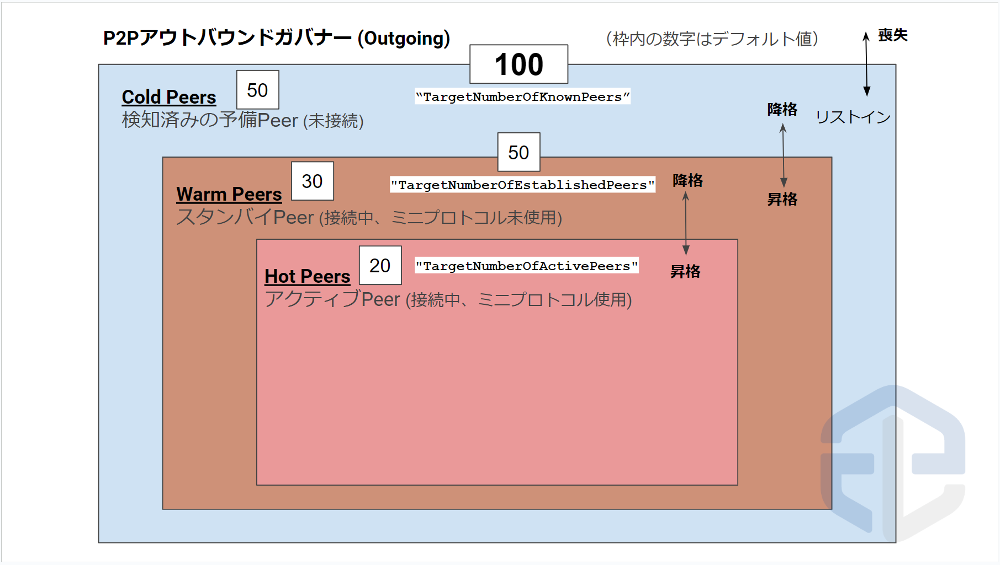

# **3. リレーとBPを接続する**

!!! abstract "リレーBPとの役割"

    * **リレーノード(リレー)**  
    自身のBPと他のリレーノード(カルダノネットワーク)との繋がりを持ち最新スロットを取得しブロック伝播の役割を果たします。

    * **ブロックプロデューサーノード(BP)**  
    ブロック生成専用ノードです。ブロック生成に必要なキーと証明書 \(node.cert, kes.skey vrf.skey\)を用いて起動し自身のリレーノードのみに接続することでセキュリティを強化します。  
  

## **3-1. ダイナミックP2Pを理解する**
ダイナミックP2Pはカルダノネットワークを構成するリレーノードの個々の繋がりを形成するために静的接続構成ファイルを必要とせず、台帳に登録された各プールのリレーリストの中から最適なリレーノードを検出し自動接続します。
これにより、ネットワークパフォーマンスを向上させ、回復力、分散化をさらに強化します。


### **それぞれの内部機能と役割**
| 機能名     | 役割                          |
| ----------- | ------------------------------------ |
| アウトバウンドガバナー       | 自身のリレーノードから接続するノード情報を管理 |
| インバウンドガバナー      | 自身のリレーに接続してくるノード情報を管理 |
| コネクションマネージャー       | 全てのTCPコネクション状態管理・追跡 |
| ピア共有(Peer Sharing)    | ノードを他のノードに伝達・既知のピアに追加する機能 |
| Genesis lite(Bootstrap Peers)    | Ouroboros Genesis実装までの信頼ノードブートストラップ機能 |

!!! abstract  "**アウトバウンドガバナーとは？(Outgoing)**"
    自身のリレーノードから接続するノード情報を管理する機能で、設定ファイル(mainnet-config.json)で接続数のコントロールが可能。

    | 設定フラグ:デフォルト値     | 役割                          | 
    | ----------- | ------------------------------------ | 
    | "TargetNumberOfKnownPeers:100"       | 全体の既知ルートピア数(Hot/Warm/Cold合計)  |
    | "TargetNumberOfEstablishedPeers:50"      | 接続を確立させたいルートピア数(Hot/Warm/合計)|
    | "TargetNumberOfActivePeers:20"      | Hot接続させたいルートピア数 |
    | "TargetNumberOfRootPeers:100"   | 台帳から取得するルートピアの数 |

    * `TargetNumberOfRootPeers`は、全体の既知ピア数を決める`TargetNumberOfKnownPeers`と同等かそれ以下を指定する必要があります。
    * `TargetNumberOfRootPeers`を減らすことで、台帳から自動取得するピアの他に`PeerSharing`により他のノードから伝達されたピア情報を追加することもできます。
    * Hot/Warm/Coldの接続選定はそのノードにとって一番最適な接続先をノードが全自動で制御するのでSPOがマネージメントすることはありません。

    

!!! abstract  "**ピア共有とは？(Peer Sharing)**"
    アウトバウンドガバナーへの既知のピアを追加する2つ目の方法です。ピア共有を有効にすると、接続先ノードからピア情報を要求できるだけでなく、自身のピアを伝達できます。特に台帳に登録していないリレーを他のリレーに知らせる際に有効です。  

    * mainnet-topology.jsonファイルで伝達したいリレー情報に対して`advertise: true`を指定します。
    * リレーのトポロジーに記載されたBP情報に対して`advertise: true`を指定するとBPのIPアドレスが外部に漏洩する可能性がありますので、必ず`advertise: false`を指定してください。

## 3-3. トポロジーファイル設定変更

!!! hint "**mainnet-topology.json** とは？"

    * P2P(ピアツーピア)接続における固定接続先ノード情報を記述するファイルです。
    * リレーノードでは、ブートストラップノード、パブリックノード \(IOHKや他のリレーノード\) 及び、自身のブロックプロデューサーノード、リレーノード情報を記述します。
    * ブロックプロデューサーノードでは、自身のリレーノード情報のみを記述します。
    * **トポロジーファイル内で指定するIPはサーバーに割り当てられたパブリックIP(静的)アドレス**に書き換えて下さい
    * 各ノードのポート番号を変更している場合は都度修正してください

!!! caution "設定の前提条件"
    以下の項目を実施する前にリレー/BPノードが最新ブロックと同期しているか確認してください。
    ```
    cardano-cli conway query tip --mainnet | grep syncProgress
    ```

    戻り値確認
    `"syncProgress": "100.00"`  
    > 戻り値が99以下の場合は100(最新ブロックまで同期)になるまで待ちましょう。

新トポロジーファイル項目解説

| 項目     | 説明                          |
| ----------- | ------------------------------------ |
| `bootstrapPeers`       | Genesis lite bootstrap用ノード |
| `localRoots`       | 常にHot接続を固定したい接続先を記入 |
| `accessPoints`       |  接続先グループ |
| `advertise`    | PeerSharing伝播フラグ |
| `trustable`    | 信頼ノード設定フラグ |
| `valency`    | 接続数(接続先グループ内に記載した数と一致させる必要があります) |
| `publicRoots`    | IOGリレーなどの公開リレー接続先 |
| `useLedgerAfterSlot`    | 初期同期の際に台帳Peer検索を有効にするスロット番号 |

**以下、各ノードごとのタブをクリックして実施してください**

??? danger "リレーノードの場合"
    **リレーファイアウォール設定を変更**
    ??? attention "ファイアウォール設定の注意点"
        ご利用のVPSによっては管理画面からFWを設定する場合があります（例AWS系など）  
        その場合は以下の設定を行わず、VPSマイページ管理画面などから個別に設定してください。
        リレーノードで使用する `6000` 番ポートのインバウンド通信を許可する。任意の番号で設定している場合はその番号を許可する。

    ```bash
    sudo ufw allow 6000/tcp
    ```
    ```bash
    sudo ufw reload
    ```

    **リレーTopologyファイル変更**
    !!! hint ""
        自身のリレーノードから接続を固定するノードを指定します。

        * IPは各サーバーのパブリックIP(静的)アドレスを指定して下さい。
        * ポート番号は[2-4で設定した](../setup/2-node-setup.md#2-4)各ノードポート番号に置き換えて下さい。(SSHポートと間違えないでください)

        実行前に `+`をクリックして注釈を確認してください。  

        <font color=red>`bootstrapPeers`はまず１つのリレーで有効にして運用してください</font>  
        例）リレー１→bootstrapPeers無効  
        　　リレー２→bootstrapPeers有効  

    === "リレー１用　bootstrapPeers無効"
        ``` yaml
        cat > $NODE_HOME/${NODE_CONFIG}-topology.json << EOF
        {
        "bootstrapPeers": null,
        "localRoots": [
            {
            "accessPoints": [
                {
                "address": "BPのIP",#(1)!
                "port": BPポート #(2)!
                }
            ],
                "advertise": false,#(5)!
                "trustable": true,
                "valency": 1
            },
            {
            "accessPoints": [
                {
                "address": "リレー２IP",#(3)!
                "port": 6000 #(4)!
                }
            ],
                "advertise": true,
                "trustable": true,
                "valency": 1
            }
        ],
        "publicRoots": [
            {
            "accessPoints": [
                {
                "address": "backbone.cardano-mainnet.iohk.io",
                "port": 3001
                },
                {
                "address": "backbone.cardano.iog.io",
                "port": 3001
                },
                {
                "address": "backbone.mainnet.emurgornd.com",
                "port": 3001
                },
                {
                "address": "backbone.mainnet.cardanofoundation.org",
                "port": 3001
                }
                ],
            "advertise": false
            }
        ],
        "useLedgerAfterSlot": 110332824
        }
        EOF
        ```
        { .annotate }

        1.  BPのIPアドレスまたはDNSアドレスに置き換えてください
        2.  BPのポートに置き換えてください
        3.  リレー②のIPアドレスまたはDNSアドレスに置き換えてください
        4.  リレー②のポートに置き換えてください
        5.  accessPointsにBPを指定する時は必ず`advertise`を`false`にしてください


    === "リレー２用　bootstrapPeers有効"
        ``` yaml
        cat > $NODE_HOME/${NODE_CONFIG}-topology.json << EOF
        {
        "bootstrapPeers": [
            {
            "address": "backbone.cardano.iog.io",
            "port": 3001
            },
            {
            "address": "backbone.mainnet.emurgornd.com",
            "port": 3001
            },
            {
            "address": "backbone.mainnet.cardanofoundation.org",
            "port": 3001
            }
        ],
        "localRoots": [
            {
            "accessPoints": [
                {
                "address": "BPのIP",#(1)!
                "port": 00000 #(2)!
                }
            ],
                "advertise": false,#(5)!
                "trustable": true,
                "valency": 1
            },
            {
            "accessPoints": [
                {
                "address": "リレー１のIP",#(3)!
                "port": 6000 #(4)!
                }
            ],
                "advertise": true,
                "trustable": true,
                "valency": 1
            }
        ],
        "publicRoots": [
            {
            "accessPoints": [],
            "advertise": false
            }
        ],
        "useLedgerAfterSlot": 110332824
        }
        EOF
        ```
        { .annotate }

        1.  BPのIPアドレスまたはDNSアドレスに置き換えてください
        2.  BPのポートに置き換えてください
        3.  リレー１のIPアドレスまたはDNSアドレスに置き換えてください
        4.  リレー１のポートに置き換えてください
        5.  accessPointsにBPを指定する時は必ず`advertise`を`false`にしてください

??? danger "BPの場合"

    ファイアウォール設定を変更

    !!! tip "BPのセキュリティ"
        BPサーバーにはプール運営の秘密鍵を保管するため、ファイアウォールでBPノードポートを閉じるかリレーサーバーからの通信のみに限定する必要があります。

    BPノードに設定したポート番号を確認する
    ```bash
    PORT=`grep "PORT=" $NODE_HOME/startBlockProducingNode.sh`
    b_PORT=${PORT#"PORT="}
    echo "BPポートは${b_PORT}です"
    ```

    BPノードで使用するポート(上記で表示された番号)の通信を許可する。  
      
    `<>`を除いてIPのみ入力してください。

    ```bash title="Ubuntu22.04の場合は１行づつ実行してください"
    sudo ufw allow from <リレーノード1のIP> to any port ${b_PORT}
    sudo ufw allow from <リレーノード2のIP> to any port ${b_PORT}
    sudo ufw reload
    ```
   
    BP-Topologyファイル変更  

    実行前に `+`をクリックして注釈を確認してください。  

    <font color=red>BPでは`bootstrapPeers`と`PeerSharing`を無効にします</font>
    ``` yaml
    cat > $NODE_HOME/${NODE_CONFIG}-topology.json << EOF
    {
    "bootstrapPeers": null,
    "localRoots": [
        {
          "accessPoints": [
            {
            "address": "リレー１のIP",#(1)!
            "port": 6000 #(2)!
            },
            {
            "address": "リレー２のIP",#(3)!
            "port": 6000 #(4)!
            }
          ],
          "advertise": false,#(8)!
          "trustable": true,
          "valency": 2 #(5)!
        }
    ],
    "publicRoots": [],#(6)!
    "useLedgerAfterSlot": -1 #(7)!
    }
    EOF
    ```
    { .annotate }

    1.  リレー１のIPアドレスまたはDNSアドレスに置き換えてください
    2.  リレー１のポートに置き換えてください
    3.  リレー２のIPアドレスまたはDNSアドレスに置き換えてください
    4.  リレー２のポートに置き換えてください
    5.  固定接続ピアの数を指定してください
    6.  "publicRoots":を空にしてください
    7.  `-1`を指定することで台帳から接続先を取得しないBPモードになります
    8. ここでは`advertise`を`false`にしてください

**mainnet-topology.json構文チェック**
```
cat $NODE_HOME/mainnet-topology.json | jq .
```
=== "正常"
    mainnet-topology.jsonの中身がそのまま表示されます

=== "parse error"
    json記法に誤りがあるため以下のエラーが表示されます。mainnet-topology.jsonを開いて`{}` `[]` `,`が正しい位置にあるかご確認ください。
    ```{ .yaml .no-copy }
    parse error: Expected another key-value pair at line x, column x
    ```

ノードを再起動する
```
cnrestart
```
