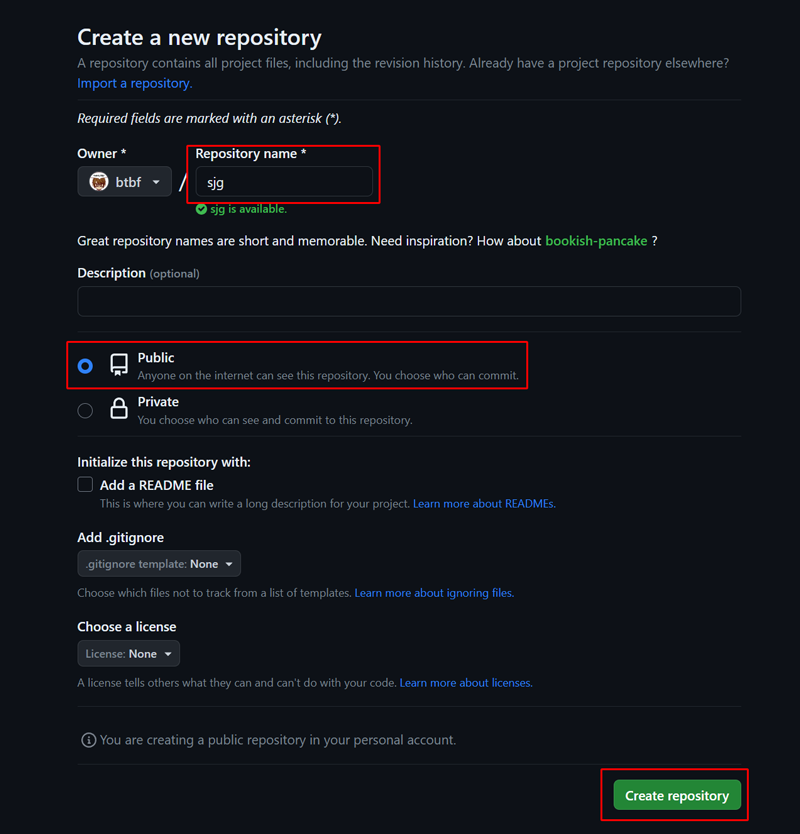
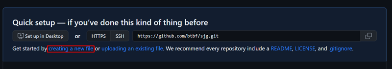
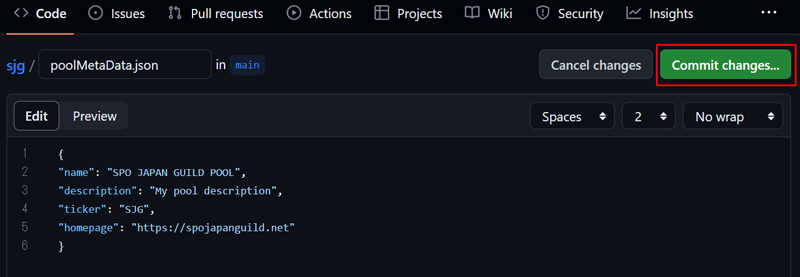
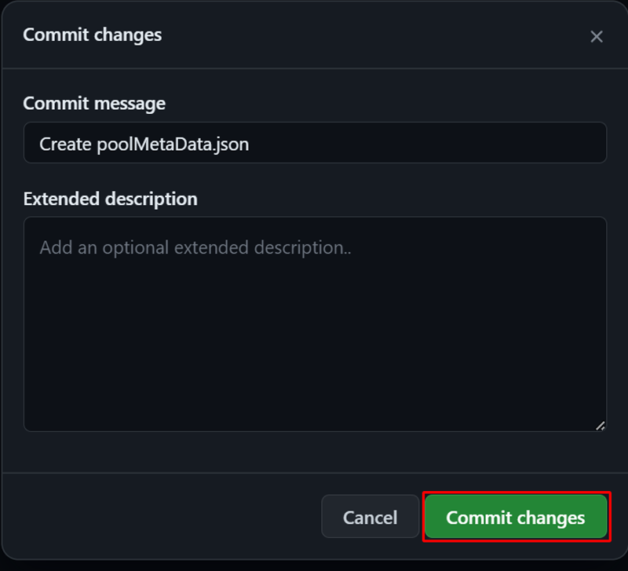
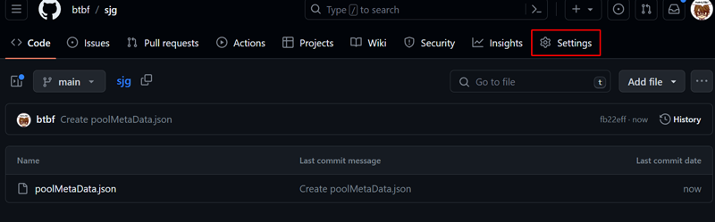
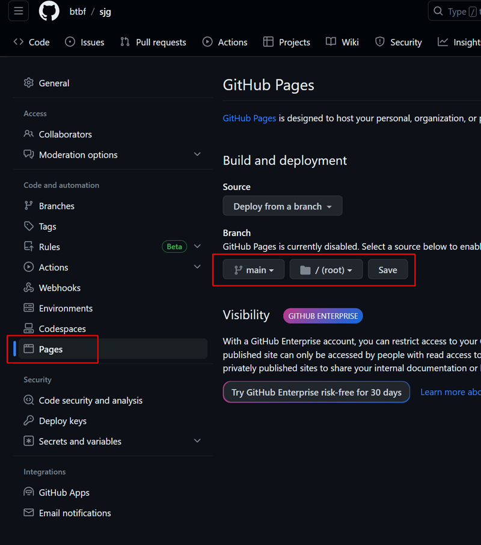
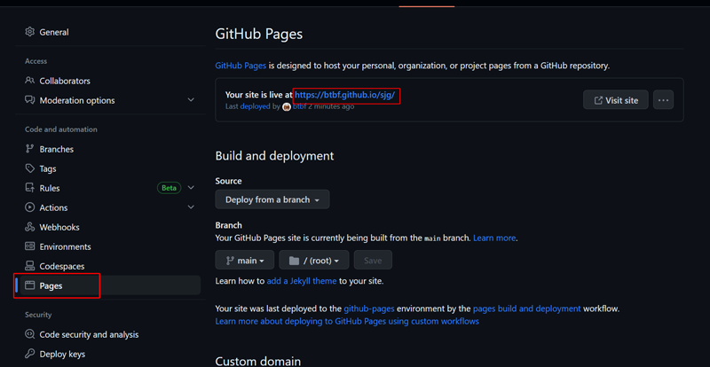

# **7.ステークプールの登録**

!!! Abstract "概要"
    こちらの手順は初回プール登録時のみ有効です。  
    プール登録後にメタ情報、誓約、固定費、変動費、リレー情報を変更する場合は、[プール情報(pool.cert)の更新](../operation/cert-update.md)の変更手順を実施してください。


!!! warning "プール登録料"
    ステークプール登録には**500ADA**の登録料が必要です。payment.addrに入金されている必要があります。


## **1.メタデータの作成**

!!! hint "ホームページを持っていない場合"
    「jsonファイルをGithubでホストする方法」を実施してください


=== "jsonファイルをGithubでホストする方法"

    !!! example ""

        1.Githubアカウントを作成しログインします [https://github.com/](https://github.com/)  
        　<font color=red>ユーザー名を最大13文字以内で作成してください</font>

        2.Repositoriesタブをクリックし、右上の**New** をクリックします。 

        3.リポジトリ作成
        
        * **Repository name**に任意のリポジトリ名<font color=red>(最大13文字以内)</font>を入力
        * Publicを選択
        * **Create repository**をクリック

        

        4.小さい文字で書かれた"**creating a new file**"をクリックします。  

        

        5.ファイル名を **poolMetaData.json** として入力し **json** コンテンツを貼り付けます。

        

        
        ```bash
        {
        "name": "MyPoolName",
        "description": "My pool description",
        "ticker": "MPN",
        "homepage": "https://myadapoolnamerocks.com"
        }
        ```

        !!! danger "作成時の注意"
            * 下記は参考フォーマットとなります。ご自身のプール名、Ticker名に書き換えてください  
            * まだhomepageアドレスが無い場合は、ご自身のTwitterアドレスでも大丈夫です。
            * **ticker**名の長さは3～5文字以内で、A-Zと0-9のみで構成する必要があります。  
            * **description**の長さは255文字以内(255byte)となります。（ひらがな、漢字、カタカナは1文字2byte）


        6.**Commit Changes...**をクリックします。

        
        

        7.上部のメニュータブから**Settings**をクリックします

        

        8.GitPages設定
        
        * 左メニューから**Pages**をクリックします。
        * Branchのプルダウンから**main** **/root**を選択する
        * **Save**をクリックします

        

        9.URLの生成

        * 左メニューから**Pages**をクリックします。
        * 上部にこのリポジトリの公開URLが表示されたことを確認します
        * 赤枠のURLをコピーします

        


        10.メタデータURLの生成

        9でコピーしたURLに`poolMetaData.json`を繋げます
        
        > **例）https://btbf.github.io/sjg/poolMetaData.json**

        <font color=red>このURLの文字列が64文字以内であることを確認してください</font>


        11．**ブロックプロデューサーノード**でjsonファイルをダウンロードし、ハッシュ値を計算する。  

        !!! danger "URLを書き換えてから実行して下さい"
            10で作成したメタデータURLを用いて下さい。

        ```bash
        cd $NODE_HOME
        wget -O poolMetaData.json https://xxx.github.io/xxx/poolMetaData.json 
        ```


=== "ご自身のホームページサーバでホストする方法"
    !!! example ""
        !!! hint ""
            下記は参考フォーマットとなります。ご自身のプール名、Ticker名に書き換えてください  

        !!! hint "作成ルール"
            **ticker**名の長さは3～5文字にする必要があります。文字はA-Zと0-9のみで構成する必要があります。  
            **description**の長さは255文字以内(255byte)となります。（ひらがな、漢字、カタカナは1文字2byte）

        メタデータファイルを作成する。
        === "ブロックプロデューサーノード"

            ```bash
            cd $NODE_HOME
            cat > poolMetaData.json << EOF
            {
            "name": "MyPoolName",
            "description": "My pool description",
            "ticker": "MPN",
            "homepage": "https://myadapoolnamerocks.com"
            }
            EOF
            ```
        
        !!! danger "注意"
            **poolMetaData.json**をあなたの公開用WEBサーバへアップロードしてください。 

メタデータJSONをチェックする
```
cat $NODE_HOME/poolMetaData.json | jq .
```

!!! error "戻り値にエラーが表示される場合"
    戻り価に`parse error:`が表示される場合は、JSON構文に誤りがあります。
    作成したメタデータJSONファイルをご確認ください。


メタデータファイルのハッシュ値を計算します。
=== "ブロックプロデューサーノード"
    ```bash
    cd $NODE_HOME
    cardano-cli conway stake-pool metadata-hash --pool-metadata-file poolMetaData.json > poolMetaDataHash.txt
    ```


## **2.プール登録証明書の作成**

!!! important "ファイル転送"
    BPにある`vrf.vkey`と`poolMetaDataHash.txt` をエアギャップマシンのcnodeディレクトリにコピーします。
    ``` mermaid
    graph LR
        A[BP] -->| vrf.vkey / poolMetaDataHash.txt | B[エアギャップ];
    ``` 

** BPとエアギャップで`vrf.vkey`ファイルハッシュを比較する **

=== "ブロックプロデューサーノード"
    ```bash
    cd $NODE_HOME
    sha256sum vrf.vkey
    ```

!!! hint ""
    BPとエアギャップで表示された戻り値を比較して、ハッシュ値が一致していればOK  

=== "エアギャップマシン"
    ```bash
    cd $NODE_HOME
    sha256sum vrf.vkey
    ```

最小プールコスト(最低固定費)を出力します。

=== "ブロックプロデューサーノード"
    ```bash
    minPoolCost=$(cat $NODE_HOME/params.json | jq -r .minPoolCost)
    echo minPoolCost: ${minPoolCost}
    ```

!!! info ""
    minPoolCost(最低固定費)は 170000000 lovelace \(170 ADA\)です。


 **エアギャップマシンでpool.certを作成する**

!!! note annotate "pool.cert作成時の注意点▼"
    
    pool.certはプール登録証明書の役割を果たし、プール情報を記載します。サンプルコードは以下の値に設定されています。  

    * **誓約 100ADA** 　(--pool-pledge) 　注釈→(1)  
    * **固定手数料 170ADA** (--pool-cost) 　注釈→(2)  
    * **変動手数料5%** (--pool-margin) 　注釈→(3)  
1.  :man_raising_hand: __誓約(Pledge)とは？__<br>Pledge(誓約)はシビル攻撃を防ぐ目的で導入されているパラメータで、SPOが自身のプールにADAをより預けることで委任者様の報酬が若干多く分配される設計になっており、複数プールを開設するよりも単一プールでの運営メリット促すために設けられた制度です。2022/02/16時点でのPledge(誓約)の設計は、SPOが差し出すADA(Pledge)が10M ADA以上からじゃないと報酬が増える割合が変わらないため、あまり機能していないのが実情です。(現在改良が検討されています)
2.  :man_raising_hand: __固定手数料(cost)とは？__<br>プール運営におけるオペレーター報酬の1つで、最低170ADAから設定可能
3.  :man_raising_hand: __変動手数料(margin)とは？__<br>プール運営におけるオペレーター報酬の1つで (総報酬-固定手数料費)におけるオペレーター報酬率

??? note "誓約(Pledge)について▼"
    自分のプールに保証金を預けることを**Pledge\(誓約\)**と呼びます

    * 支払い用アドレス(payment.addr)の残高はPledge額よりも大きい必要があります。
    * 誓約金はpayment.addrに入金されている必要があります。
    * 設定した誓約数よりpayment.addrに入金されてるADAが下回っている場合、プール報酬が０になります。
    * 誓約金はロックされません。いつでも自由に取り出せますがプール登録証明書を再提出する必要があります。


??? note "リレー(--pool-relay-ipv4)の記述について▼"
    上記のpool.cert作成時、自身のリレー情報を以下の3パターンの記述方法があります。

    **複数のリレーノードを構成する記述方法**

    **IPアドレス方式： 1ノード1IPアドレスの場合(分からない場合はこちら)**  
    [xxx.xxx.xxx]をリレーノードのパブリックIP(静的)アドレスへ書き換え
    ```bash
        --pool-relay-ipv4 xxx.xxx.xxx \
        --pool-relay-port 6000 \
        --pool-relay-ipv4 xxx.xxx.xxx \
        --pool-relay-port 6000 \
    ```

    **DNS方式：1つのエントリーの場合**  
    [relay1.yourdomain.com]をあなたのドメイン名に書き換え
    ```bash
        --single-host-pool-relay relay1.yourdomain.com \
        --pool-relay-port 6000 \
        --single-host-pool-relay relay2.yourdomain.com \
        --pool-relay-port 6000 \
    ```

    **ラウンドロビンDNSベース** [**SRV DNS record**](https://support.dnsimple.com/articles/srv-record/)の場合  
    [relay.yourdomain.com]をあなたのドメイン名に書き換え
    ```bash
        --multi-host-pool-relay relay.yourdomain.com \
        --pool-relay-port 6000 \
    ```


=== "エアギャップマシン(リレー1台の場合)"
    下記のスクリプトは例です。ご自身のプール運用設定値に変更してから実行してください。

    !!! danger "値を変更する"
        `--pool-pledge` 誓約数  
        `--pool-cost` 固定手数料  
        `--pool-margin` 変動手数料  
        `***.***.***.***`はリレー1のIPに置き換えてください  
        `https://xxx.github.io/xxx/poolMetaData.json` はご自身のメタデータURLに置き換えてください


  
    ```bash
    cd $NODE_HOME
    cardano-cli conway stake-pool registration-certificate \
        --cold-verification-key-file $HOME/cold-keys/node.vkey \
        --vrf-verification-key-file vrf.vkey \
        --pool-pledge 100000000 \
        --pool-cost 170000000 \
        --pool-margin 0.05 \
        --pool-reward-account-verification-key-file stake.vkey \
        --pool-owner-stake-verification-key-file stake.vkey \
        $NODE_NETWORK \
        --pool-relay-ipv4 ***.***.***.*** \
        --pool-relay-port 6000 \
        --metadata-url https://xxx.github.io/xxx/poolMetaData.json \
        --metadata-hash $(cat poolMetaDataHash.txt) \
        --out-file pool.cert
    ```

=== "エアギャップマシン(リレー2台の場合)"
    下記のスクリプトは例です。ご自身のプール運用設定値に変更してから実行してください。  
    
    !!! danger "値を変更する"
        `--pool-pledge` 誓約数  
        `--pool-cost` 固定手数料  
        `--pool-margin` 変動手数料  
        `***.***.***.***`はリレー1、リレー2のIPに置き換えてください   
        `https://xxx.github.io/xxx/poolMetaData.json` はご自身のメタデータURLに置き換えてください

    ```bash
    cd $NODE_HOME
    cardano-cli conway stake-pool registration-certificate \
        --cold-verification-key-file $HOME/cold-keys/node.vkey \
        --vrf-verification-key-file vrf.vkey \
        --pool-pledge 100000000 \
        --pool-cost 170000000 \
        --pool-margin 0.05 \
        --pool-reward-account-verification-key-file stake.vkey \
        --pool-owner-stake-verification-key-file stake.vkey \
        $NODE_NETWORK \
        --pool-relay-ipv4 ***.***.***.*** \
        --pool-relay-port 6000 \
        --pool-relay-ipv4 ***.***.***.*** \
        --pool-relay-port 6000 \
        --metadata-url https://xxx.github.io/xxx/poolMetaData.json \
        --metadata-hash $(cat poolMetaDataHash.txt) \
        --out-file pool.cert
    ```


**自身のステークプールに委任する証明書(deleg.cert)を作成します**

=== "エアギャップマシン"

    ```bash
    cardano-cli conway stake-address delegation-certificate \
        --stake-verification-key-file stake.vkey \
        --cold-verification-key-file $HOME/cold-keys/node.vkey \
        --out-file deleg.cert
    ```
!!! important "ファイル転送"
    エアギャップマシンの`pool.cert`と`deleg.cert`をBPのcnodeディレクトリにコピーします。
    ``` mermaid
    graph LR
        A[エアギャップ] -->|pool.cert / deleg.cert| B[BP];
    ```

## **3.プール登録トランザクションの送信**

**最新のスロット番号を取得する必要があります**

=== "ブロックプロデューサーノード"
    ```bash
    cd $NODE_HOME
    currentSlot=$(cardano-cli conway query tip $NODE_NETWORK | jq -r '.slot')
    echo Current Slot: $currentSlot
    ```

**payment.addrの残高を出力します**

=== "ブロックプロデューサーノード"
    ```bash
    cardano-cli conway query utxo \
        --address $(cat payment.addr) \
        $NODE_NETWORK > fullUtxo.out

    tail -n +3 fullUtxo.out | sort -k3 -nr > balance.out

    cat balance.out
    ```

**UTXOを算出します**

=== "ブロックプロデューサーノード"
    ```
    tx_in=""
    total_balance=0
    while read -r utxo; do
        in_addr=$(awk '{ print $1 }' <<< "${utxo}")
        idx=$(awk '{ print $2 }' <<< "${utxo}")
        utxo_balance=$(awk '{ print $3 }' <<< "${utxo}")
        total_balance=$((${total_balance}+${utxo_balance}))
        echo TxHash: ${in_addr}#${idx}
        echo ADA: ${utxo_balance}
        tx_in="${tx_in} --tx-in ${in_addr}#${idx}"
    done < balance.out
    txcnt=$(cat balance.out | wc -l)
    echo Total ADA balance: ${total_balance}
    echo Number of UTXOs: ${txcnt}
    ```

**poolDepositを出力します**

=== "ブロックプロデューサーノード"

    ```bash
    poolDeposit=$(cat $NODE_HOME/params.json | jq -r '.stakePoolDeposit')
    echo poolDeposit: $poolDeposit
    ```

**トランザクション仮ファイルを作成します**

=== "ブロックプロデューサーノード"

    ```bash
    cardano-cli conway transaction build-raw \
        ${tx_in} \
        --tx-out $(cat payment.addr)+$(( ${total_balance} - ${poolDeposit})) \
        --invalid-hereafter $(( ${currentSlot} + 10000)) \
        --fee 200000 \
        --certificate-file pool.cert \
        --certificate-file deleg.cert \
        --out-file tx.tmp
    ```

**最低手数料を計算します**

=== "ブロックプロデューサーノード"

    ```bash
    fee=$(cardano-cli conway transaction calculate-min-fee \
        --tx-body-file tx.tmp \
        --witness-count 3 \
        --protocol-params-file params.json | awk '{ print $1 }')
    echo fee: $fee
    ```


**計算結果を出力します**

=== "ブロックプロデューサーノード"

    ```bash
    txOut=$((${total_balance}-${poolDeposit}-${fee}))
    echo txOut: ${txOut}
    ```

**トランザクションファイルを作成します**

=== "ブロックプロデューサーノード"

    ```bash
    cardano-cli conway transaction build-raw \
        ${tx_in} \
        --tx-out $(cat payment.addr)+${txOut} \
        --invalid-hereafter $(( ${currentSlot} + 10000)) \
        --fee ${fee} \
        --certificate-file pool.cert \
        --certificate-file deleg.cert \
        --out-file tx.raw
    ```
!!! important "ファイル転送"
    BPの`tx.raw`をエアギャップマシンのcnodeディレクトリにコピーします。
    
    ``` mermaid
    graph LR
        A[BP] -->|tx.raw| B[エアギャップ];
    ```

**トランザクションに署名します**

=== "エアギャップマシン"
    ```bash
    cd $NODE_HOME
    cardano-cli conway transaction sign \
        --tx-body-file tx.raw \
        --signing-key-file payment.skey \
        --signing-key-file $HOME/cold-keys/node.skey \
        --signing-key-file stake.skey \
        $NODE_NETWORK \
        --out-file tx.signed
    ```
!!! important "ファイル転送"
    エアギャップマシンの`tx.signed`をBPのcnodeディレクトリにコピーします。
    ``` mermaid
    graph LR
        A[エアギャップ] -->|tx.signed| B[BP];
    ```

**トランザクションを送信します**

=== "ブロックプロデューサーノード"
    ```bash
    cardano-cli conway transaction submit \
        --tx-file tx.signed \
        $NODE_NETWORK
    ```
 > Transacsion Successfully submittedと表示されれば成功

## **4. プール登録確認**

**ステークプールIDは以下のように出力できます**

=== "エアギャップマシン"
    ```bash
    chmod u+rwx $HOME/cold-keys
    cardano-cli conway stake-pool id --cold-verification-key-file $HOME/cold-keys/node.vkey --output-format bech32 --out-file pool.id-bech32
    cardano-cli conway stake-pool id --cold-verification-key-file $HOME/cold-keys/node.vkey --output-format hex --out-file pool.id
    chmod a-rwx $HOME/cold-keys
    ```

!!! important "ファイル転送"
    エアギャップマシンの`pool.id-bech32`と`pool.id`をBPのcnodeディレクトリにコピーします。
    ``` mermaid
    graph LR
        A[エアギャップ] -->|pool.id-bech32 / pool.id| B[BP];
    ```

**以下のコマンドを実行し、プール情報が表示されればブロックチェーンに登録されています**
=== "ブロックプロデューサーノード"
    ```
    curl -s -X POST "https://api.koios.rest/api/v0/pool_info" \
        -H "Accept: application/json" \
        -H "Content-Type: application/json" \
        -d '{"_pool_bech32_ids":["'$(cat $NODE_HOME/pool.id-bech32)'"]}' | jq .
    ```


**自分のステークプールが`Cardanoscan`に登録されているか確認します**
=== "ブロックプロデューサーノード"
    ```
    cd $NODE_HOME
    cat pool.id-bech32
    ```

表示されたPoolIDであなたのステークプールがブロックチェーンに登録されているか、次のサイトで確認することが出来ます。  
[Cardanoscan](https://cardanoscan.io/pools){ .md-button blank}

!!! success "あと一息です！"
    上記サイトであなたのプールティッカーが表示されたらブロックチェーンに登録されました！しかしまだブロック生成できる状態ではありません。この後も重要な作業が続きますがもう少し頑張ってください！
