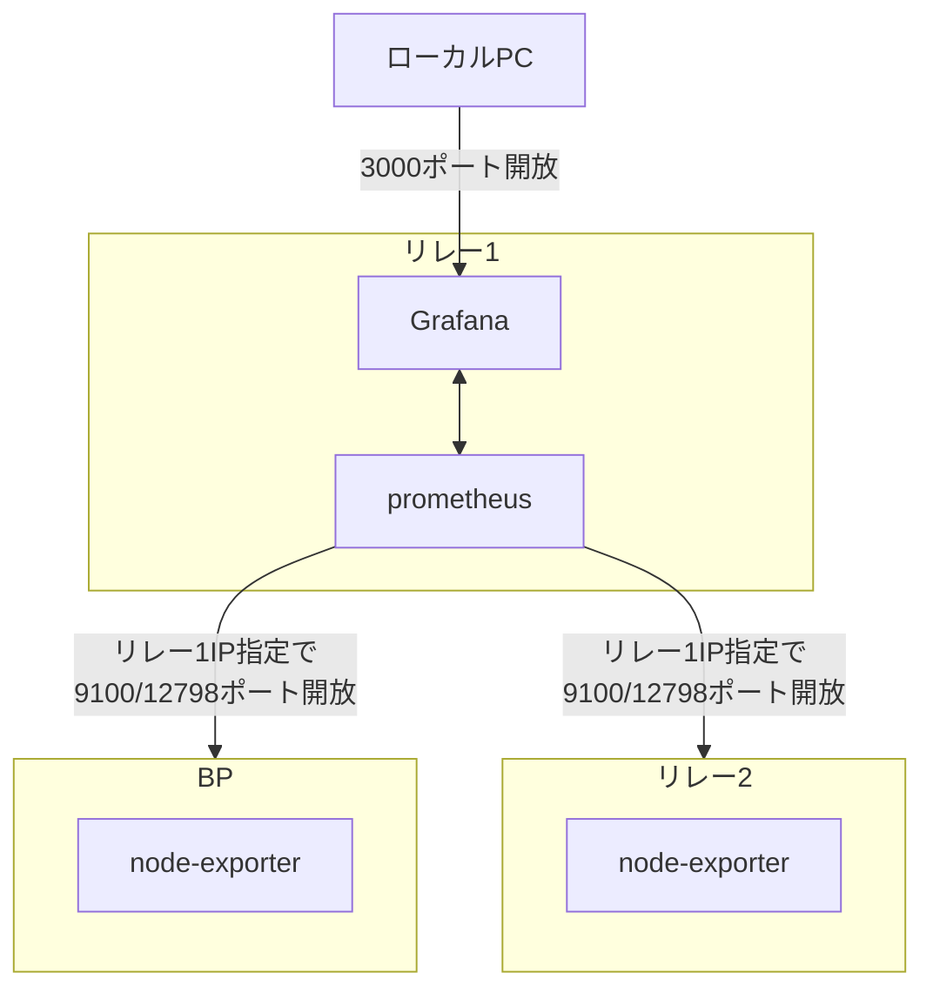
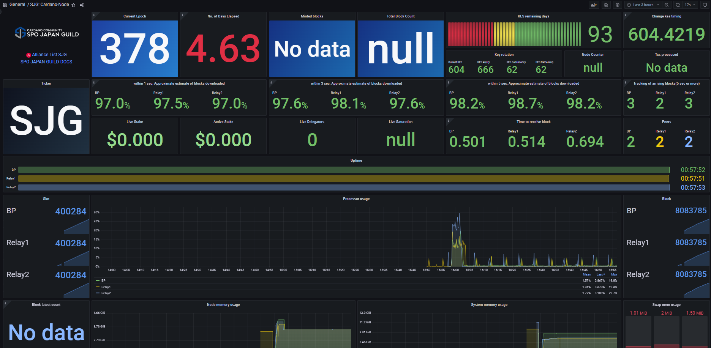

# **9.監視ツールセットアップ**

プロメテウスはターゲットに指定したメトリックHTTPエンドポイントをスクレイピングし、情報を収集する監視ツールです。[オフィシャルドキュメントはこちら](https://prometheus.io/docs/introduction/overview/) グラファナは収集されたデータを視覚的に表示させるダッシュボードツールです。

### **9-1.インストール**

!!! abstract "概要"
    「prometheus」および「prometheus node exporter」をインストールします。 この手順では、リレーノード1でprometheusとGrafana本体を稼働させ、各サーバーの情報を取得する方法です。

**構成図**


prometheusインストール

=== "リレーノード1"
    ```text
    sudo apt install -y prometheus prometheus-node-exporter
    ```

=== "BPまたはリレー2以降"

    ```bash
    sudo apt install -y prometheus-node-exporter
    ```

grafanaインストール

=== "リレーノード1"

    ```bash
    sudo apt-get install -y apt-transport-https software-properties-common
    ```
    ```bash
    sudo wget -q -O /usr/share/keyrings/grafana.key https://apt.grafana.com/gpg.key
    ```
    ```bash
    echo "deb [signed-by=/usr/share/keyrings/grafana.key] https://apt.grafana.com stable main" > grafana.list
    sudo mv grafana.list /etc/apt/sources.list.d/grafana.list
    ```
    ```bash
    sudo apt update && sudo apt install -y grafana
    ```

サービス有効化とファイアウォールを設定する。

=== "リレーノード1"

    ```bash
    sudo systemctl enable grafana-server.service
    sudo systemctl enable prometheus.service
    sudo systemctl enable prometheus-node-exporter.service
    ```

    FW設定でGrafanaポートを開放する
    ```bash
    sudo ufw allow 3000/tcp
    sudo ufw reload
    ```

=== "BPまたはリレー2以降"
    
    ```bash
    sudo systemctl enable prometheus-node-exporter.service
    ```
    
    FW設定でPrometheusメトリクスポートをリレー1のIP限定で開放する
    ```bash
    sudo ufw allow from <リレーノード1のIP> to any port 12798
    sudo ufw allow from <リレーノード1のIP> to any port 9100
    sudo ufw reload
    ```

prometheus-node-exporterアップデート

=== "リレーノード/BP"
    prometheus-node-exporterのパスを取得する
    ```bash
    cd $HOME/git
    nodeexPath=`which prometheus-node-exporter`
    ```

    1.5.0をダウンロードする
    ```bash
    wget https://github.com/prometheus/node_exporter/releases/download/v1.5.0/node_exporter-1.5.0.linux-amd64.tar.gz
    ```

    ダウンロードファイルを解凍する
    ```bash
    tar xvf node_exporter-1.5.0.linux-amd64.tar.gz
    ```

    サービスを停止する
    ```bash
    sudo systemctl stop prometheus-node-exporter.service
    ```
    
    バイナリファイルをシステムフォルダへコピーする
    ```bash
    cd node_exporter-1.5.0.linux-amd64
    sudo cp node_exporter $nodeexPath
    ```

    サービスをスタートする
    ```bash
    sudo systemctl start prometheus-node-exporter.service
    ```
    
    バージョン確認
    
    ```bash
    prometheus-node-exporter --version
    ```
    > 戻り値1行目が`node_exporter, version 1.5.0`ならOK


## **9-2.設定ファイルの作成**

リレーノード1にインストールしたPrometheusの設定ファイルを作成します。ここに記載されたサーバーのデータを取得します。

=== "リレーノード1(リレー1台の場合)"
    !!! warning "注意"
        targets:の「xxx.xxx.xxx」は、BPのパブリックIP(静的)アドレスに置き換えて下さい

    ```bash
    cat > $HOME/prometheus.yml << EOF
    global:
      scrape_interval:     15s # By default, scrape targets every 15 seconds.

      # Attach these labels to any time series or alerts when communicating with
      # external systems (federation, remote storage, Alertmanager).
      external_labels:
        monitor: 'codelab-monitor'
    
    # A scrape configuration containing exactly one endpoint to scrape:
    # Here it's Prometheus itself.
    scrape_configs:
      # The job name is added as a label job=<job_name> to any timeseries scraped from this config.
      - job_name: 'prometheus'

        static_configs:
          - targets: ['localhost:9100']
            labels:
              alias: 'relaynode1'
              type:  'system'
          - targets: ['xxx.xxx.xxx.xxx:9100']
            labels:
              alias: 'block-producing-node'
              type:  'system'
          - targets: ['xxx.xxx.xxx.xxx:12798']
            labels:
              alias: 'block-producing-node'
              type:  'cardano-node'
          - targets: ['localhost:12798']
            labels:
              alias: 'relaynode1'
              type:  'cardano-node'
    EOF
    ```

=== "リレーノード1(リレー2台の場合)"
    !!! warning "注意"
        targets:の「xxx.xxx.xxx」は、BPのパブリックIP(静的)アドレスに置き換えて下さい。  
        targets:の「bb.xxx.xxx」は、リレー2のパブリックIP(静的)アドレスに置き換えて下さい。

    ```bash
    cat > $HOME/prometheus.yml << EOF
    global:
      scrape_interval:     15s # By default, scrape targets every 15 seconds.

      # Attach these labels to any time series or alerts when communicating with
      # external systems (federation, remote storage, Alertmanager).
      external_labels:
        monitor: 'codelab-monitor'
    
    # A scrape configuration containing exactly one endpoint to scrape:
    # Here it's Prometheus itself.
    scrape_configs:
      # The job name is added as a label job=<job_name> to any timeseries scraped from this config.
      - job_name: 'prometheus'

        static_configs:
          - targets: ['localhost:9100']
            labels:
              alias: 'relaynode1'
              type:  'system'
          - targets: ['bb.xxx.xxx.xxx:9100']
            labels:
              alias: 'relaynode2'
              type:  'system'
          - targets: ['xx.xxx.xxx.xxx:9100']
            labels:
              alias: 'block-producing-node'
              type:  'system'
          - targets: ['xxx.xxx.xxx.xxx:12798']
            labels:
              alias: 'block-producing-node'
              type:  'cardano-node'
          - targets: ['localhost:12798']
            labels:
              alias: 'relaynode1'
              type:  'cardano-node'
          - targets: ['bb.xxx.xxx.xxx:12798']
            labels:
              alias: 'relaynode2'
              type:  'cardano-node'
    EOF
    ```

prometheus.yml構文チェック
=== "リレーノード1"
  ```
  sudo promtool check config $HOME/prometheus.yml
  ```
!!! hint "戻り値確認"
    構文エラーなしの場合
    ```{ .yaml .no-copy }
    Checking /home/user/prometheus.yml
    SUCCESS: 0 rule files found
    ```

    構文エラーの場合(一例)
    ```{ .yaml .no-copy }
    Checking /home/user/prometheus.yml
    FAILED: parsing YAML file /home/user/prometheus.yml: yaml: line XX: did not find expected '-' indicator
    ```
      
    ※/home/user/prometheus.yml（userは各自で設定したユーザー名）

    構文エラーだった場合は、$HOME/prometheus.ymlを開いて余分なスペースや記号の有無などを確認し、修正してください。
    ```
    sudo nano $HOME/prometheus.yml
    ```
    > 修正したら、Ctrl + Oで保存し、Enter。その後Ctrl + Xで閉じる

  prometheus.ymlを移動します
  ```bash
  sudo mv $HOME/prometheus.yml /etc/prometheus/prometheus.yml
  ```

  Grafanaプラグインをインストールする
  ```
  sudo grafana-cli plugins install yesoreyeram-infinity-datasource
  ```

サービスを起動します。

=== "リレーノード1"

    ```bash
    sudo systemctl restart grafana-server.service
    sudo systemctl restart prometheus.service
    sudo systemctl restart prometheus-node-exporter.service
    ```

サービスが正しく実行されていることを確認します。

=== "リレーノード1"

    ```bash
    sudo systemctl --no-pager status grafana-server.service prometheus.service prometheus-node-exporter.service
    ```
    !!! hint "戻り値確認"
        * grafana-server.service
        * prometheus.service
        * prometheus-node-exporter.service  
        上記3つのプログラムが 緑色 `active (running)` になっていることを確認する。

### **既存の設定ファイルを更新する場合**

```
sudo nano /etc/prometheus/prometheus.yml
```
> 修正したら、Ctrl + Oで保存し、Enter。その後Ctrl + Xで閉じる

prometheus.yml構文チェック
=== "リレーノード1"
  ```
  sudo promtool check config /etc/prometheus/prometheus.yml
  ```
!!! hint "戻り値確認"
    構文エラーなしの場合
    ```{ .yaml .no-copy }
    Checking /etc/prometheus/prometheus.yml
    SUCCESS: 0 rule files found
    ```

    構文エラーの場合(一例)
    ```{ .yaml .no-copy }
    Checking /etc/prometheus/prometheus.yml
    FAILED: parsing YAML file /etc/prometheus/prometheus.yml: yaml: line XX: did not find expected '-' indicator
    ```
    /etc/prometheus/prometheus.ymlを開いて余分なスペースや記号の有無などを確認してください。

サービスを再起動する
```
sudo systemctl restart prometheus.service
```

## **9-3.Grafanaダッシュボードの設定**

1. ローカルPCのブラウザから http://&lt;リレーノード1IPアドレス&gt;:3000 を開きます。
2. ログイン名・PWは **admin** / **admin**
3. パスワードを変更します。
4. 左上の三本線メニューを開き「Connections」→「Data sources」をクリックします。
5. 「Add new data source」をクリックし、「Prometheus」を選択します。
6. 名前は `Prometheus`としてください。
7. **URL** を [http://localhost:9090](http://localhost:9090)に設定します。
8. **Save & Test**をクリックし`Successfully queried the Prometheus API.`と表示されたら再度`Data sources`をクリックします。
9. 「Add new data source」をクリックし、下部にある「Infinity」をクリックします。
10. 設定内容を変更することなく、**Save & Test**をクリックし`Settings saved`と表示されたらOK。
11. BPサーバーでパネル用JSONファイルをダウンロードします。
=== "ブロックプロデューサーノード"
  ```
  curl -s -o $NODE_HOME/SJG_Grafana_Dashboard.json https://raw.githubusercontent.com/akyo3/Extends-SJG-Knowledge/main/SJG_Grafana_Dashboard.json
  ```
  一部ファイル内容を書き換える
  ```
  sed -i $NODE_HOME/SJG_Grafana_Dashboard.json \
      -e "s/bech32_id_of_your_pool/$(cat $NODE_HOME/pool.id-bech32)/g"
  ```
12. BPの`cnode`フォルダにある`SJG_Grafana_Dashboard.json`をローカルPCにダウンロードします  
13. 左メニューの「Dashboards」→「New」→「`+import`」をクリックします。  
14. 「Upload JSON file」をクリックし、10でダウンロードした`SJG_Grafana_Dashboard.json`を指定します。  
15. 「Prometheus」と「Infinity」のプルダウンを選択し`Import`ボタンをクリックします。  





!!! success "🎊おめでとうございます🎊"
    これで基本的な監視設定は完了です。
    
    以下の追加設定も実施してください。

    * [セキュリティ強化設定](../operation/grafana-security.md)
    * 異常時に通知する[アラート設定](../operation/grafana-alert.md)