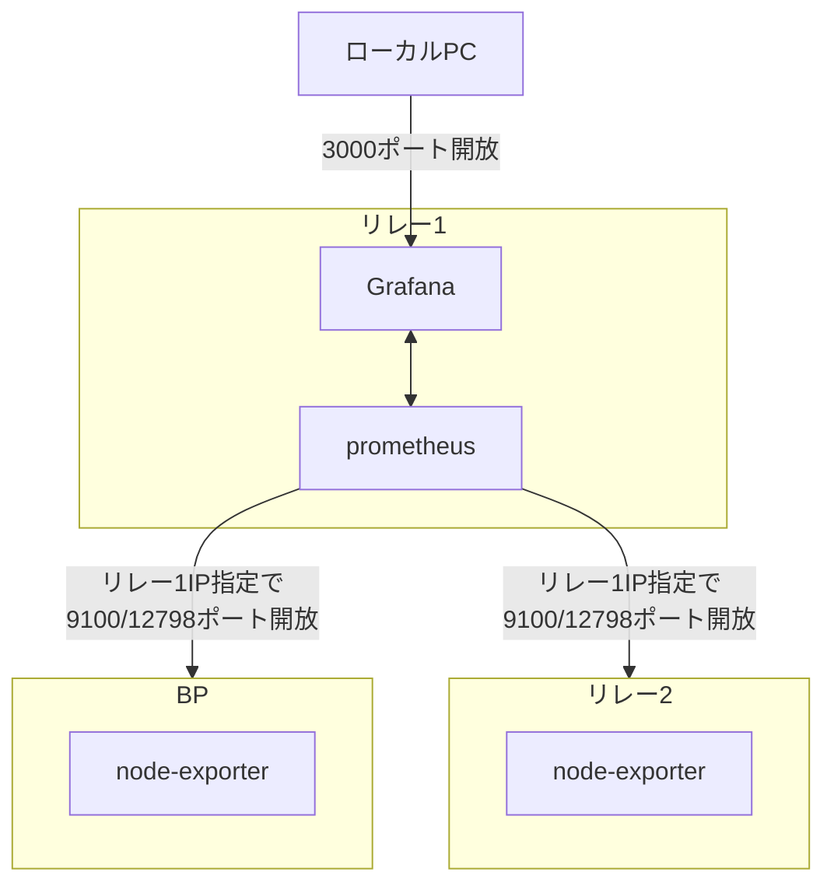

# **9.監視ツールセットアップ**

プロメテウスはターゲットに指定したメトリックHTTPエンドポイントをスクレイピングし、情報を収集する監視ツールです。[オフィシャルドキュメントはこちら](https://prometheus.io/docs/introduction/overview/) グラファナは収集されたデータを視覚的に表示させるダッシュボードツールです。

### **1.インストール**

!!! abstract "概要"
    「prometheus」および「prometheus node exporter」をインストールします。 この手順では、リレーノード1でprometheusとGrafana本体を稼働させ、各サーバーの情報を取得する方法です。

**構成図**


prometheusインストール

=== "リレーノード1"
    ```text
    sudo apt install -y prometheus prometheus-node-exporter
    ```

=== "BPまたはリレー2以降"

    ```bash
    sudo apt install -y prometheus-node-exporter
    ```

grafanaインストール

=== "リレーノード1"
    ```bash
    wget -q -O - https://packages.grafana.com/gpg.key | sudo apt-key add -
    ```
    ```bash
    echo "deb https://packages.grafana.com/oss/deb stable main" > grafana.list
    sudo mv grafana.list /etc/apt/sources.list.d/grafana.list
    ```
    ```bash
    sudo apt update && sudo apt install -y grafana
    ```

サービス有効化とファイアウォールを設定する。

=== "リレーノード1"

    ```bash
    sudo systemctl enable grafana-server.service
    sudo systemctl enable prometheus.service
    sudo systemctl enable prometheus-node-exporter.service
    ```

    FW設定でGrafanaポートを開放する
    ```bash
    sudo ufw allow 3000/tcp
    sudo ufw reload
    ```

=== "BPまたはリレー2以降"
    
    ```bash
    sudo systemctl enable prometheus-node-exporter.service
    ```
    
    FW設定でPrometheusメトリクスポートをリレー1のIP限定で開放する
    ```bash
    sudo ufw allow from <リレーノード1のIP> to any port 12798
    sudo ufw allow from <リレーノード1のIP> to any port 9100
    sudo ufw reload
    ```

## **2.設定ファイルの作成**

リレーノード1にインストールしたPrometheusの設定ファイルを作成します。ここに記載されたサーバーのデータを取得します。

=== "リレーノード1(リレー1台の場合)"
    !!! warning "注意"
        targets:の「xxx.xxx.xxx」は、BPのパブリックIP(静的)アドレスに置き換えて下さい

    ```bash
    cat > prometheus.yml << EOF
    global:
      scrape_interval:     15s # By default, scrape targets every 15 seconds.

      # Attach these labels to any time series or alerts when communicating with
      # external systems (federation, remote storage, Alertmanager).
      external_labels:
        monitor: 'codelab-monitor'
    
    # A scrape configuration containing exactly one endpoint to scrape:
    # Here it's Prometheus itself.
    scrape_configs:
      # The job name is added as a label job=<job_name> to any timeseries scraped from this config.
      - job_name: 'prometheus'

        static_configs:
          - targets: ['localhost:9100']
            labels:
              alias: 'relaynode1'
              type:  'system'
          - targets: ['xxx.xxx.xxx.xxx:9100']
            labels:
              alias: 'block-producing-node'
              type:  'system'
          - targets: ['xxx.xxx.xxx.xxx:12798']
            labels:
              alias: 'block-producer-node'
              type:  'cardano-node'
          - targets: ['localhost:12798']
            labels:
              alias: 'relaynode1'
              type:  'cardano-node'
    EOF
    ```

=== "リレーノード1(リレー2台の場合)"
    !!! warning "注意"
        targets:の「xxx.xxx.xxx」は、BPのパブリックIP(静的)アドレスに置き換えて下さい。  
        targets:の「bb.xxx.xxx」は、リレー2のパブリックIP(静的)アドレスに置き換えて下さい。

    ```bash
    cat > prometheus.yml << EOF
    global:
      scrape_interval:     15s # By default, scrape targets every 15 seconds.

      # Attach these labels to any time series or alerts when communicating with
      # external systems (federation, remote storage, Alertmanager).
      external_labels:
        monitor: 'codelab-monitor'
    
    # A scrape configuration containing exactly one endpoint to scrape:
    # Here it's Prometheus itself.
    scrape_configs:
      # The job name is added as a label job=<job_name> to any timeseries scraped from this config.
      - job_name: 'prometheus'

        static_configs:
          - targets: ['localhost:9100']
            labels:
              alias: 'relaynode1'
              type:  'system'
          - targets: ['bb.xxx.xxx.xxx:9100']
            labels:
              alias: 'relaynode2'
              type:  'system'
          - targets: ['xx.xxx.xxx.xxx:9100']
            labels:
              alias: 'block-producing-node'
              type:  'system'
          - targets: ['xxx.xxx.xxx.xxx:12798']
            labels:
              alias: 'block-producer-node'
              type:  'cardano-node'
          - targets: ['localhost:12798']
            labels:
              alias: 'relaynode1'
              type:  'cardano-node'
          - targets: ['bb.xxx.xxx.xxx:12798']
            labels:
              alias: 'relaynode2'
              type:  'cardano-node'
    EOF
    ```

prometheus.ymlを移動します
=== "リレーノード1"
    ```bash
    sudo mv prometheus.yml /etc/prometheus/prometheus.yml
    ```

サービスを起動します。

=== "リレーノード1"

    ```bash
    sudo systemctl restart grafana-server.service
    sudo systemctl restart prometheus.service
    sudo systemctl restart prometheus-node-exporter.service
    ```

サービスが正しく実行されていることを確認します。

=== "リレーノード1"

    ```bash
    sudo systemctl --no-pager status grafana-server.service prometheus.service prometheus-node-exporter.service
    ```


## **3.ノード設定ファイルの更新**
=== "リレーノード/BP"

    ```bash
    cd $NODE_HOME
    sed -i ${NODE_CONFIG}-config.json -e "s/127.0.0.1/0.0.0.0/g"
    ```


ノードを再起動し設定ファイルを有効化します。

=== "リレーノード/BP"

    ```bash
    sudo systemctl reload-or-restart cardano-node
    ```


## **4.Grafanaダッシュボードの設定**

1. ローカルブラウザから http://&lt;リレーノード1IPアドレス&gt;:3000 を開きます。
2. ログイン名・PWは **admin** / **admin**
3. パスワードを変更します。
4. 左メニューの歯車アイコンから データソースを追加します。
5. 「Add data source」をクリックし、「Prometheus」を選択します。
6. 名前は **Prometheus**としてください。
7. **URL** を [http://localhost:9090](http://localhost:9090)に設定します。
8. **Save & Test**をクリックします。
9. こちらの[JSONファイル](https://raw.githubusercontent.com/akyo3/Extends-SJG-Knowledge/main/SJG_Grafana_Dashboard.json)を開き、内容を全選択してコピーします。
10. 左メニューから**Create +** iconを選択 &gt; **Import**をクリックします。
11. 9でコピーした内容を「Import via panel json」に貼り付けます
12. **Load**ボタンをクリックし、次の画面で***Import**ボタンをクリックします。


!!! success "🎊おめでとうございます🎊"
これで基本的な監視設定は完了です。必要に応じてノード異常時の通知設定を行ってください
