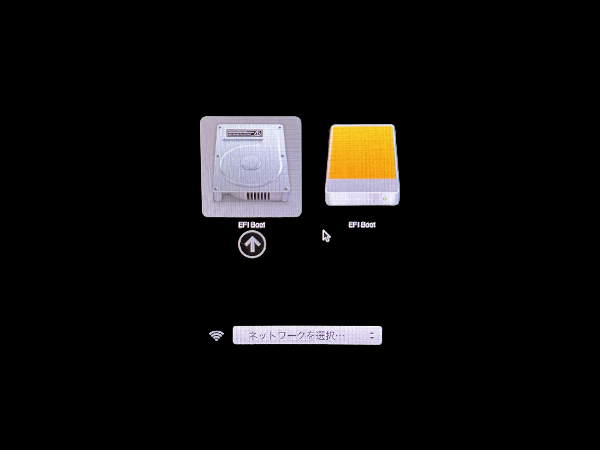
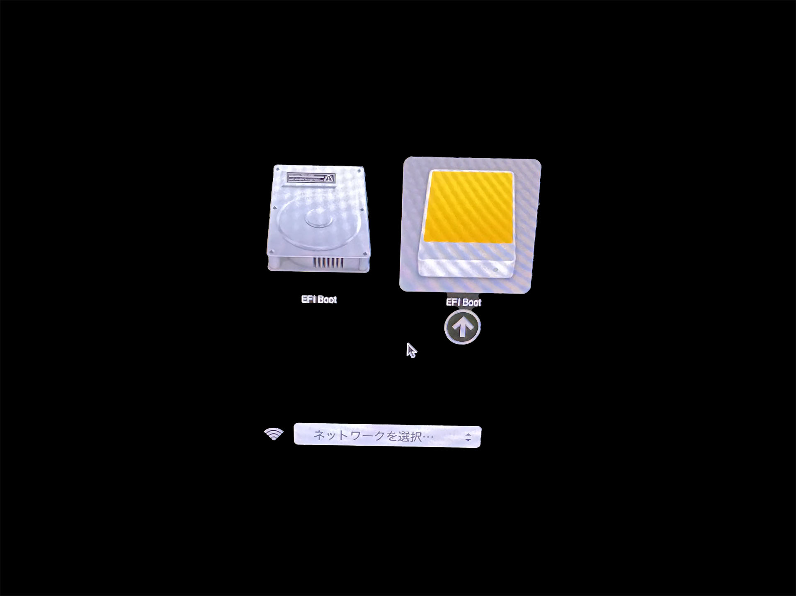

# **エアギャップ環境セットアップ**
USBブートでUbuntu 22.04を起動します。

## **Macの場合**

## **1. Bootable USBからの起動**  
作成済みのUbuntu Bootable USBをMacに接続し、電源投入と同時に`Option`キーを押し続けて起動ディスク選択画面を開きます。  
> 画面が表示されるまでキーを押し続けてください。

!!! tip "Windows用キーボードを使用している場合"  
    `Option`キーの代わりに`Alt`キーを押してください。




### **1-1. 起動デバイスを選択**
画面には内蔵ディスク（グレーのアイコン）とUSB（オレンジのアイコン）が表示されます。  
USBデバイスを選択し、Enterキーを押して起動します。




### **1-2. Ubuntu Serverのインストール開始**
表示されたメニューから「`Try or Install Ubuntu Server`」を選択し、Enterキーを押下。  
その後は画面の指示に従って通常のUbuntu Serverインストールを進めてください。


## **2. Mac mini での WiFi 設定（Intel モデルのみ）**
!!! tip "Appleシリコン搭載 Mac mini（M1/M2/M3）の方へ"
    Appleシリコンでは、WiFiドライバが提供されていないため、WiFiは利用できません。  
    有線LANを使用してください。

??? info "Intel Mac mini（Broadcom WiFiチップ搭載）の場合はこちら"  
    **前提条件**  

    以下の条件を満たすモデルのみWiFiが利用できます。  

    - Intel CPU 搭載モデル  
    - Broadcom製 WiFiチップ  

    **1. 有線LANでインターネットに接続**  

    WiFiドライバをインストールするため、まず有線LANでネットワークに接続します。  

    **2. WiFiチップの型番を確認**  
    ```bash
    lspci -nn | grep -i network
    ```

    Broadcom チップが表示されれば対象です。  
    > Broadcom Inc. and subsidiaries BCM4331

    **3. ドライバのインストール**  
    ```bash
    sudo apt update -y
    ```
    ```bash
    sudo apt install bcmwl-kernel-source network-manager -y
    ```

    **4. 再起動**  
    ```bash
    sudo reboot
    ```

    **5. WiFiデバイス名の確認**  
    ```bash
    nmcli device
    ```

    例：
    ```
    DEVICE    TYPE      STATE         CONNECTION 
    wlp2s0    wifi      disconnected  --         
    enp1s0f0  ethernet  unmanaged     --         
    lo        loopback  unmanaged     --        
    ```
    > 上記の例では`wlp2s0`がWiFiデバイスです。

    **6. アクセスポイント一覧の取得**  
    ```bash
    nmcli device wifi list
    ```

    例：
    ```
    IN-USE  BSSID              SSID               MODE   CHAN  RATE        SIGNAL  BARS  SECURITY  
            00:11:22:33:44:55  ExampleWiFi_24G    Infra  11    300 Mbit/s  92      ▂▄▆█  WPA2      
            66:77:88:99:AA:BB  OfficeNet_AP01     Infra  36    540 Mbit/s  75      ▂▄▆_  WPA2    
    ```

    **7. WiFiへの接続**  

    例：
    SSID「`ExampleWiFi_24G`」、パスワード「`mywifi1234`」 に接続する場合

    ```bash
    sudo nmcli device wifi connect "ExampleWiFi_24G" password "mywifi1234"
    ```
    > 次回以降の起動でも自動的に接続されます。

---