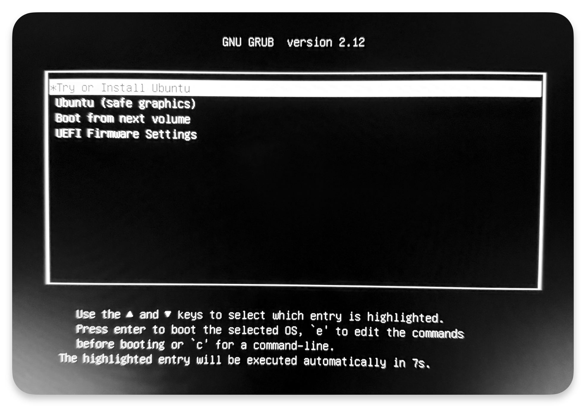
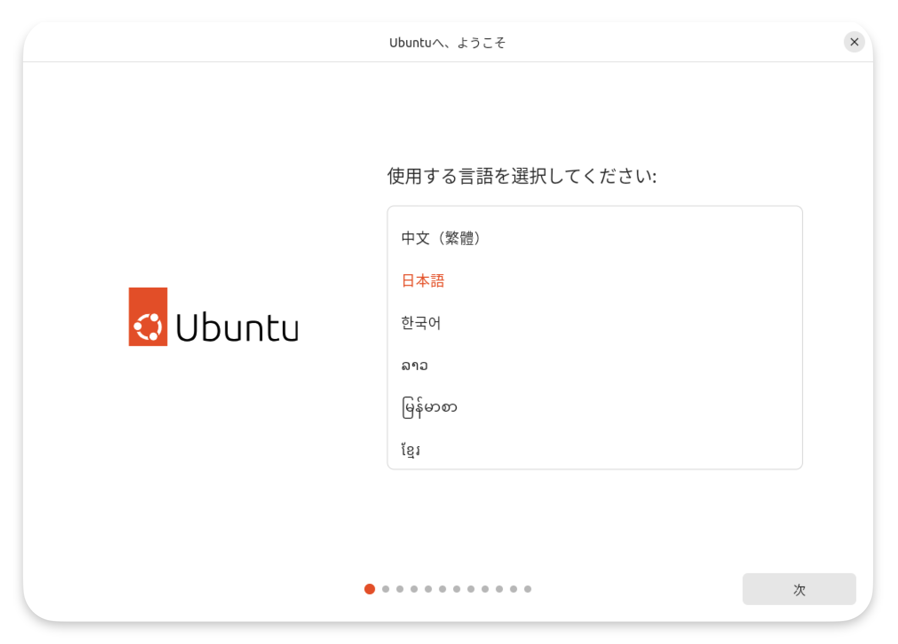
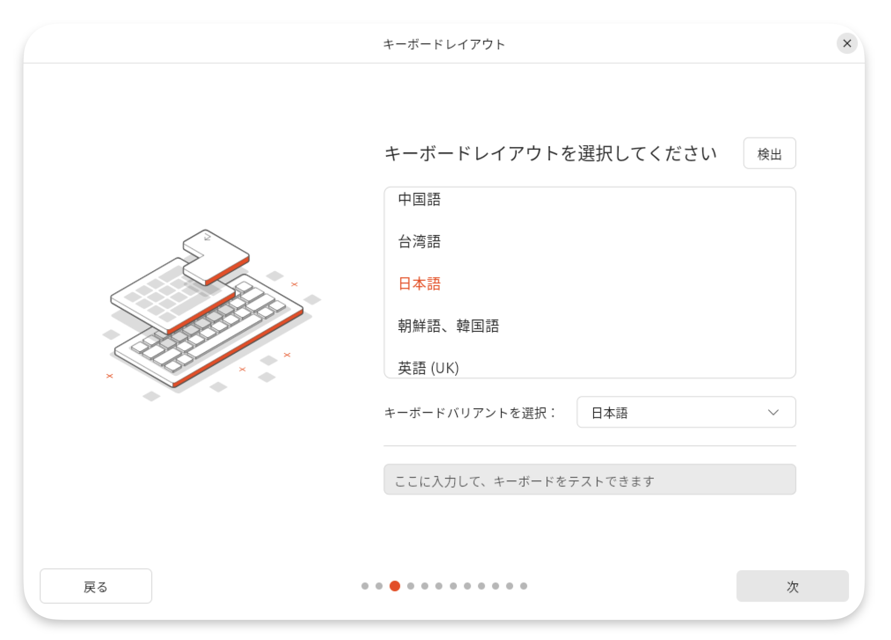
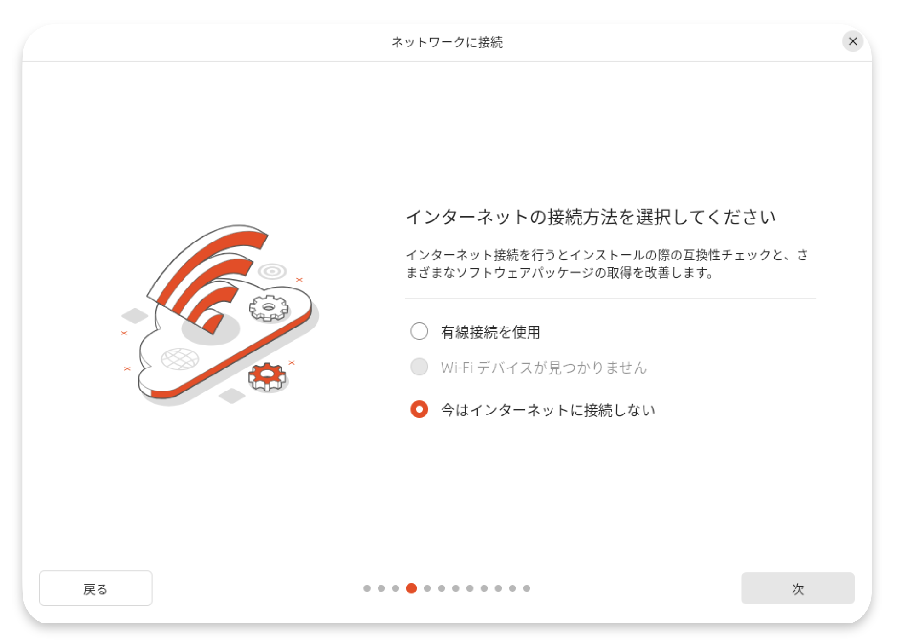
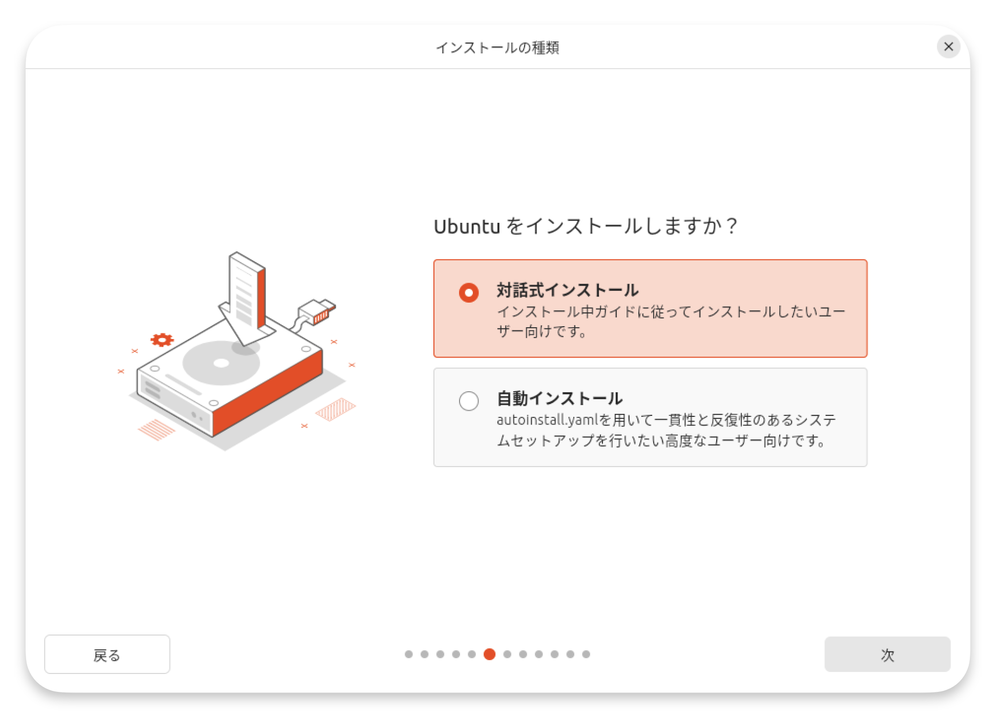
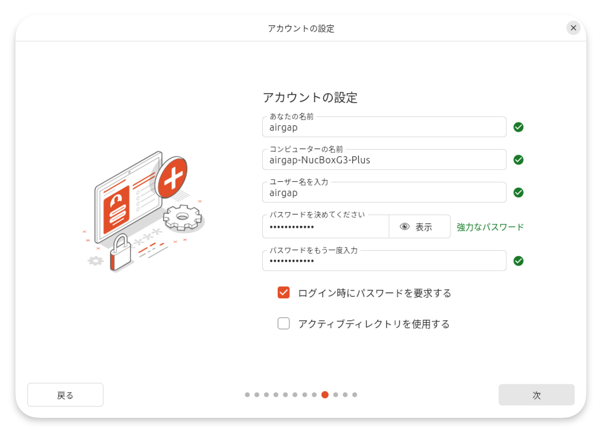
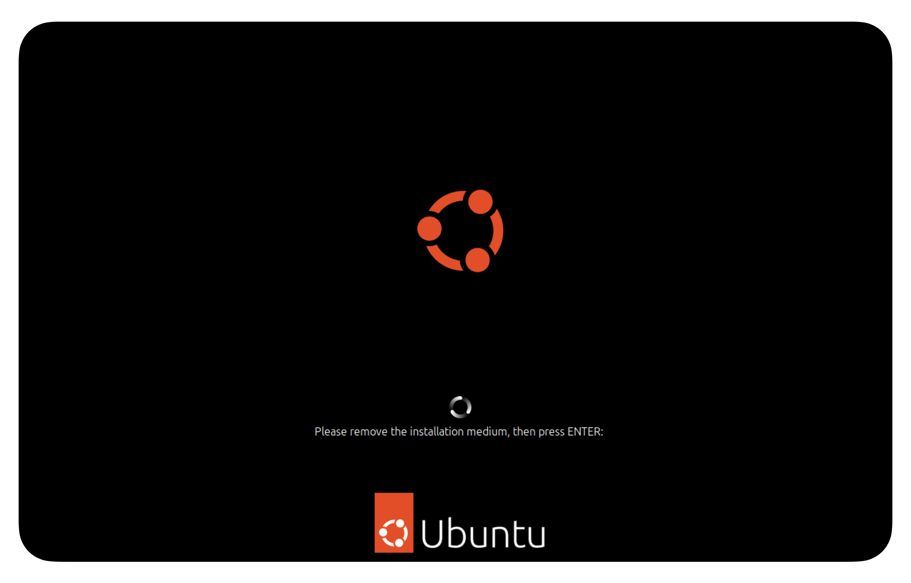
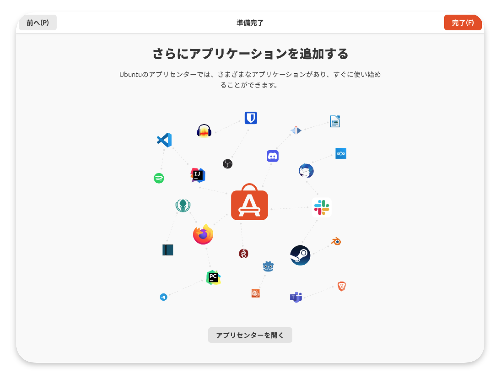
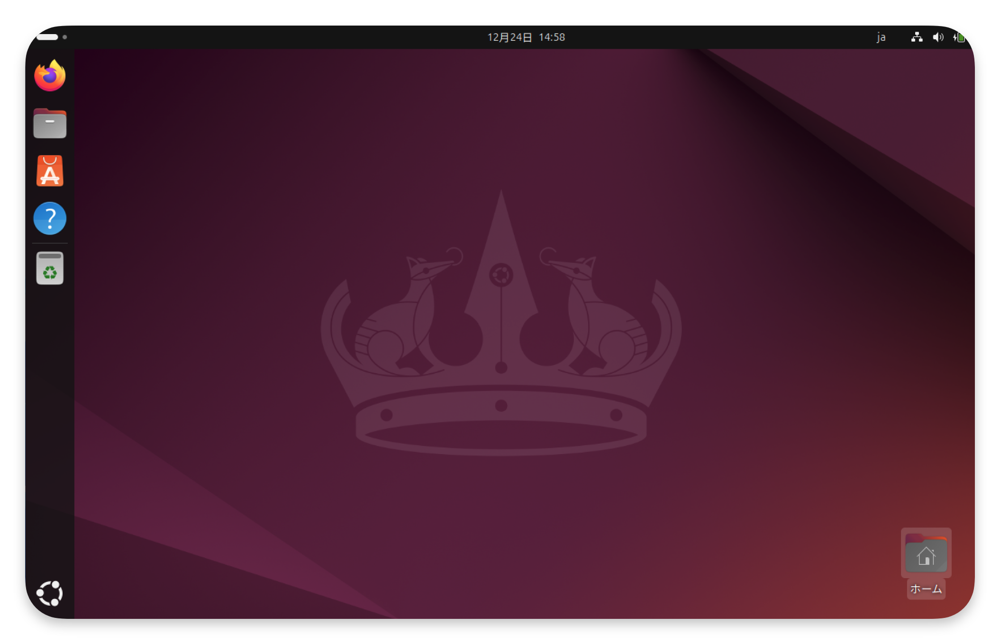

# **エアギャップ環境構築**
!!! info "エアギャップマシンとは" 
    エアギャップマシンとは、ネットワークから完全に隔離されたオフライン環境で動作する専用マシンを指します。  
    ステークプール運用においては、ウォレットの秘密鍵およびプール運営用の秘密鍵を安全に管理し、**オフライン状態**で**`cardano-cli`**を用いたトランザクション署名を行うために使用します。  
    エアギャップの一般的な定義および考え方については、[Wikipediaの解説](https://ja.wikipedia.org/wiki/%E3%82%A8%E3%82%A2%E3%82%AE%E3%83%A3%E3%83%83%E3%83%97){target="_blank" rel="noopener"}をご参照ください。

    !!! danger "秘密鍵オンライン保存のリスク"
        これらの秘密鍵をオンライン環境（BP/リレーノード等）に保存すると、ハッキング・マルウェア感染などにより、**資金やプール運営権限の盗難等につながる重大なリスク**が発生します。    
        そのため、{==**秘密鍵の管理と署名処理は必ずエアギャップマシン上で実施してください。**==}  


## **方針**
!!! note "前提"
    エアギャップ環境としての安全性を確保するため、本マニュアルでは、USBブートにより Ubuntu 24.04 を物理マシンへネイティブインストール し、{==**既存OSを削除した単一OS構成**==}で運用することを前提とします。

    Liveブート、デュアルブート構成、ならびに ホストOSに依存するあらゆる仮想化・コンテナ実行環境（ハイパーバイザー型および OS レベル仮想化を含む）は、永続性やセキュリティ境界を保証できないため、本マニュアルでは採用しません。


## **エアギャップマシンの構築手順**
!!! danger "注意点"
    Ubuntuインストール対象のエアギャップマシンはインストール中もネットワークに繋がないでください

    準備バソコンは2台です。  

    - **起動用USB作成PC**  
    Windows／macOS／Intel Mac／Apple Silicon Mac いずれでも可（ISOファイルの書き込み専用）
    - **Ubuntuインストール対象エアギャップPC**  
    UbuntuをインストールするPC（既存OSが消去されても問題ないPC / x86_64）  
    **推奨スペック**：CPU2コア以上、RAM4GB以上、ディスク25GB以上


### **1. Ubuntu Desktopイメージの取得**
Ubuntu **`Desktop`** イメージファイルをダウンロードします。

[**Ubuntu 24.04.* (Noble Numbat)**](https://releases.ubuntu.com/noble){target="_blank" rel="noopener"}  
※ ダウンロード完了まで少しかかるのでしばらくお待ちください。


### **2. USBブートディスク作成（balenaEtcher）**

#### **前提条件**
!!! tip "ヒント"
    - 初期化しても問題ない容量**`12GB`**以上のUSBメモリデバイス  
    - `Windows`または`macOS`が動作するPC  
    - [1. Ubuntu Desktopイメージの取得](../setup/air-gapped-setup.md/#1-ubuntu-desktop)で取得したISOイメージファイル

#### **`balenaEtcher`の使用概要**
balenaEtcherは、無料かつオープンソースのUSB書き込みツールであり、Ubuntuインストールに使用するブート可能なUSBメディアを安全かつ簡単に作成できます。

##### **2-1. Etcherのインストール**
balenaEtcherの公式サイトにアクセスし、インストーラーをダウンロードしてインストールします。

[https://etcher.balena.io](https://etcher.balena.io){target="_blank" rel="noopener"}

!!! info "各OSでのインストール手順"
    === "Windowsの場合"
        **1.** **`Etcher for Windows (x86|x64) (Installer)`**の右側の「**`Download`**」を選択します。  
        **2.** Windows 64-bit用のインストーラー（`balenaEtcher-*.*.*.Setup.exe`）をダウンロードします。  
        **3.** ダウンロードした`.exe`ファイルを実行し、画面の指示に従ってインストールを完了させます。

        - エクスプローラーを開き、左側メニューの「ダウンロード」を選択
        - `balenaEtcher-*.*.*.Setup.exe`ファイルをダブルクリック
        > **インストーラーの指示に従い進めてください**

    === "Macの場合"
        **1.** 利用しているMacのアーキテクチャに応じて、対応する **`Etcher for macOS`** の「**`Download`**」を選択します。

        - **Apple Silicon (M1/M2/M3 など)** → **`Etcher for macOS (arm64)`**
        - **Intel Mac** → **`Etcher for macOS (x64)`**

        **2.** ダウンロードした `.dmg` ファイル（例：  

        - `balenaEtcher-*.*.*-arm64.dmg`  
        - `balenaEtcher-*.*.*-x64.dmg`  

        ）を開き、**`Etcher`** アイコンを **アプリケーションフォルダへドラッグ＆ドロップ** してインストールします。

        **3.** 初回起動時に警告が表示されても、上記手順で取得したファイルであれば問題ありません。  
        「`開く`」を選択して続行してください。

##### **2-2. USBメディアの作成**
USBブートディスクを作成します。

!!! info "手順"  
    **1.** USBメモリをPCに挿入します。  
    > USBポートに正しく接続されていることを確認してください。

    **2.** Etcherを起動します。

    **3.** Ubuntu ISO イメージを選択します。   
    > 「**Flash from file**」を選択し、事前にダウンロードしたUbuntu ISO イメージファイルを選択します。

    **4.** USBメモリを選択します。  
    > 「**Select target**」を選択し、書き込み先となるUSBメモリを選択後、「`Select 1`」を選択します。  

    !!! danger "誤ったディスクを選ばないよう注意してください。"
        USB以外のストレージを選択するとデータが消去されます。  

    **5.** 「Flash」を実行します。  
    「**Flash!**」を選択すると書き込み権限の付与が求められるのでPC（Windows/macOS）の管理者パスワードを入力し、「`Ok`」を選択します。  
    > 「“balenaEtcher.app” がリムーバブルボリューム上のファイルにアクセスしようとしています。」というダイアログが表示された場合は、「許可」を選択してください。  
    > USBメモリの書き込み速度に依存しますが、処理の完了まで数分から15分程度を要します。
    
    **6.** 書き込み完了後の確認
    > 書き込みが完了するとEtcher上で「**Flash Completed!**」と表示されますので画面を閉じて終了し、USBを抜いてください。

    !!! tip "ヒント"
        macOS環境では、USBメディアが「読み取れません」といった警告が表示される場合がありますが、これは正常ですのでUSBを取り外して問題ありません。


### **3. USBブートによるUbuntuの起動**
1. エアギャップマシンとして使用するPCに先ほど書き込んだUSBを挿入します。    
2. コンピューターを起動します。  
3. 表示されたメニューから「**`Try or Install Ubuntu`**」を選択し、Enterキーを押下します。  
その後は画面の指示に従って通常のUbuntu Desktopのインストールを進めてください。  
> Ubuntuが起動しない場合は、コンピューターを再起動してください。  
> その際Windowsでは主に`F12`、Macだと`Option`または`Alt`キーを押し続けてください。



#### **3-1. インストーラーのセットアップ**
※ 以降の画像は一例であり、環境によって表示が異なる場合があります。  

1. 言語を選択。  


2. アクセシビリティ設定は選択せず、「`次`」を選択します。  


3. 使用しているキーボードレイアウトを選択します。  


4. 「`今はインターネットに接続しない`」を選択します。  


5. 「`Ubuntuをインストール`」を選択します。  


6. 対話型インストール「`対話式インストール`」を選択します。  


7. 「`規定の選択`」を選択します。  


8. 不要なドライバやバイナリを最小化するため、サードパーティ製ソフトウェアはインストールしません。  


#### **3-2. ディスクのセットアップ**
1. 「`ディスクを削除してUbuntuをインストールする`」を選択します。


2. ユーザー名とパスワードを設定します。  

> コンピューター名の末尾は自動で入力されます。  

3. タイムゾーンの選択をします。


4. インストールの準備が完了したので確認し、「`インストール`」を選択します。  


#### **3-3. インストールの完了**
1. インストール完了画面を待機し、完了後「`今すぐ再起動`」を選択します。


2. USBを取り外すため「`Enter`」を押下してください。  
「`Enter`」を押下後、すぐUSBを抜いてください。  


3. ログイン画面でパスワードを入力します。


#### **3-4. 追加設定**
1. 以下の画面が表示されたら右上の「`次へ`」を選択します。  


2. 「`Skip for now`」が選択されていることを確認し、右上の「`スキップ`」を選択します。  


3. 「`いいえ、システムデータを共有しません`」を選択し、右上の「`次へ`」を選択します。  


4. 右上の「`完了`」を選択します。  


5. 追加設定が完了しました。    


#### **3-5. ターミナルの設定**
1. ターミナルの設定をするため左下のアイコンを選択し、「`端末`」アイコンを選択します。  


2. ターミナルを右クリックして、「`ダッシュボードにピン留め`」を選択します。  


#### **3-6. 各種設定**
1. ブラケットモードの無効化設定をします。  
```bash
echo 'set enable-bracketed-paste off' >> ~/.inputrc
```

2. ターミナルを終了します。
```bash
exit
```

3. ディスプレイ設定（任意）  
好みに応じて、画面を右クリックして「`Display Settings`」を開き、「`Scale`」を「`200%`」に設定します。

#### **3-7. 通信機能の完全無効化**
エアギャップ・オフラインマシンとして運用するため、`Wi-Fi` / `Bluetooth` / `有線通信`を含むすべてのネットワーク機能を`OS`レベルで無効化します。  
※ 機内モードは再起動後に解除されるため使用しません。

1. `NetworkManager`の完全停止  
```bash
sudo systemctl stop NetworkManager
```
```bash
sudo systemctl disable NetworkManager
```

2. `Bluetooth` サービスの完全無効化
```bash
sudo systemctl stop bluetooth
```
```bash
sudo systemctl disable bluetooth
```
```bash
sudo systemctl mask bluetooth
```

3. `rfkill` による無線デバイス遮断
```bash
sudo rfkill block all
```

4. 無線デバイス遮断の確認
```bash
rfkill list
```
`Soft blocked: yes` であることを確認します。　　

5. `rfkill` の永続化
```bash
sudo tee /etc/systemd/system/rfkill-block.service > /dev/null << 'EOF'
[Unit]
Description=Block all radios (air-gapped)
After=multi-user.target

[Service]
Type=oneshot
ExecStart=/usr/sbin/rfkill block all

[Install]
WantedBy=multi-user.target
EOF
```

6. 有効化
```bash
sudo systemctl daemon-reload
```
```bash
sudo systemctl enable rfkill-block.service
```

7. システムを再起動します。
```bash
sudo reboot
```

**状態確認**  

1. `NetworkManager`
```bash
nmcli general status
```
期待される表示例：
``` { .yaml .no-copy }
Error: NetworkManager is not running.
```  

2. `Wi-Fi` / `無線`
```bash
nmcli radio
```
期待される表示例：
``` { .yaml .no-copy }
Error: NetworkManager is not running.
```

3. `rfkill`
```bash
rfkill list
```
> `Soft blocked: yes` であることを確認します。

4. Bluetooth サービスの状態確認
```bash
systemctl status bluetooth --no-pager
```
期待される表示例：
``` { .yaml .no-copy }
○ bluetooth.service
     Loaded: masked (Reason: Unit bluetooth.service is masked.)
     Active: inactive (dead)
```


以上の設定によりエアギャップ環境の構築が完了しました。

---

### 4. 旧エアギャップからの移行

旧エアギャップ（VirtualBox等）から移行する場合の手順です。

#### 4-1. 環境変数の設定
```
echo 'export NODE_HOME="$HOME/cnode"' >> ~/.bashrc
echo 'export NODE_NETWORK="--mainnet"' >> ~/.bashrc
echo 'export CARDANO_NODE_NETWORK_ID=mainnet' >> ~/.bashrc
echo alias airgap="'cd $HOME/cnode && [ -f airgap-set.tar.gz ] && tar -xOzf airgap-set.tar.gz airgap_script | bash -s verify || echo "airgap-set.tar.gz が見つかりません"'" >> $HOME/.bashrc

source ~/.bashrc
mkdir -p ${NODE_HOME}
```

??? テストネットの場合はこちら
    === "Preview"
        ```
        echo 'export NODE_HOME="$HOME/cnode"' >> $HOME/.bashrc
        echo 'export NODE_NETWORK="--testnet-magic 2"' >> $HOME/.bashrc
        echo 'export CARDANO_NODE_NETWORK_ID=2' >> $HOME/.bashrc
        echo alias airgap="'cd $HOME/cnode && [ -f airgap-set.tar.gz ] && tar -xOzf airgap-set.tar.gz airgap_script | bash -s verify || echo "airgap-set.tar.gz が見つかりません"'" >> $HOME/.bashrc

        source $HOME/.bashrc
        mkdir -p ${NODE_HOME}
        ```

    === "PreProd"
        ```
        echo 'export NODE_HOME="$HOME/cnode"' >> $HOME/.bashrc
        echo 'export NODE_NETWORK="--testnet-magic 1"' >> $HOME/.bashrc
        echo 'export CARDANO_NODE_NETWORK_ID=1' >> $HOME/.bashrc
        echo alias airgap="'cd $HOME/cnode && [ -f airgap-set.tar.gz ] && tar -xOzf airgap-set.tar.gz airgap_script | bash -s verify || echo "airgap-set.tar.gz が見つかりません"'" >> $HOME/.bashrc

        source $HOME/.bashrc
        mkdir -p ${NODE_HOME}
        ```

#### 4-2. ファイルの移動

**パーミッション変更**
=== "VirtualBox側"
```
chmod u+rx $HOME/cold-keys
```

**ディレクトリコピー**  
VirtualBox側から以下のディレクトリをコピーして新エアギャップの$HOME直下に移動してください。

($HOMEは/home/<user>ディレクトリを指します)  

- $HOME/cnode  
- $HOME/cold-kes  

**パーミッション変更**
=== "新エアギャップ側"
```
chmod a-rx $HOME/cold-keys
```

#### 4-3. CLIインストール

[cardano-cliバイナリーファイルコピー](../operation/node-update.md#4-エアギャップアップデート)を参照してください