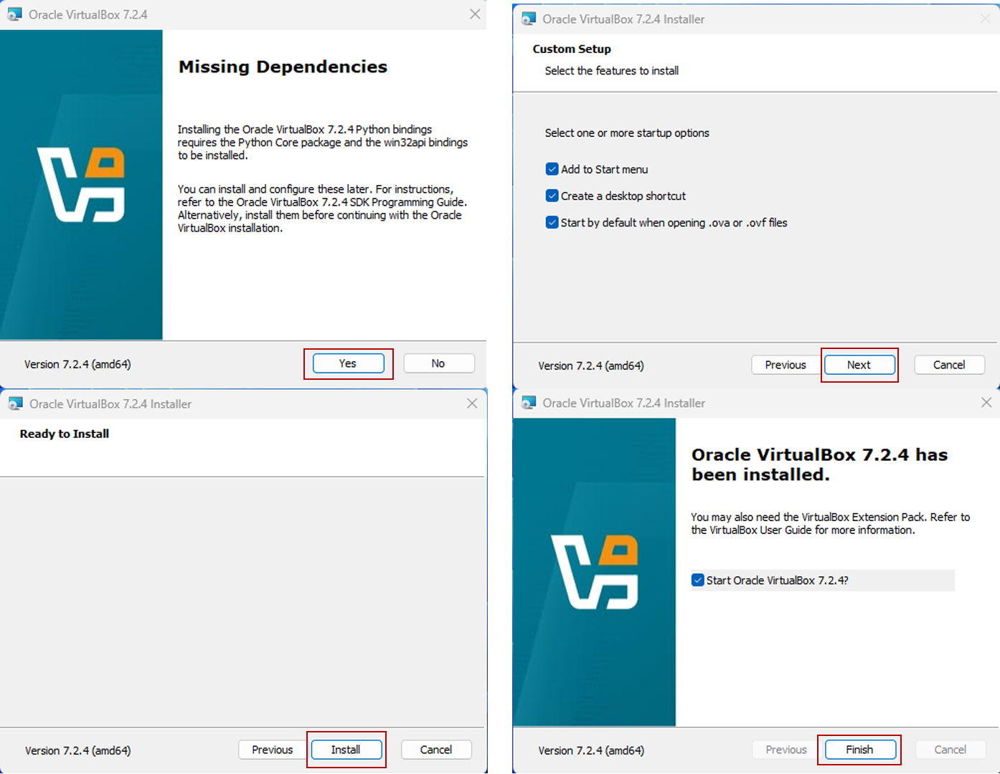

# **VirtualBox 自動セットアップ**

!!! summary "OVAプレビルドパッケージとは？"
    このOVAパッケージは、**VirtualBox上で動作する事前構築済み（プレビルド）仮想マシン**です。複雑なインストール作業を行うことなく、すぐに同一の環境を再現できます。
    
    
## 🚀 特徴

- ✅ **インストール不要**：Ubuntuなど必要なソフトウェアがあらかじめ導入済み  
- ✅ **設定済み**：ネットワーク、ユーザー、ツール構成が完了済み  
- ✅ **安全・再現性あり**：誰が使っても同じ環境で動作  
- ✅ **VirtualBox対応**：Windows / macOS / Linux どれでも動作可能  

---

## 🧩 OVA 構成情報

### 🖥️ 仮想マシン設定

| 項目 | 設定内容 |
|------|-----------|
| OS | Ubuntu 24.04.3 LTS Desktop |
| チップセット | PIIX3 |
| CPU（プロセッサー） | 4 コア |
| メモリ（RAM） | 4 GB |
| ビデオメモリ | 128 MB |
| 表示倍率 | 200% |
| ストレージ | 50 GB |
| グラフィックコントローラ | VMSVGA |
| ネットワーク | 無効 |
| USBコントローラ | USB 2.0（EHCI） |
| オーディオ | 無効 |
| 共有クリップボード | 双方向 |
| ドラッグ＆ドロップ |  双方向 |
| Guest Additions | ✅ インストール済み |
| フォルダパス（ホスト側） | `C:\share` |
| マウントポイント（ゲスト側） | `/media/share` |
| 自動マウント | 有効 |
| 永続設定 | 有効（再起動後も維持） |

---

### 🐧 Ubuntu 構成

| 項目 | 内容 |
|------|------|
| ディストリビューション | Ubuntu 24.04.3 LTS  |
| カーネル (x86 AMD版) | 6.14.0-33-generic |
| カーネル (ARM版) | 6.14.0-33-generic |
| 主要プリインストールツール | curl, wget, Guest-Additions |
| ロケール | ja_JP.UTF-8 |
| タイムゾーン | Asia/Tokyo |
| ユーザー名（初期） | `airgap` |
| パスワード（初期） | `airgap` |
| ネットワーク | 無効 |
| cardano-cli (x86 AMD版) | 10.11.0.0 ([IOGビルド](https://github.com/IntersectMBO/cardano-cli)) |
| cardano-cli (ARM版) | 10.11.0.0 ([Armada Allianceビルド](https://github.com/armada-alliance/cardano-node-binaries)) |
| 環境変数 | SJG推奨設定済み |
| Guest Additions | 画面解像度自動調整・共有フォルダ・クリップボード対応 |


## 📦 使い方

### ① VirtualBox インストール
以下の公式サイトから お手元のパソコンに適したVirtualBox 7.2.4 をダウンロードしてインストールしてください。  
🔗 [https://www.virtualbox.org/wiki/Downloads](https://www.virtualbox.org/wiki/Downloads)




---

### ② OVAダウンロード

| プラットフォーム | ダウンロードURL | サイズ | 備考 |
|------------------|------------------|---------|------|
| 🪟 **Windows** | [https://download.virtualbox.org/virtualbox/7.0.20/VirtualBox-7.0.20-163906-Win.exe](https://download.virtualbox.org/virtualbox/7.0.20/VirtualBox-7.0.20-163906-Win.exe) | 約 108 MB | 64bit版 Windows 10 / 11 対応 |
| 🍎 **macOS (Intel チップ)** | [https://download.virtualbox.org/virtualbox/7.0.20/VirtualBox-7.0.20-163906-OSX.dmg](https://download.virtualbox.org/virtualbox/7.0.20/VirtualBox-7.0.20-163906-OSX.dmg) | 約 132 MB | Intel Mac 用 |
| 🍏 **macOS (Apple Silicon)** | [https://download.virtualbox.org/virtualbox/7.0.20/VirtualBox-7.0.20-163906-macOSArm64.dmg](https://download.virtualbox.org/virtualbox/7.0.20/VirtualBox-7.0.20-163906-macOSArm64.dmg) | 約 138 MB | M1 / M2 / M3 チップ対応 |


### ③ ハッシュ値の確認（改ざん防止）

ダウンロードした OVA ファイルが正しく・安全であることを確認するために、  
配布元が公開している **SHA256ハッシュ値** と照合してください。  

---

### 🪟 Windows の場合（PowerShell）

1. PowerShell を開きます  
2. ダウンロードした OVA ファイルがあるフォルダに移動します  
```
例）
cd "C:\Users\<ユーザー名>\Downloads"
Get-FileHash .\airgap-amd10.11.0.0.ova -Algorithm SHA256
```
```
出力例)
Algorithm : SHA256
Hash      : 9A7E1C3D5F2B84A9C9F9B9E0A12F8E2C94E5A7C3DFA6C0E8A7D8BCE3F6A12F5B
Path      : C:\Users\User\Downloads\airgap-amd10.11.0.0.ova
```

<font color=red>以下に記載しているSHA256ハッシュ値と異なるハッシュ値が表示された場合は、改ざんされいる可能性があるため実行しないでください。</font>

### 🍎 macOS の場合（ターミナル）

1. ターミナルを開きます  
2. ダウンロードした OVA ファイルがあるディレクトリに移動します
```
cd ~/Downloads
```
3. ハッシュ値を調べます
```
shasum -a 256 airgap-arm10.11.0.0.ova
```
```
出力例)
9a7e1c3d5f2b84a9c9f9b9e0a12f8e2c94e5a7c3dfa6c0e8a7d8bce3f6a12f5b  airgap-arm10.11.0.0.ova
```


<font color=red>以下に記載しているSHA256ハッシュ値と異なるハッシュ値が表示された場合は、改ざんされいる可能性があるため実行しないでください。</font>


### ④ OVAインポート

1. VirtualBox を起動  
2. メニューから「**ファイル → 仮想アプライアンスのインポート**」を選択  
3. ダウンロードした `.ova` ファイルを指定  
4. 「**インポート**」をクリック  
5. 一覧に表示された仮想マシンを選択し、「**起動**」をクリック  

これでエアギャップ環境がすぐに利用可能になります 🚀

---


