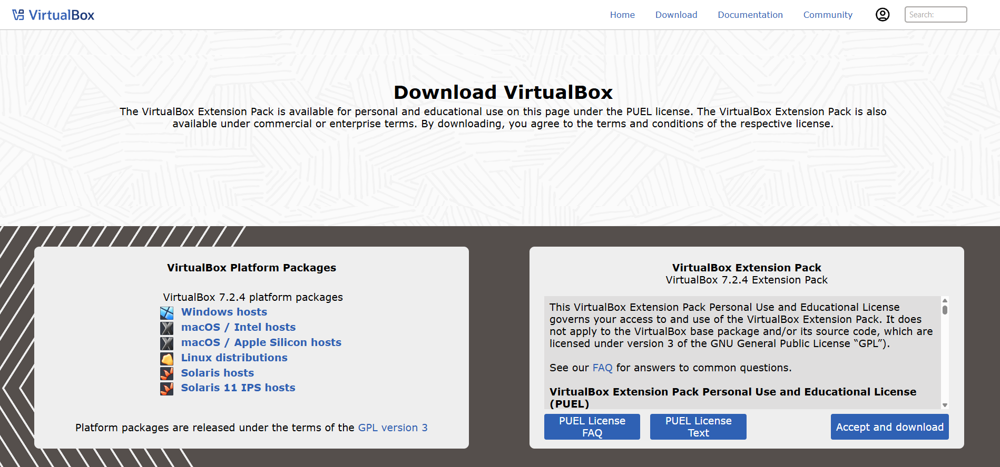
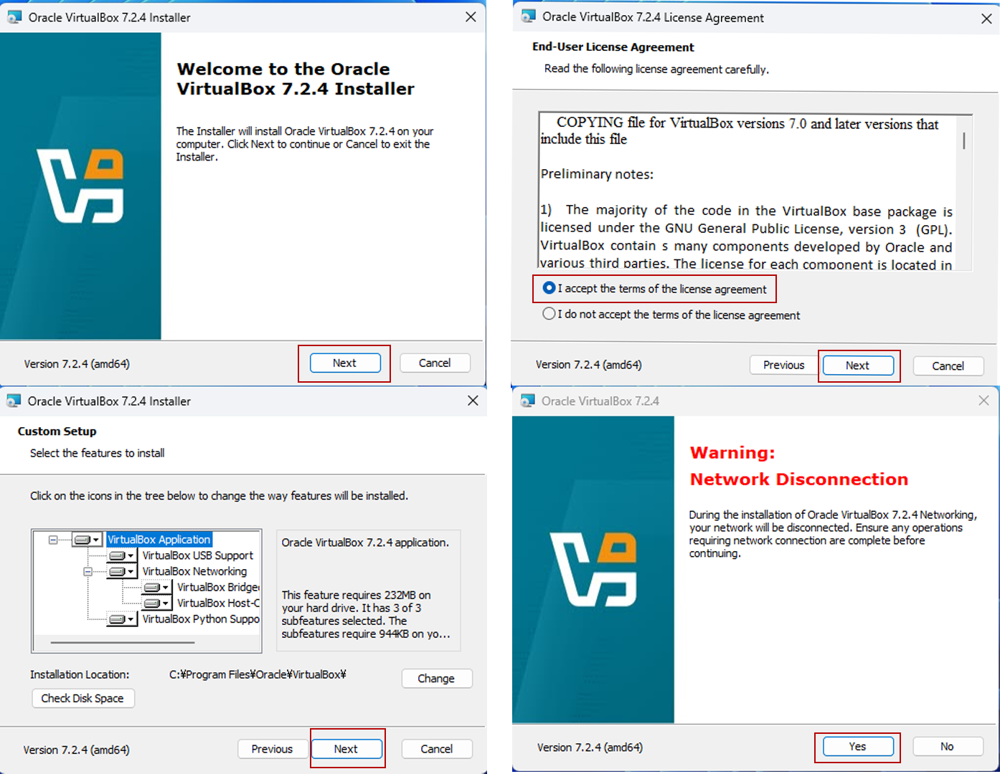
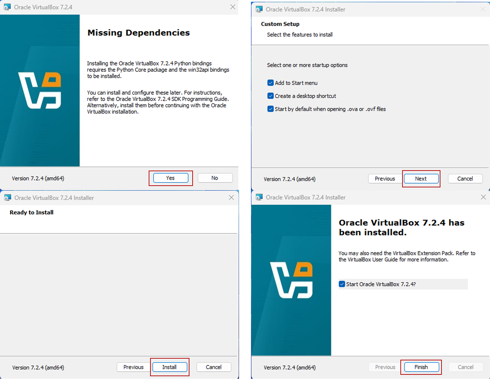

# 🧰 手動インストール版

この手順では、**VirtualBox OVAファイルを使用せず**に、  
ユーザー自身でUbuntuを一からインストール・設定する方法を説明します。  
より細かな構成変更やカスタマイズを行いたい方向けです。

---

## ⚙️ 特徴

- 🧩 **柔軟な構成変更**：CPU数・メモリ・ディスク容量を自由に設定可能  
- 📦 **学習にも最適**：Linuxインストール工程を理解できる  

---

## 🪄 手動セットアップ手順

### ① Ubuntu ISO ダウンロード
Ubuntu公式サイトから最新のLTS版（例：24.04.3 LTS）を取得します。 

| プラットフォーム | Ubuntu ISO | 
|------------------|-------------|
| 🪟 **Windows** | [Ubuntu 24.04.3 LTS Desktop (Intel / AMD 64-bit)](https://ubuntu.com/download/desktop) |
| 🍎 **macOS (Intel)** | [Ubuntu 24.04.3 LTS Desktop (Intel / AMD 64-bit)](https://ubuntu.com/download/desktop) |
| 🍏 **macOS (Apple Silicon)** | [Ubuntu 24.04.3 LTS Server (ARM64)](https://ubuntu.com/download/server) |


### ② VirtualBox インストール
以下の公式サイトから お手元のパソコンに適したVirtualBox 7.2.4 をダウンロードしてインストールしてください。  
🔗 [https://www.virtualbox.org/wiki/Downloads](https://www.virtualbox.org/wiki/Downloads)




---

### ② VirtualBox で新規仮想マシンを作成
1. 「新規」ボタンをクリック  
2. 名前を入力（例：Ubuntu 24.04）  
3. タイプ：`Linux`、バージョン：`Ubuntu (64-bit)` を選択  
4. メモリ：**4096 MB（4GB）**  
5. 仮想ディスク：**20GB 以上（VDI・動的割り当て）**

---

### ③ Ubuntu ISO をマウント
作成した仮想マシンを選択し、  
「設定 → ストレージ → 光学ドライブ」からISOファイルを指定します。

---

### ④ Ubuntu をインストール
起動して、通常のUbuntuインストールウィザードに従います。  
- 言語：日本語  
- インストールタイプ：「通常のインストール」  
- ユーザー名・パスワードを任意で設定  

---

### ⑤ Guest Additions をインストール
起動後、VirtualBoxのメニューから  
「**デバイス → Guest Additions CDイメージの挿入**」を選択し、  
以下を実行：

```bash
sudo apt update
sudo apt install -y build-essential dkms linux-headers-$(uname -r)
sudo mkdir /media/cdrom
sudo mount /dev/cdrom /media/cdrom
sudo /media/cdrom/VBoxLinuxAdditions.run
sudo reboot
```
